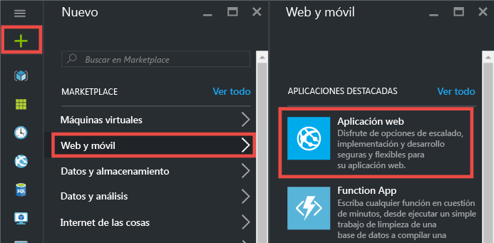
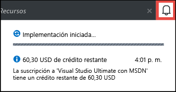
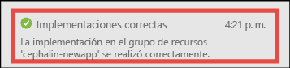
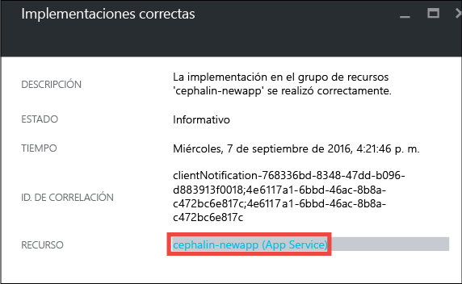
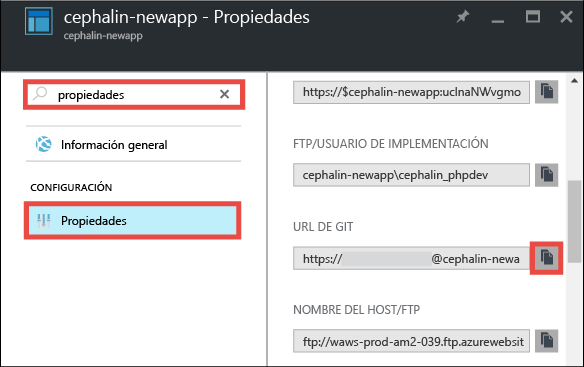
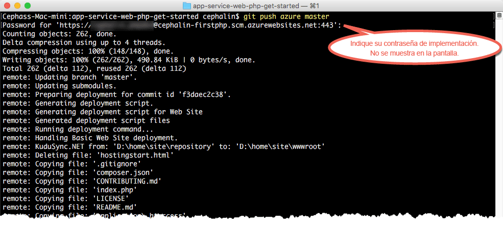

<properties 
	pageTitle="Implementación de su primera aplicación web de PHP en Azure en 5 minutos | Microsoft Azure" 
	description="Aprenda lo fácil que es ejecutar aplicaciones web en App Service mediante la implementación de una aplicación de ejemplo. Para empezar, realice un desarrollo real rápidamente y vea los resultados inmediatamente." 
	services="app-service\web"
	documentationCenter=""
	authors="cephalin"
	manager="wpickett"
	editor=""
/>

<tags
	ms.service="app-service-web"
	ms.workload="web"
	ms.tgt_pltfrm="na"
	ms.devlang="na"
	ms.topic="hero-article"
	ms.date="09/16/2016" 
	ms.author="cephalin"
/>
	
# Implementación de su primera aplicación web de PHP en Azure en 5 minutos

Este tutorial le ayudará a implementar su primera aplicación web de PHP en [Azure App Service](../app-service/app-service-value-prop-what-is.md).
App Service se puede usar para crear aplicaciones web, [back-ends de aplicaciones móviles](/documentation/learning-paths/appservice-mobileapps/) y 
[aplicaciones de API](../app-service-api/app-service-api-apps-why-best-platform.md).

Podrá:

- Crear una aplicación web en Azure App Service.
- Implementar código PHP de ejemplo.
- Ver la ejecución del código en directo en producción.
- Actualizar la aplicación web del mismo modo que [insertaría confirmaciones de Git](https://git-scm.com/docs/git-push).

## Requisitos previos

- [Instale Git](http://www.git-scm.com/downloads). Compruebe que la instalación se realizó correctamente ejecutando `git --version` en un símbolo del sistema de Windows, 
una ventana de PowerShell, un shell de Linux o un terminal de OS X.
- Obtenga una cuenta de Microsoft Azure. Si aún no tiene ninguna, puede 
[registrarse para una evaluación gratuita](/pricing/free-trial/?WT.mc_id=A261C142F) o 
[activar los beneficios de suscripción de Visual Studio](/pricing/member-offers/msdn-benefits-details/?WT.mc_id=A261C142F).

>[AZURE.NOTE] También puede [probar App Service](http://go.microsoft.com/fwlink/?LinkId=523751) sin una cuenta de Azure. Cree una aplicación de inicio y juegue con ella durante una hora como máximo; no se requiere ninguna tarjeta de crédito ni ningún compromiso.

## Creación de una aplicación web

1. Inicie sesión en [Azure Portal](https://portal.azure.com) con su cuenta de Azure.

2. En el menú izquierdo, haga clic en **nuevo** > **Web y móvil** > **Aplicación web**.

    

3. En la hoja de creación de la aplicación, utilice la siguiente configuración para su nueva aplicación:

    - **Nombre de la aplicación**: escriba un nombre único.
    - **Grupo de recursos**: seleccione **Crear nuevo** y asígnele un nombre.
    - **Plan de App Service/Ubicación**: haga clic en esta opción para configurarla y, después, en **Crear nuevo** para establecer el nombre, la ubicación y 
    el plan de tarifa del plan de App Service. Puede usar el plan de tarifa **Gratis**.

    Cuando haya terminado, la hoja de creación de la aplicación debe tener este aspecto:

    

3. Haga clic en **Crear** en la parte inferior. Puede hacer clic en el icono de **notificación**, situado en la parte superior, para ver el progreso.

    

4. Cuando la implementación haya finalizado, verá este mensaje de notificación. Haga clic en el mensaje para abrir la hoja de implementación.

    

5. En la hoja **Implementación correcta**, haga clic en el vínculo **Recurso** para abrir la hoja de su nueva aplicación web.

    

## Implementación del código en la aplicación web

Ahora vamos a implementar código en Azure mediante Git.

5. En la hoja de la aplicación web, desplácese hacia abajo hasta **Opciones de implementación** o búsquela, y haga clic en ella.

    

6. Haga clic en **Elegir origen** > **Repositorio de Git local** > **Aceptar**.

7. En la hoja de la aplicación web, haga clic en **Credenciales de implementación**.

8. Configure las credenciales de implementación y haga clic en **Guardar**.

7. En la hoja de la aplicación web, desplácese hacia abajo hasta **Propiedades** o búsquela, y haga clic en ella. Junto a **Dirección URL de Git**, haga clic en el botón **Copiar**.

    

    Ya está listo para implementar el código con Git.

1. En el terminal de la línea de comandos, cambie a un directorio de trabajo (`CD`) y clone la aplicación de ejemplo del modo siguiente:

        git clone https://github.com/Azure-Samples/app-service-web-php-get-started.git

    

    Para *&lt;github_sample_url>*, use una de las siguientes direcciones URL, en función del marco que le guste:

2. Cambie al repositorio de la aplicación de ejemplo. Por ejemplo,

        cd app-service-web-html-get-started

3. En el Git remoto, configure la dirección URL de Git de su aplicación de Azure, que copió del portal unos pocos pasos antes.

        git remote add azure <giturlfromportal>

4. Implemente su código de ejemplo en la nueva aplicación de Azure igual que insertaría cualquier código con Git:

        git push azure master

    

    Si usó uno de los marcos de lenguaje, verá un resultado diferente. Esto se debe a que `git push` no solo inserta código en Azure, sino que también desencadena tareas de implementación en el motor de implementación. Si tiene cualquier package.json en la raíz del proyecto (repositorio), el script de implementación restaurará los paquetes necesarios para usted. También puede [habilitar la extensión Composer](web-sites-php-mysql-deploy-use-git.md#composer) para procesar automáticamente los archivos composer.json en la aplicación PHP.

Eso es todo. El código se ejecuta ahora en directo en Azure. En el explorador, vaya a http://*&lt;appname>*.azurewebsites.net para verlo en acción.

## Realización de actualizaciones en la aplicación

Ahora puede usar Git para efectuar inserciones desde la raíz del proyecto (repositorio) con el fin de realizar una actualización en el sitio activo. Hágalo igual que cuando implementó el código por primera vez. Por ejemplo, cada vez que quiera insertar un nuevo cambio que ha probado localmente, solo tiene que ejecutar los siguientes comandos desde la raíz del proyecto (repositorio):

    git add .
    git commit -m "<your_message>"
    git push azure master

## Pasos siguientes

[Creación, configuración e implementación de una aplicación web de Laravel en Azure](app-service-web-php-get-started.md). Gracias a este tutorial, aprenderá los conocimientos básicos necesarios para ejecutar cualquier aplicación web de PHP en Azure, como:

- Crear y configurar aplicaciones en Azure desde PowerShell/Bash.
- Establecer la versión de PHP.
- Usar un archivo de inicio que no está en el directorio raíz de la aplicación.
- Habilitar la automatización de Composer.
- Acceder a variables de entorno específico.
- Solucionar errores comunes.

También puede hacer más cosas con su primera aplicación web. Por ejemplo:

- Pruebe [otras formas de implementar el código en Azure](../app-service-web/web-sites-deploy.md). Por ejemplo, para implementar desde uno de los repositorios de GitHub, simplemente seleccione 
**GitHub** en lugar de **Repositorio de Git local** en **Opciones de implementación**.
- Lleve su aplicación de Azure aún más lejos. Autentique los usuarios. Escálela según la demanda. Configure algunas alertas de rendimiento. Todo ello con unos cuantos clics. Consulte 
[Incorporación de funcionalidad a su primera aplicación web](app-service-web-get-started-2.md).

<!---HONumber=AcomDC_0920_2016-->