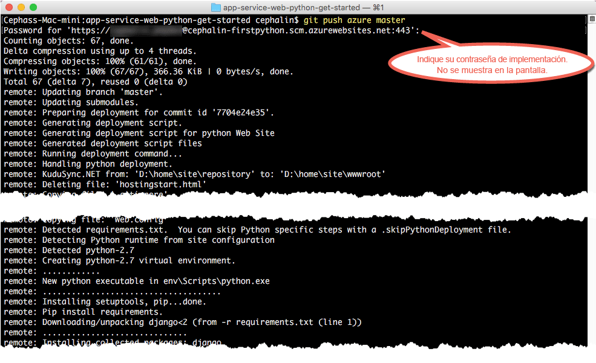

# Implementación de su primera aplicación web de Python en Azure en 5 minutos (versión preliminar de CLI 2.0)

> [!div class="op_single_selector"]
> * [Primer sitio HTML](app-service-web-get-started-html.md)
> * [Primera aplicación .NET](app-service-web-get-started-dotnet.md)
> * [Primera aplicación PHP](app-service-web-get-started-php.md)
> * [Primera aplicación Node.js](app-service-web-get-started-nodejs.md)
> * [Primera aplicación Python](app-service-web-get-started-python.md)
> * [Primera aplicación Java](app-service-web-get-started-java.md)
> 
> 

Este tutorial le ayudará a implementar su primera aplicación web de Python en [Azure App Service](../app-service/app-service-value-prop-what-is.md).
App Service se puede usar para crear aplicaciones web, [back-ends de aplicaciones móviles](/documentation/learning-paths/appservice-mobileapps/) y [aplicaciones de API](../app-service-api/app-service-api-apps-why-best-platform.md).

Podrá: 

* Crear una aplicación web en Azure App Service.
* Implementar el código de Python de ejemplo.
* Ver la ejecución del código en directo en producción.
* Actualizar la aplicación web del mismo modo que [insertaría confirmaciones de Git](https://git-scm.com/docs/git-push).

[!INCLUDE [app-service-linux](../../includes/app-service-linux.md)]

## Versiones de la CLI para completar la tarea

Puede completar la tarea mediante una de las siguientes versiones de la CLI:

- [CLI de Azure 1.0](app-service-web-get-started-python-cli-nodejs.md): la CLI para los modelos de implementación clásico y de Resource Manager
- [CLI de Azure 2.0 (versión preliminar)](app-service-web-get-started-python.md): la CLI de última generación para el modelo de implementación de Resource Manager

## Requisitos previos
* [Git](http://www.git-scm.com/downloads).
* [Versión preliminar de la CLI de Azure 2.0](/cli/azure/install-az-cli2).
* Una cuenta de Microsoft Azure. Si aún no tiene ninguna, puede [registrarse para una evaluación gratuita](https://azure.microsoft.com/pricing/free-trial/?WT.mc_id=A261C142F) o [activar las ventajas de suscriptor de Visual Studio](https://azure.microsoft.com/pricing/member-offers/msdn-benefits-details/?WT.mc_id=A261C142F).

> [!NOTE]
> También puede [probar App Service](https://azure.microsoft.com/try/app-service/) sin una cuenta de Azure. Cree una aplicación de inicio y juegue con ella durante una hora como máximo; no se requiere ninguna tarjeta de crédito ni ningún compromiso.
> 
> 

## Implementación de una aplicación web de Python
1. Abra un símbolo del sistema de Windows, una ventana de PowerShell, un shell de Linux o un terminal de OS X. Ejecute `git --version` y `azure --version` para comprobar que Git y la CLI de Azure estén instalados en el equipo.
   
    
   
    Si no ha instalado las herramientas, consulte [Requisitos previos](#Prerequisites) para obtener vínculos de descarga.
2. Inicie sesión en Azure como se indica a continuación:
   
        az login
   
    Siga el mensaje de ayuda para continuar con el proceso de inicio de sesión.
   
    

3. Establezca el usuario de implementación de App Service. Posteriormente implementará el código mediante estas credenciales.
   
        az appservice web deployment user set --user-name <username> --password <password>

3. Cree un nuevo [grupo de recursos](../azure-resource-manager/resource-group-overview.md). Para este primer tutorial de App Service, no necesita realmente saber qué es.

        az group create --location "<location>" --name my-first-app-group

    Para ver los posibles valores que puede usar para `<location>`, use el comando de la CLI `az appservice list-locations`.

3. Cree un nuevo [plan de App Service](../app-service/azure-web-sites-web-hosting-plans-in-depth-overview.md) "GRATIS". Para este primer tutorial de App Service, sepa que no se le cobrará por las aplicaciones web de este plan.

        az appservice plan create --name my-free-appservice-plan --resource-group my-first-app-group --sku FREE

4. Cree una nueva aplicación web con un nombre único en `<app_name>`.

        az appservice web create --name <app_name> --resource-group my-first-app-group --plan my-free-appservice-plan

4. A continuación, obtenga el código Python de ejemplo que desea implementar. Cambie a un directorio de trabajo (`CD`) y clone la aplicación de ejemplo como se indica a continuación:
   
        cd <working_directory>
        git clone https://github.com/Azure-Samples/app-service-web-python-get-started.git

5. Cambie al repositorio de la aplicación de ejemplo. Por ejemplo:
   
        cd app-service-web-python-get-started
5. Configure la implementación local de Git para la aplicación web de App Service con el siguiente comando:

        az appservice web source-control config-local-git --name <app_name> --resource-group my-first-app-group

    Obtendrá una salida JSON como esta, lo que significa que está configurado el repositorio de Git remoto:

        {
        "url": "https://<deployment_user>@<app_name>.scm.azurewebsites.net/<app_name>.git"
        }

6. Agregue la dirección URL en la salida JSON como un repositorio de Git remoto para el repositorio local (llamado `azure` para mayor claridad).

        git remote add azure https://<deployment_user>@<app_name>.scm.azurewebsites.net/<app_name>.git
   
7. Implemente su código de ejemplo en la nueva aplicación de Azure igual que insertaría cualquier código con Git. Cuando se le pida, use la contraseña que configuró anteriormente.
   
        git push azure master
   
    
   
    `git push` no solo inserta código en Azure, sino que también desencadena tareas de implementación en el motor de implementación. 
    Si tiene cualquier archivo requirements.txt (Python) en la raíz del proyecto (repositorio), el script de implementación restaurará los paquetes necesarios para usted. 

Enhorabuena, ha implementado la aplicación en el Servicio de aplicaciones de Azure.

## Visualización de la aplicación en ejecución
Para ver cómo la aplicación se ejecuta en Azure, ejecute este comando desde cualquier directorio del repositorio:

    azure site browse

## Realización de actualizaciones en la aplicación
Ahora puede usar Git para efectuar inserciones desde la raíz del proyecto (repositorio) con el fin de realizar una actualización en el sitio activo. Hágalo igual que cuando implementó el código por primera vez. Por ejemplo, cada vez que quiera insertar un nuevo cambio que ha probado localmente, solo tiene que ejecutar los siguientes comandos desde la raíz del proyecto (repositorio):

    git add .
    git commit -m "<your_message>"
    git push azure master

## Pasos siguientes
[Crear, configurar e implementar una aplicación web de Django en Azure en Visual Studio](web-sites-python-ptvs-django-mysql.md). Gracias a este tutorial, aprenderá los conocimientos básicos necesarios para ejecutar una aplicación web de Python en Azure, como:

* Crear e implementar una aplicación de Python mediante una plantilla.
* Establecer la versión de Python.
* Crear entornos virtuales.
* Conectarse a una base de datos.

También puede hacer más cosas con su primera aplicación web. Por ejemplo:

* Pruebe [otras formas de implementar el código en Azure](web-sites-deploy.md). Por ejemplo, para implementar desde uno de los repositorios de GitHub, simplemente seleccione **GitHub** en lugar de **Repositorio de Git local** en **Opciones de implementación**.
* Lleve su aplicación de Azure aún más lejos. Autentique los usuarios. Escálela según la demanda. Configure algunas alertas de rendimiento. Todo ello con unos cuantos clics. Consulte [Incorporación de funcionalidad a su primera aplicación web](app-service-web-get-started-2.md).

<!--HONumber=Feb17_HO3-->

