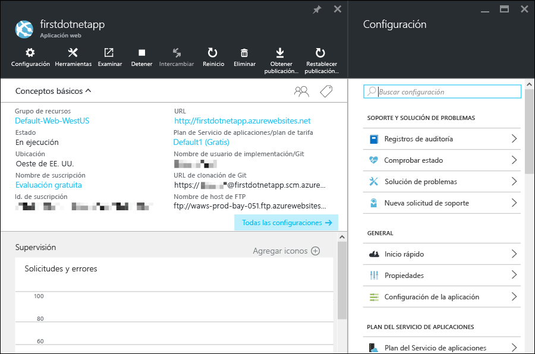

<properties 
	pageTitle="Introducción a las aplicaciones web en el Servicio de aplicaciones de Azure" 
	description="Aprenda lo fácil que es ejecutar la aplicación web en vivo en el Servicio de aplicaciones. Comience a desarrollar en tiempo real en 5 minutos y vea los resultados inmediatamente." 
	services="app-service\web"
	documentationCenter=""
	authors="cephalin" 
	manager="wpickett" 
	editor="" 
/>

<tags 
	ms.service="app-service-web" 
	ms.workload="web" 
	ms.tgt_pltfrm="na" 
	ms.devlang="na" 
	ms.topic="hero-article"
	ms.date="03/17/2016" 
	ms.author="cephalin"
/>
	
# Introducción a las aplicaciones web en el Servicio de aplicaciones de Azure

Este tutorial le ayuda a empezar a trabajar rápidamente con la implementación de aplicaciones web en el [Servicio de aplicaciones de Azure](../app-service/app-service-value-prop-what-is.md). Con poca intervención por su parte, podrá:

- Implementar una aplicación web de ejemplo (elija entre ASP.NET, PHP, Node.js, Java o Python).
- Visualizar la aplicación en ejecución en cuestión de segundos.
- Actualizar la aplicación web del mismo modo que insertaría confirmaciones de [Git](http://www.git-scm.com/).

También echaremos un primer vistazo al [Portal de Azure](https://portal.azure.com) e inspeccionaremos las características allí disponibles.

## Requisitos previos

Para completar este tutorial, necesita:

- Git. Puede descargar la binarios de instalación [aquí](http://www.git-scm.com/downloads). Debería poder ejecutar `git --version` desde el terminal de línea de comandos de su elección. 
- Conocimientos básicos de Git.
- CLI de Azure. Las instrucciones de instalación se pueden encontrar [aquí](../xplat-cli-install.md). Debería poder ejecutar `azure --version` desde el terminal de línea de comandos de su elección.
- Una cuenta de Microsoft Azure. Si aún no tiene ninguna, puede [registrarse para una evaluación gratuita](/pricing/free-trial/?WT.mc_id=A261C142F) o bien [activar las ventajas de suscriptor de Visual Studio](/pricing/member-offers/msdn-benefits-details/?WT.mc_id=A261C142F).

>[AZURE.NOTE] Para ver el Servicio de aplicaciones de Azure en acción antes de registrarse en una cuenta de Azure, vaya a la [prueba del Servicio de aplicaciones](http://go.microsoft.com/fwlink/?LinkId=523751). Ahí podrá crear inmediatamente una aplicación de inicio de corta duración en el Servicio de aplicaciones. No se requiere tarjeta de crédito y no se establece ningún compromiso.

## Implementación de una aplicación sitio

Vamos a implementar una aplicación web en el Servicio de aplicaciones de Azure.

1. Abra un nuevo símbolo del sistema de Windows, un shell de Linux o un terminal de OS X y utilice el comando `CD` para cambiar a un directorio de trabajo, luego clone la aplicación de ejemplo de este modo:

        git clone <github_sample_url>

    En *&lt;github\_sample\_url>*, use una de las siguientes direcciones URL, según la plataforma que prefiera:

    - ASP.NET: [https://github.com/Azure-Samples/app-service-web-dotnet-get-started.git](https://github.com/Azure-Samples/app-service-web-dotnet-get-started.git)
    - PHP (CodeIgniter): [https://github.com/Azure-Samples/app-service-web-php-get-started.git](https://github.com/Azure-Samples/app-service-web-php-get-started.git)
    - Node.js (Express): [https://github.com/Azure-Samples/app-service-web-nodejs-get-started.git](https://github.com/Azure-Samples/app-service-web-nodejs-get-started.git) 
    - Java: [https://github.com/Azure-Samples/app-service-web-java-get-started.git](https://github.com/Azure-Samples/app-service-web-java-get-started.git)
    - Python (Django): [https://github.com/Azure-Samples/app-service-web-python-get-started.git](https://github.com/Azure-Samples/app-service-web-python-get-started.git)

2. `CD` en el directorio raíz de la aplicación de ejemplo. Por ejemplo,

        cd app-service-web-dotnet-get-started

3. Inicie sesión en Azure de la manera siguiente:

        azure login
    
    Siga las indicaciones para continuar el inicio de sesión en un explorador con una cuenta de Microsoft que tenga su suscripción de Azure.

4. Cree el recurso de aplicación del Servicio de aplicaciones en Azure con un nombre de aplicación único con el comando siguiente. La dirección URL de la aplicación web será http://&lt;app_name>.azurewebsites.net.

        azure site create --git <app_name> 
      
    >[AZURE.NOTE] Si nunca ha configurado credenciales de implementación para su suscripción de Azure, se le solicitará que las cree. El Servicio de aplicaciones usa estas credenciales, no las de su cuenta de Azure, solo en implementaciones de Git e inicios de sesión FTP.
    
    Ahora no solo se crea la aplicación en Azure, sino que su directorio actual también se inicializa con Git y se conecta a la nueva aplicación del Servicio de aplicaciones como un Git remoto. Puede dirigirse a la dirección URL de la aplicación para ver la bonita página HTML predeterminada, pero de hecho ahora vamos a obtener allí su propio código.

4. Ahora, implemente su código de ejemplo en la nueva aplicación del Servicio de aplicaciones igual que insertaría cualquier código con Git:

        git push azure master 
    
    >[AZURE.NOTE] Se le pedirá la contraseña de implementación. Si no está familiarizado con el Servicio de aplicaciones, proporcione la contraseña de implementación que acaba de crear y listo.
    
    `git push` no solo inserta código en Azure, sino que también desencadena tareas de implementación en el motor de implementación. Si tiene algún archivo package.json (Node.js) o requirements.txt (Python) en la raíz del proyecto (repositorio), o tiene un archivo packages.config en su proyecto ASP.NET, los scripts de implementación restaurarán los paquetes necesarios de forma automática. También puede [habilitar la extensión Composer](web-sites-php-mysql-deploy-use-git.md#composer) para procesar automáticamente los archivos composer.json en la aplicación PHP.

Enhorabuena, ha implementado la aplicación en el Servicio de aplicaciones de Azure.

## Visualización de la aplicación en ejecución

Para ver la aplicación en ejecución en Azure, ejecute este comando:

    azure site browse <app_name>

Si ve el mensaje de error: `Site <app_name> does not exist or has no hostnames`, vuelva a intentar el comando en unos segundos. Algunas aplicaciones, como las de Java, tardan más en empaquetar la implementación.

## Realización de actualizaciones en la aplicación

Ahora puede usar Git para efectuar inserciones desde la raíz del proyecto (repositorio) con el fin de realizar una actualización en el sitio activo. Esto se hace del mismo modo que cuando implementó la aplicación en Azure por primera vez. Por ejemplo, cada vez que quiera insertar un nuevo cambio que ha probado localmente, solo tiene que ejecutar los siguientes comandos desde la raíz del proyecto (repositorio):
    
    git add .
    git commit -m "<your_message>"
    git push azure master

## Otras maneras de realizar la implementación

Existen varias maneras de implementar la aplicación web, y la implementación de Git desde un repositorio local es solo una de ellas. Puede implementar directamente desde Visual Studio, continuamente desde GitHub, sincronizar desde OneDrive o DropBox, cargar archivos mediante FTP, etc. Para más información sobre las opciones de implementación, consulte [Documentación de implementación del Servicio de aplicaciones de Azure](../app-service-web/web-sites-deploy.md).

## Visualización de la aplicación en el Portal de Azure

Ahora, vayamos al Portal de Azure para ver lo que ha creado:

1. Inicie sesión en el [Portal de Azure](https://portal.azure.com) con una cuenta de Microsoft que tenga su suscripción de Azure.

2. En la barra de la izquierda, haga clic en **Servicios de aplicaciones**.

3. Haga clic en la aplicación del Servicio de aplicaciones que acaba de crear para abrir su hoja en el portal. Verá que, para su comodidad, también se abre la hoja **Configuración** de forma predeterminada.

    

La hoja de la aplicación del Servicio de aplicaciones presenta numerosas opciones de configuración y herramientas que le permiten configurar, supervisar y proteger su aplicación, así como resolver cualquier problema que surja con ella. Dedique unos minutos a familiarizarse con esta interfaz mediante la realización de algunas tareas sencillas:

- Detenga la aplicación.
- Reinicie la aplicación.
- Haga clic en el vínculo **Grupo de recursos** para ver todos los recursos implementados en el grupo de recursos.
- Haga clic en **Configuración** > **Propiedades** para ver otra información sobre la aplicación.
- Haga clic en **Herramientas** para acceder a herramientas útiles de supervisión y solución de problemas.  

## Pasos siguientes

Lleve la aplicación que ha implementado al siguiente nivel. Protéjala con autenticación. Escálela según la demanda. Configure algunas alertas de rendimiento. Todo ello con uno cuantos clics. Consulte [Introducción al Servicio de aplicaciones de Azure: parte 2](app-service-web-get-started-2.md).

Si lo prefiere, siga explorando cómo crear una aplicación web para el Servicio de aplicaciones con una plataforma de idioma específica:

- [Creación de una aplicación web ASP.NET en el Servicio de aplicaciones de Azure](web-sites-dotnet-get-started.md)
- [Creación de una aplicación web de PHP en Servicio de aplicaciones de Azure](web-sites-php-mysql-deploy-use-git.md)
- [Creación de una aplicación web de Node.js en el Servicio de aplicaciones de Azure](web-sites-nodejs-develop-deploy-mac.md)
- [Creación de una aplicación web de Java en el Servicio de aplicaciones de Azure](web-sites-java-get-started.md)
- [Creación de una aplicación web de Python en el Servicio de aplicaciones de Azure](web-sites-python-ptvs-django-mysql.md)

También puede encontrar numeroso contenido sobre el abanico de aplicaciones que puede crear en el Servicio de aplicaciones de Azure, como aplicaciones web, back-ends de aplicación móvil y aplicaciones de API.

- [Create web apps (Creación de aplicaciones web)](/documentation/learning-paths/appservice-webapps/)
- [Create mobile apps (Creación de aplicaciones móviles)](/documentation/learning-paths/appservice-mobileapps/)
- [Create API apps (Creación de aplicaciones de API)](../app-service-api/app-service-api-apps-why-best-platform.md)

<!---HONumber=AcomDC_0323_2016-->