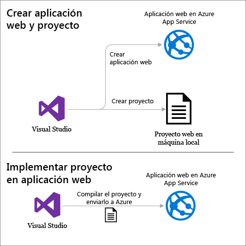
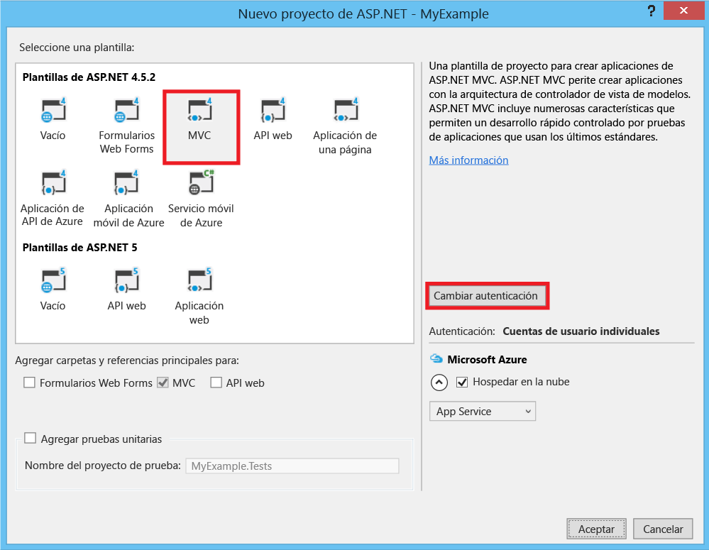
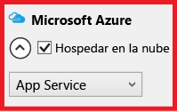
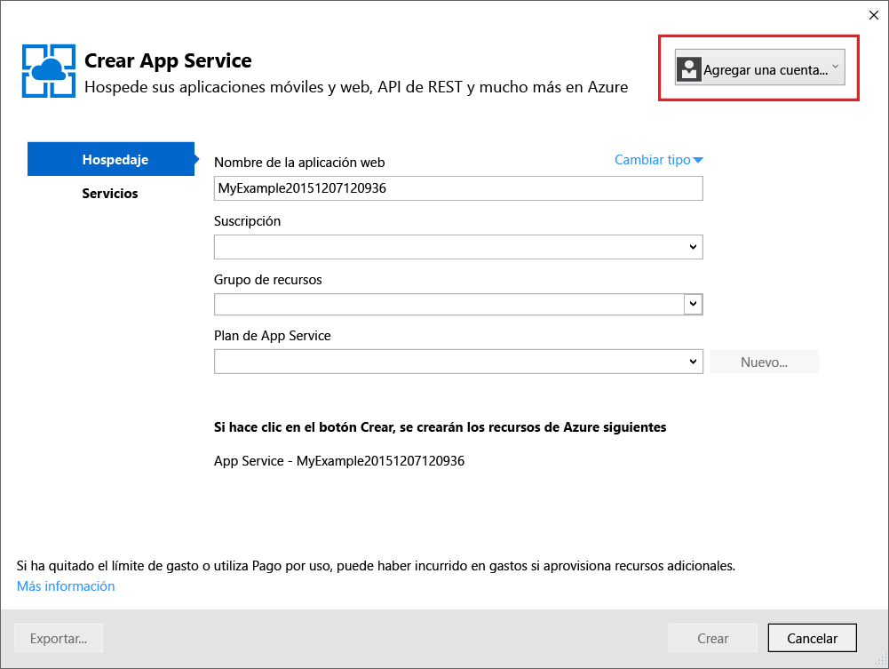
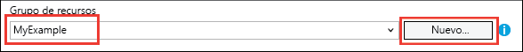
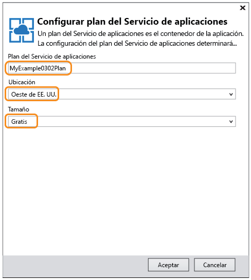
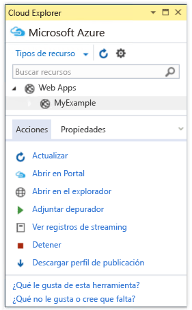
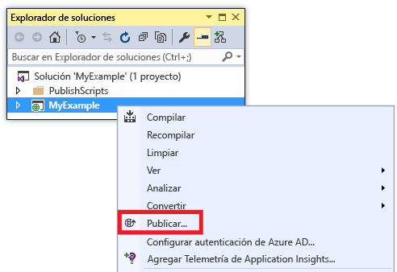
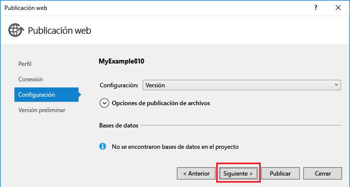
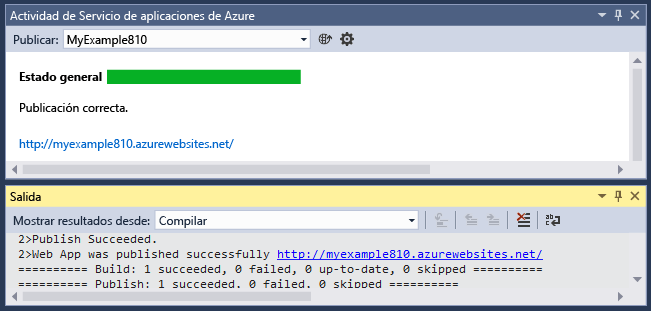

# Implementación de una aplicación web creada con ASP.NET en el Servicio de aplicaciones de Azure mediante Visual Studio
[!INCLUDE [tabs](../../includes/app-service-web-get-started-nav-tabs.md)]

## Información general
Este tutorial muestra cómo implementar una aplicación web creada con ASP.NET en una [aplicación web del Servicio de aplicaciones de Azure](app-service-web-overview.md) mediante Visual Studio 2015.

En este tutorial se asume que es desarrollador de ASP.NET y que nunca ha usado Azure. Cuando acabe, tendrá una sencilla aplicación web en funcionamiento en la nube.

Aprenderá a realizar los siguientes procedimientos:

* Cómo crear una nueva aplicación web del Servicio de aplicaciones servicio mientras crea un proyecto web en Visual Studio.
* Cómo implementar un proyecto web en una aplicación web de servicio de aplicación mediante Visual Studio.

El diagrama muestra lo que va a hacer en el tutorial.

Al final del tutorial se encuentran las secciones [Solución de problemas](#troubleshooting), en la que se dan ideas sobre lo que puede hacer si algo no funciona, y [Pasos siguientes](#next-steps), donde se proporcionan vínculos a otros tutoriales que explican con mayor profundidad cómo usar Azure App Service.

Dado que este es un tutorial de introducción, el proyecto de web que se muestra cómo implementar es simple, no utiliza base de datos ni realiza autenticación o autorización. Para obtener vínculos a temas más avanzados de implementación, consulte [Documentación de implementación del Servicio de aplicaciones de Azure](web-sites-deploy.md).

Aparte del tiempo necesario para instalar Azure SDK para. NET, este tutorial tardará aproximadamente 10-15 minutos en completarse.

## Requisitos previos
* En este tutorial se asume que ha trabajado con ASP.NET MVC y Visual Studio. Si necesita una introducción, consulte [Getting Started with ASP.NET MVC 5](http://www.asp.net/mvc/overview/getting-started/introduction/getting-started)(Introducción a ASP.NET MVC 5).
* Necesitará una cuenta de Azure. Puede [abrir una cuenta gratuita de Azure](/pricing/free-trial/?WT.mc_id=A261C142F) o [activar las ventajas que disfrutan los suscriptores de Visual Studio](/pricing/member-offers/msdn-benefits-details/?WT.mc_id=A261C142F). 
  
    Si desea empezar a usar el Servicio de aplicaciones de Azure antes de suscribirse para obtener una cuenta de Azure, vaya a la [prueba gratuita del Servicio de aplicaciones](http://go.microsoft.com/fwlink/?LinkId=523751). Ahí puede crear una aplicación de corta duración para iniciarse en el Servicio de aplicaciones (no se requiere tarjeta de crédito ni se establecen compromisos).

## Configuración del entorno de desarrollo
Este tutorial está escrito para Visual Studio 2015 con [Azure SDK para. NET](../dotnet-sdk.md) 2.9, o las versiones posteriores. 

* [Descargar el último Azure SDK para Visual Studio 2015](http://go.microsoft.com/fwlink/?linkid=518003). El SDK instala Visual Studio 2015, en caso de que no lo esté.
  
  > [!NOTE]
  > Según la cantidad de dependencias de SDK que tenga ya en la máquina, la instalación del SDK puede tardar un período largo, desde unos minutos a media hora o más.
  > 
  > 

Si tiene Visual Studio 2013 y prefiere usar esa versión, puede [descargar el último Azure SDK para Visual Studio 2013](http://go.microsoft.com/fwlink/?LinkID=324322). Algunas pantallas pueden no coincidir exactamente con las ilustraciones.

## Configuración de un proyecto web nuevo
El siguiente paso es crear un proyecto web en Visual Studio y una aplicación web en el Servicio de aplicaciones de Azure. En esta sección del tutorial configurará el nuevo proyecto web. 

1. Abra Visual Studio 2015.
2. Haga clic en **Archivo > Nuevo > Proyecto**.
3. En el cuadro de diálogo **Nuevo proyecto**, haga clic en **Visual C# > Web > Aplicación web ASP.NET**.
4. Asegúrese de que **.NET Framework 4.5.2** es el marco de trabajo de destino seleccionado.
5. [Azure Application Insights](../application-insights/app-insights-overview.md) supervisa la aplicación web en cuanto a disponibilidad, rendimiento y uso. La casilla **Agregar Application Insights al proyecto** está activada de forma predeterminada la primera vez que crea un proyecto web después de instalar Visual Studio. Desactive la casilla Agregar Application Insights al proyecto si no desea probar Application Insights.
6. Asigne a la aplicación el nombre **MyExample** y haga clic en **Aceptar**.
   
    
7. En el cuadro de diálogo **Nuevo proyecto de ASP.NET**, seleccione la plantilla **MVC** y haga clic en **Cambiar autenticación**.
   
    Para este tutorial, implemente un proyecto web de ASP.NET MVC. Si desea información sobre cómo implementar un proyecto de ASP.NET Web API, consulte la sección [Pasos siguientes](#next-steps) . 
   
    
8. En el cuadro de diálogo **Cambiar autenticación**, haga clic en **Sin autenticación** y, a continuación, en **Aceptar**.
   
    
   
    Para este tutorial de introducción va a implementar una aplicación sencilla en el que el usuario no inicia sesión.
9. En la sección **Microsoft Azure** del cuadro de diálogo **Nuevo proyecto ASP.NET**, asegúrese de que la casilla **Host en la nube** está activada y que **App Service** está seleccionado en la lista desplegable.
   
    
   
    Con esta configuración se indica a Visual Studio que cree una aplicación web de Azure para su proyecto web.
10. Haga clic en **Aceptar**

## Configuración de recursos de Azure para una aplicación web nueva
Ahora va a indicar a Visual Studio los recursos de Azure que desea que cree.

1. En el cuadro de diálogo **Crear servicio de aplicaciones**, haga clic en **Agregar una cuenta** y, luego, inicie sesión en Azure con el identificador y la contraseña de la cuenta que utiliza para administrar la suscripción de Azure.
   
    
   
    Si ya había iniciado sesión en el mismo equipo, es posible que no vea el botón **Agregar una cuenta** . En ese caso, puede omitir este paso o puede que tenga que volver a escribir sus credenciales.
2. En **Nombre de aplicación web** , escriba un nombre que sea único en el dominio *azurewebsites.net* . Puede denominarlo MyExample con números a la derecha para que sea único, por ejemplo, MyExample810. Si se crea automáticamente un nombre de web predeterminado, será exclusivo y puede usarlo.
   
    Si escribe un nombre que ya usa otro usuario, aparecerá un signo de exclamación rojo a la derecha en lugar de una marca de verificación verde y tendrá que especificar otro nombre.
   
    La dirección URL de la aplicación es este nombre, más *. azurewebsites.net*. Por ejemplo, si el nombre es `MyExample810`, la dirección URL será `myexample810.azurewebsites.net`.
   
    También puede utilizar un dominio personalizado con una aplicación web de Azure. Para más información, consulte [Configurar un nombre de dominio personalizado en el servicio de aplicaciones de Azure](web-sites-custom-domain-name.md).
3. Haga clic en el botón **Nuevo**, que se encuentra al lado del cuadro **Grupo de recursos**, y escriba "MyExample", o cualquier otro nombre que prefiera. 
   
    
   
    Un grupo de recursos es una colección de recursos de Azure tales como aplicaciones web, bases de datos y máquinas virtuales. Para un tutorial, suele ser mejor crear un nuevo grupo de recursos, porque así será fácil eliminar en un solo paso todos los recursos de Azure que se creen para el tutorial. Para más información, consulte [Información general de Azure Resource Manager](../azure-resource-manager/resource-group-overview.md).
4. Haga clic en el botón **Nuevo** situado junto a la lista desplegable **Plan de App Service**.
   
    
   
    Aparece el cuadro de diálogo **Configurar el plan de servicio de aplicaciones** .
   
    
   
    En los siguientes pasos, se configurará un plan del Servicio de aplicaciones para el nuevo grupo de recursos. Un plan del Servicio de aplicaciones especifica los recursos de proceso en los que se ejecuta una aplicación web. Por ejemplo, si elige el nivel Gratis, la aplicación de API se ejecuta en máquinas virtuales compartidas, mientras que para algunos niveles de pago, se ejecuta en máquinas virtuales dedicadas. Para más información, consulte [Introducción detallada sobre los planes del Servicio de aplicaciones de Azure](../app-service/azure-web-sites-web-hosting-plans-in-depth-overview.md).
5. En el cuadro de diálogo **Configurar el plan de servicio de aplicaciones** , escriba "MyExamplePlan", o cualquier otro nombre que prefiera.
6. En la lista desplegable **Ubicación** , elija la ubicación más cercana.
   
    Esta opción especifica en qué centro de datos de Azure se ejecutará su aplicación. Para este tutorial, puede seleccionar cualquier región y no habrá una diferencia notable, Pero para una aplicación de producción, es aconsejable que el servidor esté lo más próximo posible a los clientes que vaya a acceder a él, con el fin de minimizar la [latencia](http://www.bing.com/search?q=web%20latency%20introduction&qs=n&form=QBRE&pq=web%20latency%20introduction&sc=1-24&sp=-1&sk=&cvid=eefff99dfc864d25a75a83740f1e0090).
7. En la lista desplegable **Tamaño**, haga clic en **Gratis**.
   
    Para este tutorial, el plan de tarifa Gratis proporcionará un rendimiento suficiente.
8. En el cuadro de diálogo **Configurar el plan de servicio de aplicaciones**, haga clic en **Aceptar**.
9. En el cuadro de diálogo **Crear servicio de aplicaciones**, haga clic en **Crear**.

## Visual Studio crea el proyecto y la aplicación web
En poco tiempo, normalmente menos de un minuto, Visual Studio crea el proyecto web y la aplicación web.  

La ventana del **Explorador de soluciones** ventana muestra los archivos y carpetas del nuevo proyecto.

La ventana **Actividad del Servicio de aplicaciones de Azure** muestra que se ha creado la aplicación web.

La ventana **Cloud Explorer** le permite ver y administrar los recursos de Azure, incluida la nueva aplicación web que acaba de crear.

## Implementación del proyecto web en la aplicación web de Azure
En esta sección se implementa el proyecto web en la aplicación web.

1. En el **Explorador de soluciones**, haga clic con el botón derecho y elija **Publicar**.
   
    
   
    En unos segundos aparecerá el Asistente para **publicación web** . El asistente abre un *perfil de publicación* que incluye la configuración para implementar el proyecto web en la nueva aplicación web.
   
    El perfil de publicación incluye un nombre de usuario y una contraseña para la implementación.  Estas credenciales se han generado automáticamente y no es preciso que las escriba. La contraseña está cifrada en un archivo oculto específico del usuario, que se encuentra en la carpeta `Properties\PublishProfiles` .
2. En la pestaña **Conexión** del Asistente para **publicación web**, haga clic en **Siguiente**.
   
    
   
    La siguiente pestaña es **Configuración** . En ella se puede cambiar la pestaña de configuración de compilación para implementar una compilación de depuración para la [depuración remota](web-sites-dotnet-troubleshoot-visual-studio.md#remotedebug). También ofrece varias [opciones de publicación de archivos](https://msdn.microsoft.com/library/dd465337.aspx#Anchor_2).
3. En la pestaña **Configuración**, haga clic en **Siguiente**.
   
   
   
   La siguiente pestaña es **Vista previa** . Aquí puede ver qué archivos se van a copiar desde el proyecto a la aplicación de API. Al implementar un proyecto en una aplicación de API para la que ya implementó anteriormente, solo se copian los archivos modificados. Si desea ver una lista de los archivos que se van a copiar, haga clic en el botón **Iniciar vista previa** .
4. En la pestaña **Vista previa**, haga clic en **Publicar**.
   
   
   
   Al hacer clic en **Publicar**, Visual Studio comienza el proceso de copia de los archivos en el servidor de Azure. Esto puede tardar un par de minutos.
   
   Las ventanas **Salida** y **Actividad de Azure App Service** muestran las acciones de implementación que se realizaron e informan de la correcta finalización de la implementación.
   
   
   
   Tras una implementación correcta, el explorador predeterminado se abre automáticamente en la dirección URL de la aplicación web implementada y la aplicación que creó se ejecuta ahora en la nube. La dirección URL en la barra de direcciones del explorador muestra que la aplicación web se carga desde Internet.
   
   
   
   > [!TIP]
   > Para agilizar la implementación, puede habilitar la barra de herramientas **Publicación en Web con un solo clic** . Haga clic en **Vista > Barras de herramientas** y seleccione **Publicación en Web con un solo clic**. Esta barra de herramientas se puede usar para seleccionar un perfil, hacer clic en un botón para publicar o hacer clic en un botón para abrir el Asistente para **publicación web** .
   > 
   > 
   > 

## Solución de problemas
Si experimenta problemas mientras avanza por este tutorial, asegúrese de que está usando la versión más reciente del SDK de Azure para. NET. La manera más fácil de hacerlo es descargar [Azure SDK para Visual Studio 2015](http://go.microsoft.com/fwlink/?linkid=518003). Si tiene instalada la versión actual, el Instalador de plataforma web indicará que no es preciso realizar la instalación.

Si está en una red corporativa y está intentando realizar la implementación en el Servicio de aplicaciones de Azure mediante un firewall, asegúrese de que los puertos 443 y 8172 estén abiertos para Web Deploy. Si no puede abrir esos puertos, consulte la siguiente Pasos siguientes a continuación para ver otras opciones de implementación.

Una vez que la aplicación web ASP.NET se esté ejecutando en Azure App Service, puede obtener más información acerca de las características de Visual Studio que simplifican la solución de problemas. Para más información sobre el registro, la depuración remota, etc., consulte [Solución de problemas de una aplicación web en el Servicio de aplicaciones de Azure con Visual Studio](web-sites-dotnet-troubleshoot-visual-studio.md).

## Pasos siguientes
En este tutorial, aprendió a crear una aplicación web sencilla e implementarla en una aplicación web de Azure. Estos son algunos temas y recursos relacionados que le permitirán saber más sobre el Servicio de aplicaciones de Azure:

* Supervisión y administración de una aplicación web en el [Portal de Azure](https://portal.azure.com/). 
  
    Para más información, consulte la [introducción a Azure Portal](/services/management-portal/) y [Configuración de aplicaciones web en Azure App Service](web-sites-configure.md).
* Implementación de un proyecto web existente en una nueva aplicación web mediante Visual Studio
  
    En el **Explorador de soluciones**, haga clic con el botón derecho en el proyecto y, luego, haga clic en **Publicar**. Elija **Microsoft Azure App Service** como destino de publicación y haga clic en **Nuevo**. A partir de ahí los cuadros de diálogo son los mismos que ha visto en este tutorial.
* Implementación de un proyecto web desde el control de código fuente
  
    Para más información acerca de la [automatización de la implementación](http://www.asp.net/aspnet/overview/developing-apps-with-windows-azure/building-real-world-cloud-apps-with-windows-azure/continuous-integration-and-continuous-delivery) desde un [sistema de control de código fuente](http://www.asp.net/aspnet/overview/developing-apps-with-windows-azure/building-real-world-cloud-apps-with-windows-azure/source-control), consulte [Introducción a las aplicaciones web en Azure App Service](app-service-web-get-started.md) y [Documentación de implementación del Servicio de aplicaciones de Azure](web-sites-deploy.md).
* Implementación de una ASP.NET Web API en una aplicación de API en el Servicio de aplicaciones de Azure
  
    Ha visto cómo crear una instancia del Servicio de aplicaciones de Azure pensada principalmente para hospedar un sitio web. Servicio de aplicaciones también ofrece características para hospedar las API web, como la compatibilidad con CORS y compatibilidad con los metadatos de API para la generación de código de cliente. Puede utilizar las características API en una aplicación web, pero si desea principalmente hospedar una API en una instancia de Servicio de aplicaciones, una **aplicación de API** sería una opción mejor. Para más información, consulte [Introducción a Aplicaciones de API y ASP.NET en el Servicio de aplicaciones de Azure](../app-service-api/app-service-api-dotnet-get-started.md). 
* Incorporación de un nombre de dominio personalizado y SSL
  
    Para obtener información acerca de cómo usar SSL y su propio dominio (por ejemplo, www.contoso.com, en lugar de contoso.azurewebsites.net), consulte los siguientes recursos:
  
  * [Configuración de un nombre de dominio personalizado en el Servicio de aplicaciones de Azure](web-sites-custom-domain-name.md)
  * [Habilitación de HTTPS en un sitio web de Azure](web-sites-configure-ssl-certificate.md)
* Eliminación del grupo de recursos que contiene la aplicación web y todos los recursos de Azure relacionados cuando haya terminado con ellos.
  
    Para más información acerca de cómo trabajar con grupos de recursos en el Portal de Azure, consulte [Implementación de recursos con las plantillas de Resource Manager y el Portal de Azure](../resource-group-template-deploy-portal.md).   
* Para ver más ejemplos de creación de una aplicación web ASP.NET en App Service, consulte [Create and deploy an ASP.NET web app in Azure App Service](https://github.com/Microsoft/HealthClinic.biz/wiki/Create-and-deploy-an-ASP.NET-web-app-in-Azure-App-Service) (Creación e implementación de una aplicación web ASP.NET en Azure App Service) y [Create and deploy a mobile app in Azure App Service](https://github.com/Microsoft/HealthClinic.biz/wiki/Create-and-deploy-a-mobile-app-in-Azure-App-Service) (Creación e implementación de una aplicación móvil en Azure App Service) en la [demostración](https://github.com/Microsoft/HealthClinic.biz) de [HealthClinic.biz](https://blogs.msdn.microsoft.com/visualstudio/2015/12/08/connectdemos-2015-healthclinic-biz/) 2015 Connect. Para ver más guías rápidas de la demostración de HealthClinic.biz, consulte las [guías rápidas de las herramientas de desarrollador de Azure](https://github.com/Microsoft/HealthClinic.biz/wiki/Azure-Developer-Tools-Quickstarts).

<!---HONumber=Nov16_HO2-->

