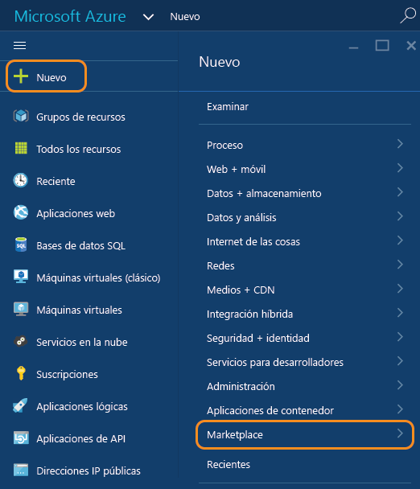
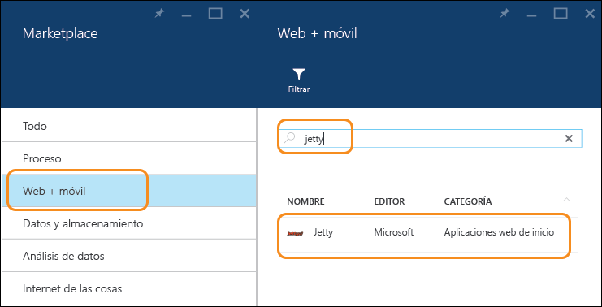
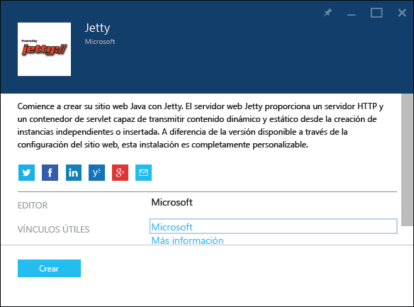
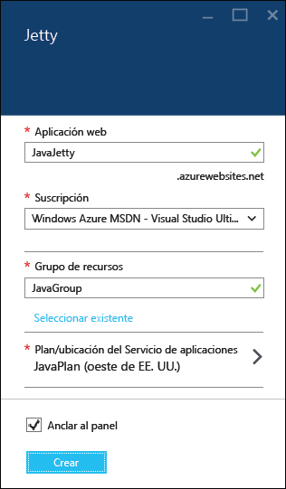
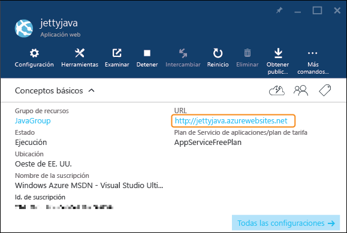

<properties
	pageTitle="Creación de una aplicación web de Java en Servicio de aplicaciones de Azure | Microsoft Azure"
	description="En este tutorial se muestra cómo implementar una aplicación web de Java en el Servicio de aplicaciones de Azure."
	services="app-service\web"
	documentationCenter="java"
	authors="rmcmurray"
	manager="wpickett"
	editor="jimbe"/>
<tags
	ms.service="app-service-web"
	ms.workload="web"
	ms.tgt_pltfrm="na"
	ms.devlang="Java"
	ms.topic="hero-article"
	ms.date="08/31/2015"
	ms.author="robmcm"/>

# Creación de una aplicación web de Java en el Servicio de aplicaciones de Azure

> [AZURE.SELECTOR]
- [.Net](web-sites-dotnet-get-started.md)
- [Node.js](web-sites-nodejs-develop-deploy-mac.md)
- [Java](web-sites-java-get-started.md)
- [PHP - Git](web-sites-php-mysql-deploy-use-git.md)
- [PHP - FTP](web-sites-php-mysql-deploy-use-ftp.md)
- [Python](web-sites-python-ptvs-django-mysql.md)

En este tutorial se muestra cómo crear una [aplicación web de Java en el Servicio de aplicaciones de Azure](http://go.microsoft.com/fwlink/?LinkId=529714) mediante el Portal de vista previa de Azure. Puede elegir una plantilla de aplicación web de Azure Marketplace o crear una aplicación web genérica y configurarla manualmente para Java.

Si no desea usar ninguna de estas técnicas y, por ejemplo, desea personalizar el contenedor de aplicaciones, consulte [Carga de una aplicación web de Java personalizada en Azure](web-sites-java-custom-upload.md).

> [AZURE.NOTE]Necesita una cuenta de Microsoft Azure para completar este tutorial. Si aún no la tiene, puede [activar los beneficios de suscripción a MSDN][] o bien [registrarse para obtener una evaluación gratuita][].
>
> Si desea empezar a usar Servicio de aplicaciones de Azure antes de suscribirse para obtener una cuenta de Azure, vaya a la [prueba gratuita de Servicio de aplicaciones][]. Ahí puede crear de forma inmediata una aplicación web de corta duración para iniciarse en Servicio de aplicaciones, no se requiere tarjeta de crédito y no se establece ningún compromiso.

## Selección de una plantilla de aplicación web en Azure Marketplace

En esta sección se muestra cómo usar Azure Marketplace para crear una aplicación web de Java.

1. Inicie sesión en el [Portal de vista previa de Azure](https://portal.azure.com/).

2. Haga clic en **Nuevo > Marketplace**.

	

5. Haga clic en **Web y móvil**.

	Puede que tenga que desplazarse a la izquierda para ver la hoja **Marketplace** donde puede seleccionar **Web y móvil**.

6. En el cuadro de texto Buscar, escriba el nombre de un servidor de aplicaciones Java, como **Apache Tomcat** o **Jetty** y luego presione Entrar.

4. En los resultados de búsqueda, haga clic en el servidor de aplicaciones Java.

	

5. En la primera hoja **Apache Tomcat** o **Jetty**, haga clic en **Crear**.

	

4. En la siguiente hoja **Apache Tomcat** o **Jetty**, escriba un nombre para la aplicación web en el cuadro **Aplicación web**.

	Este nombre debe ser único en el dominio azurewebsites.net porque la dirección URL de la aplicación web será {nombre}.azurewebsites.net. Si el nombre especificado no es único, se muestra un signo de exclamación rojo en el cuadro de texto.

5. Seleccione un **Grupo de recursos** o cree uno nuevo.

	Para obtener más información sobre los grupos de recursos, consulte [Uso del Portal de vista previa de Azure para administrar los recursos de Azure](../resource-group-portal.md).

5. Seleccione un **plan de servicio de aplicaciones/ubicación** o cree uno nuevo.

	Para obtener más información sobre los planes del Servicio de aplicaciones, consulte [Información general sobre los planes del Servicio de aplicaciones de Azure](../azure-web-sites-web-hosting-plans-in-depth-overview.md).

6. Haga clic en **Crear**.

	

	En poco tiempo, normalmente menos de un minuto, Azure termina de crear la nueva aplicación web.

7. Haga clic en **Aplicaciones web > {su nueva aplicación web}**.

8. Haga clic en la **URL** para buscar el nuevo sitio.

	

	Si eligió Tomcat, verá una página similar al ejemplo siguiente.

	

	Si eligió Jetty, verá una página similar al ejemplo siguiente.

	

Ahora que ha creado la aplicación web con un contenedor de aplicaciones, consulte la sección [Pasos siguientes](#next-steps) para obtener información sobre cómo cargar la aplicación en la aplicación web.

## Creación de una aplicación web y su configuración manual para Java

En esta sección se muestra cómo crear una aplicación web y configurarla manualmente para Java.

1. Inicie sesión en el [Portal de vista previa de Azure](https://portal.azure.com/).

2. Haga clic en **Nuevo > Web y móvil**.

6. Haga clic en **Aplicación web**.

4. Escriba un nombre para la aplicación web en el cuadro **Aplicación web**.

	Este nombre debe ser único en el dominio azurewebsites.net porque la dirección URL de la aplicación web será {nombre}.azurewebsites.net. Si el nombre especificado no es único, se muestra un signo de exclamación rojo en el cuadro de texto.

5. Seleccione un **Grupo de recursos** o cree uno nuevo.

	Para obtener más información sobre los grupos de recursos, consulte [Uso del Portal de vista previa de Azure para administrar los recursos de Azure](../resource-group-portal.md).

5. Seleccione un **plan de servicio de aplicaciones/ubicación** o cree uno nuevo.

	Para obtener más información sobre los planes del Servicio de aplicaciones, consulte [Información general sobre los planes del Servicio de aplicaciones de Azure](../azure-web-sites-web-hosting-plans-in-depth-overview.md).

6. Haga clic en **Crear**.
 
11. Cuando se haya creado la aplicación web, haga clic en **Aplicaciones web > {su aplicación web}**.
 
13. En la hoja **Aplicación web**, haga clic en **Configuración**.

12. Haga clic en **Configuración de la aplicación**.

13. Elija la **versión Java** deseada.

14. Elija el **contenedor web** deseado.

15. Haga clic en **Guardar**.

	En un momento, la aplicación web se convertirá en una aplicación basada en Java.

7. Haga clic en **Aplicaciones web > {su nueva aplicación web}**.

8. Haga clic en la **URL** para buscar el nuevo sitio.

	La página web confirma que ha creado una aplicación web basada en Java.

## Pasos siguientes

En este momento, dispone de un servidor de aplicaciones Java que se ejecuta en la aplicación web en el Servicio de aplicaciones de Azure. Para implementar su propio código en la aplicación web, consulte [Incorporación de una aplicación o página web a la aplicación web de Java](web-sites-java-add-app.md).

Para obtener más información sobre el desarrollo de aplicaciones Java en Azure, consulte el [Centro de desarrolladores de Java](/develop/java/).

<!-- External Links -->
[activar los beneficios de suscripción a MSDN]: http://go.microsoft.com/fwlink/?LinkId=623901
[registrarse para obtener una evaluación gratuita]: http://go.microsoft.com/fwlink/?LinkId=623901

[prueba gratuita de Servicio de aplicaciones]: http://go.microsoft.com/fwlink/?LinkId=523751

<!---HONumber=Oct15_HO4-->