<properties 
	pageTitle="Django y MySQL en Azure con Python Tools 2.1 para Visual Studio" 
	description="Obtenga información acerca de cómo usar Python Tools para Visual Studio para crear una aplicación Django que almacene datos en una instancia de base de datos de MySQL y se pueda implementar en un sitio web." 
	services="app-service\web" 
	tags="python"
	documentationCenter="python" 
	authors="huguesv" 
	manager="wpickett" 
	editor=""/>

<tags 
	ms.service="app-service-web" 
	ms.workload="web" 
	ms.tgt_pltfrm="na" 
	ms.devlang="python" 
	ms.topic="article" 
	ms.date="02/09/2015" 
	ms.author="huguesv"/>

# Django y MySQL en Azure con Python Tools 2.1 para Visual Studio 

En este tutorial, usaremos las [herramientas de Python para Visual Studio][] a fin de crear una aplicación de sondeos sencilla mediante una de las plantillas de ejemplo de PTVS. Este tutorial también se encuentra disponible como [vídeo](https://www.youtube.com/watch?v=oKCApIrS0Lo)

Vamos a aprender a usar un servicio de MySQL hospedado en Azure, configurar la aplicación para usar MySQL y publicar la aplicación en un sitio web de Azure.

Consulte el [Centro para desarrolladores de Python][] para tener acceso a más artículos que tratan sobre el desarrollo de Sitios web de Azure con PTVS mediante el uso de marcos web Bottle, Flask y Django, con MongoDB, Almacenamiento de tablas de Azure y los servicios de Base de datos MySQL y SQL.  Si bien estos artículos se centran en Sitios web de Azure, los pasos son similares a los que se aplican para desarrollar [Servicios en la nube de Azure][].

## Requisitos previos

 - Visual Studio 2012 o 2013
 - [Python Tools 2.1 para Visual Studio][]
 - [Python Tools 2.1 para archivos VSIX de ejemplo de Visual Studio][]
 - [Herramientas del SDK de Azure para VS 2013][] o [Herramientas del SDK de Azure para VS 2012][]
 - [Python 2.7 de 32 bits][]

> [AZURE.NOTE]
> Para completar este tutorial, deberá tener una cuenta de Azure. Puede <a href="http://azure.microsoft.com/pricing/member-offers/msdn-benefits-details/">activar sus beneficios de suscriptor a MSDN</a> o <a href="http://azure.microsoft.com/pricing/free-trial/">registrarse para obtener una evaluación gratuita</a>.
> 
> Si desea obtener una introducción a Sitios web de Azure antes de inscribirse para abrir una cuenta, vaya a <a href="https://trywebsites.azurewebsites.net/?language=python">https://trywebsites.azurewebsites.net</a>, donde puede crear inmediatamente y de forma gratuita un sitio básico de ASP.NET de corta duración en Sitios web de Azure. No es necesario proporcionar ninguna tarjeta de crédito ni asumir ningún compromiso.

## Creación del proyecto

En esta sección, vamos a crear un proyecto de Visual Studio con la utilización de una plantilla de ejemplo. Vamos a crear un entorno virtual e instalar los paquetes necesarios.  Vamos a crear una base de datos local con sqlite.  A continuación, ejecutaremos la aplicación localmente.

1.  En Visual Studio, seleccione **Archivo** y **Nuevo proyecto**.

1.  Las plantillas de proyecto de los archivos VSIX de ejemplo de PTVS se encuentran disponibles en **Python**, **Samples** (Ejemplos).  Seleccione **Polls Flask Web Project** (Proyecto web de Flask para sondeos) y haga clic en OK (Aceptar) para crear el proyecto.

  	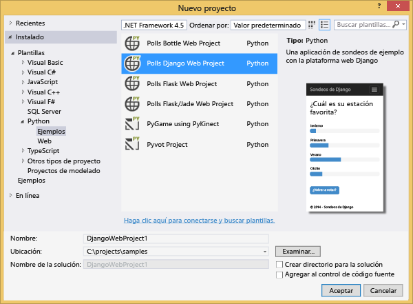

1.  Se le pedirá que instale paquetes externos.  Seleccione **Instalar en un entorno virtual**.

  	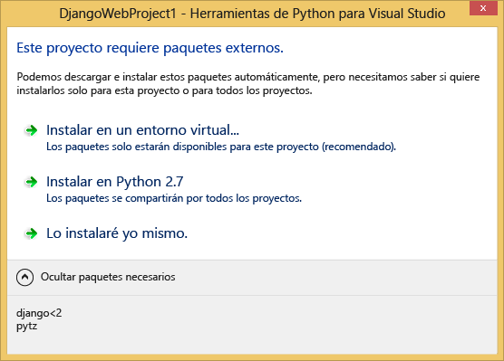

1.  Seleccione **Python 2.7** como intérprete de base.

  	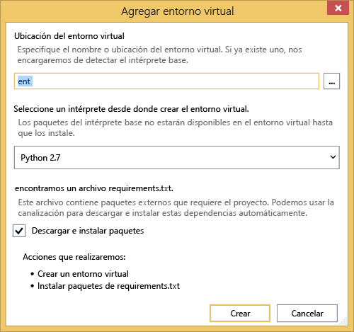

1.  Haga clic con el botón secundario en el nodo del proyecto y seleccione **Python**, **Django Sync DB** (Base de datos de sincronización de Django).

  	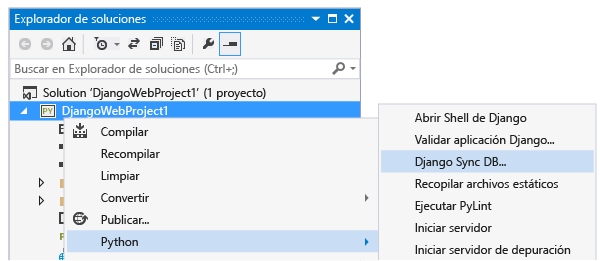

1.  A continuación, se abrirá la consola de administración de Django.  Siga las indicaciones para crear un usuario.

    Se creará una base de datos sqlite en la carpeta del proyecto.

  	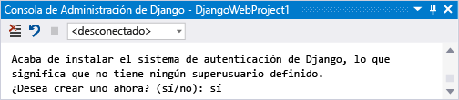

1.  Presione <kbd>F5</kbd> para confirmar que la aplicación funciona.

1.  Haga clic en **Iniciar sesión** en la barra de navegación de la parte superior.

  	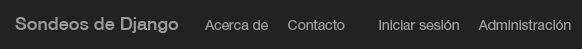

1.  Escriba las credenciales del usuario que ha creado al sincronizar la base de datos.

  	

1.  Haga clic en **Create Sample Polls** (Crear sondeos de ejemplo).

  	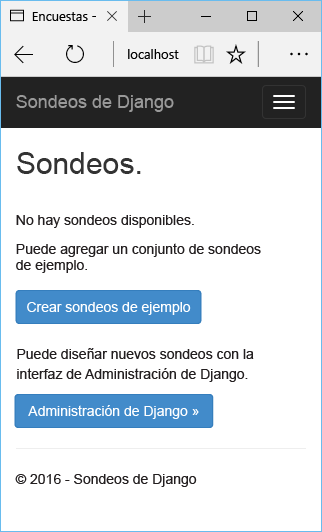

1.  Haga clic en un sondeo y vote.

  	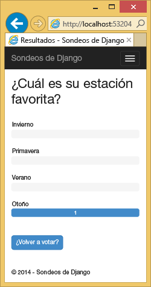

## Creación de una base de datos MySQL

Para la base de datos, crearemos una base de datos MySQL de ClearDB hospedada en Azure.

Como alternativa, puede crear su propia máquina virtual para que se ejecute en Azure y, a continuación, instalar y administrar MySQL por su cuenta.

Siga estos pasos para crear una base de datos con un plan gratuito.

1.  Inicie sesión en el [Portal de administración de Azure][].

1.  En la parte inferior del panel de navegación, haga clic en **NEW**.

  	

1.  Haga clic en **ALMACENAR** y, a continuación, en **ClearDB MySQL Database** (Base de datos MySQL de ClearDB).

  	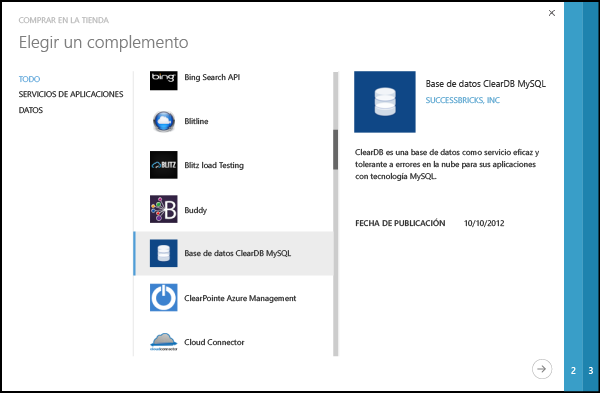

1.  En Nombre, escriba un nombre que usará para el servicio de base de datos.

1.  Seleccione un grupo de región/afinidad en el que ubicar el servicio de base de datos. Si va a usar la base de datos desde la aplicación de Azure, seleccione la misma región en la que implementará la aplicación.

  	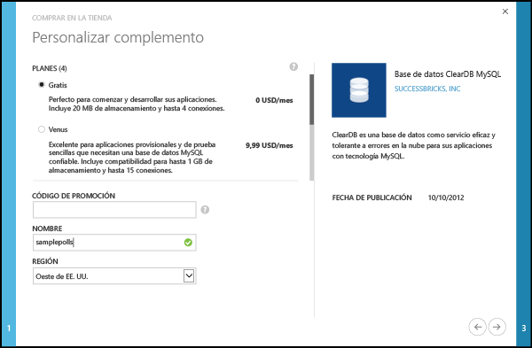

1.  Haga clic en **COMPRAR**.

## Configuración del proyecto

En esta sección, vamos a configurar nuestra aplicación para usar la base de datos MySQL que acabamos de crear.  Observaremos cómo obtener la configuración de la conexión en el portal de Azure.  También vamos a instalar paquetes adicionales de Python necesarios para utilizar bases de datos MySQL con Django.  A continuación, ejecutaremos la aplicación localmente.

1.  En el [Portal de administración de Azure][], haga clic en **COMPLEMENTOS** y, a continuación, haga clic en el servicio Base de datos MySQL de ClearDB que ha creado anteriormente.

1.  Haga clic en **INFORMACIÓN DE CONEXIÓN**.  Puede usar el botón Copiar para colocar el valor de **CONNECTIONSTRING** en el Portapapeles.

  	

1.  En Visual Studio, abra **settings.py** desde la carpeta  *ProjectName*.  Pegue temporalmente la cadena de conexión en el editor.  La cadena de conexión tiene el siguiente formato:

        Database=<NAME>;Data Source=<HOST>;User Id=<USER>;Password=<PASSWORD>

    Cambie el **MOTOR** predeterminado de la base datos para que use MySQL y establezca los valores de **NOMBRE**, **USUARIO**, **CONTRASEÑA** y **HOST** de la **CADENA DE CONEXIÓN**.

        DATABASES = {
            'default': {
                'ENGINE': 'django.db.backends.mysql',
                'NAME': '<Database>',
                'USER': '<User Id>',
                'PASSWORD': '<Password>',
                'HOST': '<Data Source>',
                'PORT': '',
            }
        }

1.  En el Explorador de soluciones, en **Python Environments** (Entornos de Python), haga clic con el botón secundario en el entorno virtual y seleccione **Install Python Package** (Instalar paquete de Python).

1. Instale el paquete `mysql-python` con **easy_install**.

  	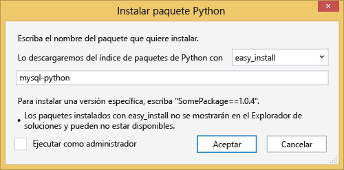

1.  Haga clic con el botón secundario en el nodo del proyecto y seleccione **Python**, **Django Sync DB** (Base de datos de sincronización de Django).  

    De esta forma, se crearán las tablas para la base de datos MySQL que hemos creado en la sección anterior.  Siga las indicaciones para crear un usuario, que no tiene que coincidir con el usuario de la base de datos sqlite creada en la primera sección.

  	

1.  Presione <kbd>F5</kbd> para ejecutar la aplicación.  Los sondeos creados con **Create Sample Polls** (Crear sondeos de ejemplo) y los datos enviados al votar se serializarán en la base de datos MySQL.

## Publicación en un sitio web de Azure

PTVS ofrece una forma fácil de implementar la aplicación web en un sitio web de Azure.

1.  En el **Explorador de soluciones**, haga clic con el botón secundario en el nodo del proyecto y seleccione **Publicar**.

  	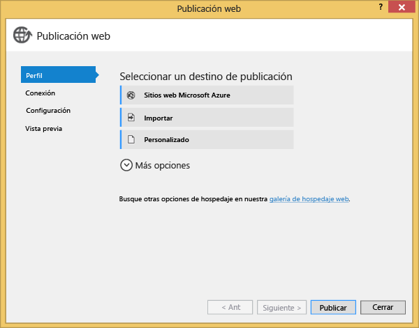

1.  Haga clic en **Sitios web de Microsoft Azure**.

1.  Haga clic en **Nuevo** para crear un sitio nuevo.

1.  Seleccione un **Nombre de sitio** y una **Región** y haga clic en **Crear**.

  	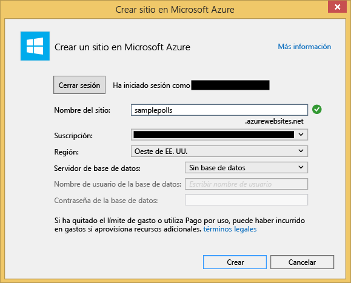

1.  Acepte todos los valores predeterminados y haga clic en **Publicar**.

1.  El explorador web se abrirá automáticamente en el sitio web publicado.  La aplicación ahora debe funcionar según lo previsto, con el uso de la base de datos **MySQL** hospedada en Azure.

    ¡Enhorabuena!

  	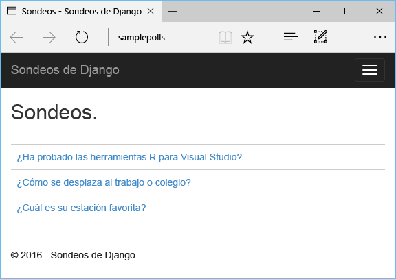

## Pasos siguientes

Siga estos vínculos para obtener más información sobre las herramientas de Python para Visual Studio, Django y MySQL.

- [Documentación sobre Python Tools para Visual Studio][]
  - [Proyectos web][]
  - [Proyectos de servicio en la nube][]
  - [Depuración remota en Microsoft Azure][]
- [Documentación de Django][]
- [MySQL][]

<!--Link references-->
[Centro para desarrolladores de Python]: /develop/python/
[Servicios en la nube de Azure]: ../cloud-services-python-ptvs.md

<!--External Link references-->
[Portal de administración de Azure]: https://manage.windowsazure.com
[Python Tools para Visual Studio]: http://aka.ms/ptvs
[Python Tools 2.1 para Visual Studio]: http://go.microsoft.com/fwlink/?LinkId=517189
[Python Tools 2.1 para archivos VSIX de ejemplo de Visual Studio]: http://go.microsoft.com/fwlink/?LinkId=517189
[Herramientas del SDK de Azure para VS 2013]: http://go.microsoft.com/fwlink/?LinkId=323510
[Herramientas del SDK de Azure para VS 2012]: http://go.microsoft.com/fwlink/?LinkId=323511
[Python 2.7 de 32 bits]: http://go.microsoft.com/fwlink/?LinkId=517190 
[Documentación sobre Python Tools para Visual Studio]: http://pytools.codeplex.com/documentation
[Depuración remota en Microsoft Azure]: http://pytools.codeplex.com/wikipage?title=Features%20Azure%20Remote%20Debugging
[Proyectos web]: http://pytools.codeplex.com/wikipage?title=Features%20Web%20Project
[Proyectos de servicio en la nube]: http://pytools.codeplex.com/wikipage?title=Features%20Cloud%20Project
[Documentación de Django]: https://www.djangoproject.com/
[MySQL]: http://www.mysql.com/

<!--HONumber=52--> 