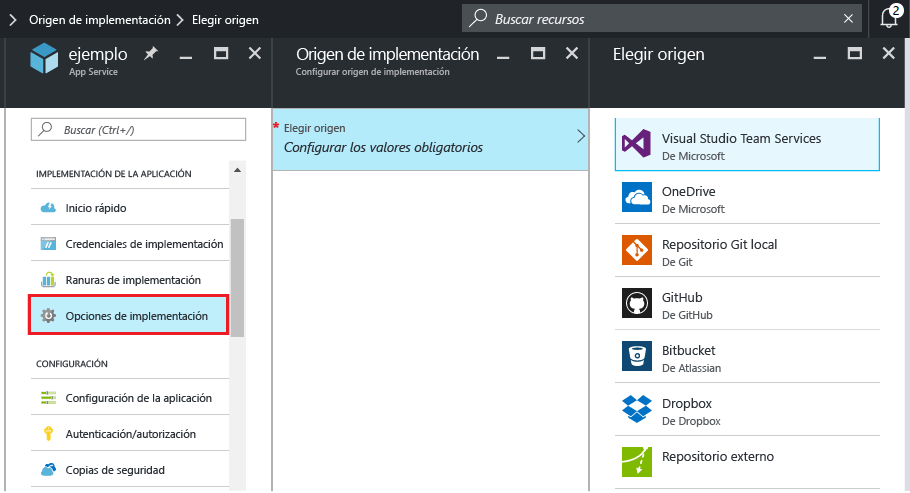
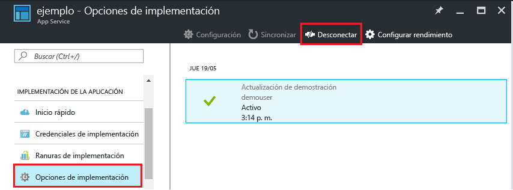

# Implementación continua en el Servicio de aplicaciones de Azure
En este tutorial se muestra cómo configurar un flujo de trabajo de implementación continua para sus aplicaciones de [Azure Web Apps](app-service-web-overview.md). La integración del Servicio de aplicaciones con BitBucket, GitHub y [Visual Studio Team Services (VSTS)](https://www.visualstudio.com/team-services/) hace posible un flujo de trabajo de implementación continuo en el que Azure extrae las actualizaciones más recientes del proyecto publicado en uno de estos servicios. La implementación continua representa una buena opción para los proyectos donde se integran contribuciones diversas y frecuentes.

Para más información sobre cómo configurar una implementación continua manualmente desde un repositorio en la nube que no aparece en Azure Portal (como [GitLab](https://gitlab.com/)), consulte [Setting up continuous deployment using manual steps](https://github.com/projectkudu/kudu/wiki/Continuous-deployment#setting-up-continuous-deployment-using-manual-steps) (Configuración de la implementación continua de forma manual).

## Habilitación de la implementación continua
Para habilitar la implementación continua

1. Publique el contenido de la aplicación en el repositorio que se utilizará para la implementación continua.  
    Para más información sobre cómo publicar el proyecto en estos servicios, consulte [Crear un repositorio (GitHub)], [Crear un repositorio (BitBucket)] y la [introducción a VSTS].
2. En la hoja del menú de la aplicación de [Azure Portal], haga clic en **IMPLEMENTACIÓN DE LA APLICACIÓN &gt; Opciones de implementación**. Haga clic en **Elegir origen** y luego seleccione el origen de implementación.  
   
    
   
   > [!NOTE]
   > Para configurar una cuenta de VSTS para la implementación del Servicio de aplicaciones, consulte este [tutorial](https://github.com/projectkudu/kudu/wiki/Setting-up-a-VSTS-account-so-it-can-deploy-to-a-Web-App).
   > 
   > 
3. Complete el flujo de trabajo de autorización.
4. En la hoja **Origen de implementación**, elija el proyecto y la rama desde donde se implementará. Cuando haya terminado, haga clic en **Aceptar**.
   
    
   
   > [!NOTE]
   > Al habilitar la implementación continua con GitHub o BitBucket, se mostrarán tanto los proyectos públicos como privados.
   > 
   > 
   
    Servicio de aplicaciones crea una asociación con el repositorio seleccionado, extrae los archivos de la rama seleccionada y mantiene un clon del repositorio para la aplicación del Servicio de aplicaciones. Al configurar la implementación continua de VSTS desde Azure Portal, la integración usa el [motor de implementación de Kudu](https://github.com/projectkudu/kudu/wiki) de App Service, que ya automatiza las tareas de compilación e implementación con cada `git push`. No es necesario configurar por separado la implementación continua en VSTS. Una vez que el proceso finaliza, la hoja **Opciones de implementación** de la aplicación muestra una implementación activa que indica que la implementación se ha realizado correctamente.
5. Para comprobar que la aplicación se implementó correctamente, haga clic en la opción **URL** de la parte superior de la hoja de la aplicación en Azure Portal.
6. Para comprobar que se está produciendo la implementación continua desde el repositorio elegido, inserte un cambio en el repositorio. La aplicación debería actualizarse para reflejar los cambios poco después de que finalice la inserción en el repositorio. Puede comprobar que la actualización se ha extraído en la hoja **Opciones de implementación** de la aplicación.

## Implementación continua de una solución de Visual Studio
La inserción de una solución de Visual Studio en el Servicio de aplicaciones de Azure es tan fácil como insertar un archivo index.html. El proceso de implementación del Servicio de aplicaciones simplifica todos los detalles, incluida la restauración de las dependencias de NuGet y la compilación de los archivos binarios de la aplicación. Puede seguir los procedimientos recomendados de control de código fuente sobre el mantenimiento del código solo en el repositorio de Git y dejar que la implementación del Servicio de aplicaciones se encargue del resto.

Los pasos para insertar su solución de Visual Studio en el Servicio de aplicaciones son los mismos de la [sección anterior](#overview), siempre y cuando haya configurado la solución y el repositorio como sigue:

* Use la opción de control de código fuente de Visual Studio para generar un archivo `.gitignore` (como en la siguiente imagen) o agregue manualmente un archivo `.gitignore` en la raíz del repositorio con contenido similar a este [ejemplo .gitignore](https://github.com/github/gitignore/blob/master/VisualStudio.gitignore).
  
  
* Agregue el árbol de directorios de la solución entero a su repositorio, con el archivo .sln en la raíz del repositorio.

Una vez que haya establecido el repositorio como se ha descrito y haya configurado la aplicación en Azure para la publicación continua desde uno de los repositorios de Git en línea, podrá desarrollar la aplicación ASP.NET localmente en Visual Studio e implementar continuamente el código simplemente insertando los cambios en el repositorio de Git en línea.

## Deshabilitación de la implementación continua
Para deshabilitar la implementación continua

1. En la hoja del menú de la aplicación de [Azure Portal], haga clic en **IMPLEMENTACIÓN DE LA APLICACIÓN &gt; Opciones de implementación**. A continuación, haga clic en **Desconectar** en la hoja **Opciones de implementación**.
   
    
2. Tras responder **Sí** al mensaje de confirmación, puede volver a la hoja de la aplicación y hacer clic en **IMPLEMENTACIÓN DE LA APLICACIÓN > Opciones de implementación** si quiere configurar la publicación desde otro origen.

## Recursos adicionales
* [How to investigate common issues with continuous deployment](https://github.com/projectkudu/kudu/wiki/Investigating-continuous-deployment)
* [Uso de PowerShell para Azure]
* [Uso de las herramientas de línea de comandos de Azure para Mac y Linux]
* [Documentación de Git]
* [Project Kudu](https://github.com/projectkudu/kudu/wiki)
* [Usar Azure para generar automáticamente una canalización de CI/CD para implementar una aplicación de ASP.NET 4](https://www.visualstudio.com/docs/build/get-started/aspnet-4-ci-cd-azure-automatic)

> [!NOTE]
> Si desea empezar a trabajar con el Servicio de aplicaciones de Azure antes de inscribirse para abrir una cuenta de Azure, vaya a [App Service](https://azure.microsoft.com/try/app-service/), donde podrá crear inmediatamente una aplicación web de inicio de corta duración en el Servicio de aplicaciones. No es necesario proporcionar ninguna tarjeta de crédito ni asumir ningún compromiso.
> 
> 

[Azure Portal]: https://portal.azure.com
[VSTS Portal]: https://www.visualstudio.com/en-us/products/visual-studio-team-services-vs.aspx
[Installing Git]: http://git-scm.com/book/en/Getting-Started-Installing-Git
[Uso de PowerShell para Azure]: /powershell/azureps-cmdlets-docs
[Uso de las herramientas de línea de comandos de Azure para Mac y Linux]:../cli-install-nodejs.md
[Documentación de Git]: http://git-scm.com/documentation

[Crear un repositorio (GitHub)]: https://help.github.com/articles/create-a-repo
[Crear un repositorio (BitBucket)]: https://confluence.atlassian.com/display/BITBUCKET/Create+an+Account+and+a+Git+Repo
[introducción a VSTS]: https://www.visualstudio.com/docs/vsts-tfs-overview
