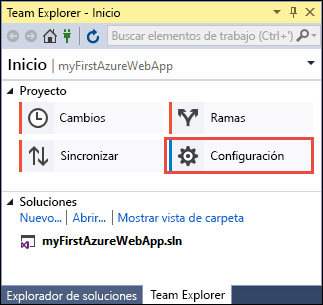
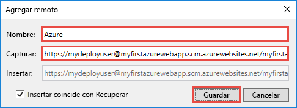

# <a name="create-an-aspnet-core-web-app-in-azure"></a>Creación de una aplicación web ASP.NET Core en Azure

> [!NOTE]
> En este artículo se implementa una aplicación en App Service en Windows. Para realizar implementaciones en App Service en _Linux_, consulte [Creación de una aplicación web de .NET Core en App Service en Linux](./containers/quickstart-dotnetcore.md).
>
> Si quiere conocer los pasos para una aplicación de ASP.NET Framework, consulte [Creación de una aplicación web de ASP.NET Framework en Azure](app-service-web-get-started-dotnet-framework.md). 
>

[Azure Web Apps](app-service-web-overview.md) proporciona un servicio de hospedaje web muy escalable y con aplicación de revisiones de un modo automático.  Esta guía de inicio rápido muestra cómo implementar su primera aplicación web ASP.NET Core en Azure Web Apps. Cuando haya terminado, tendrá un grupo de recursos que consta de un plan de App Service y una aplicación web de Azure con una aplicación web implementada.

[!INCLUDE [quickstarts-free-trial-note](../../includes/quickstarts-free-trial-note.md)]

## <a name="prerequisites"></a>requisitos previos

Para completar este tutorial:

* Instalar <a href="https://www.visualstudio.com/downloads/" target="_blank">Visual Studio 2017</a> con las cargas de trabajo siguientes:
    - **ASP.NET y desarrollo web**
    - **Desarrollo de Azure**

    

## <a name="create-an-aspnet-core-web-app"></a>Cree una aplicación web ASP.NET Core

Cree un proyecto nuevo en Visual Studio seleccionando **Archivo > Nuevo > Proyecto**. 

En el cuadro de diálogo **Nuevo proyecto**, seleccione **Visual C# > Web > Aplicación web ASP.NET Core**.

Dele a la aplicación el nombre _myFirstAzureWebApp_, y seleccione **Crear nuevo repositorio Git** y **Aceptar**.
   


Puede implementar cualquier tipo de aplicación web ASP.NET Core en Azure. Para esta guía de inicio rápido, seleccione la plantilla **Aplicación web** y asegúrese de que la autenticación se establece en **Sin autenticación**.
      
Seleccione **Aceptar**.


Una vez creado el proyecto de ASP.NET Core, se mostrará la página de bienvenida de ASP.NET Core con numerosos vínculos a recursos que le ayudarán a empezar a trabajar. 


En el menú, seleccione **Depurar > Iniciar sin depurar** para ejecutar la aplicación web localmente.


[!INCLUDE [cloud-shell-try-it.md](../../includes/cloud-shell-try-it.md)]

[!INCLUDE [Configure deployment user](../../includes/configure-deployment-user.md)] 

[!INCLUDE [Create resource group](../../includes/app-service-web-create-resource-group.md)] 

[!INCLUDE [Create app service plan](../../includes/app-service-web-create-app-service-plan.md)] 

[!INCLUDE [Create web app](../../includes/app-service-web-create-web-app.md)] 


## <a name="push-to-azure-from-visual-studio"></a>Inserción en Azure desde Visual Studio

De nuevo en Visual Studio, en el menú **Vista**, haga clic en **Team Explorer**. Aparecerá **Team Explorer**.

En la vista **Inicio**, haga clic en **Configuración** > **Configuración del repositorio**.



En la sección **Remotos** de **Configuración del repositorio**, seleccione **Agregar**. Se mostrará el cuadro de diálogo **Agregar remoto**.

Establezca el campo **Nombre** en _Azure_ y el campo **Capturar** en la dirección URL que guardó de [Crear una aplicación web](#create-a-web-app). Haga clic en **Save**(Guardar).



Este valor es equivalente al comando Git `git remote add Azure <URL>`.

Haga clic en el botón **Inicio** de la parte superior.

Seleccione **Configuración** > **Configuración global**. Confirme que se han establecido el nombre y las direcciones de correo electrónico. Seleccione **Actualizar** si es necesario.

Visual Studio ya confirmó todos los archivos en el repositorio de Git cuando creó el proyecto. Ahora solo tiene que insertar los archivos en Azure.

Haga clic en el botón **Inicio** de la parte superior. Seleccione **Sincronizar** > **Acciones** > **Abrir símbolo del sistema**. 

Escriba el siguiente comando en la ventana de comandos y, cuando se le pida, la contraseña de implementación:

```
git push Azure master
```

Este comando puede tardar varios minutos en ejecutarse. Durante la ejecución, muestra información similar a la del ejemplo siguiente:

```
Counting objects: 4, done.
Delta compression using up to 8 threads.
Compressing objects: 100% (4/4), done.
Writing objects: 100% (4/4), 349 bytes | 349.00 KiB/s, done.
Total 4 (delta 3), reused 0 (delta 0)
remote: Updating branch 'master'.
remote: Updating submodules.
remote: Preparing deployment for commit id '9e20345e9c'.
remote: Generating deployment script.
remote: Project file path: .\myFirstAzureWebApp\myFirstAzureWebApp.csproj
remote: Solution file path: .\myFirstAzureWebApp.sln
remote: Generated deployment script files
remote: Running deployment command...
remote: Handling ASP.NET Core Web Application deployment.
remote:   Restoring packages for D:\home\site\repository\myFirstAzureWebApp\myFirstAzureWebApp.csproj...
remote:   Restoring packages for D:\home\site\repository\myFirstAzureWebApp\myFirstAzureWebApp.csproj...
...
remote: Finished successfully.
remote: Running post deployment command(s)...
remote: Deployment successful.
To https://<app_name>.scm.azurewebsites.net/<app_name>.git
 * [new branch]      master -> master
```

## <a name="browse-to-the-app"></a>Navegación hasta la aplicación

En un explorador, vaya a la dirección URL de la aplicación web de Azure: `http://<app_name>.azurewebsites.net`.

La página se ejecuta como una aplicación web de Azure App Service.


Su aplicación web ASP.NET Core se está ejecutando en vivo en Azure App Service.

## <a name="update-the-app-and-redeploy"></a>Actualización de la aplicación y nueva implementación

Desde el **Explorador de soluciones**, abra _Pages/Index.cshtml_.

Busque la etiqueta HTML `<div id="myCarousel" class="carousel slide" data-ride="carousel" data-interval="6000">` en la parte superior y reemplace el elemento entero por el código siguiente:

```HTML
<div class="jumbotron">
    <h1>ASP.NET in Azure!</h1>
    <p class="lead">This is a simple app that we’ve built that demonstrates how to deploy a .NET app to Azure App Service.</p>
</div>
```

En el **Explorador de soluciones**, haga clic con el botón derecho en _Pages/Index.cshtml_ y haga clic en **Confirmar**. Escriba un mensaje de confirmación para el cambio y haga clic en **Confirmar todo**.

De nuevo en la ventana del símbolo del sistema, inserte los cambios de código en Azure.

```bash
git push Azure master
```

Al terminar la implementación, vaya a `http://<app_name>.azurewebsites.net` de nuevo.


## <a name="manage-the-azure-web-app"></a>Administración de la aplicación web de Azure

Vaya a <a href="https://portal.azure.com" target="_blank">Azure Portal</a> para administrar la aplicación web.

En el menú izquierdo, seleccione **App Services** y, después, el nombre de la aplicación web de Azure.


Podrá ver la página de información general de la aplicación web. En este caso, puede realizar tareas de administración básicas como examinar, detener, iniciar, reiniciar y eliminar. 


El menú izquierdo proporciona distintas páginas para configurar la aplicación. 

[!INCLUDE [Clean-up section](../../includes/clean-up-section-portal.md)]

## <a name="next-steps"></a>pasos siguientes

> [!div class="nextstepaction"]
> [ASP.NET Core con SQL Database](app-service-web-tutorial-dotnetcore-sqldb.md)
