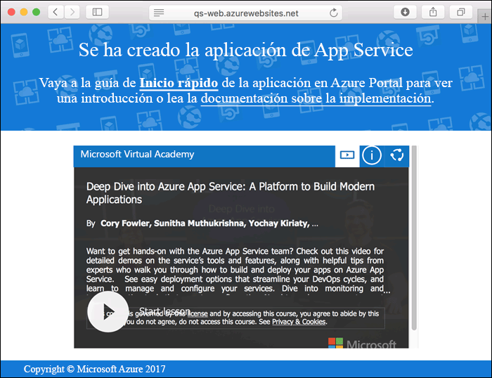
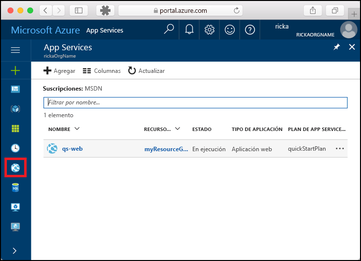
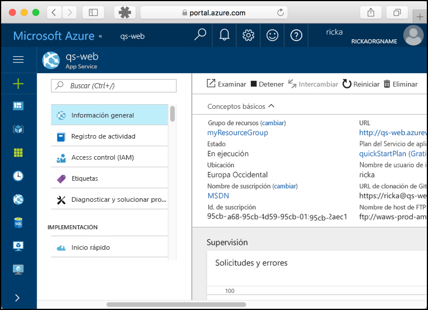

# <a name="create-a-static-html-web-app-in-azure"></a>Creación de una aplicación web HTML estática en Azure

[Azure Web Apps](app-service-web-overview.md) proporciona un servicio de hospedaje web muy escalable y con aplicación de revisiones de un modo automático.  En esta guía de inicio rápido se explica cómo se implementa un sitio HTML+CSS básico en Azure Web Apps. Se crea la aplicación web con la [CLI de Azure](https://docs.microsoft.com/cli/azure/get-started-with-azure-cli) y se usa Git para implementar el contenido HTML de ejemplo en la aplicación web.


Estos pasos se pueden realizar con un equipo Mac, Windows o Linux. Una vez instalados los requisitos previos, tardará aproximadamente cinco minutos en completar los pasos.

## <a name="prerequisites"></a>Requisitos previos

Para completar esta guía de inicio rápido:

- <a href="https://git-scm.com/" target="_blank">Instalación de Git</a>

[!INCLUDE [quickstarts-free-trial-note](../../includes/quickstarts-free-trial-note.md)]

## <a name="download-the-sample"></a>Descarga del ejemplo

En una ventana de terminal, ejecute el siguiente comando para clonar el repositorio de la aplicación de ejemplo en el equipo local.

```bash
git clone https://github.com/Azure-Samples/html-docs-hello-world.git
```

Cambie al directorio que contiene el código de ejemplo.

```bash
cd html-docs-hello-world
```

## <a name="view-the-html"></a>Ver el código HTML

Vaya al directorio que contiene el código HTML de ejemplo. Abra el archivo *index.html* en el explorador.


[!INCLUDE [cloud-shell-try-it.md](../../includes/cloud-shell-try-it.md)]

[!INCLUDE [Configure deployment user](../../includes/configure-deployment-user.md)] 

[!INCLUDE [Create resource group](../../includes/app-service-web-create-resource-group.md)] 

[!INCLUDE [Create app service plan](../../includes/app-service-web-create-app-service-plan.md)] 

[!INCLUDE [Create web app](../../includes/app-service-web-create-web-app.md)] 



[!INCLUDE [Push to Azure](../../includes/app-service-web-git-push-to-azure.md)] 

```bash
Counting objects: 13, done.
Delta compression using up to 4 threads.
Compressing objects: 100% (11/11), done.
Writing objects: 100% (13/13), 2.07 KiB | 0 bytes/s, done.
Total 13 (delta 2), reused 0 (delta 0)
remote: Updating branch 'master'.
remote: Updating submodules.
remote: Preparing deployment for commit id 'cc39b1e4cb'.
remote: Generating deployment script.
remote: Generating deployment script for Web Site
remote: Generated deployment script files
remote: Running deployment command...
remote: Handling Basic Web Site deployment.
remote: KuduSync.NET from: 'D:\home\site\repository' to: 'D:\home\site\wwwroot'
remote: Deleting file: 'hostingstart.html'
remote: Copying file: '.gitignore'
remote: Copying file: 'LICENSE'
remote: Copying file: 'README.md'
remote: Finished successfully.
remote: Running post deployment command(s)...
remote: Deployment successful.
To https://<app_name>.scm.azurewebsites.net/<app_name>.git
 * [new branch]      master -> master
```

## <a name="browse-to-the-app"></a>Navegación hasta la aplicación

En un explorador, vaya a la dirección URL de la aplicación web de Azure: `http://<app_name>.azurewebsites.net`.

La página se ejecuta como una aplicación web de Azure App Service.


**¡Enhorabuena!** Ha implementado la primera aplicación HTML en App Service.

## <a name="update-and-redeploy-the-app"></a>Actualización de la aplicación y nueva implementación

Abra el archivo *index.html* en un editor de texto y realice un cambio en el marcado. Por ejemplo, cambie el encabezado H1 "Azure App Service - Sample Static HTML Site" por "Azure App Service".

En la ventana del terminal local, confirme los cambios en Git e inserte los cambios de código en Azure.

```bash
git commit -am "updated HTML"
git push azure master
```

Una vez completada la implementación, actualice el explorador para ver los cambios.


## <a name="manage-your-new-azure-web-app"></a>Administración de la nueva aplicación web de Azure

Vaya a <a href="https://portal.azure.com" target="_blank">Azure Portal</a> para administrar la aplicación web que ha creado.

En el menú izquierdo, haga clic en **App Services** y, a continuación, haga clic en el nombre de la aplicación web de Azure.



Podrá ver la página de información general de la aplicación web. En este caso, puede realizar tareas de administración básicas como examinar, detener, iniciar, reiniciar y eliminar. 



El menú izquierdo proporciona distintas páginas para configurar la aplicación. 

[!INCLUDE [cli-samples-clean-up](../../includes/cli-samples-clean-up.md)]

## <a name="next-steps"></a>Pasos siguientes

> [!div class="nextstepaction"]
> [Asignación de un dominio personalizado](app-service-web-tutorial-custom-domain.md)
