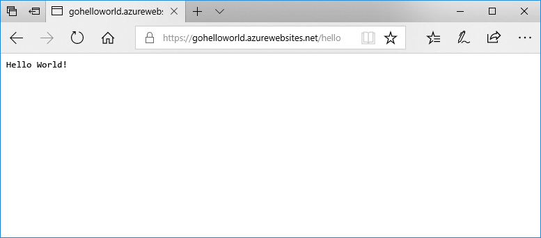

# <a name="deploy-a-dockergo-web-app-in-web-app-for-containers"></a>Implementación de una aplicación Docker o Go en Web App for Containers

[App Service Linux](app-service-linux-intro.md) proporciona pilas de aplicaciones predefinidas en Linux con compatibilidad con lenguajes como .NET, PHP, Node.js entre otros. También puede usar una imagen personalizada de Docker para ejecutar la aplicación web en una pila de aplicaciones aún sin definir en Azure. Esta guía de inicio rápido muestra cómo crear una aplicación web e implementar una imagen de GO desde Docker Hub. Creará la aplicación web con la [CLI de Azure](https://docs.microsoft.com/cli/azure/get-started-with-azure-cli).



[!INCLUDE [quickstarts-free-trial-note](../../../includes/quickstarts-free-trial-note.md)]

[!INCLUDE [cloud-shell-try-it.md](../../../includes/cloud-shell-try-it.md)]

[!INCLUDE [Configure deployment user](../../../includes/configure-deployment-user.md)]

[!INCLUDE [Create resource group](../../../includes/app-service-web-create-resource-group.md)]

[!INCLUDE [Create app service plan](../../../includes/app-service-web-create-app-service-plan-linux.md)]

## <a name="create-a-web-app"></a>Creación de una aplicación web

Cree una [aplicación web](../app-service-web-overview.md) en el plan de App Service `myAppServicePlan` con el comando [az webapp create](/cli/azure/webapp?view=azure-cli-latest#az_webapp_create). No olvide reemplazar `<app name>` por un nombre de aplicación único global.

```azurecli-interactive
az webapp create --resource-group myResourceGroup --plan myAppServicePlan --name <app name> --deployment-container-image-name microsoft/azure-appservices-go-quickstart
```

En el comando anterior, `--deployment-container-image-name` apunta a la imagen pública de Docker Hub [microsoft/azure-appservices-go-quickstart](https://hub.docker.com/r/microsoft/azure-appservices-go-quickstart/).

Cuando se haya creado la aplicación web, la CLI de Azure mostrará información similar a la del ejemplo siguiente:

```json
{
  "availabilityState": "Normal",
  "clientAffinityEnabled": true,
  "clientCertEnabled": false,
  "cloningInfo": null,
  "containerSize": 0,
  "dailyMemoryTimeQuota": 0,
  "defaultHostName": "<app name>.azurewebsites.net",
  "deploymentLocalGitUrl": "https://<username>@<app name>.scm.azurewebsites.net/<app name>.git",
  "enabled": true,
  < JSON data removed for brevity. >
}
```

## <a name="browse-to-the-app"></a>Navegación hasta la aplicación

```bash
http://<app_name>.azurewebsites.net/hello
```


**¡Enhorabuena!** Ya ha implementado una imagen personalizada de Docker que ejecuta una aplicación Go en Web App for Containers.

[!INCLUDE [Clean-up section](../../../includes/cli-script-clean-up.md)]

## <a name="next-steps"></a>pasos siguientes

> [!div class="nextstepaction"]
> [Usar una imagen de Docker personalizada](tutorial-custom-docker-image.md)
