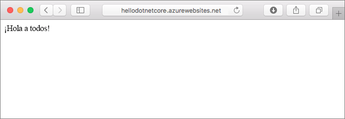
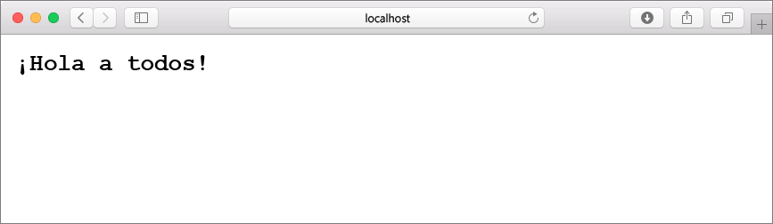
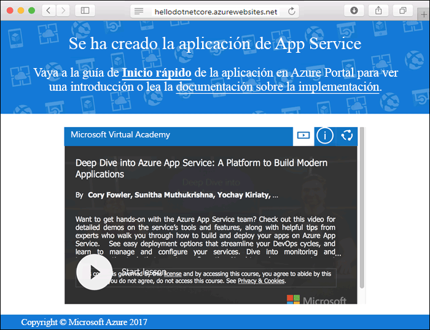
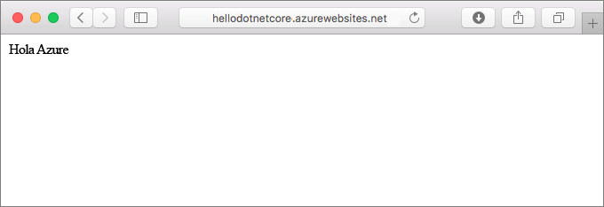
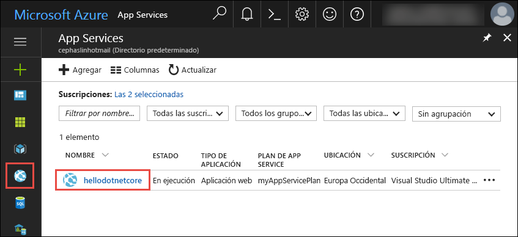
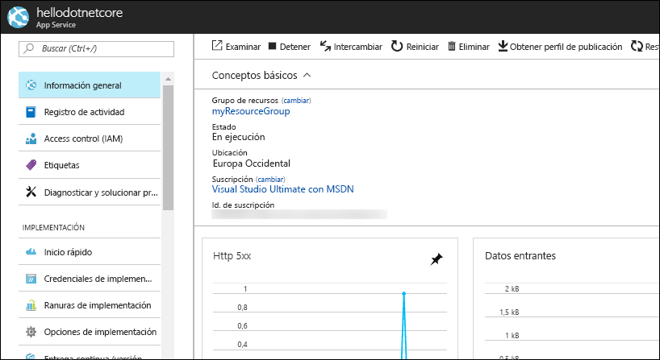

# <a name="create-a-net-core-web-app-in-app-service-on-linux"></a>Creación de una aplicación web de .NET Core en App Service en Linux

> [!NOTE]
> En este artículo se implementa una aplicación en App Service en Linux. Para realizar implementaciones en App Service en _Windows_, consulte [Creación de una aplicación web de ASP.NET Core en Azure](../app-service-web-get-started-dotnet.md).
>

[App Service en Linux](app-service-linux-intro.md) proporciona un servicio de hospedaje web muy escalable y con aplicación automática de revisiones utilizando el sistema operativo Linux. En esta guía de inicio rápido se muestra cómo crear una aplicación de [.NET Core](https://docs.microsoft.com/aspnet/core/) en App Service en Linux. Se crea la aplicación web con la [CLI de Azure](https://docs.microsoft.com/cli/azure/get-started-with-azure-cli) y se usa Git para implementar el código .NET Core en la aplicación web.



Estos pasos se pueden realizar en este artículo con una máquina Mac, Windows o Linux.

[!INCLUDE [quickstarts-free-trial-note](../../../includes/quickstarts-free-trial-note.md)]

## <a name="prerequisites"></a>requisitos previos

Para completar esta guía de inicio rápido:

* <a href="https://git-scm.com/" target="_blank">Instalación de Git</a>
* <a href="https://github.com/dotnet/core/blob/master/release-notes/download-archives/1.1.6-sdk-download.md" target="_blank">Instalación del SDK 1.1 de .NET Core</a>

## <a name="create-the-app-locally"></a>Creación de la aplicación localmente

En la ventana del terminal de la máquina, cree un directorio denominado `hellodotnetcore` y haga que sea el directorio actual.

```bash
md hellodotnetcore
cd hellodotnetcore
```

Cree una nueva aplicación web de .NET Core.

```bash
dotnet new web
```

## <a name="run-the-app-locally"></a>Ejecución de la aplicación de forma local

Restaure los paquetes NuGet y ejecute la aplicación.

```bash
dotnet restore
dotnet run
```

Abra un explorador web y vaya a la aplicación en `http://localhost:5000`.

Verá el mensaje **Hola mundo** de la aplicación de ejemplo que aparece en la página.



En la ventana de terminal, presione **Ctrl + C** para salir del servidor web. Inicialice un repositorio Git para el proyecto de .NET Core.

```bash
git init
git add .
git commit -m "first commit"
```

[!INCLUDE [cloud-shell-try-it.md](../../../includes/cloud-shell-try-it.md)]

[!INCLUDE [Configure deployment user](../../../includes/configure-deployment-user.md)]

[!INCLUDE [Create resource group](../../../includes/app-service-web-create-resource-group.md)]

[!INCLUDE [Create app service plan](../../../includes/app-service-web-create-app-service-plan-linux.md)]

## <a name="create-a-web-app"></a>Creación de una aplicación web

[!INCLUDE [Create web app](../../../includes/app-service-web-create-web-app-dotnetcore-no-h.md)]

Vaya a la aplicación web recién creada. Reemplace _&lt;app name>_ por el nombre de la aplicación web.

```bash
http://<app name>.azurewebsites.net
```

Este es el aspecto que debería tener su nueva aplicación web:



[!INCLUDE [Push to Azure](../../../includes/app-service-web-git-push-to-azure.md)] 

```bash
Counting objects: 22, done.
Delta compression using up to 8 threads.
Compressing objects: 100% (18/18), done.
Writing objects: 100% (22/22), 51.21 KiB | 3.94 MiB/s, done.
Total 22 (delta 1), reused 0 (delta 0)
remote: Updating branch 'master'.
remote: Updating submodules.
remote: Preparing deployment for commit id '741f16d1db'.
remote: Generating deployment script.
remote: Project file path: ./hellodotnetcore.csproj
remote: Generated deployment script files
remote: Running deployment command...
remote: Handling ASP.NET Core Web Application deployment.
remote: ...............................................................................................
remote:   Restoring packages for /home/site/repository/hellodotnetcore.csproj...
remote: ....................................
remote:   Installing System.Xml.XPath 4.0.1.
remote:   Installing System.Diagnostics.Tracing 4.1.0.
remote:   Installing System.Threading.Tasks.Extensions 4.0.0.
remote:   Installing System.Reflection.Emit.ILGeneration 4.0.1.
remote:   ...
remote: Finished successfully.
remote: Running post deployment command(s)...
remote: Deployment successful.
To https://cephalin-dotnetcore.scm.azurewebsites.net/cephalin-dotnetcore.git
 * [new branch]      master -> master
```

## <a name="browse-to-the-app"></a>Navegación hasta la aplicación

Vaya a la aplicación implementada mediante el explorador web.

```bash
http://<app_name>.azurewebsites.net
```

El código de ejemplo de .NET Core se ejecuta en una aplicación web con una imagen integrada.


**¡Enhorabuena!** Ha implementado su primera aplicación de .NET Core en App Service en Linux.

## <a name="update-and-redeploy-the-code"></a>Actualización del código y nueva implementación

En el directorio local, abra el archivo _Startup.cs_. Realice un pequeño cambio en el texto en la llamada de método `context.Response.WriteAsync`:

```csharp
await context.Response.WriteAsync("Hello Azure!");
```

Confirme los cambios en Git y, después, inserte los cambios de código en Azure.

```bash
git commit -am "updated output"
git push azure master
```

Una vez que la implementación haya finalizado, vuelva a cambiar la ventana del explorador que se abrió en el paso **Navegación hasta la aplicación** y actualice la vista.



## <a name="manage-your-new-azure-web-app"></a>Administración de la nueva aplicación web de Azure

Vaya a <a href="https://portal.azure.com" target="_blank">Azure Portal</a> para administrar la aplicación web que ha creado.

En el menú izquierdo, haga clic en **App Services** y, a continuación, haga clic en el nombre de la aplicación web de Azure.



Podrá ver la página de información general de la aplicación web. En este caso, puede realizar tareas de administración básicas como examinar, detener, iniciar, reiniciar y eliminar. 



El menú izquierdo proporciona distintas páginas para configurar la aplicación. 

[!INCLUDE [cli-samples-clean-up](../../../includes/cli-samples-clean-up.md)]

## <a name="next-steps"></a>pasos siguientes

> [!div class="nextstepaction"]
> [Compilación de una aplicación web .NET Core y SQL Database en Azure App Service en Linux](tutorial-dotnetcore-sqldb-app.md)
