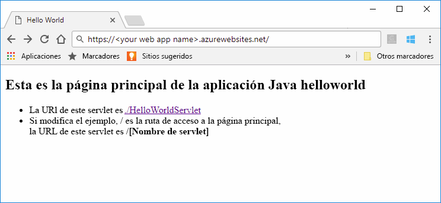
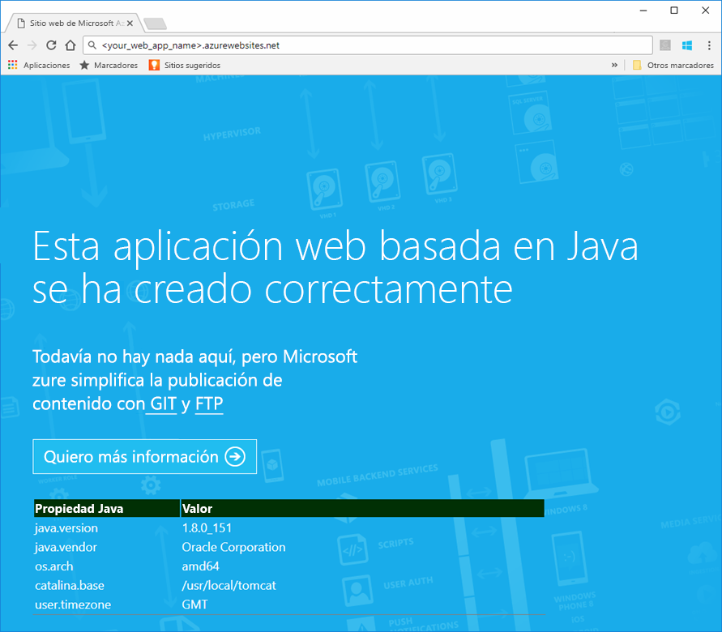
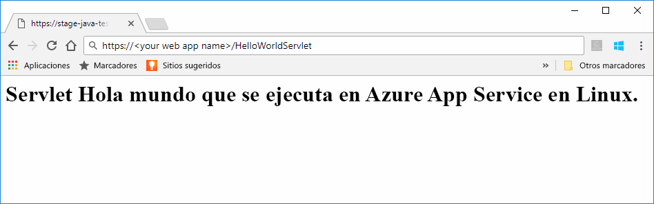
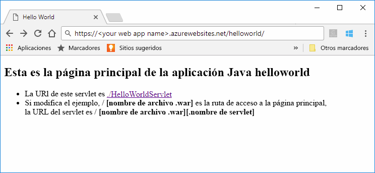
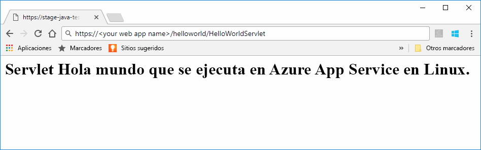

# <a name="preview-create-a-java-web-app-in-app-service-on-linux"></a>Versión preliminar: Creación de una aplicación web de Java en App Service en Linux

App Service en Linux proporciona en la actualidad una característica en vista previa compatible con las aplicaciones web de Java. Para más información sobre las versiones preliminares, consulte [Términos de uso complementarios para versiones en vista previa de Microsoft Azure](https://azure.microsoft.com/support/legal/preview-supplemental-terms/). El artículo [Implementación de una aplicación web Hola mundo en un contenedor Linux en la nube con el kit de herramientas de Azure para IntelliJ](https://docs.microsoft.com/java/azure/intellij/azure-toolkit-for-intellij-hello-world-web-app-linux) ofrece un método alternativo para implementar las aplicaciones de Java en su propio contenedor.

> [!NOTE]
> En este artículo se implementa una aplicación web de Java en App Service en Linux.
>

[App Service en Linux](app-service-linux-intro.md) proporciona un servicio de hospedaje web muy escalable y con aplicación automática de revisiones utilizando el sistema operativo Linux. En esta guía de inicio rápido se explica cómo se implementa una aplicación Java en App Service en Linux utilizando una imagen integrada. Puede crear la aplicación web con la imagen integrada mediante la [CLI de Azure](https://docs.microsoft.com/cli/azure/get-started-with-azure-cli) e implementar la aplicación Java en la aplicación web.



[!INCLUDE [quickstarts-free-trial-note](../../../includes/quickstarts-free-trial-note.md)]


## <a name="prerequisites"></a>requisitos previos

Para completar esta guía de inicio rápido: 

* Debe tener una suscripción de Azure. Si no tiene una suscripción a Azure, cree una [cuenta gratuita](https://azure.microsoft.com/free/?ref=microsoft.com&utm_source=microsoft.com&utm_medium=docs&utm_campaign=visualstudio) antes de empezar.
* [Instale Git](https://git-scm.com/).
* Instale [Eclipse](https://www.eclipse.org/downloads/).


[!INCLUDE [cloud-shell-try-it.md](../../../includes/cloud-shell-try-it.md)]

[!INCLUDE [Configure deployment user](../../../includes/configure-deployment-user.md)]


## <a name="create-a-resource-group"></a>Crear un grupo de recursos

En Cloud Shell, cree un grupo de recursos con el comando [`az group create`](/cli/azure/group?view=azure-cli-latest#az_group_create). En el ejemplo siguiente, se crea un grupo de recursos denominado *myResourceGroup* en la ubicación *Europa Occidental*. Para ver todas las ubicaciones admitidas de App Service, ejecute el comando [`az appservice list-locations`](/cli/azure/appservice?view=azure-cli-latest#az_appservice_list_locations).

```azurecli-interactive
az group create --name myResourceGroup --location "West US"
```

Generalmente se crean el grupo de recursos y los recursos en una región cercana. 

Cuando finaliza el comando, una salida de JSON muestra las propiedades del grupo de recursos.


[!INCLUDE [Create app service plan](../../../includes/app-service-web-create-app-service-plan-linux.md)]


## <a name="create-a-web-app"></a>Creación de una aplicación web

En Cloud Shell, cree una [aplicación web](../app-service-web-overview.md) en el plan de App Service `myAppServicePlan`. Puede hacerlo con el comando [`az webapp create`](/cli/azure/webapp?view=azure-cli-latest#az_webapp_create). En el siguiente ejemplo, reemplace *\<app_name>* por un nombre único global de aplicación (los caracteres válidos son `a-z`, `0-9` y `-`). 

```azurecli-interactive
az webapp create --name <app_name> --resource-group myResourceGroup --plan myAppServicePlan --runtime "TOMCAT|8.5-jre8"
```

En el parámetro **runtime**, use uno de estos entornos de ejecución:
 * TOMCAT|8.5-jre8
 * TOMCAT|9.0-jre8


Cuando se ha creado la aplicación web, la CLI de Azure muestra información similar a la del ejemplo siguiente:

```json
{
  "additionalProperties": {},
  "availabilityState": "Normal",
  "clientAffinityEnabled": true,
  "clientCertEnabled": false,
  "cloningInfo": null,
  "containerSize": 0,
  "dailyMemoryTimeQuota": 0,
  "defaultHostName": "<your web app name>.azurewebsites.net",
  "enabled": true,
  "enabledHostNames": [
    "<your web app name>.azurewebsites.net",
    "<your web app name>.scm.azurewebsites.net"
  ],
  "ftpPublishingUrl": "ftp://<your ftp URL>",  
  < JSON data removed for brevity. >
}
```

Copie el valor para **ftpPublishingUrl**. Lo usará más adelante si elige la implementación mediante FTP.

Vaya a la aplicación web recién creada.

```
http://<app_name>.azurewebsites.net
```

Si la aplicación web está en funcionamiento, aparecerá una pantalla predeterminada similar a la siguiente imagen:




## <a name="download-the-sample-java-app"></a>Descarga de aplicación Java de ejemplo

En una ventana del terminal de la máquina, ejecute el siguiente comando para clonar el repositorio de la aplicación de ejemplo en el equipo local. Implementará esta aplicación de ejemplo en un paso posterior.

```bash
git clone https://github.com/Azure-Samples/java-docs-hello-world
```


## <a name="deploying-the-java-app-to-app-service-on-linux"></a>Implementación de la aplicación Java en App Service en Linux

Abra el proyecto de ejemplo en [Eclipse](https://www.eclipse.org/downloads/), y [exporte la aplicación Java a un archivo web (WAR)](http://help.eclipse.org/kepler/index.jsp?topic=%2Forg.eclipse.wst.webtools.doc.user%2Ftopics%2Ftwcrewar.html) denominado `helloworld.war`.

Para implementar el archivo WAR de la aplicación Java, puede usar WarDeploy (actualmente en [versión preliminar](https://azure.microsoft.com/support/legal/preview-supplemental-terms/)), o FTP.

Según el método de implementación que utilice, la ruta de acceso relativa para ir a la aplicación web de Java será ligeramente diferente.

### <a name="deploy-with-wardeploy"></a>Implementación con WarDeploy 

Para implementar el archivo WAR con WarDeploy, utilice la siguiente línea de comandos de ejemplo de cURL para enviar una solicitud POST a *https://<your app name>.scm.azurewebsites.net/api/wardeploy*. La solicitud POST debe contener el archivo .war en el cuerpo del mensaje. Las credenciales de implementación de la aplicación se proporcionan en la solicitud mediante la autenticación de HTTP BASIC. Para más información sobre WarDeploy, consulte [Implementar una aplicación en Azure App Service con un archivo ZIP o WAR](../app-service-deploy-zip.md).

```bash
curl -X POST -u <username> --data-binary @"<war_file_path>" https://<app_name>.scm.azurewebsites.net/api/wardeploy
```

Actualice lo siguiente:

* `username`: use el nombre de usuario de las credenciales de implementación que creó anteriormente.
* `war_file_path`: use la ruta de acceso del archivo WAR local.
* `app_name`: use el nombre de la aplicación que creó anteriormente.

Ejecute el comando. Cuando se lo solicite cURL, escriba la contraseña de las credenciales de implementación.

Vaya a la aplicación implementada mediante la siguiente dirección URL del explorador web.

```bash
http://<app_name>.azurewebsites.net
```

El código de ejemplo de Java se está ejecutando en una aplicación web con una imagen integrada.


Use el explorador web para ir al servlet.

```bash
http://<app_name>.azurewebsites.net/HelloWorldServlet
```

El servlet se está ejecutando en una aplicación web con una imagen integrada.




**¡Enhorabuena!** Ha implementado su primera aplicación Java en App Service en Linux.


### <a name="ftp-deployment"></a>Implementación mediante FTP

Como alternativa, también puede usar FTP para implementar el archivo WAR. 

Ponga el archivo en una FTP en el directorio */home/site/wwwroot/webapps* de la aplicación web. La siguiente línea de comandos de ejemplo utiliza cURL:

```bash
curl -T war_file_path -u "app_name\username" ftp://webappFTPURL/site/wwwroot/webapps/
```

Actualice lo siguiente:

* `war_file_path`: use la ruta de acceso del archivo WAR local.
* `app_name`: use el nombre de la aplicación que creó anteriormente.
* `username`: use el nombre de usuario de las credenciales de implementación que creó anteriormente.
* `webappFTPURL`: use el valor del **nombre de host de FTP** de la aplicación web que copió anteriormente. El nombre de host de FTP también aparece en la hoja **Información general** de la aplicación web en [Azure Portal](https://portal.azure.com/).

Ejecute el comando. Cuando se lo solicite cURL, escriba la contraseña de las credenciales de implementación.


Vaya a la aplicación implementada mediante la siguiente dirección URL del explorador web.

```bash
http://<app_name>.azurewebsites.net/helloworld
```

El código de ejemplo de Java se está ejecutando en una aplicación web con una imagen integrada.



Use el explorador web para ir al servlet.

```bash
http://<app_name>.azurewebsites.net/helloworld/HelloWorldServlet
```

El código de ejemplo de Java se está ejecutando en una aplicación web con una imagen integrada.




**¡Enhorabuena!** Ha implementado su primera aplicación Java en App Service en Linux.


[!INCLUDE [cli-samples-clean-up](../../../includes/cli-samples-clean-up.md)]


## <a name="next-steps"></a>Pasos siguientes

Para más información acerca del uso de Java con Azure, consulte los siguientes vínculos:

* [Azure para desarrolladores de Java](https://docs.microsoft.com/java/azure/)
* [Implementación de una aplicación web Hola mundo en un contenedor Linux en la nube con el kit de herramientas de Azure para IntelliJ](https://docs.microsoft.com/java/azure/intellij/azure-toolkit-for-intellij-hello-world-web-app-linux)
* [Herramientas de Java para Visual Studio Team Services](https://java.visualstudio.com/)
