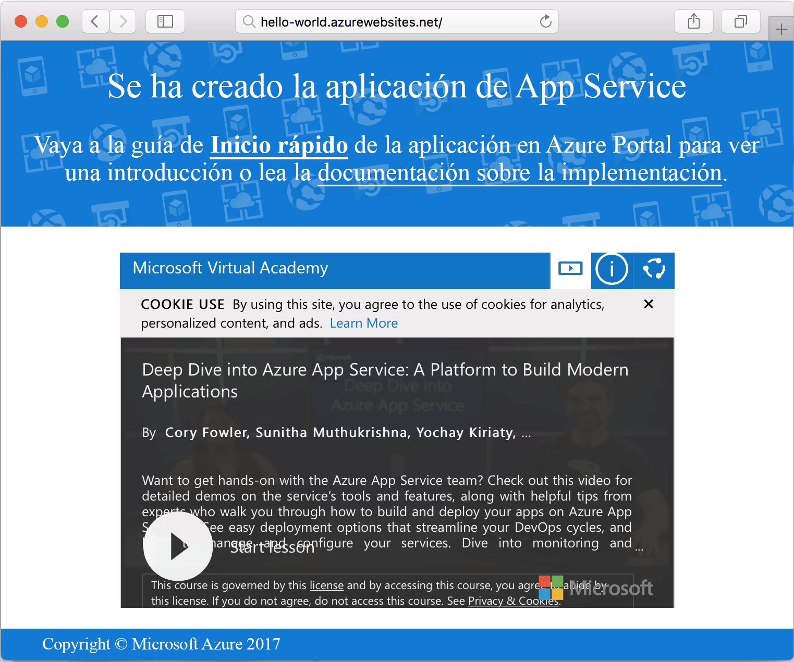

# <a name="create-a-ruby-app-in-app-service-on-linux"></a>Creación de una aplicación de Ruby en App Service en Linux

[App Service en Linux](app-service-linux-intro.md) proporciona un servicio de hospedaje web muy escalable y con aplicación de revisiones de un modo automático. En esta guía de inicio rápido se muestra cómo crear una aplicación de Ruby on Rails básica en la aplicación e implementarla a continuación en Azure como Aplicación web en Linux.


## <a name="prerequisites"></a>requisitos previos

* <a href="https://www.ruby-lang.org/en/documentation/installation/#rubyinstaller" target="_blank">Instalación de Ruby 2.4.1 o superior</a>
* <a href="https://git-scm.com/" target="_blank">Instalación de Git</a>

[!INCLUDE [quickstarts-free-trial-note](../../../includes/quickstarts-free-trial-note.md)]

## <a name="download-the-sample"></a>Descarga del ejemplo

En una ventana de terminal, ejecute el siguiente comando para clonar el repositorio de la aplicación de ejemplo en el equipo local:

```bash
git clone https://github.com/Azure-Samples/ruby-docs-hello-world
```

## <a name="run-the-application-locally"></a>Ejecución de la aplicación de forma local

Ejecute el servidor de Rails para que funcione la aplicación. Cambie al directorio *hello-world* y el comando `rails server` iniciará el servidor.

```bash
cd hello-world\bin
rails server
```

Mediante el explorador web, vaya a `http://localhost:3000` para probar la aplicación localmente.


## <a name="modify-app-to-display-welcome-message"></a>Modificación de la aplicación para mostrar el mensaje de bienvenida

Modifique la aplicación para que aparezca en ella un mensaje de bienvenida. En primer lugar, debe configurar una ruta mediante la modificación del archivo *~/workspace/ruby-docs-hello-world/config/routes.rb* para que incluya una ruta denominada `hello`.

  ```ruby
  Rails.application.routes.draw do
      #For details on the DSL available within this file, see http://guides.rubyonrails.org/routing.html
      root 'application#hello'
  end
  ```

Cambie el controlador de la aplicación para que devuelva el mensaje como HTML al explorador. 

Abra *~/workspace/hello-world/app/controllers/application_controller.rb* para editarla. Modifique la clase `ApplicationController` para que sea como el siguiente código de ejemplo:

  ```ruby
  class ApplicationController > ActionController :: base
    protect_from_forgery with: :exception
    def hello
      render html: "Hello, world from Azure Web App on Linux!"
    end
  end
  ```

La aplicación ya está configurada. Mediante el explorador web, vaya a `http://localhost:3000` para confirmar la página de aterrizaje de raíz.


[!INCLUDE [Try Cloud Shell](../../../includes/cloud-shell-try-it.md)]

[!INCLUDE [Configure deployment user](../../../includes/configure-deployment-user.md)]

## <a name="create-a-ruby-web-app-on-azure"></a>Creación de una aplicación web de Ruby en Azure

Un grupo de recursos debe contener los recursos necesarios para la aplicación web. Para crear un grupo de recursos, use el comando [az group create]().

```azurecli-interactive
az group create --location westeurope --name myResourceGroup
```

Use el comando [az appservice plan create](/cli/azure/appservice/plan?view=azure-cli-latest#az_appservice_plan_create) para crear un plan de App Service para su aplicación web.

```azurecli-interactive
az appservice plan create --name myAppServicePlan --resource-group myResourceGroup --is-linux
```

A continuación, emita el comando [az webapp create](/cli/azure/webapp?view=azure-cli-latest#az_webapp_create) para crear la aplicación web que usa el plan de App Service recién creado. Tenga en cuenta que el tiempo de ejecución se establece en `ruby|2.3`. No olvide reemplazar `<app name>` por un nombre de aplicación único.

```azurecli-interactive
az webapp create --resource-group myResourceGroup --plan myAppServicePlan --name <app name> \
--runtime "ruby|2.3" --deployment-local-git
```

El resultado del comando revela información acerca de la aplicación web recién creada, así como la dirección URL de la implementación. El archivo debe tener un aspecto similar al ejemplo siguiente. Copie la dirección URL para su uso posterior en este tutorial.

```bash
https://<deployment user name>@<app name>.scm.azurewebsites.net/<app name>.git
```

Una vez creada la aplicación web, podrá verse la página **Información general**. Vaya a esta. Se muestra la siguiente página de presentación:




## <a name="deploy-your-application"></a>Implementación de aplicación

Ejecute los comandos siguientes para implementar la aplicación local en el sitio web de Azure:

```bash
git remote add azure <Git deployment URL from above>
git add -A
git commit -m "Initial deployment commit"
git push azure master
```

Confirme que las operaciones de implementación remota se han realizado correctamente. Los comandos generan una salida similar al texto siguiente:

```bash
remote: Using sass-rails 5.0.6
remote: Updating files in vendor/cache
remote: Bundle gems are installed into ./vendor/bundle
remote: Updating files in vendor/cache
remote: ~site/repository
remote: Finished successfully.
remote: Running post deployment command(s)...
remote: Deployment successful.
To https://<your web app name>.scm.azurewebsites.net/<your web app name>.git
  579ccb....2ca5f31  master -> master
myuser@ubuntu1234:~workspace/<app name>$
```

Una vez que la implementación haya finalizado, reinicie la aplicación web para que la implementación surta efecto mediante el comando [az webapp restart](/cli/azure/webapp?view=azure-cli-latest#az_webapp_restart), como se muestra aquí:

```azurecli-interactive
az webapp restart --name <app name> --resource-group myResourceGroup
```

Vaya al sitio y verifique los resultados.

```bash
http://<app name>.azurewebsites.net
```


> [!NOTE]
> Mientras se reinicia la aplicación, al tratar de obtener acceso al sitio, se obtendrá un código de estado HTTP `Error 503 Server unavailable`. Puede tardar unos minutos en reiniciarse completamente.
>

[!INCLUDE [Clean-up section](../../../includes/cli-script-clean-up.md)]

## <a name="next-steps"></a>pasos siguientes

> [!div class="nextstepaction"]
> [Ruby on Rails con MySQL](tutorial-ruby-mysql-app.md)
