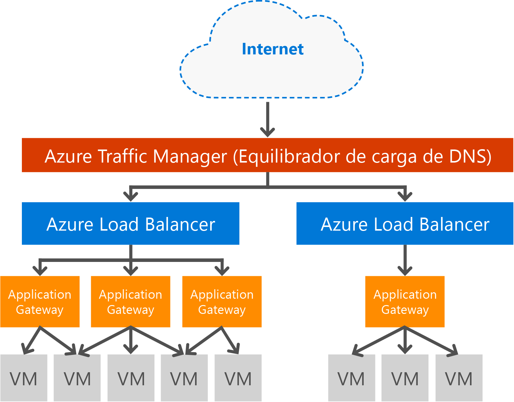

# Introducción a Application Gateway

Microsoft Azure Application Gateway es una aplicación virtual dedicada que proporciona un controlador de entrega de aplicaciones (ADC) como servicio. Ofrece diversas funcionalidades de equilibrio de carga de nivel 7 para la aplicación. Permite a los clientes optimizar la productividad de las granjas de servidores web traspasando la carga de la terminación SSL con mayor actividad de la CPU a Application Gateway. Además, dispone de otras funcionalidades de enrutamiento de nivel 7, como la distribución round robin del tráfico entrante, la afinidad de sesiones basada en cookies, el enrutamiento basado en rutas de acceso URL y la capacidad de hospedar varios sitios web detrás de un único servicio Application Gateway. También se proporciona un firewall de aplicaciones web (WAF) como parte de la SKU de WAF de Application Gateway. Este firewall proporciona protección para las aplicaciones web frente a vulnerabilidades web y vulnerabilidades de seguridad comunes. Application Gateway puede configurarse como una puerta de enlace orientada a Internet, una puerta de enlace solo para uso interno o una combinación de las dos. 

## Características

Application Gateway proporciona actualmente las siguientes funcionalidades:

* **[Firewall de aplicaciones web](application-gateway-webapplicationfirewall-overview.md)**: el firewall de aplicaciones web (WAF) de Azure Application Gateway protege las aplicaciones web de ataques web comunes, como inyección de código SQL, ataques de scripts entre sitios y secuestros de sesiones.
* **Equilibrio de carga HTTP** : Application Gateway proporciona equilibrio de carga en operaciones por turnos. El equilibrio de carga se realiza en el nivel 7 y se usa exclusivamente para el tráfico HTTP(S).
* **Afinidad de sesión basada en cookies**: esta característica es útil cuando se quiere mantener una sesión de usuario en el mismo back-end. Mediante el uso de cookies administradas por la puerta de enlace, Application Gateway puede dirigir el tráfico posterior desde una sesión de usuario hasta el mismo back-end para procesarlo. Esta característica es importante en aquellos casos donde se guarda el estado de sesión de forma local en el servidor back-end para una sesión de usuario.
* **[Descarga de Capa de sockets seguros (SSL)](application-gateway-ssl-arm.md)**: esta característica realiza la costosa tarea de descifrar el tráfico HTTPS desde los servidores web. Al terminar la conexión SSL en Application Gateway y reenviar la solicitud sin cifrar al servidor, el servidor web no tiene que realizar el descifrado.  Application Gateway vuelve a cifrar la respuesta antes de enviarla al cliente. Esta característica es útil en escenarios donde el back-end se encuentra en la misma red virtual protegida que Application Gateway de Azure.
* **[SSL de extremo a extremo](application-gateway-backend-ssl.md)**: Application Gateway admite el cifrado del tráfico de extremo a extremo. Para ello, lo que hace es terminar la conexión SSL en la puerta de enlace de aplicaciones. La puerta de enlace aplica entonces las reglas de enrutamiento al tráfico, vuelve a cifrar el paquete y lo reenvía al back-end adecuado según las reglas de enrutamiento definidas. Cualquier respuesta del servidor web pasa por el mismo proceso en su regreso al usuario final.
* **[Enrutamiento de contenido basado en direcciones URL](application-gateway-url-route-overview.md)**: esta característica ofrece la posibilidad de usar diferentes servidores back-end para tráfico distinto. El tráfico de una carpeta en el servidor web o en una red CDN puede enrutarse a un back-end diferente. Esta funcionalidad reduce la carga innecesaria en los servidores back-end que no suministran contenido específico.
* **[Enrutamiento multisitio](application-gateway-multi-site-overview.md)**: Application Gateway permite consolidar hasta 20 sitios web en una sola puerta de enlace de aplicaciones.
* **[Compatibilidad con WebSocket](application-gateway-websocket.md)**: otra gran característica de Application Gateway es la compatibilidad nativa con WebSocket.
* **[Supervisión de estado](application-gateway-probe-overview.md)**: Application Gateway proporciona supervisión de estado predeterminada de los recursos de back-end, así como sondeos para la supervisión en escenarios más específicos.
* **[Directiva SSL y cifrados](application-gateway-ssl-policy-overview.md)**: esta característica ofrece la posibilidad de limitar las versiones del protocolo SSL y los conjuntos de cifrado compatibles y el orden en que se procesan.
* **[Solicitar redireccionamiento](application-gateway-redirect-overview.md)**: esta característica proporciona la funcionalidad para redirigir las solicitudes HTTP a un agente de escucha HTTPS.
* **[Compatibilidad con servidores back-end multiinquilino](application-gateway-web-app-overview.md)**: Application Gateway admite la configuración de servicios back-end multiinquilino, por ejemplo, Azure Web Apps y API Gateway, como miembros del grupo de servidores back-end. 
* **[Diagnóstico avanzado](application-gateway-diagnostics.md)**: Application Gateway proporciona registros de diagnóstico y acceso completos. Los registros de firewall están disponibles para los recursos de puerta de enlace de aplicaciones que tienen WAF habilitado.

## Ventajas

Application Gateway resulta de utilidad para:

* Aplicaciones que requieren solicitudes de la misma sesión de usuario o cliente para llegar a la misma máquina virtual back-end. Ejemplos de estas aplicaciones serían las aplicaciones de carro de la compra y los servidores de correo web.
* La eliminación de la sobrecarga de terminación SSL para las granjas de servidores web.
* Aplicaciones, como Content Delivery Network, que requieren que varias solicitudes HTTP en la misma conexión TCP de ejecución prolongada se enruten a servidores backend diferentes o su carga se equilibre entre estos.
* Aplicaciones que permiten el tráfico de WebSocket.
* Proteger aplicaciones web frente a ataques comunes basados en web como inyección de código SQL, ataques de scripts entre sitios y secuestros de sesiones.
* Distribución lógica del tráfico en función de diferentes criterios de enrutamiento, como la ruta de acceso URL o las cabeceras de dominio.

Application Gateway está completamente administrada por Azure, es escalable y tiene una elevada disponibilidad. Cuenta con un amplio conjunto de funcionalidades de diagnóstico y registro, lo que facilita su administración. Cuando se crea una puerta de enlace de aplicaciones, se asocia un punto de conexión (una VIP pública o una IP de ILB interna) que se utiliza como dirección IP pública para el tráfico de red de entrada. Esta dirección IP de ILB o VIP la proporciona la instancia de Azure Load Balancer operativa en el nivel de transporte (TCP/UDP) y hace que toda la carga del tráfico de red entrante se equilibre en las instancias de trabajo de Application Gateway. Application Gateway enruta el tráfico HTTP/HTTPS en función de su configuración, independientemente de que se trate de una máquina virtual, un servicio en la nube o una dirección IP interna o externa.

El equilibrio de carga de Puerta de enlace de aplicaciones  como servicio administrado de Azure permite el aprovisionamiento de un equilibrador de carga de nivel 7 detrás del equilibrador de carga de software de Azure. Traffic Manager puede usarse para completar el escenario tal como se muestra en la imagen siguiente, donde Traffic Manager proporciona redirección y disponibilidad del tráfico a varios recursos de puerta de enlace de aplicaciones en distintas regiones, mientras que la puerta de enlace de aplicaciones proporciona equilibrio de carga entre regiones de nivel 7. Un ejemplo de este escenario se puede encontrar en [Using Load Balancing Services in the Azure Cloud](../traffic-manager/traffic-manager-load-balancing-azure.md) (Uso de servicios de equilibrio de carga en la nube de Azure).

[!INCLUDE [load-balancer-compare-tm-ag-lb-include.md](../../includes/load-balancer-compare-tm-ag-lb-include.md)]

## Tamaños e instancias de puerta de enlace

Application Gateway actualmente se ofrece en tres tamaños: **pequeño**, **mediano** y **grande**. Tamaños pequeños de instancia están pensados para escenarios de desarrollo y pruebas.

Puede crear hasta 50 puertas de enlace de aplicaciones por suscripción y cada una de esas puertas de enlace de aplicaciones puede tener un máximo de 10 instancias. Cada puerta de enlace de aplicaciones puede constar de 20 agentes de escucha HTTP. Para ver una lista completa de los límites de la puerta de enlace de aplicaciones, consulte el tema sobre los [límites de servicio de Application Gateway](../azure-subscription-service-limits.md?toc=%2fazure%2fapplication-gateway%2ftoc.json#application-gateway-limits).

En la tabla siguiente se muestra un promedio de rendimiento para cada instancia de puerta de enlace de aplicaciones con descarga SSL habilitada:

| Respuesta de la página de back-end | Pequeña | Mediano | Grande |
| --- | --- | --- | --- |
| 6K |7,5 Mbps |13 Mbps |50 Mbps |
| 100 k |35 Mbps |100 Mbps |200 Mbps |

> [!NOTE]
> Se trata de valores aproximados para un rendimiento de puerta de enlace de aplicaciones. El rendimiento real depende de varios detalles del entorno, como el tamaño medio de página, la ubicación de las instancias de back-end y el tiempo de procesamiento para proporcionar una página. Para los números de rendimiento exactos, debe ejecutar sus propias pruebas. Estos valores solo se proporcionan para obtener instrucciones de planeamiento de capacidad.

## Supervisión del estado

Application Gateway de Azure supervisa el estado de las instancias back-end automáticamente mediante sondeos de estado básicos o personalizados. Mediante sondeos de mantenimiento, se tiene la seguridad de que solo los hosts con un estado correcto responden al tráfico. Para obtener más información, consulte [Información general sobre la supervisión de estado de Application Gateway](application-gateway-probe-overview.md).

## Configuración y administración

Para su punto de conexión, Application Gateway puede tener una dirección IP pública, privada o ambas al configurarse. Application Gateway se configura dentro de una red virtual de su propia subred. La subred que se cree o utilice para la puerta de enlace de aplicaciones no puede contener otros tipos de recursos; en la subred solo se permiten otras puertas de enlace de aplicaciones. Para proteger los recursos de back-end, los servidores back-end pueden estar en una subred diferente en la misma red virtual que la puerta de enlace de aplicaciones. Esta subred no es necesaria para las aplicaciones de back-end. Mientras la puerta de enlace de aplicaciones pueda llegar hasta la dirección IP, podrá proporcionar funcionalidades ADC para los servidores back-end. 

Puede crear y administrar una puerta de enlace de aplicaciones mediante las API de REST, los cmdlets de PowerShell, la CLI de Azure o [Azure Portal](https://portal.azure.com/). Si tiene preguntas adicionales sobre Application Gateway, visite [Preguntas más frecuentes sobre Application Gateway](application-gateway-faq.md) para ver una lista de estas.

## Precios

El precio se basa en una tarifa por instancia de puerta de enlace por hora y una tarifa de procesamiento de datos. El precio de la puerta de enlace por hora de la SKU WAF es diferente de los cargos de la SKU estándar. Esta información sobre los precios se puede encontrar en los [detalles de precios de Application Gateway](https://azure.microsoft.com/pricing/details/application-gateway/). Los costos por procesamiento de datos permanecen iguales.

## P+F

Para consultar las preguntas más frecuentes acerca de Application Gateway, consulte [Preguntas más frecuentes sobre Application Gateway](application-gateway-faq.md).

## Pasos siguientes

Ahora que ya conoce cómo funciona Application Gateway, puede [crear una puerta de enlace de aplicaciones](application-gateway-create-gateway-portal.md) o bien puede [crear una descarga de SSL de puerta de enlace de aplicaciones](application-gateway-ssl-arm.md) para equilibrar la carga de las conexiones HTTPS.

Para aprender a crear una puerta de enlace de aplicaciones mediante el enrutamiento de contenido basado en direcciones URL, vaya a [Creación de una puerta de enlace de aplicaciones mediante enrutamiento basado en direcciones URL](application-gateway-create-url-route-arm-ps.md) para obtener más información.

Para aprender sobre algunas de las demás funcionalidades de red principales, consulte [Redes de Azure](../networking/networking-overview.md).
