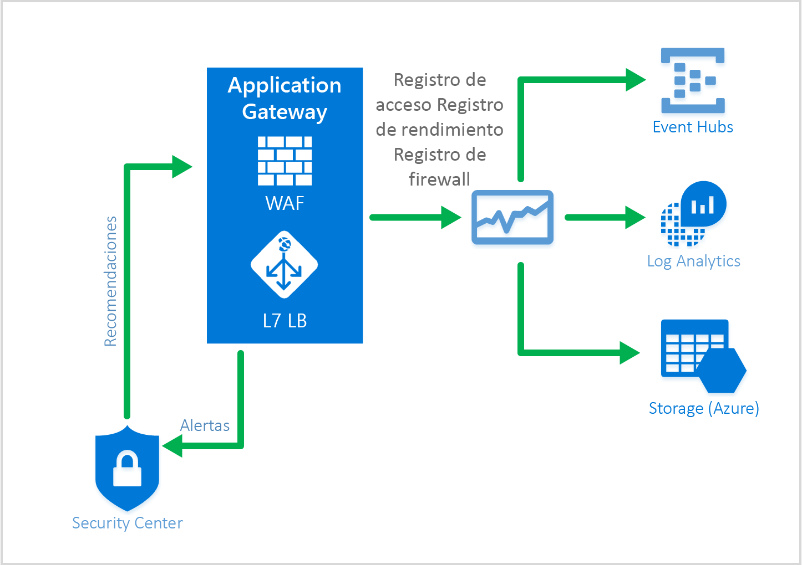

# <a name="web-application-firewall-waf"></a>Firewall de aplicaciones web (WAF)

Firewall de aplicaciones web (WAF) es una característica de Application Gateway que proporciona a las aplicaciones una protección centralizada contra vulnerabilidades de seguridad comunes. 

Firewall de aplicaciones web se basa en las reglas contenidas en [OWASP Core Rule Set](https://www.owasp.org/index.php/Category:OWASP_ModSecurity_Core_Rule_Set_Project) 3.0 o 2.2.9. Las aplicaciones web son cada vez más los objetivos de ataques malintencionados que aprovechan vulnerabilidades comunes conocidas, como ataques por inyección de código SQL o ataques de scripts de sitios, por nombrar unos pocos. Impedir tales ataques en el código de aplicación puede ser un verdadero desafío y requerir tareas rigurosas de mantenimiento, aplicación de revisiones y supervisión en varias capas de la topología de aplicación. Un firewall de aplicaciones web centralizado facilita enormemente la administración de la seguridad y proporciona mayor protección a los administradores de la aplicación frente a amenazas o intrusiones. Las soluciones de WAF también pueden reaccionar más rápido ante una amenaza de la seguridad aplicando revisiones que aborden una vulnerabilidad conocida en una ubicación central en lugar de proteger cada una de las aplicaciones web por separado. Las puertas de enlace de aplicaciones existentes pueden transformarse rápidamente en puertas de enlace con un firewall de aplicaciones web habilitado.


Application Gateway funciona como un controlador de entrega de aplicaciones y ofrece terminación SSL, afinidad de sesión basada en cookies, distribución de la carga en operaciones por turnos, enrutamiento basado en contenido, posibilidad de hospedar varios sitios y mejoras de seguridad. Algunas de las mejoras de seguridad que se ofrecen en Application Gateway son administración de directivas SSL y compatibilidad con SSL de extremo a extremo. La seguridad de las aplicaciones se mejora mediante un WAF (firewall de aplicaciones web) integrado directamente en la oferta de ADC. De esta forma se proporciona una ubicación central fácil de configurar para administrar y proteger las aplicaciones web frente a vulnerabilidades web comunes.

## <a name="benefits"></a>Ventajas

Estas son las principales ventajas proporcionadas por Application Gateway y el firewall de aplicaciones web:

### <a name="protection"></a>Protección

* Protección de la aplicación web contra las vulnerabilidades y los ataques web sin modificación del código de back-end.

* Protección de varias aplicaciones web al mismo tiempo detrás de una puerta de enlace de aplicaciones. Application Gateway admite el hospedaje de hasta 20 sitios web detrás de una única puerta de enlace. Todos ellos se pueden proteger contra los ataques web mediante WAF.

### <a name="monitoring"></a>Supervisión

* Supervise la aplicación web frente a ataques mediante un registro de WAF en tiempo real. Este registro se integra con [Azure Monitor](../monitoring-and-diagnostics/monitoring-overview.md) para realizar un seguimiento de los registros y alertas de WAF y permite supervisar con facilidad las tendencias.

* WAF se integrará con Azure Security Center pronto. Azure Security Center permite obtener una visión central del estado de la seguridad de todos sus recursos en Azure.

### <a name="customization"></a>Personalización

* La capacidad para personalizar las reglas y grupos de reglas del WAF para satisfacer las necesidades de su aplicación y eliminar los falsos positivos.

## <a name="features"></a>Características

El firewall de aplicaciones web viene preconfigurado con CRS 3.0 de forma predeterminada, aunque también puede usar la versión 2.2.9. CRS 3.0 permite reducir el número de falsos positivos con respecto a la versión 2.2.9. Se ofrece la posibilidad de [personalizar reglas para adaptarse a sus necesidades](application-gateway-customize-waf-rules-portal.md). Entre las vulnerabilidades web más habituales frente a las que protege el firewall de aplicaciones web se incluyen:

* Protección contra la inyección de código SQL
* Protección contra scripts entre sitios
* Protección contra ataques web comunes, como inyección de comandos, contrabando de solicitudes HTTP, división de respuestas HTTP y ataque remoto de inclusión de archivos
* Protección contra infracciones del protocolo HTTP
* Protección contra anomalías del protocolo HTTP, como la falta de agentes de usuario de host y encabezados de aceptación
* Prevención contra bots, rastreadores y escáneres
* Detección de errores de configuración comunes (es decir, Apache, IIS, etc.)

Para una lista más detallada de las reglas y los mecanismos de protección, consulte el siguiente apartado sobre [conjuntos de reglas principales](#core-rule-sets).

### <a name="core-rule-sets"></a>Conjuntos de reglas principales

Application Gateway admite dos conjuntos de reglas: CRS 3.0 y CRS 2.2.9. Estos conjuntos de reglas principales son colecciones de reglas que protegen las aplicaciones web frente a actividades malintencionadas.

#### <a name="owasp30"></a>OWASP_3.0

CRS 3.0 proporciona 13 grupos de reglas, tal como se muestra en la tabla siguiente. Cada uno de estos grupos de reglas contiene varias reglas que se pueden deshabilitar.

|RuleGroup|Descripción|
|---|---|
|**[REQUEST-910-IP-REPUTATION](application-gateway-crs-rulegroups-rules.md#crs910)**|Contiene reglas para protegerse frente a remitentes de spam conocidos o actividades malintencionadas.|
|**[REQUEST-911-METHOD-ENFORCEMENT](application-gateway-crs-rulegroups-rules.md#crs911)**|Contiene reglas para bloquear métodos (PUT, PATCH< ..)|
|**[REQUEST-912-DOS-PROTECTION](application-gateway-crs-rulegroups-rules.md#crs912)**| Contiene reglas para protegerse contra ataques de denegación de servicio (DoS).|
|**[REQUEST-913-SCANNER-DETECTION](application-gateway-crs-rulegroups-rules.md#crs913)**| Contiene reglas para protegerse de los escáneres de puertos y entornos.|
|**[REQUEST-920-PROTOCOL-ENFORCEMENT](application-gateway-crs-rulegroups-rules.md#crs920)**|Contiene reglas para protegerse de problemas de protocolo y codificación.|
|**[REQUEST-921-PROTOCOL-ATTACK](application-gateway-crs-rulegroups-rules.md#crs921)**|Contiene reglas para protegerse frente a ataques por inyección de encabezado, contrabando de solicitudes y división de respuestas|
|**[REQUEST-930-APPLICATION-ATTACK-LFI](application-gateway-crs-rulegroups-rules.md#crs930)**|Contiene reglas para protegerse contra ataques a archivos y rutas de acceso.|
|**[REQUEST-931-APPLICATION-ATTACK-RFI](application-gateway-crs-rulegroups-rules.md#crs931)**|Contiene reglas para protegerse contra ataques remotos de inclusión de archivos (RFI)|
|**[REQUEST-932-APPLICATION-ATTACK-RCE](application-gateway-crs-rulegroups-rules.md#crs932)**|Contiene reglas para protegerse contra la ejecución remota de código.|
|**[REQUEST-933-APPLICATION-ATTACK-PHP](application-gateway-crs-rulegroups-rules.md#crs933)**|Contiene reglas para protegerse contra ataques por inyección en PHP.|
|**[REQUEST-941-APPLICATION-ATTACK-XSS](application-gateway-crs-rulegroups-rules.md#crs941)**|Contiene reglas para protegerse contra los scripts entre sitios.|
|**[REQUEST-942-APPLICATION-ATTACK-SQLI](application-gateway-crs-rulegroups-rules.md#crs942)**|Contiene reglas para protegerse contra los ataques de inyección de código SQL.|
|**[REQUEST-943-APPLICATION-ATTACK-SESSION-FIXATION](application-gateway-crs-rulegroups-rules.md#crs943)**|Contiene reglas para protegerse contra los ataques por fijación de sesión.|

#### <a name="owasp229"></a>OWASP_2.2.9

CRS 2.2.9 proporciona 10 grupos de reglas, tal como se muestra en la tabla siguiente. Cada uno de estos grupos de reglas contiene varias reglas que se pueden deshabilitar.

|RuleGroup|Descripción|
|---|---|
|**[crs_20_protocol_violations](application-gateway-crs-rulegroups-rules.md#crs20)**|Contiene reglas para protegerse frente a las infracciones de protocolo (caracteres no válidos, GET con un cuerpo de solicitud, etc).|
|**[crs_21_protocol_anomalies](application-gateway-crs-rulegroups-rules.md#crs21)**|Contiene reglas para protegerse frente a una información de encabezados incorrecta.|
|**[crs_23_request_limits](application-gateway-crs-rulegroups-rules.md#crs23)**|Contiene reglas para protegerse frente a argumentos o archivos que superan las limitaciones.|
|**[crs_30_http_policy](application-gateway-crs-rulegroups-rules.md#crs30)**|Contiene reglas para protegerse frente a métodos, encabezados y tipos de archivo restringidos. |
|**[crs_35_bad_robots](application-gateway-crs-rulegroups-rules.md#crs35)**|Contiene reglas para protegerse frente a escáneres y rastreadores web.|
|**[crs_40_generic_attacks](application-gateway-crs-rulegroups-rules.md#crs40)**|Contiene reglas para protegerse contra ataques genéricos (fijación de sesión, ataque remoto de inclusión de archivos, inyección en PHP, etc.)|
|**[crs_41_sql_injection_attacks](application-gateway-crs-rulegroups-rules.md#crs41sql)**|Contiene reglas para protegerse contra ataques de inyección de código SQL.|
|**[crs_41_xss_attacks](application-gateway-crs-rulegroups-rules.md#crs41xss)**|Contiene reglas para protegerse contra los scripts entre sitios.|
|**[crs_42_tight_security](application-gateway-crs-rulegroups-rules.md#crs42)**|Contiene una regla para protegerse contra los ataques punto punto barra|
|**[crs_45_trojans](application-gateway-crs-rulegroups-rules.md#crs45)**|Contiene reglas para protegerse frente a troyanos de puerta trasera.|

### <a name="waf-modes"></a>Modos de WAF

WAF de Application Gateway se puede configurar para ejecutarse en dos modos:

* **Modo de detección**: en este modo, WAF de Application Gateway supervisa y registra todas las alertas de amenazas en un archivo de registro. El registro de diagnósticos para Application Gateway se debe activar mediante la sección **Diagnósticos**. También debe asegurarse de que el registro de WAF esté seleccionado y activado. Cuando se ejecuta en modo de detección, el firewall de aplicaciones de web no bloquea las solicitudes entrantes.
* **Modo de prevención** : en este modo, Application Gateway bloquea activamente las intrusiones y los ataques detectados por sus reglas. El atacante recibe una excepción de acceso no autorizado 403 y se termina la conexión. El modo de prevención continúa registrando estos ataques en los registros de WAF.

### <a name="application-gateway-waf-reports"></a>Supervisión de WAF

Es importante supervisar el estado de la instancia de Application Gateway. La supervisión del estado del firewall de aplicaciones web y las aplicaciones que este protege se proporciona mediante el registro y la integración con Azure Monitor, Azure Security Center (que estará disponible en breve) y Log Analytics.



#### <a name="azure-monitor"></a>Azure Monitor

Cada registro de Application Gateway se integra con [Azure Monitor](../monitoring-and-diagnostics/monitoring-overview.md).  Esto permite realizar un seguimiento de la información de diagnóstico incluidos los registros y alertas de WAF.  Esta funcionalidad se proporciona en el recurso de Application Gateway en el portal en la pestaña **Diagnóstico** o mediante el servicio Azure Monitor directamente. Para más información acerca de cómo habilitar los registros de diagnóstico de Application Gateway, visite [Diagnósticos de Application Gateway](application-gateway-diagnostics.md)

#### <a name="azure-security-center"></a>Azure Security Center

[Azure Security Center](../security-center/security-center-intro.md) ayuda a evitar, detectar y responder a amenazas con más visibilidad y control sobre la seguridad de sus recursos de Azure. Application Gateway ahora [se integra en Azure Security Center](application-gateway-integration-security-center.md). Azure Security Center examina su entorno para detectar aplicaciones web no protegidas. Después, puede recomendar el firewall de aplicación web (WAF) de Application Gateway para proteger estos recursos vulnerables. Puede crear el WAF de Application Gateway directamente desde Azure Security Center.  Estas instancias de WAF se integran con Azure Security Center y envían alertas e información de estado a Azure Security Center para crear informes.


#### <a name="logging"></a>Registro

WAF de Application Gateway ofrece informes detallados sobre las amenazas detectadas. El registro se integra con los registros de Diagnósticos de Azure y las alertas se registran en formato json. Estos registros pueden integrarse con [Log Analytics](../log-analytics/log-analytics-azure-networking-analytics.md).


```json
{
  "resourceId": "/SUBSCRIPTIONS/{subscriptionId}/RESOURCEGROUPS/{resourceGroupId}/PROVIDERS/MICROSOFT.NETWORK/APPLICATIONGATEWAYS/{appGatewayName}",
  "operationName": "ApplicationGatewayFirewall",
  "time": "2017-03-20T15:52:09.1494499Z",
  "category": "ApplicationGatewayFirewallLog",
  "properties": {
    "instanceId": "ApplicationGatewayRole_IN_0",
    "clientIp": "104.210.252.3",
    "clientPort": "4835",
    "requestUri": "/?a=%3Cscript%3Ealert(%22Hello%22);%3C/script%3E",
    "ruleSetType": "OWASP",
    "ruleSetVersion": "3.0",
    "ruleId": "941320",
    "message": "Possible XSS Attack Detected - HTML Tag Handler",
    "action": "Blocked",
    "site": "Global",
    "details": {
      "message": "Warning. Pattern match \"<(a|abbr|acronym|address|applet|area|audioscope|b|base|basefront|bdo|bgsound|big|blackface|blink|blockquote|body|bq|br|button|caption|center|cite|code|col|colgroup|comment|dd|del|dfn|dir|div|dl|dt|em|embed|fieldset|fn|font|form|frame|frameset|h1|head|h ...\" at ARGS:a.",
      "data": "Matched Data: <script> found within ARGS:a: <script>alert(\\x22hello\\x22);</script>",
      "file": "rules/REQUEST-941-APPLICATION-ATTACK-XSS.conf",
      "line": "865"
    }
  }
} 

```

## <a name="application-gateway-waf-sku-pricing"></a>Precios de las SKU de WAF de Application Gateway

El firewall de aplicaciones web está disponible en una nueva SKU de WAF. Esta SKU está disponible solo en el modelo de aprovisionamiento de Azure Resource Manager y no en el modelo de implementación clásica. Además, la SKU de WAF está solo disponible para tamaños de instancias medianas y grandes de Application Gateway. Todos los límites de Application Gateway también se aplican a la SKU de WAF. El precio se basa en una tarifa por instancia de puerta de enlace por hora y una tarifa de procesamiento de datos. El precio de puerta de enlace por hora para una SKU de WAF es diferente a los costos de una SKU estándar y puede encontrar más información sobre estos en los [detalles de precios de Application Gateway](https://azure.microsoft.com/pricing/details/application-gateway/). Los costos por procesamiento de datos permanecen iguales. No hay ningún costo por regla o grupo de reglas. Puede proteger varias aplicaciones web mediante el mismo firewall de aplicaciones web y no hay ningún cargo adicional por admitir varias aplicaciones. 

La facturación de WAF se inicia de forma efectiva a partir del 5/5/2017. Hasta entonces, las puertas de enlace de SKU de WAF se continuarán cobrando a las tarifas estándar.

## <a name="next-steps"></a>Pasos siguientes

Después de conocer más sobre las funcionalidades de WAF, consulte [cómo configurar el firewall de aplicaciones web en Application Gateway](application-gateway-web-application-firewall-portal.md).

