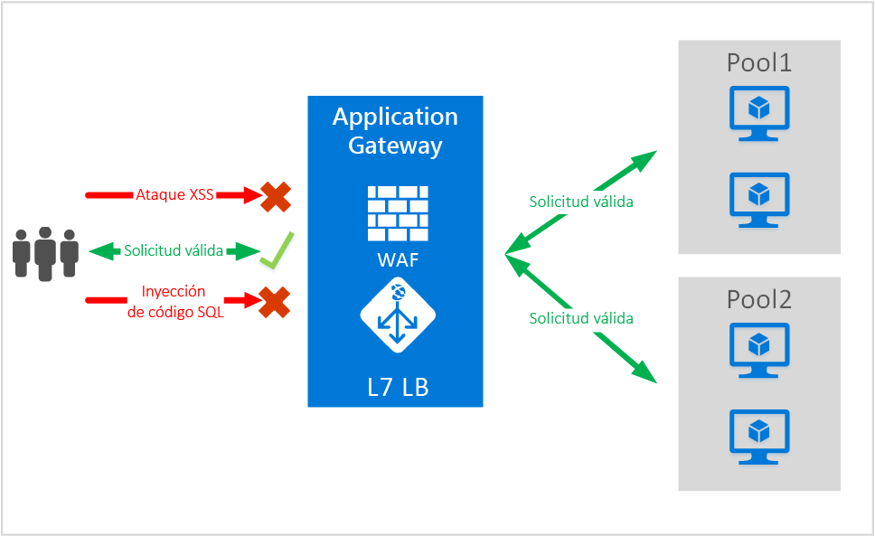
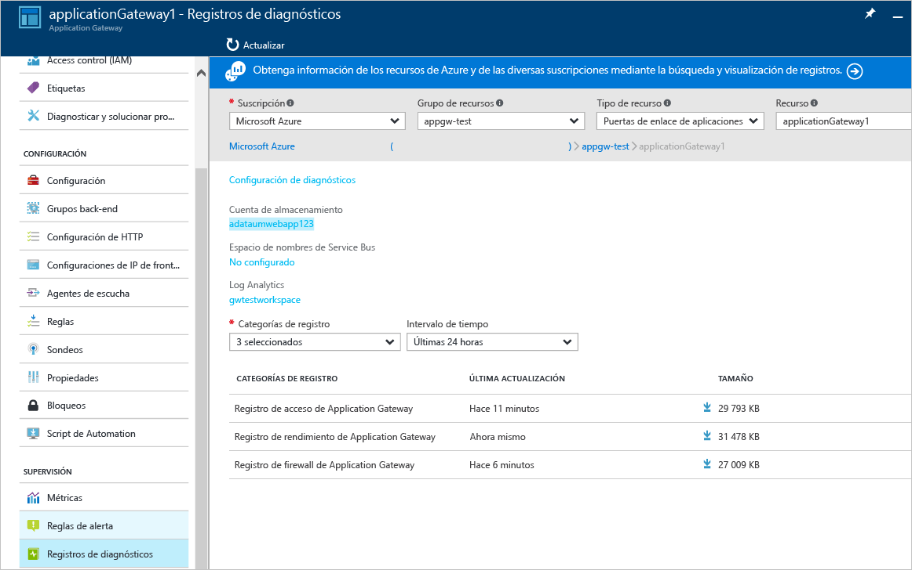

<properties
   pageTitle="Firewall de aplicaciones web de Application Gateway| Microsoft Azure"
   description="En esta página se proporciona una visión general de la funcionalidad del firewall de aplicaciones web de Application Gateway."
   documentationCenter="na"
   services="application-gateway"
   authors="amsriva"
   manager="rossort"
   editor="amsriva"/>
<tags
   ms.service="application-gateway"
   ms.devlang="na"
   ms.topic="hero-article"
   ms.tgt_pltfrm="na"
   ms.workload="infrastructure-services"
   ms.date="09/26/2016"
   ms.author="amsriva"/>

# Firewall de aplicaciones web de Application Gateway (versión preliminar)

Las aplicaciones web son cada vez más los objetivos de ataques malintencionados que aprovechan vulnerabilidades comunes conocidas, como ataques por inyección de código SQL o ataques de scripts de sitios, por nombrar unos pocos.
Impedir tales ataques en el código de aplicación puede ser un verdadero desafío y requerir tareas rigurosas de mantenimiento, aplicación de revisiones y supervisión en varias capas de la topología de aplicación. Una protección centralizada para los ataques web simplifica la administración de la seguridad y proporciona a la aplicación un mejor control contra las amenazas de intrusiones. Una solución WAF también puede reaccionar más rápido a las amenazas de seguridad al aplicar revisiones a vulnerabilidades conocidas en una ubicación central y proteger cada una de las aplicaciones web de forma individual.

Application Gateway funciona como un controlador de entrega de aplicaciones y ofrece terminación SSL, afinidad de sesión basada en cookies, distribución de la carga en operaciones por turnos, enrutamiento basado en contenido, posibilidad de hospedar varios sitios y mejoras de seguridad. Algunas de las mejoras de seguridad que se ofrecen en Application Gateway son administración de directivas SSL y compatibilidad con SSL de extremo a extremo. Estamos en proceso de reforzar las funcionalidades de seguridad de aplicaciones de nuestro servicio mediante la introducción de WAF (firewall de aplicaciones web) integrado directamente en la oferta de ADC. De esta forma se proporciona una ubicación central fácil de configurar para administrar y proteger las aplicaciones web frente a vulnerabilidades web comunes.

La configuración de WAF en Application Gateway proporciona las siguientes ventajas:

- Protección de la aplicación web contra las vulnerabilidades y los ataques web sin modificación del código de back-end.
- Protección de varias aplicaciones web al mismo tiempo detrás de una puerta de enlace de aplicaciones. Application Gateway admite el hospedaje de hasta 20 sitios web detrás de una única puerta de enlace, todos los cuales se podrían proteger contra los ataques web.
- Supervisión de las aplicaciones web de cara a los ataques mediante un informe en tiempo real generado por los registros WAF de Application Gateway.
- Algunos controles de cumplimiento requieren que todos los puntos de conexión accesibles desde Internet estén protegidos por una solución WAF. Mediante el uso de Application Gateway con WAF habilitado, puede satisfacer estos requisitos de cumplimiento.

## Información general

WAF de Application Gateway se ofrece en una nueva SKU (SKU de WAF) y viene preconfigurado con ModSecurity y OWASP Core Rule Set para proporcionar protección de base frente a la mayoría de las 10 vulnerabilidades web de OWASP más comunes.

- Protección contra la inyección de código SQL
- Protección contra scripts entre sitios
- Protección contra ataques web comunes, como inyección de comandos, contrabando de solicitudes HTTP, división de respuestas HTTP y ataque remoto de inclusión de archivos
- Protección contra infracciones del protocolo HTTP
- Protección contra anomalías del protocolo HTTP, como la falta de agentes de usuario de host y encabezados de aceptación
- Protecciones de denegación de servicio HTTP, lo que incluye desbordamiento HTTP y prevención de denegación de servicio HTTP
- Prevención contra bots, rastreadores y escáneres
- Detección de errores de configuración comunes (es decir, Apache, IIS, etc.)

## Modos de WAF

WAF de Application Gateway se puede configurar para ejecutarse en dos modos:

- **Modo de detección** : en este modo, WAF de Application Gateway supervisa y registra todas las alertas de amenazas en un archivo de registro. Debe asegurarse de que el registro de diagnósticos para Application Gateway esté activado mediante la sección Diagnósticos. También debe asegurarse de que el registro de WAF esté seleccionado y activado.
- **Modo de prevención** : en este modo, Application Gateway bloquea activamente las intrusiones y los ataques detectados por sus reglas. El atacante recibe una excepción de acceso no autorizado 403 y se termina la conexión. El modo de prevención continúa registrando estos ataques en los registros de WAF.

## Informes de WAF de Application Gateway

WAF de Application Gateway ofrece informes detallados sobre las amenazas detectadas. El registro se integra con los registros de Azure Diagnostics y las alertas se registran en formato json.

    {
        "resourceId": "/SUBSCRIPTIONS/<subscriptionId>/RESOURCEGROUPS/<resourceGroupName>/PROVIDERS/MICROSOFT.NETWORK/APPLICATIONGATEWAYS/<applicationGatewayName>",
        "operationName": "ApplicationGatewayFirewall",
        "time": "2016-09-20T00:40:04.9138513Z",
        "category": "ApplicationGatewayFirewallLog",
        "properties":     {
            "instanceId":"ApplicationGatewayRole_IN_0",
            "clientIp":"108.41.16.164",
            "clientPort":1815,
            "requestUri":"/wavsep/active/RXSS-Detection-Evaluation-POST/",
            "ruleId":"OWASP_973336",
            "message":"XSS Filter - Category 1: Script Tag Vector",
            "action":"Logged",
            "site":"Global",
            "message":"XSS Filter - Category 1: Script Tag Vector",
            "details":{"message":" Warning. Pattern match "(?i)(<script","file":"/owasp_crs/base_rules/modsecurity_crs_41_xss_attacks.conf","line":"14"}}
    }

## Precios de las SKU de WAF de Application Gateway

Durante la versión preliminar, no existen cargos adicionales por el uso de WAF de Application Gateway. Se le sigue cobrando según las tarifas de SKU básica existentes. En el momento de disponibilidad con carácter general (GA) se le comunicarán los cargos de la SKU de WAF. Los clientes que hayan decidido implementar Application Gateway en la SKU de WAF comenzarían a acumular los precios de SKU de WAF únicamente tras el anuncio de GA.

## Pasos siguientes

Después de conocer más sobre las funcionalidades de WAF, consulte [cómo configurar el firewall de aplicaciones web en Application Gateway](application-gateway-web-application-firewall-portal.md).

<!--HONumber=Oct16_HO2-->

