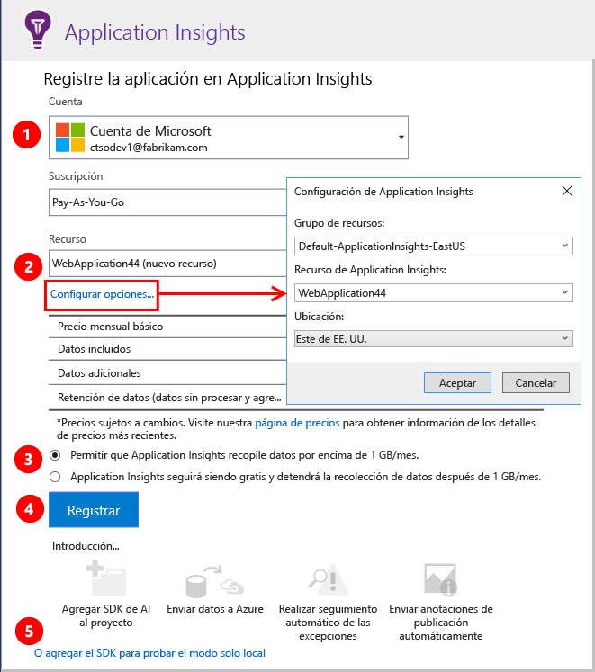
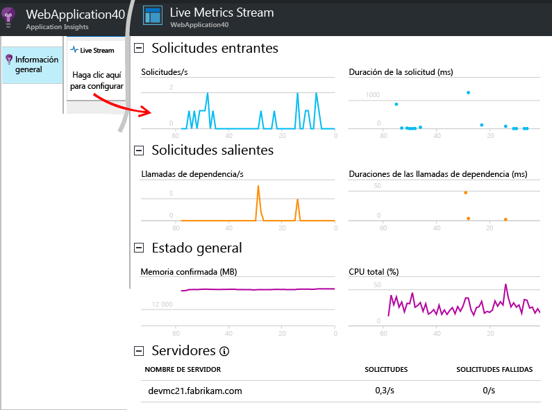
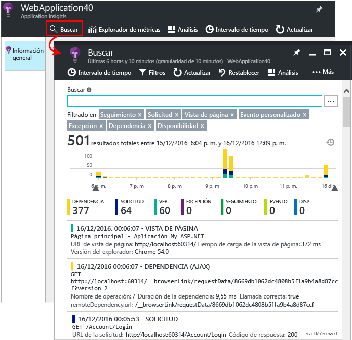
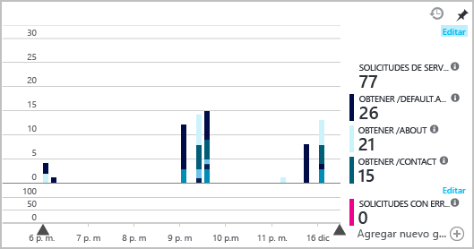
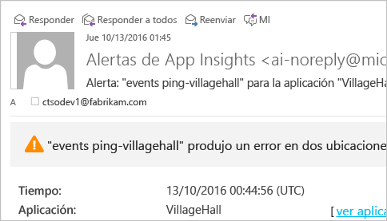

# <a name="set-up-application-insights-for-your-aspnet-website"></a>Configuración de Application Insights para un sitio web de ASP.NET
[Azure Application Insights](app-insights-overview.md) supervisa la aplicación activa para ayudarle a [detectar y diagnosticar problemas de rendimiento y excepciones](app-insights-detect-triage-diagnose.md), así como a [descubrir cómo se usa la aplicación](app-insights-overview-usage.md). Funciona con la característica Web Apps de Azure App Service, así como con las aplicaciones que se hospedan en sus propios servidores IIS locales o en máquinas virtuales en la nube.

## <a name="before-you-start"></a>Antes de comenzar
Necesita:

* Visual Studio 2013, actualización 3 o superior. Es mejor que sea superior.
* Una suscripción a [Microsoft Azure](http://azure.com). Si su equipo u organización tiene una suscripción a Azure, el propietario puede agregarla a ella con su [cuenta Microsoft](http://live.com).

Si está interesado, puede examinar otros temas:

* [Instrumentación de aplicaciones web en tiempo de ejecución con Application Insights](app-insights-monitor-performance-live-website-now.md)
* [Azure Cloud Services](app-insights-cloudservices.md)

## <a name="ide"></a>Paso 1: Agregue el SDK de Application Insights

Haga clic con el botón derecho en su proyecto de aplicación web en el Explorador de soluciones y elija **Agregar**, **Telemetría de Application Insights...** o **Configurar Application Insights**.


(En Visual Studio 2015, también hay una opción para agregar Application Insights en el cuadro de diálogo Nuevo proyecto.)

Vaya a la página de configuración de Application Insights:



1. Seleccione la cuenta y la suscripción que usa para acceder a Azure.
2. Seleccione el recurso de Azure en el que desea ver los datos de la aplicación. Normalmente, se crea un recurso independiente para cada aplicación. Si desea establecer el grupo de recursos o la ubicación en que se almacenan los datos, haga clic en **Parámetros de configuración**. Los grupos de recursos se utilizan para controlar el acceso a los datos. Por ejemplo, si tiene varias aplicaciones que forman parte del mismo sistema, puede poner sus datos de Application Insights en el mismo grupo de recursos.
3. Application Insights es gratuito hasta un volumen de telemetría determinado. Para evitar gastos, puede poner un límite en dicho volumen. Una vez que se crea el recurso, es posible cambiar la selección en el portal. Para ello, es preciso abrir **Características y precios**, **Administración de datos**, **Límite de volumen diario**.
4. Haga clic en **Registrar** para avanzar y configurar Application Insights para su aplicación web. La telemetría se enviará a [Azure Portal](https://portal.azure.com), durante la depuración y después de que se haya publicado la aplicación.
5. Como alternativa, puede agregar el SDK de Application Insights a la aplicación. En ese caso, podrá ver la telemetría en Visual Studio mientras se realiza la depuración. Posteriormente, puede volver a esta página de configuración, o bien puede esperar hasta que haya implementado la aplicación y [activar la telemetría en tiempo de ejecución](app-insights-monitor-performance-live-website-now.md).


## <a name="run"></a>Paso 2: Ejecute la aplicación
Ejecute la aplicación con F5. Abra distintas páginas para generar telemetría.

En Visual Studio, aparece un recuento de los eventos que se han registrado.


## <a name="step-3-see-your-telemetry-in-visual-studio-or-application-insights"></a>Paso 3: Vea la telemetría en Visual Studio o Application Insights
La telemetría se puede ver en Visual Studio o en el portal web de Application Insights.

En **Visual Studio**, abra la ventana de Application Insights. Haga clic en el botón **Application Insights** o haga clic con el botón derecho en el Explorador de soluciones, seleccione **Application Insights** y, después, haga clic en el proyecto en **Buscar telemetría activa**.

En la ventana de búsqueda de Application Insights de Visual Studio, en la vista de **datos de la sesión de depuración** encontrará la telemetría generada en el lado del servidor de la aplicación. Experimente con los filtros y haga clic en cualquier evento para ver más información al respecto.


> [!NOTE]
> Si no ve datos, asegúrese de que el intervalo de tiempo es correcto y haga clic en el icono de búsqueda.

[Más información acerca de las herramientas de Application Insights en Visual Studio](app-insights-visual-studio.md).

<a name="monitor"></a>
### <a name="the-application-insights-web-portal"></a>El portal web de Application Insights
La telemetría también se puede ver **en el portal web de Application Insights**, salvo que se elija instalar solo el SDK. El portal tiene más gráficos, herramientas de análisis y paneles que Visual Studio.

Abra el recurso de Application Insights. Inicie sesión en [Azure Portal](https://portal.azure.com/) y búsquelo allí, o haga clic en el proyecto en Visual Studio y deje que lo lleve allí.


> [!NOTE]
> Si recibe un error de acceso, es posible que tenga más de un conjunto de credenciales de Microsoft y que haya iniciar sesión con el erróneo. En el portal, cierre la sesión y vuelva a iniciarla.

El portal se abrirá en una vista de los datos de telemetría de su aplicación.


Haga clic en un icono para ver su contenido con mayor detalle.

### <a name="more-details-in-the-application-insights-web-portal"></a>El portal web de Application Insights encontrará más información al respecto
Aquí hay algunos ejemplos de cómo el portal proporciona más detalles.

* [**Live Metrics Stream**](app-insights-live-stream.md) muestra la telemetría casi al instante.

    

    Abra Live Metrics Stream mientras se ejecuta la aplicación para que puedan conectarse.

    Live Metrics Stream solo muestra la telemetría durante un minuto después de que se envía. Para más investigaciones históricas, use Search, Explorador de métricas y Analytics. Los datos pueden tardar unos minutos en aparecer.

* [**Search**](app-insights-diagnostic-search.md) muestra los eventos individuales, como solicitudes, excepciones y vistas de la página. Puede filtrar por tipo de evento, coincidencia de términos y valores de propiedad. Haga clic en cualquier evento para ver sus propiedades y eventos relacionados.

    

 * En modo de desarrollo, pueden ver una gran cantidad de eventos de dependencia (AJAX). Son las sincronizaciones entre el explorador y el emulador del servidor. Para ocultarlas, haga clic en el filtro **Dependencia**.
* [**Las métricas agregadas**](app-insights-metrics-explorer.md) como las tasas de solicitud y de error aparecen en los gráficos. Haga clic en cualquiera de los gráficos para abrir una hoja en la que encontrará más información. Haga clic en la etiqueta **Editar** de cualquier gráfico para establecer los filtros y el tamaño.

    

[Más información acerca del uso de Application Insights en el Portal de Azure](app-insights-dashboards.md).

## <a name="step-4-publish-your-app"></a>Paso 4: Publique la aplicación
Publique su aplicación en el servidor IIS o en Azure. Consulte [Secuencia de métricas en directo](app-insights-metrics-explorer.md#live-metrics-stream) para asegurarse de que todo está ejecutándose sin problemas.

La telemetría se crea en el portal de Application Insights, donde puede supervisar las métricas, buscar en la telemetría y configurar los [paneles](app-insights-dashboards.md). También puede usar el eficaz [lenguaje de consulta Analytics](app-insights-analytics.md) para analizar el uso y rendimiento o para buscar eventos concretos.

También puede seguir analizando la telemetría en [Visual Studio](app-insights-visual-studio.md) con herramientas como búsqueda de diagnóstico y las [tendencias](app-insights-visual-studio-trends.md).

> [!NOTE]
> Si la aplicación envía suficiente telemetría que se acerque a las [limitaciones de peticiones](app-insights-pricing.md#limits-summary), se activará el [muestreo](app-insights-sampling.md) automático. El muestreo reduce la cantidad de datos de telemetría enviados desde su aplicación, a la vez que conserva los datos correlacionados para fines de diagnóstico.
>
>

## <a name="land"></a> ¿Qué hace el comando Agregar Application Insights?
Application Insights envía los datos de telemetría de una aplicación al portal de Application Insights (que está hospedado en Microsoft Azure).


Por tanto, el comando realiza tres operaciones:

1. Agrega el paquete NuGet del SDK web de Application Insights al proyecto. Para verlo en Visual Studio, haga clic con el botón derecho en el proyecto y elija **Administrar paquetes de NuGet**.
2. Crea un recurso de Application Insights en [Azure Portal](https://portal.azure.com/). Aquí es donde se ven los datos. Recupera la *clave de instrumentación*, que identifica al recurso.
3. Insertar la clave de instrumentación en `ApplicationInsights.config`, con el fin de que el SDK pueda enviar datos de telemetría al portal.

Si lo desea, puede realizar estos pasos manualmente para [ASP.NET 4](app-insights-windows-services.md) o [ASP.NET Core](https://github.com/Microsoft/ApplicationInsights-aspnetcore/wiki/Getting-Started).

### <a name="upgrade-to-future-sdk-versions"></a>Actualización a futuras versiones del SDK
Para actualizar a una [nueva versión del SDK](https://github.com/Microsoft/ApplicationInsights-dotnet-server/releases), vuelva a abrir el **Administrador de paquetes NuGet** y filtre por los paquetes instalados. Seleccione **Microsoft.ApplicationInsights.Web** y elija **Actualizar**.

Si ha hecho alguna personalización en ApplicationInsights.config, guarde una copia del mismo antes de realizar la actualización. Luego, combine los cambios en la nueva versión.

## <a name="add-more-telemetry"></a>Incorporación de telemetría adicional
Los siguientes son otros tipos de telemetría que se pueden agregar.
### <a name="dependencies-exceptions-and-performance-counters"></a>Dependencias, excepciones y contadores de rendimiento

[Instale el monitor de estado](http://go.microsoft.com/fwlink/?LinkId=506648) en cada equipo del servidor de IIS para obtener telemetría adicional acerca de las aplicaciones web. Si ya está instalado, no es preciso hacer nada (puede que ya haya utilizado el monitor de estado para iniciar la supervisión de una aplicación en tiempo de ejecución).

Con el monitor de estado, además del SDK de tiempo de compilación, obtendrá un conjunto más completo de telemetría que incluye:

* [Contadores de rendimiento](app-insights-performance-counters.md): CPU, memoria, disco y otros contadores de rendimiento relacionados con la aplicación.
* [Excepciones](app-insights-asp-net-exceptions.md): telemetría más detallada para algunas excepciones.
* [Dependencias](app-insights-asp-net-dependencies.md): incluyen los valores devueltos.

### <a name="webpages-and-single-page-apps"></a>Páginas web y aplicaciones de una página
1. [Agregue el fragmento de código de JavaScript](app-insights-javascript.md) a sus páginas web para mostrar datos acerca de las vistas de página, los tiempos de carga, las excepciones del explorador, el rendimiento de las llamadas AJAX y los recuentos de usuarios y sesiones. Toda esta información aparece en las hojas Explorador y Uso.
2. [Eventos personalizados con código](app-insights-api-custom-events-metrics.md) para el recuento, la hora o la medición de las acciones del usuario.


### <a name="diagnostic-code"></a>Código de diagnóstico
¿Tiene un problema? Si desea insertar código en la aplicación para que le ayude con el diagnóstico, tiene varias opciones:

* [Capturar seguimientos de registros](app-insights-asp-net-trace-logs.md): si ya utiliza Log4N, NLog o System.Diagnostics.Trace para registrar eventos de seguimiento, puede enviar el resultado a Application Insights. para poder correlacionarlo con las solicitudes, realizar búsquedas en él y analizarlo.
* [Eventos y métricas personalizados](app-insights-api-custom-events-metrics.md): use TrackEvent() y TrackMetric() en el código del servidor o de la página web.
* [Etiquetar la telemetría con propiedades adicionales](app-insights-api-filtering-sampling.md#add-properties).

Use [Buscar](app-insights-diagnostic-search.md) para buscar y correlacionar eventos específicos y [Análisis](app-insights-analytics.md) para realizar consultas más eficaces.

## <a name="alerts"></a>Alertas
Sea el primero en saber si la aplicación tiene problemas.

* [Pruebas de disponibilidad](app-insights-monitor-web-app-availability.md): cree estas pruebas para asegurarse de que el sitio se ve en la web.
* [Diagnósticos inteligentes](app-insights-proactive-diagnostics.md): estas pruebas se realizan automáticamente, por lo que no es preciso hacer nada para configurarlas. Le indican si la aplicación tiene una tasa de solicitudes con error inusual.
* [Alertas de métricas](app-insights-alerts.md): establézcalas para que le adviertan si una métrica supera un umbral. Puede establecerlas en las métricas personalizadas que codifique en la aplicación.

De forma predeterminada, se envían notificaciones de alerta al propietario de la suscripción de Azure.



## <a name="version-and-release-tracking"></a>Versión y seguimiento de versiones
Para realizar el seguimiento de la versión de la aplicación, asegúrese de que `buildinfo.config` lo genera el proceso de Microsoft Build Engine. En su archivo .csproj, agregue:  

```XML

    <PropertyGroup>
      <GenerateBuildInfoConfigFile>true</GenerateBuildInfoConfigFile>    <IncludeServerNameInBuildInfo>true</IncludeServerNameInBuildInfo>
    </PropertyGroup>
```

Cuando tenga la información de la compilación, el módulo web de Application Insights agregará automáticamente la **versión de la aplicación** como una propiedad a cada elemento de telemetría. Esto le permite filtrar por versión al realizar [búsquedas de diagnósticos](app-insights-diagnostic-search.md) o al [explorar métricas](app-insights-metrics-explorer.md).

Sin embargo, tenga en cuenta que el número de versión de la compilación solo lo genera Microsoft Build Engine, no la compilación de desarrollador de Visual Studio.

### <a name="release-annotations"></a>Anotaciones de la versión
Si usa Visual Studio Team Services, puede [obtener un marcador de anotación](app-insights-annotations.md) agregado a los gráficos, siempre que publique una nueva versión. La siguiente imagen muestra cómo aparece este marcador.


## <a name="next-steps"></a>Pasos siguientes
**[Trabajo con Application Insights en Visual Studio](app-insights-visual-studio.md)**<br/>Incluye información acerca de la depuración con telemetría, la búsqueda de diagnóstico y la profundización en el código.

**[Trabajo con el portal de Application Insights](app-insights-dashboards.md)**<br/> Incluye información acerca de los paneles, eficaces herramientas de diagnóstico y análisis, alertas, un mapa activo de dependencias de la aplicación y exportación de la telemetría.

