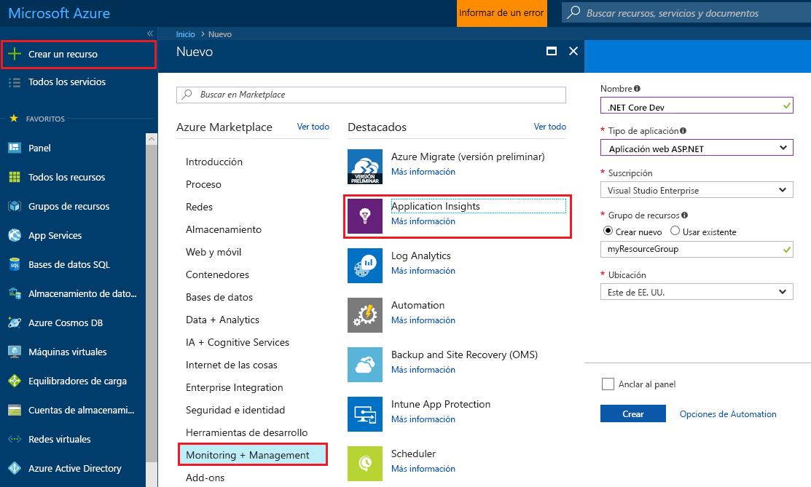
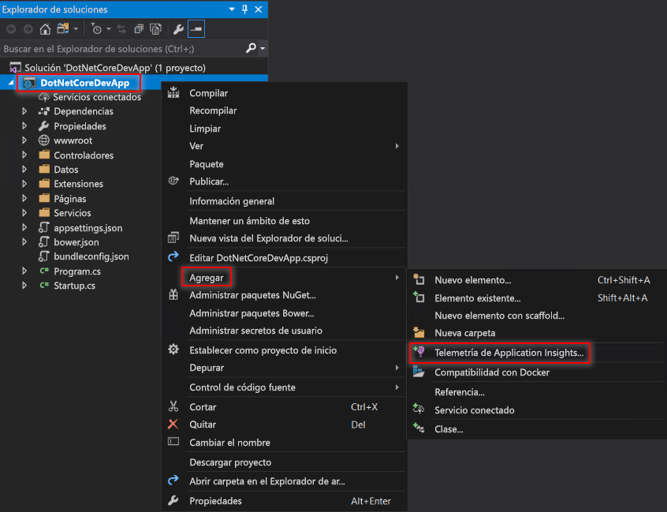
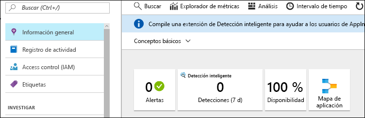
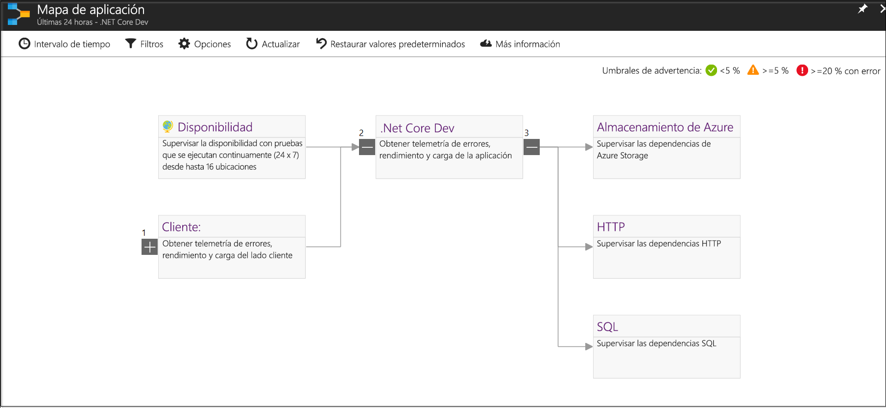
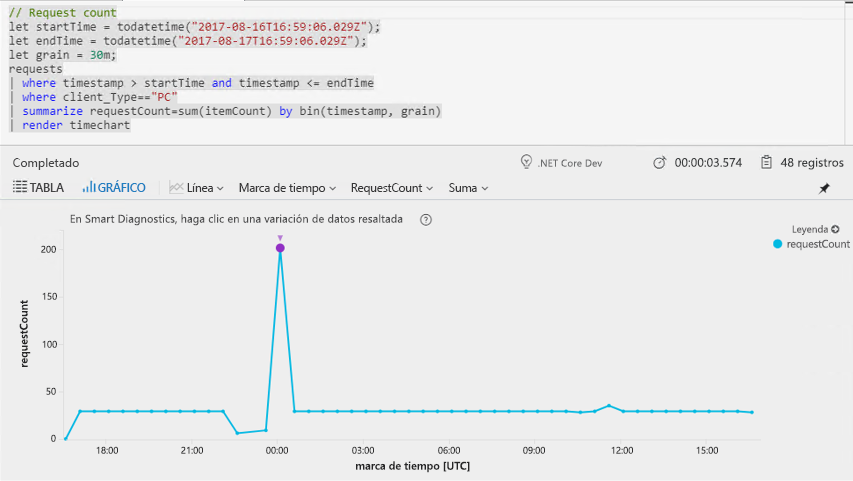
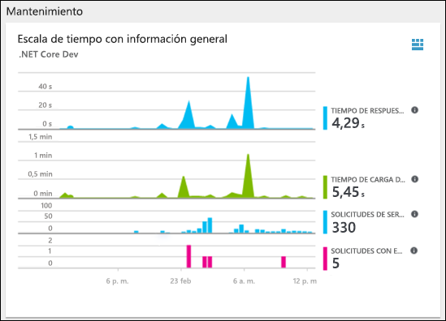
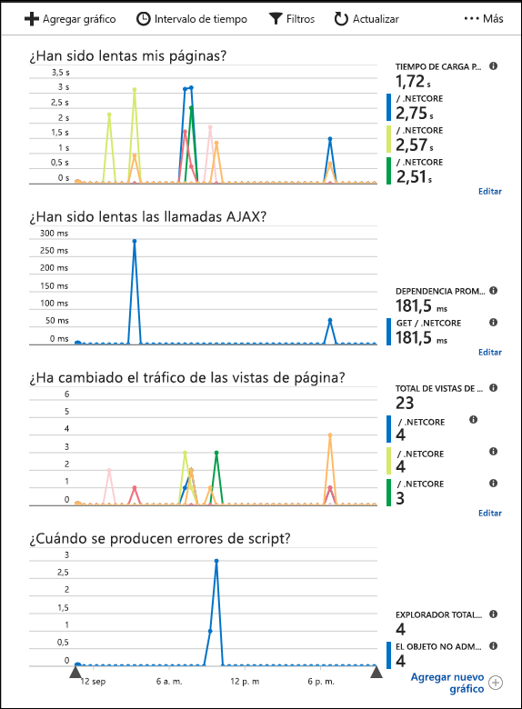

# <a name="start-monitoring-your-aspnet-core-web-application"></a>Inicio de la supervisión de la aplicación web ASP.NET Core

Con Azure Application Insights puede supervisar fácilmente la disponibilidad, el rendimiento y el uso de su aplicación web. También puede identificar rápidamente y diagnosticar errores en la aplicación sin tener que esperar a que un usuario informe de ellos. 

Esta guía de inicio rápido le ayudará a agregar el SDK de Application Insights a una aplicación web ASP.Net Core existente. 

## <a name="prerequisites"></a>Requisitos previos

Para completar esta guía de inicio rápido:

- Instale [Visual Studio 2017](https://www.visualstudio.com/downloads/) con las cargas de trabajo siguientes:
  - ASP.NET y desarrollo web
  - Desarrollo de Azure
- [Instalación del SDK de .NET Core 2.0](https://www.microsoft.com/net/core)
- Necesitará una suscripción de Azure y una aplicación web .NET Core existente.

Si no tiene una aplicación web ASP.NET Core, puede crear una siguiendo la [guía de creación de una aplicación web ASP.NET Core](https://docs.microsoft.com/aspnet/core/tutorials/publish-to-azure-webapp-using-vs).

Si no tiene una suscripción a Azure, cree una cuenta [gratuita](https://azure.microsoft.com/free/) antes de empezar.

## <a name="log-in-to-the-azure-portal"></a>Iniciar sesión en Azure Portal

Inicie sesión en [Azure Portal](https://portal.azure.com/).

## <a name="enable-application-insights"></a>Habilitación de Application Insights

Application Insights recopila datos de telemetría desde cualquier aplicación conectada a Internet, independientemente de si se está ejecutando localmente o en la nube. Siga estos pasos para empezar a ver los datos.

1. Seleccione **Nuevo** > **Supervisión y administración** > **Application Insights**.

   

    Aparecerá un cuadro de configuración, use la tabla siguiente para rellenar los campos de entrada.

    | Settings        |  Valor           | Descripción  |
   | ------------- |:-------------|:-----|
   | **Name**      | Nombre único global | Nombre que identifica la aplicación que se está supervisando |
   | **Tipo de aplicación** | Aplicación web ASP.NET | Tipo de aplicación que se está supervisando |
   | **Grupo de recursos**     | myResourceGroup      | Nombre para el nuevo grupo de recursos que hospedará los datos de Application Insights |
   | **Ubicación** | Este de EE. UU. | Elija una ubicación cerca de usted o de donde se hospeda la aplicación |

2. Haga clic en **Crear**.

## <a name="configure-app-insights-sdk"></a>Configuración del SDK de Application Insights

1. Abra el **proyecto** de la aplicación web ASP.NET Core en Visual Studio > haga clic con el botón derecho en el nombre de la aplicación en el **Explorador de soluciones** > seleccione **Agregar**  >  **Telemetría de Application Insights**.

    

2. Haga clic en el botón **Iniciar prueba gratuita** > seleccione el **recurso existente** que creó en Azure Portal > haga clic en **Registrar**.

3. Seleccione **Depurar** > **Iniciar sin depurar** (Ctrl + F5) para iniciar la aplicación.

> [!NOTE]
> Los datos tardan unos 3-5 minutos en empezar a aparecer en el portal. Si se trata de una aplicación de prueba de poco tráfico, tenga en cuenta que la mayoría de las métricas se capturan solo cuando hay solicitudes u operaciones activas.

## <a name="start-monitoring-in-the-azure-portal"></a>Inicio de la supervisión en Azure Portal

1. Ahora puede volver a abrir la página **Introducción** de Application Insights en Azure Portal; para ello, seleccione **Proyecto** > **Application Insights** > **Abrir portal de Application Insights** para ver los detalles de la aplicación en ejecución.

   

2. Haga clic en **Mapa de la aplicación** para un diseño visual de las relaciones de dependencia entre los componentes de la aplicación. Cada componente muestra KPI como la carga, el rendimiento, errores y alertas.

   

3. Haga clic en el icono **Análisis de aplicaciones** .  Se abrirá **Application Insights Analytics**, que proporciona un lenguaje de consulta completo para analizar todos los datos recopilados por Application Insights. En este caso, se genera una consulta que representa el número de solicitudes en un gráfico. Puede escribir sus propias consultas para analizar otros datos.

   

4. Vuelva a la página **Introducción** y examine el **Escala de tiempo con información general de Estado**.  Este panel proporciona estadísticas sobre el estado de aplicación, incluido el número de solicitudes entrantes, la duración de las solicitudes y los errores que se producen. 

   

   Para habilitar el gráfico **Tiempo de carga de la vista de página** que se rellenará con los datos de **Telemetría del lado cliente**, agregue este script para cada página de las que desee realizar el seguimiento:

   ```HTML
   <!-- 
   To collect end-user usage analytics about your application, 
   insert the following script into each page you want to track.
   Place this code immediately before the closing </head> tag,
   and before any other scripts. Your first data will appear 
   automatically in just a few seconds.
   -->
   <script type="text/javascript">
     var appInsights=window.appInsights||function(config){
       function i(config){t[config]=function(){var i=arguments;t.queue.push(function(){t[config].apply(t,i)})}}var t={config:config},u=document,e=window,o="script",s="AuthenticatedUserContext",h="start",c="stop",l="Track",a=l+"Event",v=l+"Page",y=u.createElement(o),r,f;y.src=config.url||"https://az416426.vo.msecnd.net/scripts/a/ai.0.js";u.getElementsByTagName(o)[0].parentNode.appendChild(y);try{t.cookie=u.cookie}catch(p){}for(t.queue=[],t.version="1.0",r=["Event","Exception","Metric","PageView","Trace","Dependency"];r.length;)i("track"+r.pop());return i("set"+s),i("clear"+s),i(h+a),i(c+a),i(h+v),i(c+v),i("flush"),config.disableExceptionTracking||(r="onerror",i("_"+r),f=e[r],e[r]=function(config,i,u,e,o){var s=f&&f(config,i,u,e,o);return s!==!0&&t["_"+r](config,i,u,e,o),s}),t
       }({
           instrumentationKey:"<insert instrumentation key>"
       });
       
       window.appInsights=appInsights;
       appInsights.trackPageView();
   </script>
   ```

5. Haga clic en **Explorador** debajo del encabezado **Investigar**. Aquí encontrará las métricas relacionadas con el rendimiento de las páginas de la aplicación. Puede hacer clic en **Agregar nuevo gráfico** para crear vistas personalizadas adicionales o seleccionar **Editar** para modificar los tipos de gráfico existentes, el alto, la paleta de colores, las agrupaciones o las métricas.

   

## <a name="clean-up-resources"></a>Limpieza de recursos

Si tiene previsto seguir trabajando con las siguientes guías de inicio rápido o tutoriales, no elimine los recursos creados en esta guía de inicio rápido. Si no tiene previsto continuar, siga estos pasos para eliminar todos los recursos creados por esta guía de inicio rápido en Azure Portal.

1. En el menú izquierdo de Azure Portal, haga clic en **Grupos de recursos** y en **myResourceGroup**.
2. En la página del grupo de recursos, haga clic en **Eliminar**, escriba **myResourceGroup** en el cuadro de texto y haga clic en **Eliminar**.

## <a name="next-steps"></a>Pasos siguientes

> [!div class="nextstepaction"]
> [Búsqueda y diagnóstico de excepciones en tiempo de ejecución](https://docs.microsoft.com/azure/application-insights/app-insights-tutorial-runtime-exceptions)
