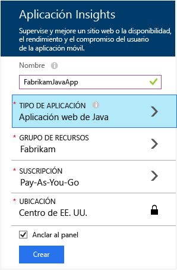
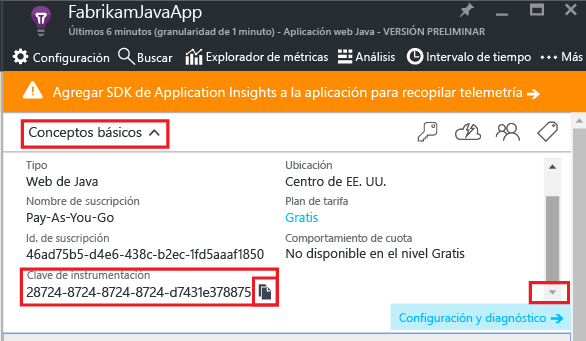
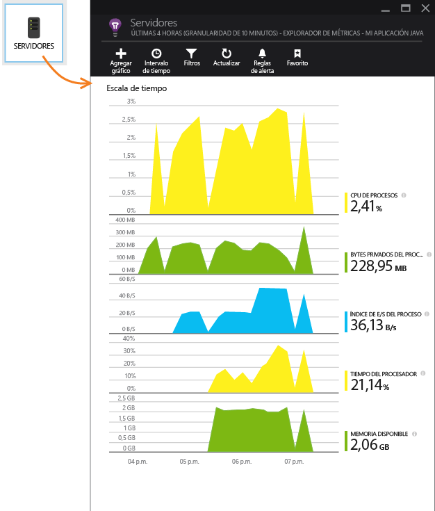
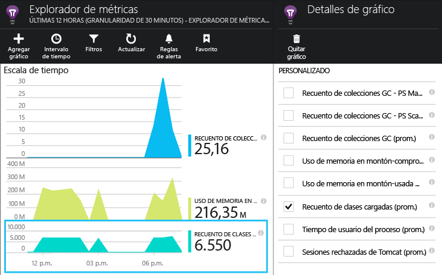

# <a name="get-started-with-application-insights-in-a-java-web-project"></a>Introducción a Application Insights en un proyecto web de Java


[Application Insights](https://azure.microsoft.com/services/application-insights/) es un servicio de análisis extensible para desarrolladores web que ayuda a comprender el rendimiento y el uso de la aplicación activa. Úselo para [detectar y diagnosticar problemas de rendimiento y excepciones](app-insights-detect-triage-diagnose.md), y [escribir código][api] para realizar un seguimiento de lo que los usuarios hacen con su aplicación.


Application Insights es compatible con aplicaciones Java que se ejecutan en Linux, Unix o Windows.

Necesita:

* Oracle JRE 1.6 o posterior, o Zulu JRE 1.6 o posterior
* Una suscripción a [Microsoft Azure](https://azure.microsoft.com/).

*Si tiene una aplicación web que ya está en funcionamiento, puede seguir el procedimiento alternativo para [agregar el SDK en tiempo de ejecución en el servidor web](app-insights-java-live.md). Esa alternativa evita volver a generar el código, pero no incluye la opción de escribir código para realizar un seguimiento de la actividad del usuario.*

## <a name="1-get-an-application-insights-instrumentation-key"></a>1. Obtención de una clave de instrumentación de Application Insights
1. Inicie sesión en el [Portal de Microsoft Azure](https://portal.azure.com).
2. Cree un recurso en Application Insights. Establezca el tipo de aplicación a una aplicación web de Java.

    
3. Busque la clave de instrumentación del nuevo recurso. Pronto tendrá que pegarla en el proyecto de código.

    

## <a name="2-add-the-application-insights-sdk-for-java-to-your-project"></a>2. Incorporación del SDK de Application Insights para Java al proyecto
*Elija la forma adecuada para su proyecto.*

#### <a name="if-youre-using-eclipse-to-create-a-maven-or-dynamic-web-project-"></a>Si usa Eclipse para crear un proyecto web dinámico o de Maven...
Use el [complemento SDK de Application Insights para Java][eclipse].

#### <a name="if-youre-using-maven"></a>Si está usando Maven...
Si su proyecto ya se ha configurado para usar Maven para la compilación, combine el siguiente código en el archivo pom.xml.

A continuación, actualice las dependencias del proyecto, para obtener los archivos binarios descargados.

```XML

    <repositories>
       <repository>
          <id>central</id>
          <name>Central</name>
          <url>http://repo1.maven.org/maven2</url>
       </repository>
    </repositories>

    <dependencies>
      <dependency>
        <groupId>com.microsoft.azure</groupId>
        <artifactId>applicationinsights-web</artifactId>
        <!-- or applicationinsights-core for bare API -->
        <version>[1.0,)</version>
      </dependency>
    </dependencies>
```

* *¿Errores de validación en la suma de comprobación o la compilación?* Pruebe en su lugar una versión específica, como:`<version>1.0.n</version>`. Encontrará la versión más reciente en las [notas de la versión del SDK](https://github.com/Microsoft/ApplicationInsights-Java#release-notes) o en nuestros [artefactos de Maven](http://search.maven.org/#search%7Cga%7C1%7Capplicationinsights).
* *¿Necesita actualizar a un nuevo SDK?* Actualice las dependencias del proyecto.

#### <a name="if-youre-using-gradle"></a>Si está usando Gradle...
Si su proyecto ya se ha configurado para usar Grade para la compilación, combine el siguiente código al archivo build.gradle.

A continuación, actualice las dependencias del proyecto, para obtener los archivos binarios descargados.

```JSON

    repositories {
      mavenCentral()
    }

    dependencies {
      compile group: 'com.microsoft.azure', name: 'applicationinsights-web', version: '1.+'
      // or applicationinsights-core for bare API
    }
```

* *¿Errores de validación de suma de comprobación o de compilación? Utilice en su lugar una versión específica, como:* `version:'1.0.n'` *Encontrará la versión más reciente en las [notas de la versión de SDK](https://github.com/Microsoft/ApplicationInsights-Java#release-notes).*
* *Para actualizar a un nuevo SDK*
  * Actualice las dependencias del proyecto.

#### <a name="otherwise-"></a>De lo contrario...
Agregue manualmente el SDK:

1. Descargue el [SDK de Application Insights para Java](https://aka.ms/aijavasdk).
2. Extraiga los archivos binarios del archivo zip y agréguelos al proyecto.

### <a name="questions"></a>Preguntas...
* *¿Cuál es la relación entre los componentes `-core` y `-web` del archivo zip?*

  * `applicationinsights-core` le ofrece la API básica. Este componente se necesita siempre.
  * `applicationinsights-web` proporciona métricas que realizan el seguimiento de recuentos de solicitud HTTP y tiempos de respuesta. Este componente se puede omitir si no se desea que se recopilen automáticamente los datos de esta telemetría. Por ejemplo, si desea escribir la suya propia.
* *Para actualizar el SDK cuando publicamos cambios*

  * Descargue el [SDK más reciente de Application Insights para Java](https://aka.ms/qqkaq6) y sustituya los antiguos.
  * Los cambios se describen en las [notas de la versión de SDK](https://github.com/Microsoft/ApplicationInsights-Java#release-notes).

## <a name="3-add-an-application-insights-xml-file"></a>3. Adición de un archivo .xml de Application Insights
Agregue ApplicationInsights.xml a la carpeta de recursos del proyecto o asegúrese de que se agrega a la ruta de acceso de la clase de implementación del proyecto. Copie en ella el siguiente XML.

Sustituya la clave de instrumentación que obtuvo en el portal de Azure.

```XML

    <?xml version="1.0" encoding="utf-8"?>
    <ApplicationInsights xmlns="http://schemas.microsoft.com/ApplicationInsights/2013/Settings" schemaVersion="2014-05-30">


      <!-- The key from the portal: -->

      <InstrumentationKey>** Your instrumentation key **</InstrumentationKey>


      <!-- HTTP request component (not required for bare API) -->

      <TelemetryModules>
        <Add type="com.microsoft.applicationinsights.web.extensibility.modules.WebRequestTrackingTelemetryModule"/>
        <Add type="com.microsoft.applicationinsights.web.extensibility.modules.WebSessionTrackingTelemetryModule"/>
        <Add type="com.microsoft.applicationinsights.web.extensibility.modules.WebUserTrackingTelemetryModule"/>
      </TelemetryModules>

      <!-- Events correlation (not required for bare API) -->
      <!-- These initializers add context data to each event -->

      <TelemetryInitializers>
        <Add type="com.microsoft.applicationinsights.web.extensibility.initializers.WebOperationIdTelemetryInitializer"/>
        <Add type="com.microsoft.applicationinsights.web.extensibility.initializers.WebOperationNameTelemetryInitializer"/>
        <Add type="com.microsoft.applicationinsights.web.extensibility.initializers.WebSessionTelemetryInitializer"/>
        <Add type="com.microsoft.applicationinsights.web.extensibility.initializers.WebUserTelemetryInitializer"/>
        <Add type="com.microsoft.applicationinsights.web.extensibility.initializers.WebUserAgentTelemetryInitializer"/>

      </TelemetryInitializers>
    </ApplicationInsights>
```


* La clave de instrumentación se envía junto con todos los elementos de telemetría e indica a Application Insights que se muestre en el recurso.
* El componente de la solicitud HTTP es opcional. Envía automáticamente telemetría sobre las solicitudes y tiempos de respuesta en el portal.
* La correlación de eventos es un complemento del componente de la solicitud HTTP. Asigna un identificador a cada solicitud recibida por el servidor y agrega este identificador como propiedad a todos los elementos de telemetría como la propiedad 'Operation.Id'. Le permite correlacionar la telemetría asociada a cada solicitud estableciendo un filtro en la [búsqueda de diagnóstico][diagnostic].
* La clave de Application Insights se puede pasar dinámicamente desde el Portal de Azure como una propiedad del sistema (-DAPPLICATION_INSIGHTS_IKEY = your_ikey). Si no hay ninguna propiedad definida, busca la variable de entorno (APPLICATION_INSIGHTS_IKEY) en la configuración de las aplicaciones de Azure. Si las propiedades no están definidas, se usa el valor predeterminado de InstrumentationKey de ApplicationInsights.xml. Esta secuencia le ayuda a administrar dinámicamente distintas instancias InstrumentationKeys para entornos diferentes.

### <a name="alternative-ways-to-set-the-instrumentation-key"></a>Alternativas para establecer la clave de instrumentación
SDK de Application Insights busca la clave en este orden:

1. Propiedad del sistema:-DAPPLICATION_INSIGHTS_IKEY = your_ikey
2. Variable de entorno: APPLICATION_INSIGHTS_IKEY
3. Archivo de configuración: ApplicationInsights.xml

También se puede [configurar en el código](app-insights-api-custom-events-metrics.md#ikey):

```Java

    telemetryClient.InstrumentationKey = "...";
```

## <a name="4-add-an-http-filter"></a>4. Adición de un filtro HTTP
El último paso de la configuración permite que el componente de la solicitud HTTP registre las solicitudes web. (No es necesario si solo desea la API básica).

Busque y abra el archivo web.xml en el proyecto y combine el siguiente código bajo el nodo web-app, donde se han configurado los filtros de aplicación.

Para obtener los resultados más precisos, el filtro debe asignarse antes de todos los demás filtros.

```XML

    <filter>
      <filter-name>ApplicationInsightsWebFilter</filter-name>
      <filter-class>
        com.microsoft.applicationinsights.web.internal.WebRequestTrackingFilter
      </filter-class>
    </filter>
    <filter-mapping>
       <filter-name>ApplicationInsightsWebFilter</filter-name>
       <url-pattern>/*</url-pattern>
    </filter-mapping>
```

#### <a name="if-youre-using-spring-web-mvc-31-or-later"></a>Si utiliza Spring Web MVC 3.1, o cualquier versión posterior
Edite estos elementos en *-servlet.xml para incluir el paquete de Application Insights:

```XML

    <context:component-scan base-package=" com.springapp.mvc, com.microsoft.applicationinsights.web.spring"/>

    <mvc:interceptors>
        <mvc:interceptor>
            <mvc:mapping path="/**"/>
            <bean class="com.microsoft.applicationinsights.web.spring.RequestNameHandlerInterceptorAdapter" />
        </mvc:interceptor>
    </mvc:interceptors>
```

#### <a name="if-youre-using-struts-2"></a>Si está usando Struts 2
Agregue este elemento al archivo de configuración Struts (denominado normalmente struts.xml o struts-default.xml):

```XML

     <interceptors>
       <interceptor name="ApplicationInsightsRequestNameInterceptor" class="com.microsoft.applicationinsights.web.struts.RequestNameInterceptor" />
     </interceptors>
     <default-interceptor-ref name="ApplicationInsightsRequestNameInterceptor" />
```

(Si tiene interceptores definidos en una pila predeterminada, el interceptor puede agregarse simplemente a dicha pila).

## <a name="5-run-your-application"></a>5. Ejecución de la aplicación
Ejecútela en modo de depuración en el equipo de desarrollo o bien publíquela en el servidor.

## <a name="6-view-your-telemetry-in-application-insights"></a>6. Visualización de la telemetría en Application Insights
Vuelva al recurso de Application Insights en el [Portal de Microsoft Azure](https://portal.azure.com).

Los datos de las solicitudes HTTP aparecen en la hoja de información general. (Si todavía no está ahí, espere unos segundos y, a continuación, haga clic en Actualizar).


[Más información acerca de las métricas.][metrics]

Haga clic en cualquier gráfico para ver métricas agregadas más detalladas.


> Application Insights asume que el formato de las solicitudes HTTP para las aplicaciones de MVC es: `VERB controller/action`. Por ejemplo, `GET Home/Product/f9anuh81`, `GET Home/Product/2dffwrf5` y `GET Home/Product/sdf96vws` se agrupan en `GET Home/Product`. Esta agrupación permite agregaciones significativas de solicitudes, como el número de solicitudes y el tiempo medio de ejecución de las solicitudes.
>
>

### <a name="instance-data"></a>Datos de instancia
Haga clic en un tipo de solicitud específico para ver las instancias individuales.

Se muestran dos tipos de datos en Application Insights: datos agregados, almacenados y mostrados como promedios, recuentos y sumas; y datos de instancia, como informes individuales de las solicitudes HTTP, excepciones, vistas de página o eventos personalizados.

Cuando vea las propiedades de una solicitud, podrá ver los eventos de telemetría asociados, como solicitudes y excepciones.


### <a name="analytics-powerful-query-language"></a>Analytics: Lenguaje de consulta eficaz
A medida que acumula más datos, puede ejecutar consultas tanto para agregar datos como para buscar instancias individuales.  [Analytics](app-insights-analytics.md) es una eficaz herramienta tanto para conocer el rendimiento y el uso, como para el diagnóstico.


## <a name="7-install-your-app-on-the-server"></a>7. Instalación de la aplicación en el servidor
Ahora puede publicar la aplicación en el servidor, dejar que la utilicen los usuarios y ver la telemetría en el portal.

* Asegúrese de que el firewall permite que la aplicación envíe datos de telemetría a estos puertos:

  * dc.services.visualstudio.com:443
  * f5.services.visualstudio.com:443

* Si el tráfico saliente debe enrutarse a través de un firewall, defina las propiedades de sistema `http.proxyHost` y `http.proxyPort`.

* En los servidores de Windows, instale:

  * [Microsoft Visual C++ Redistributable](http://www.microsoft.com/download/details.aspx?id=40784)

    (Este componente habilita los contadores de rendimiento.)


## <a name="exceptions-and-request-failures"></a>Excepciones y errores de solicitud
Las excepciones no controladas se recopilan automáticamente:


Para recopilar datos de otras excepciones, tiene dos opciones:

* [Insertar llamadas a TrackException en el código][apiexceptions].
* [Instalar el agente de Java en el servidor](app-insights-java-agent.md). Debe especificar los métodos que desee ver.

## <a name="monitor-method-calls-and-external-dependencies"></a>Supervisión de llamadas a métodos y dependencias externas
[Instale el agente de Java](app-insights-java-agent.md) para registrar los métodos internos especificados y las llamadas realizadas a través de JDBC, con datos de tiempo.

## <a name="performance-counters"></a>Contadores de rendimiento
Abra **Configuración** y **Servidores** para ver un intervalo de contadores de rendimiento.



### <a name="customize-performance-counter-collection"></a>Personalizar la recopilación de contadores de rendimiento
Para deshabilitar la recopilación del conjunto estándar de contadores de rendimiento, agregue el siguiente código bajo el nodo raíz del archivo ApplicationInsights.xml:

```XML
    <PerformanceCounters>
       <UseBuiltIn>False</UseBuiltIn>
    </PerformanceCounters>
```

### <a name="collect-additional-performance-counters"></a>Recopilar contadores de rendimiento adicionales
Puede especificar contadores de rendimiento adicionales que se van a recopilar.

#### <a name="jmx-counters-exposed-by-the-java-virtual-machine"></a>Contadores JMX (expuestos por la máquina virtual de Java)

```XML
    <PerformanceCounters>
      <Jmx>
        <Add objectName="java.lang:type=ClassLoading" attribute="TotalLoadedClassCount" displayName="Loaded Class Count"/>
        <Add objectName="java.lang:type=Memory" attribute="HeapMemoryUsage.used" displayName="Heap Memory Usage-used" type="composite"/>
      </Jmx>
    </PerformanceCounters>
```

* `displayName` : el nombre mostrado en el portal de Application Insights.
* `objectName` : el nombre del objeto JMX.
* `attribute` : el atributo del nombre del objeto JMX que se va a capturar
* `type` (opcional): el tipo de atributo del objeto JMX:
  * Valor predeterminado: un tipo simple como int o long.
  * `composite`: los datos del contador de rendimiento tienen el formato 'Attribute.Data'
  * `tabular`: los datos del contador de rendimiento tienen el formato de una fila de tabla

#### <a name="windows-performance-counters"></a>Contadores de rendimiento de Windows
Cada [contador de rendimiento de Windows](https://msdn.microsoft.com/library/windows/desktop/aa373083.aspx) es un miembro de una categoría (de la misma manera que un campo es un miembro de una clase). Las categorías puede ser globales, o pueden tener instancias con nombre o numeradas.

```XML
    <PerformanceCounters>
      <Windows>
        <Add displayName="Process User Time" categoryName="Process" counterName="%User Time" instanceName="__SELF__" />
        <Add displayName="Bytes Printed per Second" categoryName="Print Queue" counterName="Bytes Printed/sec" instanceName="Fax" />
      </Windows>
    </PerformanceCounters>
```

* displayName: el nombre mostrado en el portal de Application Insights.
* categoryName: la categoría de contador de rendimiento (objeto de rendimiento) con la que está asociada este contador de rendimiento.
* counterName: el nombre del contador de rendimiento.
* instanceName: el nombre de la instancia de categoría del contador de rendimiento o una cadena vacía (""), si la categoría contiene una sola instancia. Si categoryName es Proceso, y el contador de rendimiento que desea recopilar está en el proceso de JVM actual en que se ejecuta la aplicación, especifique `"__SELF__"`.

Los contadores de rendimiento están visibles como métricas personalizadas en el [Explorador de métricas][metrics].



### <a name="unix-performance-counters"></a>Contadores de rendimiento de Unix
* [Instale collectd con el complemento de Application Insights](app-insights-java-collectd.md) para obtener una amplia variedad de datos de red y del sistema.

## <a name="get-user-and-session-data"></a>Obtención de datos de usuario y sesión
Bien, va a enviar telemetría desde el servidor web. Ahora, para obtener la visión completa de 360 grados de la aplicación, puede agregar mayor supervisión:

* [Agregue telemetría a las páginas web][usage] para supervisar las vistas de páginas y las métricas de usuario.
* [Configure las pruebas web][availability] para comprobar que la aplicación efectivamente está activa y responde adecuadamente.

## <a name="capture-log-traces"></a>Captura de seguimiento de registros
Application Insights se puede utilizar para segmentar y desglosar los registros desde Log4J, Logback u otras plataformas de registro. Puede correlacionar los registros con solicitudes HTTP y otra telemetría. [Vea cómo][javalogs].

## <a name="send-your-own-telemetry"></a>Envío de su propia telemetría
Ahora que ha instalado el SDK, puede utilizar la API para enviar su propia telemetría.

* [Realice el seguimiento de eventos y métricas personalizados][api] para saber qué hacen los usuarios con su aplicación.
* [Busque eventos y registros][diagnostic] para ayudar a diagnosticar problemas.

## <a name="availability-web-tests"></a>Pruebas web de disponibilidad
Application Insights puede probar su sitio web a intervalos regulares para comprobar que está activo y que responde correctamente. [Para configurarlo][availability], haga clic en Pruebas web.


Obtendrá gráficos de tiempos de respuesta, junto con notificaciones por correo electrónico si su sitio deja de funcionar.


[Más información acerca de las pruebas web de disponibilidad.][availability]

## <a name="questions-problems"></a>¿Tiene preguntas? ¿Tiene problemas?
[Solución de problemas de Java](app-insights-java-troubleshoot.md)

## <a name="video"></a>Vídeo

> [!VIDEO https://channel9.msdn.com/events/Connect/2016/100/player]

## <a name="next-steps"></a>Pasos siguientes
* [Supervisión de llamadas a dependencias](app-insights-java-agent.md)
* [Supervisión de contadores de rendimiento de Unix](app-insights-java-collectd.md)
* Incorporación de la [supervisión a las páginas web](app-insights-javascript.md) para controlar los tiempos de carga, las llamadas de AJAX y la excepciones del explorador.
* Escritura de una [telemetría personalizada](app-insights-api-custom-events-metrics.md) para hacer un seguimiento del uso en el explorador o el servidor.
* Creación de [paneles](app-insights-dashboards.md) para agrupar los principales gráficos y supervisar el sistema.
* Uso de [Analytics](app-insights-analytics.md) para realizar consultas eficaces sobre los datos de telemetría de la aplicación
* Para más información, visite [Azure para desarrolladores de Java](/java/azure).

<!--Link references-->

[api]: app-insights-api-custom-events-metrics.md
[apiexceptions]: app-insights-api-custom-events-metrics.md#trackexception
[availability]: app-insights-monitor-web-app-availability.md
[diagnostic]: app-insights-diagnostic-search.md
[eclipse]: app-insights-java-eclipse.md
[javalogs]: app-insights-java-trace-logs.md
[metrics]: app-insights-metrics-explorer.md
[usage]: app-insights-javascript.md
