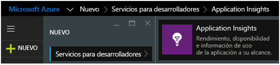

<properties 
	pageTitle="Introducción a Application Insights en un proyecto web de Java" 
	description="Supervisión del rendimiento y del uso del sitio web de Java con Application Insights" 
	services="application-insights" 
    documentationCenter="java"
	authors="alancameronwills" 
	manager="ronmart"/>

<tags 
	ms.service="application-insights" 
	ms.workload="tbd" 
	ms.tgt_pltfrm="ibiza" 
	ms.devlang="na" 
	ms.topic="article" 
	ms.date="05/11/2015" 
	ms.author="awills"/>
 
# Introducción a Application Insights en un proyecto web de Java

*Application Insights se encuentra en su versión de vista previa.*

[AZURE.INCLUDE [app-insights-selector-get-started](../../includes/app-insights-selector-get-started.md)]

Mediante la adición de Application Insights de Visual Studio al proyecto, puede detectar y diagnosticar problemas de rendimiento y excepciones.

Además, puede configurar [pruebas web][availability] para supervisar la disponibilidad de la aplicación e insertar el [código en las páginas web][api] para comprender los patrones de uso.

Necesitará:

* Oracle JRE 1.6 o posterior, o Zulu JRE 1.6 o posterior
* Una suscripción a [Microsoft Azure](http://azure.microsoft.com/). (Puede empezar con la [evaluación gratuita](http://azure.microsoft.com/pricing/free-trial/)).

## 1. Obtención de una clave de instrumentación de Application Insights

1. Inicio de sesión en el [Portal de Microsoft Azure](https://portal.azure.com)
2. Creación de un recurso de Application Insights

    
3. Establezca el tipo de aplicación a una aplicación web de Java.

    
4. Busque la clave de instrumentación del nuevo recurso. En breve necesitará pegarlo en el proyecto de código.

    

## 2. Incorporación del SDK de Application Insights para Java al proyecto

*Elija la forma adecuada para su proyecto.*

#### Si está creando un proyecto web dinámico en Eclipse...

Utilice el [complemento de SDK de Application Insights para Java][eclipse].

#### Si está usando Maven...

Si su proyecto ya se ha configurado para usar Maven para la compilación, combine el siguiente fragmento de código al archivo pom.xml.

A continuación, actualice las dependencias del proyecto, para obtener los archivos binarios descargados.

    <repositories>
       <repository>
          <id>central</id>
          <name>Central</name>
          <url>http://repo1.maven.org/maven2</url>
       </repository>
    </repositories>

    <dependencies>
      <dependency>
        <groupId>com.microsoft.azure</groupId>
        <artifactId>applicationinsights-web</artifactId>
        <!-- or applicationinsights-core for bare API -->
        <version>[0.9,)</version>
      </dependency>
    </dependencies>

* *¿Errores de validación de suma de comprobación o de compilación?*
 * Utilice en su lugar una versión específica, como:* `<version>0.9.n</version>`. Encontrará la versión más reciente en las [notas de la versión de SDK](app-insights-release-notes-java.md) o en nuestros [artefactos de Maven](http://search.maven.org/#search%7Cga%7C1%7Capplicationinsights).
* *Para actualizar a un nuevo SDK*
 * Actualice las dependencias del proyecto.

#### Si está usando Gradle...

Si su proyecto ya se ha configurado para usar Grade para la compilación, combine el siguiente fragmento de código al archivo build.gradle.

A continuación, actualice las dependencias del proyecto, para obtener los archivos binarios descargados.

    repositories {
      mavenCentral()
    }

    dependencies {
      compile group: 'com.microsoft.azure', name: 'applicationinsights-web', version: '0.9.+'
      // or applicationinsights-core for bare API
    }

* *¿Errores de validación de suma de comprobación o de compilación? Utilice en su lugar una versión específica, como:* `version:'0.9.n'` *Encontrará la versión más reciente en las [notas de la versión de SDK](app-insights-release-notes-java.md).* 
* *Para actualizar a un nuevo SDK*
 * Actualice las dependencias del proyecto.

#### De lo contrario...

Agregue manualmente el SDK:

1. Documentación de las [bibliotecas de Azure para Java](http://dl.msopentech.com/lib/PackageForWindowsAzureLibrariesForJava.html)
2. Extraiga los siguientes archivos binarios en el archivo zip y agregarlos al proyecto:
 * applicationinsights-core
 * applicationinsights-web
 * annotation-detector
 * commons-codec
 * commons-io
 * commons-lang
 * commons-logging
 * guava
 * httpclient
 * httpcore
 * jsr305

Preguntas...

* *¿Cuál es la relación entre los componentes `-core` y `-web`?*

 * `applicationinsights-core` proporciona la API básica sin telemetría automática.
 * `applicationinsights-web` proporciona métricas que realizan el seguimiento de recuentos de solicitud HTTP y tiempos de respuesta. 

* *Para actualizar el SDK*
 * Descargue las [bibliotecas de Azure para Java](http://dl.msopentech.com/lib/PackageForWindowsAzureLibrariesForJava.html) más recientes y reemplace las antiguas.
 * Los cambios se describen en las [notas de la versión de SDK](app-insights-release-notes-java.md).

## 3. Adición de un archivo xml de Application Insights

Agregue ApplicationInsights.xml a la carpeta de recursos del proyecto o, en caso contrario, asegúrese de que se agrega a la ruta de acceso de la clase de implementación del proyecto. Copie en ella el código XML siguiente.

Sustituya la clave de instrumentación que obtuvo en el portal de Azure.

    <?xml version="1.0" encoding="utf-8"?>
    <ApplicationInsights xmlns="http://schemas.microsoft.com/ApplicationInsights/2013/Settings" schemaVersion="2014-05-30">

      <!-- The key from the portal: -->

      <InstrumentationKey>** Your instrumentation key **</InstrumentationKey>

      <!-- HTTP request component (not required for bare API) -->

      <TelemetryModules>
        <Add type="com.microsoft.applicationinsights.web.extensibility.modules.WebRequestTrackingTelemetryModule"/>
        <Add type="com.microsoft.applicationinsights.web.extensibility.modules.WebSessionTrackingTelemetryModule"/>
        <Add type="com.microsoft.applicationinsights.web.extensibility.modules.WebUserTrackingTelemetryModule"/>
      </TelemetryModules>

      <!-- Events correlation (not required for bare API) -->
      <!-- These initializers add context data to each event -->

      <TelemetryInitializers>
        <Add   type="com.microsoft.applicationinsights.web.extensibility.initializers.WebOperationIdTelemetryInitializer"/>
        <Add type="com.microsoft.applicationinsights.web.extensibility.initializers.WebOperationNameTelemetryInitializer"/>
        <Add type="com.microsoft.applicationinsights.web.extensibility.initializers.WebSessionTelemetryInitializer"/>
        <Add type="com.microsoft.applicationinsights.web.extensibility.initializers.WebUserTelemetryInitializer"/>
        <Add type="com.microsoft.applicationinsights.web.extensibility.initializers.WebUserAgentTelemetryInitializer"/>

      </TelemetryInitializers>
    </ApplicationInsights>

* La clave de instrumentación se envía junto con todos los elementos de telemetría e indica a Application Insights que se muestre en el recurso.
* El componente de la solicitud HTTP es opcional. Envía automáticamente telemetría sobre las solicitudes y tiempos de respuesta en el portal.
* La correlación de eventos es un complemento del componente de la solicitud HTTP. Asigna un identificador a cada solicitud recibida por el servidor y lo agrega como una propiedad a cada elemento de telemetría como la propiedad 'Operation.Id'. Le permite correlacionar la telemetría asociada a cada solicitud estableciendo un filtro en la [búsqueda de diagnóstico][diagnostic].

## 4. Adición de un filtro HTTP

El último paso de la configuración permite que el componente de la solicitud HTTP registre las solicitudes web. (No es necesario si solo desea la API básica).

Busque y abra el archivo web.xml en el proyecto y combine el siguiente fragmento de código bajo el nodo web-app, donde se han configurado los filtros de aplicación.

Para obtener los resultados más precisos, el filtro debe asignarse antes de todos los demás filtros.

    <filter>
      <filter-name>ApplicationInsightsWebFilter</filter-name>
      <filter-class>
        com.microsoft.applicationinsights.web.internal.WebRequestTrackingFilter
      </filter-class>
    </filter>
    <filter-mapping>
       <filter-name>ApplicationInsightsWebFilter</filter-name>
       <url-pattern>/*</url-pattern>
    </filter-mapping>

#### Si utiliza MVC 3.1 o posterior

Edite estos elementos para incluir en el paquete de Application Insights:

    <context:component-scan base-package=" com.springapp.mvc, com.microsoft.applicationinsights.web.spring"/>

    <mvc:interceptors>
        <mvc:interceptor>
            <mvc:mapping path="/**"/>
            <bean class="com.microsoft.applicationinsights.web.spring.RequestNameHandlerInterceptorAdapter" />
        </mvc:interceptor>
    </mvc:interceptors>

#### Si está usando Struts 2

Agregue este elemento al archivo de configuración Struts (denominado normalmente struts.xml o struts-default.xml):

     <interceptors>
       <interceptor name="ApplicationInsightsRequestNameInterceptor" class="com.microsoft.applicationinsights.web.struts.RequestNameInterceptor" />
     </interceptors>
     <default-interceptor-ref name="ApplicationInsightsRequestNameInterceptor" />

(Si tiene interceptores definidos en una pila predeterminada, el interceptor puede agregarse simplemente a dicha pila).

## 5. Habilitación de la recopilación de contadores de rendimiento

En el equipo servidor, si es una máquina de Windows, instale

* [Microsoft Visual C++ Redistributable](http://www.microsoft.com/download/details.aspx?id=40784)

## 6. Ejecución de la aplicación

Ejecútela en modo de depuración en el equipo de desarrollo o bien publíquela en el servidor.

## 7. Visualización de la telemetría en Application Insights

Vuelva al recurso Application Insights en el [Portal de Microsoft Azure](https://portal.azure.com).

Los datos de las solicitudes HTTP aparecerán en la hoja de información general. (Si todavía no está ahí, espere unos segundos y, a continuación, haga clic en Actualizar).

 

Haga clic en cualquier gráfico para ver métricas más detalladas.

 

Y cuando vea las propiedades de una solicitud, podrá ver los eventos de telemetría asociados, como solicitudes y excepciones.
 

[Más información acerca de las métricas][metrics]

#### Cálculo de nombre de dirección inteligente

Application Insights asume que el formato de las solicitudes HTTP para las aplicaciones de MVC es: `VERB controller/action`

Por ejemplo, `GET Home/Product/f9anuh81`, `GET Home/Product/2dffwrf5` y `GET Home/Product/sdf96vws` se agruparán en `GET Home/Product`.

Esto permite agregaciones significativas de solicitudes, como el número de solicitudes y el tiempo de ejecución promedio para las solicitudes.

## Excepciones no controladas y errores de solicitud

Para recopilar datos de otras excepciones, [inserte llamadas a TrackException en el código][apiexceptions].

## Contadores de rendimiento

Haga clic en el icono de los servidores y verá una variedad de contadores de rendimiento.

### Personalización de la recopilación de contadores de rendimiento

Para deshabilitar la recopilación del conjunto estándar de contadores de rendimiento, agregue el siguiente fragmento de código bajo el nodo raíz del archivo ApplicationInsights.xml:

    <PerformanceCounters>
       <UseBuiltIn>False</UseBuiltIn>
    </PerformanceCounters>

### Recopilación de contadores de rendimiento adicionales

Puede especificar contadores de rendimiento adicionales que se van a recopilar.

#### Contadores JMX (expuestos por la máquina virtual de Java)

    <PerformanceCounters>
      <Jmx>
        <Add objectName="java.lang:type=ClassLoading" attribute="TotalLoadedClassCount" displayName="Loaded Class Count"/>
        <Add objectName="java.lang:type=Memory" attribute="HeapMemoryUsage.used" displayName="Heap Memory Usage-used" type="composite"/>
      </Jmx>
    </PerformanceCounters>

*	`displayName`: el nombre mostrado en el portal de Application Insights.
*	`objectName`: el nombre del objeto JMX.
*	`attribute`: el atributo del nombre del objeto JMX que se va a capturar
*	`type` (opcional): el tipo de atributo del objeto JMX:
 *	Valor predeterminado: un tipo simple como int o long.
 *	`composite`: los datos del contador de rendimiento tienen el formato 'Attribute.Data'
 *	`tabular`: los datos del contador de rendimiento tienen el formato de una fila de tabla

#### Contadores de rendimiento de Windows (64 bits) 

Cada [contador de rendimiento de Windows](https://msdn.microsoft.com/library/windows/desktop/aa373083.aspx) es un miembro de una categoría (de la misma manera que un campo es un miembro de una clase). Las categorías puede ser globales, o pueden tener instancias con nombre o numeradas.

    <PerformanceCounters>
      <Windows>
        <Add displayName="Process User Time" categoryName="Process" counterName="%User Time" instanceName="__SELF__" />
        <Add displayName="Bytes Printed per Second" categoryName="Print Queue" counterName="Bytes Printed/sec" instanceName="Fax" />
      </Windows>
    </PerformanceCounters>

*	displayName: el nombre mostrado en el portal de Application Insights.
*	categoryName: la categoría de contador de rendimiento (objeto de rendimiento) con la que está asociada este contador de rendimiento
*	counterName: el nombre del contador de rendimiento
*	instanceName: el nombre de la instancia de categoría del contador de rendimiento o una cadena vacía (""), si la categoría contiene una sola instancia. Si categoryName es Proceso, y el contador de rendimiento que desea recopilar está en el proceso de JVM actual en que se ejecuta la aplicación, especifique `"__SELF__"`.

Los contadores de rendimiento están visibles como métricas personalizadas en el [Explorador de métricas][metrics].

## Obtención de datos de usuario y sesión

Bien, va a enviar telemetría desde el servidor web. Ahora, para obtener la visión completa de 360 grados de la aplicación, puede agregar mayor supervisión:

* [Agregue telemetría a las páginas web][usage] para supervisar las vistas de páginas y las métricas de usuario.
* [Configure las pruebas web][availability] para comprobar que la aplicación efectivamente está activa y responde adecuadamente.

## Captura de seguimiento de registros

Puede utilizar Application Insights para segmentar los registros desde Log4J, Logback u otros marcos de registro. Puede correlacionar los registros con solicitudes HTTP y otra telemetría. [Vea cómo][javalogs].

## Envío de su propia telemetría

Ahora que ha instalado el SDK, puede utilizar la API para enviar su propia telemetría.

* [Realice el seguimiento de eventos y métricas personalizados][api] para saber qué hacen los usuarios con su aplicación.
* [Busque eventos y registros][diagnostic] para ayudar a diagnosticar problemas.

## ¿Tiene preguntas? ¿Tiene problemas?

[Solución de problemas de Java](app-insights-java-troubleshoot.md)

<!--Link references-->

[api]: app-insights-api-custom-events-metrics.md
[apiexceptions]: app-insights-api-custom-events-metrics.md#track-exception
[availability]: app-insights-monitor-web-app-availability.md
[diagnostic]: app-insights-diagnostic-search.md
[eclipse]: app-insights-java-eclipse.md
[javalogs]: app-insights-java-trace-logs.md
[metrics]: app-insights-metrics-explorer.md
[usage]: app-insights-web-track-usage.md

 
<!--HONumber=62-->