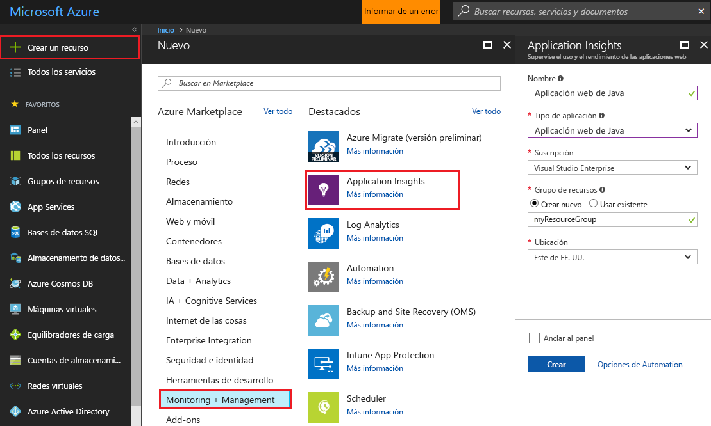
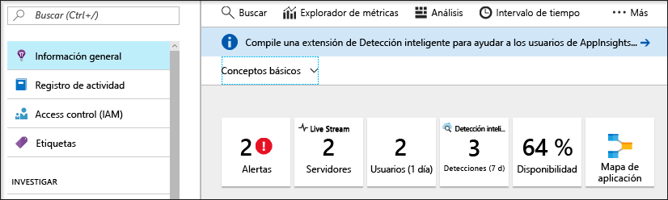
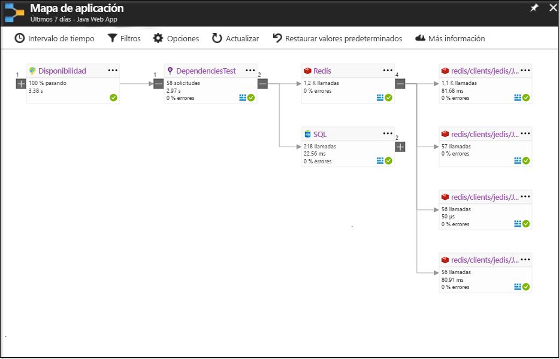
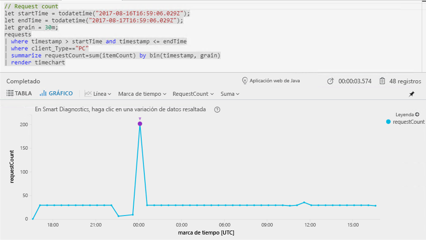
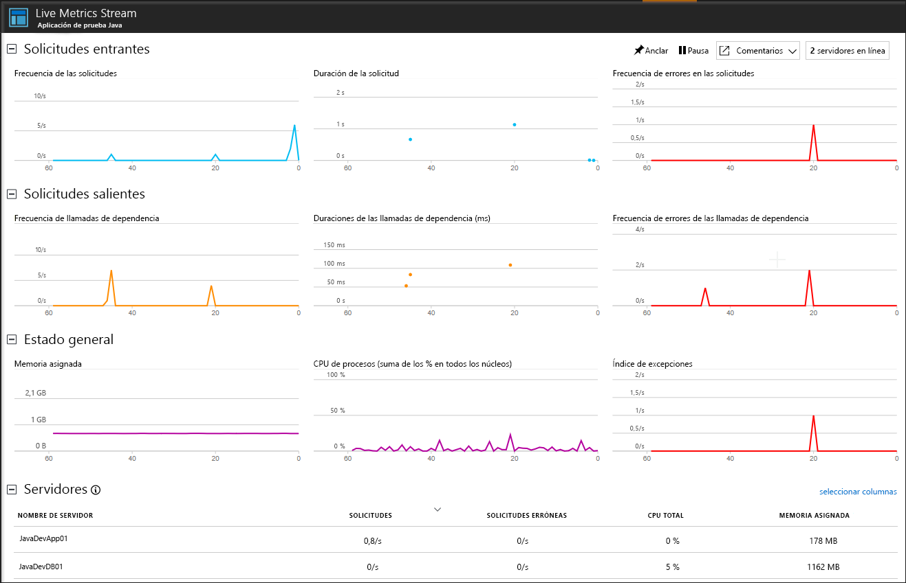

# <a name="start-monitoring-your-java-web-application"></a>Inicio de la supervisión de la aplicación web Java

Con Azure Application Insights puede supervisar fácilmente la disponibilidad, el rendimiento y el uso de su aplicación web. También puede identificar rápidamente y diagnosticar errores en la aplicación sin tener que esperar a que un usuario informe de ellos. Con el SDK para Java de Application Insights, puede supervisar los paquetes externos comunes, como MongoDB, MySQL y Redis.

Esta guía de inicio rápido le ayudará a agregar el SDK de Application Insights a un proyecto web dinámico Java existente.

## <a name="prerequisites"></a>Requisitos previos

Para completar esta guía de inicio rápido:

- Instale Oracle JRE 1.6 o posterior, o Zulu JRE 1.6 o posterior
- Instale el entorno gratuito [Eclipse IDE for Java EE Developers](http://www.eclipse.org/downloads/). Este guía de inicio rápido utiliza Eclipse Oxygen (4.7)
- Necesitará una suscripción de Azure y un proyecto web dinámico Java existente.
 
Si no tiene un proyecto web dinámico Java, puede crear uno con la [guía de inicio rápido de creación de una aplicación web Java](https://docs.microsoft.com/azure/app-service-web/app-service-web-get-started-java).

Si no tiene una suscripción a Azure, cree una cuenta [gratuita](https://azure.microsoft.com/free/) antes de empezar.

## <a name="log-in-to-the-azure-portal"></a>Iniciar sesión en Azure Portal

Inicie sesión en [Azure Portal](https://portal.azure.com/).

## <a name="enable-application-insights"></a>Habilitación de Application Insights

Application Insights recopila datos de telemetría desde cualquier aplicación conectada a Internet, independientemente de si se está ejecutando localmente o en la nube. Siga estos pasos para empezar a ver los datos.

1. Seleccione **Nuevo** > **Supervisión y administración** > **Application Insights**.

   

   Aparecerá un cuadro de configuración, use la tabla siguiente para rellenar los campos de entrada.

    | Settings        | Valor           | Descripción  |
   | ------------- |:-------------|:-----|
   | **Name**      | Nombre único global | Nombre que identifica la aplicación que se está supervisando |
   | **Tipo de aplicación** | Aplicación web Java | Tipo de aplicación que se está supervisando |
   | **Grupo de recursos**     | myResourceGroup      | Nombre para el nuevo grupo de recursos que hospedará los datos de Application Insights |
   | **Ubicación** | Este de EE. UU. | Elija una ubicación cerca de usted o de donde se hospeda la aplicación |

2. Haga clic en **Crear**.

## <a name="install-app-insights-plugin"></a>Instale el complemento de Application Insights

1. Inicie **Eclipse**, haga clic en **Ayuda** y seleccione **Install New Software** (Instalar nuevo software).

   

2. Copie ```http://dl.microsoft.com/eclipse``` en el campo "Trabajar con" > marque **Azure Toolkit for Java** (Kit de herramientas de Azure para Java) > seleccione **Application Insights Plugin for Java** (Complemento de Application Insights para Java) >  anule la selección de**"Contact all update sites during install to find required software"** (Contactar con todos los sitios de actualización durante la instalación para buscar el software necesario).

3. Una vez completada la instalación, se le pedirá que **reinicie Eclipse**.

## <a name="configure-app-insights-plugin"></a>Configuración del complemento de Application Insights

1. Inicie **Eclipse** > abra el **Proyecto** > haga clic en el nombre del proyecto en el **Explorador de proyectos** > seleccione **Azure** > haga clic en **Iniciar sesión**.

2. Seleccione el método de autenticación **Interactivo** > haga clic en **iniciar sesión** > cuando se le solicite, escriba las **credenciales de Azure** > seleccione la **suscripción de Azure** .

3. Haga clic con el botón derecho en el nombre del proyecto en el **Explorador de proyectos** > seleccione **Azure** > haga clic en **Configurar Application Insights**.

4. Marque **Enable telemetry with Application Insights** (Habilitar telemetría con Application Insights) > seleccione el recurso Application Insights y la **clave de instrumentación** que desee vincular a la aplicación Java.

   

> [!NOTE]
> El SDK de Application Insights para Java es capaz de capturar y visualizar las métricas en vivo, pero cuando se habilita la recopilación de telemetría por primera vez, los datos pueden tardar unos minutos en aparecer en el portal. Si se trata de una aplicación de prueba de poco tráfico, tenga en cuenta que la mayoría de las métricas se capturan solo cuando hay solicitudes u operaciones activas.

## <a name="start-monitoring-in-the-azure-portal"></a>Inicio de la supervisión en Azure Portal

1. Ahora puede volver a abrir la página **Introducción** de Application Insights en Azure Portal; para ello, de donde recuperó la clave de instrumentación, para ver los detalles de la aplicación en ejecución.

   

2. Haga clic en **Mapa de la aplicación** para un diseño visual de las relaciones de dependencia entre los componentes de la aplicación. Cada componente muestra KPI como la carga, el rendimiento, errores y alertas.

   

3. Haga clic en el icono **Análisis de aplicaciones** . Se abrirá **Application Insights Analytics**, que proporciona un lenguaje de consulta completo para analizar todos los datos recopilados por Application Insights. En este caso, se genera una consulta que representa el número de solicitudes en un gráfico. Puede escribir sus propias consultas para analizar otros datos.

   

4. Vuelva a la página **Introducción** y examine el **Escala de tiempo con información general de Estado**.  Este panel proporciona estadísticas sobre el estado de aplicación, incluido el número de solicitudes entrantes, la duración de las solicitudes y los errores que se producen.

   

   Para habilitar el gráfico **Tiempo de carga de la vista de página** que se rellenará con los datos de **Telemetría del lado cliente**, agregue este script para cada página de las que desee realizar el seguimiento:

   ```HTML
   <!-- 
   To collect end-user usage analytics about your application, 
   insert the following script into each page you want to track.
   Place this code immediately before the closing </head> tag,
   and before any other scripts. Your first data will appear 
   automatically in just a few seconds.
   -->
   <script type="text/javascript">
     var appInsights=window.appInsights||function(config){
     function i(config){t[config]=function(){var i=arguments;t.queue.push(function(){t[config].apply(t,i)})}}var t={config:config},u=document,e=window,o="script",s="AuthenticatedUserContext",h="start",c="stop",l="Track",a=l+"Event",v=l+"Page",y=u.createElement(o),r,f;y.src=config.url||"https://az416426.vo.msecnd.net/scripts/a/ai.0.js";u.getElementsByTagName(o)[0].parentNode.appendChild(y);try{t.cookie=u.cookie}catch(p){}for(t.queue=[],t.version="1.0",r=["Event","Exception","Metric","PageView","Trace","Dependency"];r.length;)i("track"+r.pop());return i("set"+s),i("clear"+s),i(h+a),i(c+a),i(h+v),i(c+v),i("flush"),config.disableExceptionTracking||(r="onerror",i("_"+r),f=e[r],e[r]=function(config,i,u,e,o){var s=f&&f(config,i,u,e,o);return s!==!0&&t["_"+r](config,i,u,e,o),s}),t
    }({
        instrumentationKey:"<instrumentation key>"
    });

    window.appInsights=appInsights;
    appInsights.trackPageView();
   </script>
    ```

5. Haga clic en **Live Stream**. Aquí encontrará las métricas en vivo relativas al rendimiento de la aplicación web Java. **Live Metrics Stream** incluye datos sobre el número de solicitudes entrantes, la duración de estas y los errores que se producen. También puede supervisar las métricas de rendimiento crítico, como el procesador y la memoria en tiempo real.

   

Para más información sobre la supervisión de Java, visite la [documentación adicional de Java con Application Insights](.\app-insights-java-get-started.md).

## <a name="clean-up-resources"></a>Limpieza de recursos

Si tiene previsto seguir trabajando con las siguientes guías de inicio rápido o tutoriales, no elimine los recursos creados en esta guía de inicio rápido. Si no tiene previsto continuar, siga estos pasos para eliminar todos los recursos creados por esta guía de inicio rápido en Azure Portal.

1. En el menú izquierdo de Azure Portal, haga clic en **Grupos de recursos** y en **myResourceGroup**.
2. En la página del grupo de recursos, haga clic en **Eliminar**, escriba **myResourceGroup** en el cuadro de texto y haga clic en **Eliminar**.

## <a name="next-steps"></a>Pasos siguientes

> [!div class="nextstepaction"]
> [Búsqueda y diagnóstico de problemas de rendimiento](https://docs.microsoft.com/azure/application-insights/app-insights-analytics)