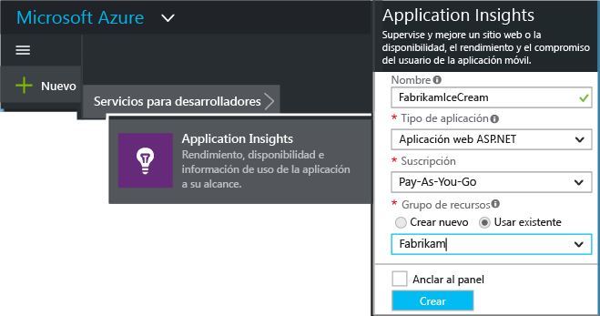
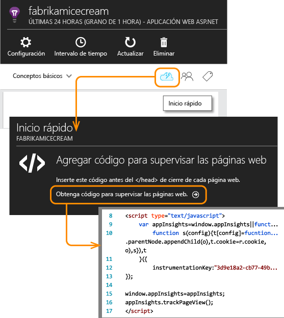
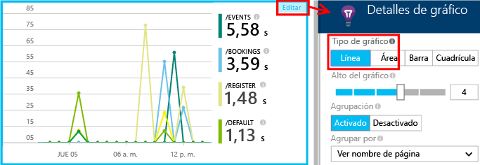
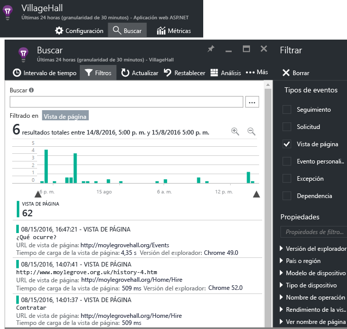

# Application Insights para páginas web
Obtenga información sobre el rendimiento y la utilización de su página web o aplicación. Si agrega [Application Insights](app-insights-overview.md) al script de la página, obtendrá los intervalos de carga de la página y de las llamadas AJAX, recuentos y detalles sobre las excepciones del explorador y los errores de AJAX, así como usuarios y recuentos de sesiones. Todos estos datos se pueden segmentar por página, sistema operativo del cliente y versión del explorador, geolocalización y otras dimensiones. Puede establecer alertas sobre recuentos de errores o sobre cargas de página lentas. Y mediante la inserción de llamadas de seguimiento en el código de JavaScript, puede controlar cómo se utilizan las distintas características de la aplicación de la página web.

Puede utilizar Application Insights con cualquier página web, solo tiene que agregar un pequeño fragmento de JavaScript. Si su servicio web es [Java](app-insights-java-get-started.md) o [ASP.NET](app-insights-asp-net.md), puede integrar datos de telemetría desde el servidor y los clientes.

Necesita una suscripción a [Microsoft Azure](https://azure.com). Si su equipo tiene una suscripción organizativa, pida al propietario que le agregue su cuenta de Microsoft. El desarrollo y la utilización a pequeña escala no implica ningún costo.

## Configuración de Application Insights para su página Web
Agregue el fragmento de código del cargador a las páginas web, como se indica a continuación.

### Apertura o creación de recurso en Application Insights
El recurso de Application Insights es donde se muestran los datos sobre el rendimiento y el uso de la página. 

Inicie sesión en [Azure Portal](https://portal.azure.com).

Si ya ha configurado la supervisión del lado del servidor de su aplicación, ya tiene un recurso:

Si no tiene uno, créelo:

*¿Tiene ya alguna pregunta?* [Creación de recursos en Application Insights](app-insights-create-new-resource.md).

### Agregar el script de SDK a la aplicación o la página web
En Inicio rápido, obtenga el script para páginas web:

Inserte el script justo antes de la etiqueta `</head>` de cada página que desea seguir. Si su sitio web tiene una página maestra, puede colocar el script allí. Por ejemplo:

* En un proyecto de ASP.NET MVC, lo colocaría en `View\Shared\_Layout.cshtml`
* En un sitio de SharePoint, en el panel de control, abra [Configuración del sitio/Página maestra](app-insights-sharepoint.md).

El script contiene la clave de instrumentación que dirige los datos al recurso de Application Insights. 

([Una explicación más profunda del script](http://apmtips.com/blog/2015/03/18/javascript-snippet-explained/))

*(Si está usando un marco de página web conocido, mire a ver si encuentra adaptadores de Application Insights). Por ejemplo, hay [un módulo AngularJS](http://ngmodules.org/modules/angular-appinsights).)*

## Configuración detallada
Hay varios [parámetros](https://github.com/Microsoft/ApplicationInsights-JS/blob/master/API-reference.md#config) que puede establecer, aunque en la mayoría de los casos, no es necesario. Por ejemplo, puede deshabilitar o limitar el número de llamadas Ajax notificadas por vista de página (para reducir el tráfico). O bien, puede establecer el modo de depuración para que los datos de telemetría se muevan rápidamente a través de la canalización sin que se procese por lotes.

Para establecer estos parámetros, busque esta línea en el fragmento de código y agregue más elementos delimitados por comas a continuación:

    })({
      instrumentationKey: "..."
      // Insert here
    });

Entre los [parámetros disponibles](https://github.com/Microsoft/ApplicationInsights-JS/blob/master/API-reference.md#config) se incluyen:

    // Send telemetry immediately without batching.
    // Remember to remove this when no longer required, as it
    // can affect browser performance.
    enableDebug: boolean,

    // Don't log browser exceptions.
    disableExceptionTracking: boolean,

    // Don't log ajax calls.
    disableAjaxTracking: boolean,

    // Limit number of Ajax calls logged, to reduce traffic.
    maxAjaxCallsPerView: 10, // default is 500

    // Time page load up to execution of first trackPageView().
    overridePageViewDuration: boolean,

    // Set these dynamically for an authenticated user.
    appUserId: string,
    accountId: string,

## Ejecución de la aplicación
Ejecute la aplicación web, úsela un rato para generar datos de telemetría y espere unos segundos. Puede ejecutarla con la tecla **F5** en la máquina de desarrollo, o publicarla y dejar que los usuarios jueguen con ella.

Si quiere comprobar la telemetría que envía una aplicación web a Application Insights, use las herramientas de depuración del explorador (**F12** en muchos exploradores). Los datos se envían a dc.services.visualstudio.com.

## Exploración de los datos de rendimiento del explorador
Abra la hoja del Explorador para mostrar los datos de rendimiento agregados de los exploradores de los usuarios.

*¿Aún no hay datos? Haga clic en **Actualizar** en la parte superior de la página. ¿Todavía nada? Consulte [Solución de problemas](app-insights-troubleshoot-faq.md).*

La hoja Explorador es una [hoja del Explorador de métricas](app-insights-metrics-explorer.md) con filtros y selecciones de gráfico preestablecidos. Si lo desea, puede editar el intervalo de tiempo, los filtros y la configuración de los gráficos y guardar el resultado como favorito. Haga clic en **Restaurar valores predeterminados** para volver a la configuración original de la hoja.

## Rendimiento de carga de la página
En la parte superior hay un gráfico segmentado de tiempos de carga de la página. La altura total del gráfico representa el tiempo promedio para cargar y mostrar las páginas desde la aplicación en los exploradores de los usuarios. El tiempo se mide desde el momento en que el explorador envía la solicitud HTTP inicial hasta que todos los eventos de la carga sincrónica se han procesado, incluido el diseño y la ejecución de scripts. No incluye las tareas asincrónicas, como la carga de elementos web de las llamadas AJAX.

El gráfico divide el tiempo total de carga de las páginas en los [intervalos estándar definidos por W3C](http://www.w3.org/TR/navigation-timing/#processing-model). 

Tenga en cuenta que el tiempo de *conexión de red* suele ser menor de lo esperable, ya que es una media de todas las solicitudes del explorador al servidor. Muchas de las solicitudes individuales tienen un tiempo de conexión de 0 porque ya hay una conexión activa con el servidor.

### ¿La carga es lenta?
Una carga de página lenta es una importante fuente de insatisfacción para los usuarios. Si el gráfico indica una carga de página lenta, es fácil realizar una investigación de diagnóstico.

El gráfico muestra el promedio de todas las cargas de páginas en la aplicación. Para ver si el problema se limita a páginas concretas, consulte más abajo en la hoja, donde hay una cuadrícula dividida por dirección URL de la página:

Observe que el recuento de vistas de página y la desviación estándar. Si el número de páginas es muy bajo, el problema no afecta mucho a los usuarios. Una desviación estándar alta (en comparación con el mismo promedio) indica mucha variación entre las mediciones individuales.

**Amplíe la información de una dirección URL y una vista de página.** Haga clic en cualquier nombre de página para ver una hoja de gráficos de explorador filtrada solo para esa dirección URL y, a continuación, en una instancia de una vista de página.

Haga clic en `...` para obtener una lista completa de las propiedades del evento, o bien inspeccione las llamadas Ajax y los eventos relacionados. Las llamadas Ajax lentas afectan al tiempo total de carga de la página si son sincrónicas. Entre los eventos relacionados se incluyen las solicitudes del servidor para la misma dirección URL (si ha configurado Application Insights en el servidor web).

**Evolución del rendimiento de la página en el tiempo.** De nuevo en la hoja de exploradores, cambie la cuadrícula de tiempo de carga de la vista de página en un gráfico de líneas para ver si hay picos en momentos concretos:

**Segmentación mediante otras dimensiones.** ¿Puede que las páginas sean más lentas a la hora de cargarse en un determinado explorador, sistema operativo del cliente o ubicación del usuario? Agregue un nuevo gráfico y experimente con la dimensión **Group-by** (Agrupar por).

## Rendimiento AJAX
Asegúrese de que las llamadas AJAX en sus páginas web funcionan correctamente. A menudo se utilizan para rellenar los elementos de la página de manera asincrónica. Aunque los elementos principales de la página se carguen rápidamente, los usuarios se frustran al ver elementos web en blanco, esperando hasta que los datos aparezcan.

Las llamadas AJAX realizadas desde la página web aparecen en la hoja de exploradores como dependencias.

Hay gráficos de resumen en la parte superior de la hoja:

y cuadrículas detalladas más abajo:

Haga clic en cualquier fila para obtener detalles concretos.

> [!NOTE]
> Si elimina el filtro Exploradores de la hoja, tanto el servidor como las dependencias AJAX se incluirán en estos gráficos. Haga clic en Restaurar valores predeterminados para volver a configurar el filtro.
> 
> 

**Para profundizar en las llamadas Ajax con errores** , desplácese hacia abajo hasta la cuadrícula de errores de Dependencia y haga clic en cualquiera de las filas para ver las instancias concretas.

Haga clic en `...` para obtener la telemetría completa de una llamada Ajax.

### ¿No se han notificado llamadas Ajax?
Las llamadas Ajax incluyen todas las llamadas HTTP/HTTPS realizadas desde el script de una página web. Si no se han notificado, compruebe que el fragmento de código no establece los [parámetros](https://github.com/Microsoft/ApplicationInsights-JS/blob/master/API-reference.md#config) `disableAjaxTracking` o `maxAjaxCallsPerView`.

## Excepciones de explorador
En la hoja de exploradores, hay un gráfico de resumen de excepciones y una cuadrícula de tipos de excepción más abajo en la hoja.

Si no ve que se hayan notificado las excepciones del explorador, compruebe que el fragmento de código no establezca el [parámetro](https://github.com/Microsoft/ApplicationInsights-JS/blob/master/API-reference.md#config) `disableExceptionTracking`.

## Inspección de eventos de vista de página individuales

Por lo general, Application Insights analiza la telemetría de vista de página y usted solo verá informes acumulativos, cuya media se ha calculado en función de todos los usuarios. Pero a efectos de depuración, también puede ver eventos de vista de página individuales.

En la hoja Búsqueda de diagnóstico, establezca Filtros en Vista de página.

Seleccione el evento que desea ver con mayor detalle. En la página de detalles, haga clic en "..." para ver aún más detalles.

> [!NOTE]
> Si usa [Buscar](app-insights-diagnostic-search.md), tenga en cuenta que tiene que hacer coincidir palabras completas: "Acerc" y "cerca de" no coinciden con "Acerca de".
> 
> 

También puede usar el potente [lenguaje de consulta de Log Analytics](https://docs.microsoft.com/azure/application-insights/app-insights-analytics-tour#browser-timings-table) para buscar vistas de página.

### Propiedades de la vista de página
* **Duración de vista de página** 
  
  * De forma predeterminada, el tiempo necesario para cargar la página, desde la solicitud del cliente hasta la carga completa (incluidos los archivos auxiliares, aunque no las tareas asincrónicas, como las llamadas de Ajax). 
  * Si establece `overridePageViewDuration` en la [configuración de la página](#detailed-configuration), el intervalo entre la solicitud del cliente y la ejecución del primer `trackPageView`. Si mueve trackPageView desde su posición habitual después de la inicialización del script, reflejará un valor diferente.
  * Si se ha establecido `overridePageViewDuration` y se proporciona un argumento de duración en la llamada a `trackPageView()`, se usará el valor del argumento. 

## Recuentos de página personalizados
De forma predeterminada, se realiza un recuento de página cada vez que se carga una página nueva en el explorador del cliente.  Sin embargo, tal vez quiera realizar un recuento de otras vistas de página. Por ejemplo, una página puede mostrar su contenido en pestañas y a usted puede interesarle realizar el recuento de una página cuando el usuario cambia de pestaña. O el código JavaScript de la página puede cargar contenido nuevo sin cambiar la URL del explorador.

Inserte una llamada de JavaScript como esta en el lugar adecuado del código de cliente:

    appInsights.trackPageView(myPageName);

El nombre de la página puede contener los mismos caracteres que una dirección URL, aunque se ignorará todo aquello que haya después de "#" o "?".

## Seguimiento de uso
¿Desea averiguar qué hacen los usuarios con su aplicación?

* [Obtenga información sobre el seguimiento de uso](app-insights-web-track-usage.md)
* [Más información sobre las API para eventos y métricas personalizados](app-insights-api-custom-events-metrics.md).

##  Vídeo

> [!VIDEO https://channel9.msdn.com/events/Connect/2016/100/player]

##  Pasos siguientes
* [Seguir el uso](app-insights-web-track-usage.md)
* [Eventos y métricas personalizados](app-insights-api-custom-events-metrics.md)
* [Compilación - Métrica - Aprendizaje](app-insights-web-track-usage.md)

