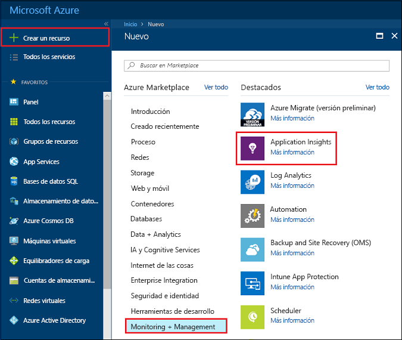
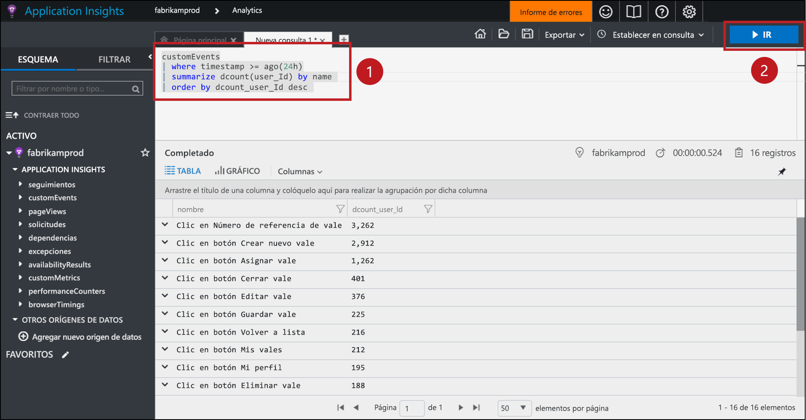
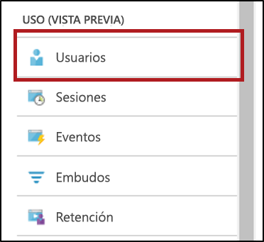
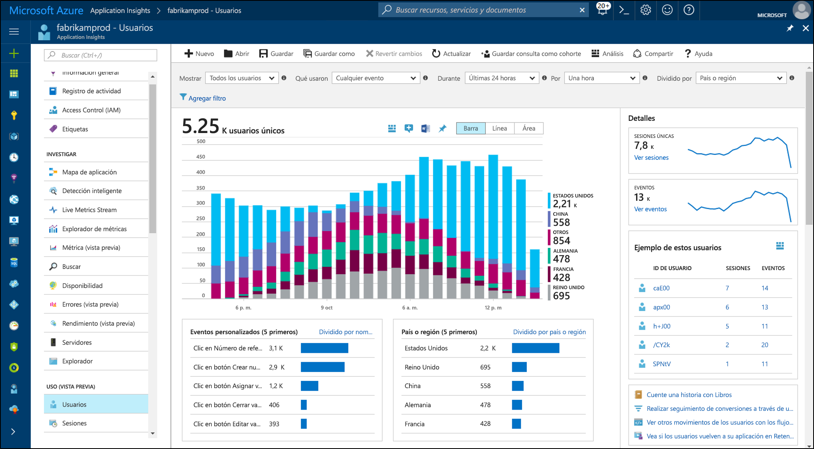
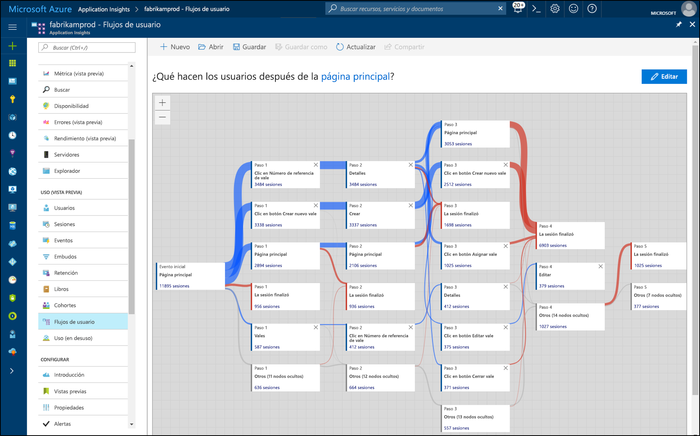

# <a name="start-analyzing-your-mobile-app-with-mobile-center-and-application-insights"></a>Análisis de aplicaciones móviles con Mobile Center y Application Insights

En este inicio rápido se explica cómo conectar la instancia de Mobile Center de la aplicación a Application Insights. Con Application Insights, puede consultar, segmentar, filtrar y analizar la telemetría con herramientas más eficaces que las que están disponibles en el servicio [Analytics](https://docs.microsoft.com/mobile-center/analytics/) de Mobile Center.

## <a name="prerequisites"></a>Requisitos previos

Para completar este inicio rápido necesita instalar:

- Una suscripción de Azure.
- Una aplicación iOS, Android, Xamarin, Universal Windows o React Native.
 
Si no tiene una suscripción a Azure, cree una cuenta [gratuita](https://azure.microsoft.com/free/) antes de empezar.

## <a name="onboard-to-mobile-center"></a>Incorporación a Mobile Center

Antes de poder usar Application Insights con su aplicación móvil, debe integrar la aplicación en [Mobile Center](https://docs.microsoft.com/mobile-center/). Application Insights no recibe datos de telemetría de su aplicación móvil directamente. En su lugar, la aplicación envía telemetría de eventos personalizados a Mobile Center. A continuación, Mobile Center exporta continuamente copias de estos eventos personalizados a Application Insights a medida que se reciben tales eventos.

Para incorporar la aplicación, siga el inicio rápido de Mobile Center para cada plataforma que su aplicación admite. Cree instancias de Mobile Center independientes para cada plataforma:

* [iOS](https://docs.microsoft.com/mobile-center/sdk/getting-started/ios).
* [Android](https://docs.microsoft.com/mobile-center/sdk/getting-started/android).
* [Xamarin](https://docs.microsoft.com/mobile-center/sdk/getting-started/xamarin).
* [Universal Windows](https://docs.microsoft.com/mobile-center/sdk/getting-started/uwp).
* [React Native](https://docs.microsoft.com/mobile-center/sdk/getting-started/react-native).

## <a name="track-events-in-your-app"></a>Seguimiento de eventos en la aplicación

Una vez que la aplicación esté incorporada a Mobile Center, se debe modificar para que envíe telemetría de eventos personalizados con el SDK de Mobile Center. Los eventos personalizados son el único tipo de telemetría de Mobile Center que se exporta a Application Insights.

Para enviar eventos personalizados desde las aplicaciones iOS, utilice los métodos `trackEvent` o `trackEvent:withProperties` en el SDK de Mobile Center. [Más información sobre el seguimiento de eventos de las aplicaciones iOS.](https://docs.microsoft.com/mobile-center/sdk/analytics/ios)

```Swift
MSAnalytics.trackEvent("Video clicked")
```

Para enviar eventos personalizados desde aplicaciones Android, use el método `trackEvent` en el SDK de Mobile Center. [Más información sobre el seguimiento de eventos de las aplicaciones Android.](https://docs.microsoft.com/mobile-center/sdk/analytics/android)

```Java
Analytics.trackEvent("Video clicked")
```

Para enviar eventos personalizados desde otras plataformas de aplicaciones, use los métodos `trackEvent` en los SDK de Mobile Center.

Para asegurarse de que se reciben los eventos personalizados, vaya a la pestaña **Eventos** de la sección **Analytics** de Mobile Center. Los eventos pueden tardar un par de minutos en aparecer desde que se enviaron desde la aplicación.

## <a name="create-an-application-insights-resource"></a>Creación de recursos en Application Insights

Una vez que la aplicación envía eventos personalizados y Mobile Center los recibe, debe crear un recurso de Application Insights para Mobile Center en Azure Portal:

1. Inicie sesión en [Azure Portal](https://portal.azure.com/).
2. Seleccione **Nuevo** > **Supervisión y administración** > **Application Insights**.

    

    Aparecerá un cuadro de configuración. Use la tabla siguiente para rellenar los campos de entrada.

    | Settings        |  Valor           | Descripción  |
   | ------------- |:-------------|:-----|
   | **Name**      | Algún valor único global, como "myApp-iOS" | Nombre que identifica la aplicación que se está supervisando |
   | **Tipo de aplicación** | Aplicación de Mobile Center | Tipo de aplicación que se está supervisando |
   | **Grupo de recursos**     | Un grupo de recursos nuevo o uno existente desde el menú | El grupo de recursos en que se va a crear el recurso de Application Insights |
   | **Ubicación** | Una ubicación en el menú | Elija una ubicación cerca de usted o de donde se hospeda la aplicación |

3. Haga clic en **Crear**.

Si la aplicación admite varias plataformas (iOS, Android, etc.), es mejor crear recursos de Application Insights independientes, uno para cada plataforma.

## <a name="export-to-application-insights"></a>Exportación a Application Insights

En el nuevo recurso de Application Insights, en la página **Información general** de la sección **Información esencial** de la parte superior, copie la clave de instrumentación de este recurso.

En la instancia de Mobile Center de la aplicación:

1. En la página **Configuración**, haga clic en **Exportar**.
2. Elija **Nueva exportación**, seleccione **Application Insights** y después haga clic en **Personalizar**.
3. Pegue la clave de instrumentación de Application Insights en el cuadro.
4. Dé su consentimiento para aumentar el uso de la suscripción de Azure que contiene el recurso de Application Insights. El primer GB de datos recibidos al mes de cada recurso de Application Insights es gratis. [Más información sobre los precios de Application Insights](https://azure.microsoft.com/pricing/details/application-insights/)

Recuerde que debe repetir este proceso para cada plataforma que su aplicación admita.

Una vez configurada la [exportación](https://docs.microsoft.com/mobile-center/analytics/export), cada evento personalizado que Mobile Center recibe se copia en Application Insights. Los eventos pueden tardar varios minutos en llegar a Application Insights, así que, si no aparecen inmediatamente, espere un poco antes de realizar otro diagnóstico.

Para proporcionarle más datos la primera vez que se conecta, las últimas 48 horas de eventos personalizados de Mobile Center se exportan automáticamente a Application Insights.

## <a name="start-monitoring-your-app"></a>Inicio de la supervisión de la aplicación

Application Insights puede consultar, segmentar, filtrar y analizar la telemetría de los eventos personalizados desde las aplicaciones de forma más exhaustiva que las herramientas de análisis que Mobile Center ofrece.

1. **Consulte la telemetría de eventos personalizados.** En la página de **información general** de Application Insights, seleccione **Analytics**. 

   

   Se abre el portal de Analytics de Application Insights asociado con el recurso de Application Insights. El portal de Analytics permite consultar directamente los datos mediante el lenguaje de consulta de Log Analytics, por lo que puede hacer preguntas arbitrariamente complejas sobre la aplicación y sus usuarios.
   
   Abra una pestaña nueva en el portal de Analytics y después pegue la siguiente consulta. Devuelve un recuento de cuántos usuarios distintos han enviado cada evento personalizado desde la aplicación en las últimas 24 horas, ordenados por estos recuentos distintivos.

   ```AIQL
   customEvents
   | where timestamp >= ago(24h)
   | summarize dcount(user_Id) by name 
   | order by dcount_user_Id desc 
   ```

   

   1. Seleccione la consulta haciendo clic en cualquier parte de la consulta en el editor de texto.
   2. Después haga clic en **Ir** para ejecutar la consulta. 

   Obtenga más información sobre [Analytics en Application Insights](app-insights-analytics.md) y el [lenguaje de consulta de Log Analytics](https://docs.loganalytics.io/docs/Language-Reference).


2. **Segmente y filtre la telemetría de eventos personalizados.** En la página de **información general** de Application Insights, seleccione **Usuarios** en la tabla de contenido.

   

   La herramienta Usuarios muestra cuántos usuarios de la aplicación hicieron clic en determinados botones, visitaron determinadas pantallas o realizaron cualquier otra acción de la que se realiza un seguimiento como evento con el SDK de Mobile Center. Si busca una forma de segmentar y filtrar los eventos de Mobile Center, la herramienta Usuarios es una excelente opción.

    

   Por ejemplo, segmente el uso por zona geográfica; para ello, elija **País o región** en el menú desplegable **Dividido por**.

3. **Analice los patrones de conversión, retención y navegación de la aplicación.** En la página de **información general** de Application Insights, seleccione **Flujos de usuario** en la tabla de contenido.

   

   En la herramienta Flujos de usuario se visualizan los eventos que los usuarios envían después de algún evento inicial. Es útil para obtener una visión general de cómo los usuarios navegan por la aplicación. También puede indicar los lugares que muchos usuarios recorren desde la aplicación o repiten las mismas acciones una y otra vez.

   Además de Flujos de usuario, Application Insights dispone de otras herramientas de análisis de uso para responder a preguntas específicas:

   * **Embudos** para analizar y supervisar las tasas de conversión.
   * **Retención** para analizar el grado en que la aplicación retiene a los usuarios con el paso del tiempo.
   * **Workbooks** para combinar visualizaciones y texto en un informe que se pueda compartir.
   * **Cohortes** para nombrar y guardar grupos de usuarios o eventos específicos, para poder hacer referencia a ellos fácilmente desde otras herramientas de análisis.

## <a name="clean-up-resources"></a>Limpieza de recursos

Si no desea continuar utilizando Application Insights con Mobile Center, desactive la exportación en Mobile Center y elimine el recurso de Application Insights. Esto evitará que se le cobren cargos adicionales por Application Insights para este recurso.

Para desactivar la exportación en Mobile Center:

1. En Mobile Center, vaya a **Configuración** y elija **Exportar**.
2. Haga clic en la exportación de Application Insights que desee eliminar y después haga clic en **Eliminar exportación** en la parte inferior y confirme.

Para eliminar el recurso de Application Insights:

1. En el menú izquierdo de Azure Portal, haga clic en **Grupos de recursos** y después elija el grupo de recursos en que se creó el recurso de Application Insights.
2. Abra el recurso de Application Insights que desea eliminar. Después haga clic en **Eliminar** en el menú superior del recurso y confirme. Se eliminará de forma permanente la copia de los datos exportados a Application Insights.

## <a name="next-steps"></a>Pasos siguientes

> [!div class="nextstepaction"]
> [Información sobre la forma en que los clientes usan la aplicación](app-insights-usage-overview.md)