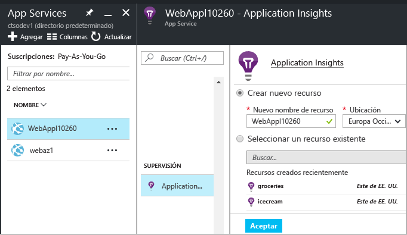
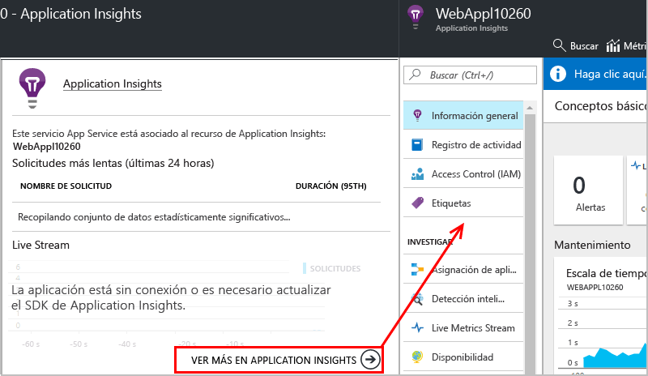
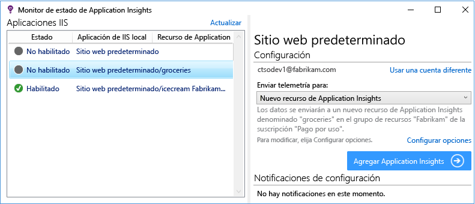

# Instrumentar aplicaciones web en tiempo de ejecución con Application Insights

Puede instrumentar una aplicación web activa con Azure Application Insights sin tener que modificar ni volver a implementar el código. Si las aplicaciones se hospedan en un servidor IIS local, instale el Monitor de estado. Si son aplicaciones web de Azure o se ejecutan en una máquina virtual de Azure, puede activar la supervisión de Application Insights en el panel de control de Azure. (También hay varios artículos sobre cómo configurar [aplicaciones web en directo de J2EE](app-insights-java-live.md) y [Azure Cloud Services](app-insights-cloudservices.md)). Necesita una suscripción a [Microsoft Azure](http://azure.com) .

Puede optar entre tres vías de aplicar Application Insights a sus aplicaciones web .NET:

* **Tiempo de compilación:** [agregue el SDK de Application Insights][greenbrown] al código de la aplicación web.
* **Tiempo de ejecución:** instrumenta la aplicación web en el servidor, como se describe a continuación, sin volver a generar e implementar el código.
* **Ambos:** compila el SDK en el código de aplicación web y aplica las extensiones del sistema en tiempo de ejecución. Obtenga lo mejor de ambas opciones.

A continuación hay un resumen de lo que se obtiene por cada vía:

|  | Tiempo de compilación | Tiempo de ejecución |
| --- | --- | --- |
| Solicitudes y excepciones |Sí |Sí |
| [Excepciones más detalladas](app-insights-asp-net-exceptions.md) | |Sí |
| [Diagnósticos de dependencia](app-insights-asp-net-dependencies.md) |En .NET 4.6 +, pero con menos detalle |Sí, detalles completos: códigos de resultado, texto de comandos SQL, verbo HTTP|
| [Contadores de rendimiento del sistema](app-insights-performance-counters.md) |Sí |Sí |
| [API para la telemetría personalizada][api] |Sí |No |
| [Integración del registro de seguimiento](app-insights-asp-net-trace-logs.md) |Sí |No |
| [Datos de usuario y página](app-insights-javascript.md) |Sí |No |
| Es necesario volver a compilar el código |Sí | No |

## Supervisión de una aplicación web de Azure activa

Si la aplicación se ejecuta como un servicio web de Azure, aquí se muestra cómo cambiar de supervisión:

* En el panel de control de la aplicación en Azure, seleccione Application Insights.

    
* Cuando se abre la página de resumen de Application Insights, haga clic en el vínculo situado en la parte inferior para abrir el recurso completo de Application Insights.

    

[Supervisión de aplicaciones de nube y VM](app-insights-azure.md).

### Habilitar la supervisión de cliente en Azure

Si ha habilitado Application Insights en Azure, puede agregar la vista de página y la telemetría de usuario.

1. Seleccione Configuración > Configuración de la aplicación.
2.  En Configuración de la aplicación, agregue un nuevo par clave-valor: 
   
    Clave: `APPINSIGHTS_JAVASCRIPT_ENABLED` 
    
    Valor: `true`
3. **Guarde** la configuración y **reinicie** la aplicación.

El SDK de JavaScript de Application Insights ahora se inserta en cada página web.

## Supervisión de una aplicación web de IIS activa

Si la aplicación se hospeda en un servidor IIS, habilite Application Insights con el Monitor de estado.

1. En el servidor web IIS, inicie sesión con las credenciales de administrador.
2. Si el Monitor de estado de Application Insights no está instalado aún, descargue y ejecute el [instalador del Monitor de estado](http://go.microsoft.com/fwlink/?LinkId=506648) (o ejecute [Web Platform Installer](https://www.microsoft.com/web/downloads/platform.aspx) y busque en él el Monitor de estado de Application Insights).
3. En el Monitor de estado, seleccione la aplicación web instalada o el sitio web que desea supervisar. Inicie sesión con sus credenciales de Azure.

    Configure el recurso donde desee ver los resultados en el portal de Application Insights. (Normalmente, es mejor crear un nuevo recurso. Seleccione un recurso existente si ya tiene [pruebas web][availability] o la [supervisión de cliente][client] para esta aplicación). 

    

4. Reinicie IIS.

    

    El servicio web se interrumpe durante un breve período.

## Personalización de las opciones de supervisión

Si se habilita Application Insights, se agregan archivos DLL y ApplicationInsights.config a la aplicación web. También puede [editar el archivo .config](app-insights-configuration-with-applicationinsights-config.md) para cambiar algunas de las opciones.

## Al volver a publicar la aplicación, vuelva a habilitar Application Insights

Antes de volver a publicar la aplicación, considere la posibilidad de [agregar Application Insights al código de Visual Studio][greenbrown]. Obtendrá una telemetría más detallada y la capacidad para escribir telemetría personalizada.

Si desea volver a publicar sin agregar Application Insights al código, tenga en cuenta que el proceso de implementación puede eliminar los archivos DLL y ApplicationInsights.config desde el sitio web publicado. Por lo tanto:

1. Si edita el archivo ApplicationInsights.config, realice una copia del mismo antes de volver a publicar la aplicación.
2. Vuelva a publicar la aplicación.
3. Vuelva a habilitar la supervisión de Application Insights. (Use el método adecuado: ya sea el panel de control de la aplicación web de Azure o el Monitor de estado en un host IIS).
4. Restablezca las modificaciones realizadas en el archivo .config.

## Solución de problemas de configuración en tiempo de ejecución de Application Insights

### ¿No se puede conectar? ¿No hay telemetría?

* Abra los [puertos de salida necesarios](app-insights-ip-addresses.md#outgoing-ports) en el firewall del servidor para que el Monitor de estado funcione.

* Abrir el Monitor de estado y seleccione la aplicación en el panel izquierdo. Compruebe si hay algún mensaje de diagnóstico para esta aplicación en la sección "Notificaciones de configuración":

  
* En el servidor, si ve en un mensaje acerca de "permisos insuficientes", intente lo siguiente:
  * En el Administrador de IIS, seleccione el grupo de aplicaciones, abra **Configuración avanzada** y en **Modelo de proceso**, anote la identidad.
  * En el panel de control de administración del equipo, agregue esta identidad al grupo Usuarios del monitor de sistema.
* Si tiene instalado MMA/SCOM (Systems Center Operation Manager) en el servidor, algunas versiones pueden entrar en conflicto. Desinstale SCOM y el Monitor de estado y vuelva a instalar las versiones más recientes.
* Consulte [Solución de problemas][qna].

## Requisitos del sistema
Compatibilidad de sistema operativo para el Monitor de estado de Application Insights en servidor:

* Windows Server 2008
* Windows Server 2008 R2
* Windows Server 2012
* Windows Server 2012 R2
* Windows Server 2016

con el último Service Pack y .NET Framework 4.5

En el lado de cliente: Windows 7, 8, 8.1 y 10, de nuevo con .NET Framework 4.5

La compatibilidad de IIS es: IIS 7, 7.5, 8 y 8.5 (se requiere IIS)

## Automatización con PowerShell
Puede iniciar y detener la supervisión mediante PowerShell en el servidor IIS.

En primer lugar, importe el módulo de Application Insights:

`Import-Module 'C:\Program Files\Microsoft Application Insights\Status Monitor\PowerShell\Microsoft.Diagnostics.Agent.StatusMonitor.PowerShell.dll'`

Encuentre las aplicaciones en supervisión:

`Get-ApplicationInsightsMonitoringStatus [-Name appName]`

* `-Name` (Opcional) Nombre de una aplicación web.
* Muestra el estado de supervisión de Application Insights para cada aplicación web (u otra aplicación con nombre) en este servidor IIS.
* Devuelve `ApplicationInsightsApplication` para cada aplicación:

  * `SdkState==EnabledAfterDeployment`: la aplicación se está supervisando y se ha instrumentado en tiempo de ejecución, ya sea con la herramienta Monitor de estado o con `Start-ApplicationInsightsMonitoring`.
  * `SdkState==Disabled`: la aplicación no se ha instrumentado para Application Insights. Nunca se ha instrumentado, o bien se deshabilitó la supervisión en tiempo de ejecución con la herramienta Monitor de estado o con `Stop-ApplicationInsightsMonitoring`.
  * `SdkState==EnabledByCodeInstrumentation`: se ha instrumentado la aplicación agregando el SDK al código fuente. El SDK no se puede actualizar ni detener.
  * `SdkVersion` muestra la versión en uso para la supervisión de esta aplicación.
  * `LatestAvailableSdkVersion`muestra la versión disponible en la galería de NuGet. Para actualizar la aplicación a esta versión, use `Update-ApplicationInsightsMonitoring`.

`Start-ApplicationInsightsMonitoring -Name appName -InstrumentationKey 00000000-000-000-000-0000000`

* `-Name` El nombre de la aplicación en IIS
* `-InstrumentationKey` El valor ikey del recurso de Application Insights donde quiere que se muestren los resultados.
* Este cmdlet solo afecta a las aplicaciones que no se han instrumentado, es decir, aquellas cuyo SdkState == NotInstrumented.

    El cmdlet no afecta a una aplicación que ya se ha instrumentado. No importa que se instrumentara en tiempo de compilación mediante la adición del SDK al código, o en tiempo de ejecución mediante un uso anterior de este cmdlet.

    La versión del SDK utilizada para instrumentar la aplicación es la versión que se ha descargado más recientemente en este servidor.

    Para descargar la versión más reciente, use Update-ApplicationInsightsVersion.
* Si se descarga correctamente, devuelve `ApplicationInsightsApplication` . Si se produce un error, inicia un seguimiento a stderr.

          Name                      : Default Web Site/WebApp1
          InstrumentationKey        : 00000000-0000-0000-0000-000000000000
          ProfilerState             : ApplicationInsights
          SdkState                  : EnabledAfterDeployment
          SdkVersion                : 1.2.1
          LatestAvailableSdkVersion : 1.2.3

`Stop-ApplicationInsightsMonitoring [-Name appName | -All]`

* `-Name` El nombre de una aplicación en IIS
* `-All` Detiene la supervisión de todas las aplicaciones en este servidor IIS con `SdkState==EnabledAfterDeployment`
* Detiene la supervisión de las aplicaciones especificadas y quita la instrumentación. Solo funciona para las aplicaciones que se han instrumentado en tiempo de ejecución con la herramienta Monitor de estado o Start-ApplicationInsightsApplication. (`SdkState==EnabledAfterDeployment`)
* Devuelve ApplicationInsightsApplication.

`Update-ApplicationInsightsMonitoring -Name appName [-InstrumentationKey "0000000-0000-000-000-0000"`]

* `-Name`: el nombre de la aplicación web en IIS.
* `-InstrumentationKey` (Opcional). Utilice esto para cambiar el recurso al que se envía la telemetría de la aplicación.
* Este cmdlet:
  * Permite actualizar la aplicación con nombre a la versión del SDK descargada más recientemente en este equipo. (Solo funciona si `SdkState==EnabledAfterDeployment`)
  * Si proporciona una clave de instrumentación, se vuelve a configurar la aplicación con nombre para enviar los datos de telemetría al recurso con esa clave. (Funciona si `SdkState != Disabled`)

`Update-ApplicationInsightsVersion`

* Permite descargar el SDK más reciente de Application Insights en el servidor.

## Preguntas acerca del Monitor de estado

### ¿Qué es el Monitor de estado?

Una aplicación de escritorio que se instala en el servidor web de IIS. Le ayuda a instrumentar y configurar aplicaciones web. 

### ¿Cuándo puedo usar el Monitor de estado?

* Para instrumentar cualquier aplicación web que se ejecute en el servidor IIS, incluso si ya se está en ejecución.
* Para habilitar la telemetría adicional para las aplicaciones web que se han [compilado con el SDK de Application Insights](app-insights-asp-net.md) en el momento de la compilación. 

### ¿Puedo cerrarlo después de ejecutarlo?

Sí. Una vez que se hayan instrumentado los sitios web seleccionados, puede cerrarlo.

No recopila telemetría por sí mismo. Simplemente configura las aplicaciones web y establece algunos permisos.

### ¿Qué hace el Monitor de estado?

Cuando selecciona una aplicación web para instrumentarla con el Monitor de estado:

* Descarga y coloca los ensamblados de Application Insights y el archivo .config en la carpeta de archivos binarios de la aplicación web.
* Modifica `web.config` para agregar el módulo de seguimiento HTTP de Application Insights.
* Habilita la generación de perfiles de CLR para recopilar llamadas de dependencia.

### ¿Tengo que actualizar el Monitor de estado siempre que actualice la aplicación?

No si reimplementa de forma incremental. 

Si selecciona la opción "eliminar archivos existentes" en el proceso de publicación, necesitará volver a ejecutar el Monitor de estado para configurar Application Insights.

### ¿Qué telemetría se recopila?

En el caso de las aplicaciones que instrumenta solo en tiempo de ejecución mediante el Monitor de estado:

* Solicitudes HTTP
* Llamadas a dependencias
* Excepciones
* Contadores de rendimiento

En el caso de las aplicaciones ya instrumentadas en el momento de la compilación:

 * Contadores de proceso.
 * Llamadas de dependencia (.NET 4.5); valores devueltos en las llamadas de dependencia (.NET 4.6).
 * Valores de seguimiento de la pila de excepción.

[Más información](http://apmtips.com/blog/2016/11/18/how-application-insights-status-monitor-not-monitors-dependencies/)

## Vídeo

> [!VIDEO https://channel9.msdn.com/events/Connect/2016/100/player]

## Pasos siguientes

Vea la telemetría:

* [Explore las métricas](app-insights-metrics-explorer.md) para supervisar el rendimiento y uso.
* [Busque eventos y registros][diagnostic] para diagnosticar problemas.
* [Análisis](app-insights-analytics.md) para más consultas avanzadas
* [Creación de paneles](app-insights-dashboards.md)

Agregue más telemetría:

* [Cree pruebas web][availability] para asegurarse de que el sitio permanece activo.
* [Agregue telemetría de cliente web][usage] para ver las excepciones de código de la página web y para que le permitan insertar llamadas de seguimiento.
* [Agregue el SDK de Application Insights al código][greenbrown] para que pueda insertar llamadas de seguimiento y registro.

<!--Link references-->

[api]: app-insights-api-custom-events-metrics.md
[availability]: app-insights-monitor-web-app-availability.md
[client]: app-insights-javascript.md
[diagnostic]: app-insights-diagnostic-search.md
[greenbrown]: app-insights-asp-net.md
[qna]: app-insights-troubleshoot-faq.md
[roles]: app-insights-resources-roles-access-control.md
[usage]: app-insights-javascript.md
