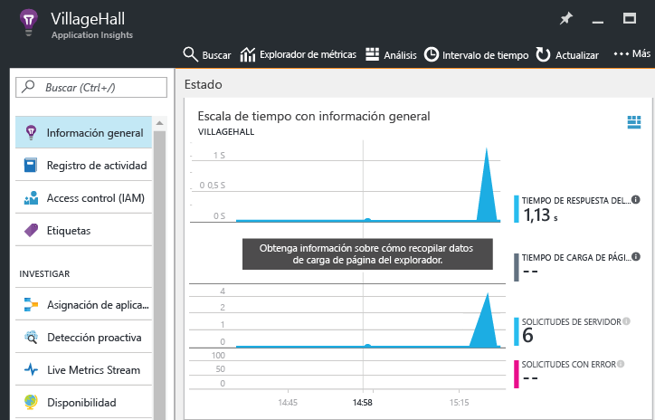

# <a name="monitor-your-nodejs-services-and-apps-with-application-insights"></a>Supervisión de servicios y aplicaciones de Node.js con Application Insights

[Azure Application Insights](app-insights-overview.md) supervisa los servicios back-end y componentes después de implementarlos para ayudarle a [detectar y diagnosticar rápidamente problemas de rendimiento, entre otros](app-insights-detect-triage-diagnose.md). Puede utilizar Application Insights para los servicios de Node.js que se hospedan en el centro de datos, en máquinas virtuales de Azure y aplicaciones web, e incluso en otras nubes públicas.

Para recibir, almacenar y explorar los datos de supervisión, incluya el SDK en su código y luego configure el recurso correspondiente de Application Insights en Azure. El SDK envía datos a ese recurso para realizar el análisis y la exploración posteriormente.

El SDK de Node.js puede supervisar automáticamente las solicitudes HTTP entrantes y salientes, excepciones y varias métricas del sistema. A partir de la versión 0.20, el SDK también puede supervisar algunos paquetes de terceros comunes, como MongoDB, MySQL y Redis. Todos los eventos relacionados con una solicitud HTTP entrante se correlacionan para una solución de problemas más rápida.

Puede usar TelemetryClient API para instrumentar y supervisar manualmente aspectos adicionales de la aplicación y el sistema. TelemetryClient API se describe con más detalle más adelante en este artículo.


## <a name="get-started"></a>Introducción

Realice las tareas siguientes para configurar la supervisión para una aplicación o servicio.

### <a name="prerequisites"></a>Requisitos previos

Antes de empezar, asegúrese de que tiene una suscripción de Azure o bien [obtenga una nueva de forma gratuita][azure-free-offer]. Si su organización ya tiene una suscripción de Azure, un administrador puede seguir [estas instrucciones][add-aad-user] y agregarle a ella.

[azure-free-offer]: https://azure.microsoft.com/free/
[add-aad-user]: https://docs.microsoft.com/azure/active-directory/active-directory-users-create-azure-portal


### <a name="resource"></a> Configuración de un recurso de Application Insights


1. Inicie sesión en [Azure Portal][portal].
2. Seleccione **Nueva** > **Herramientas de desarrollo** > **Application Insights**. El recurso incluye un punto de conexión para recibir los datos de telemetría, almacenamiento de estos datos, informes y paneles guardados, reglas y configuración de alertas y mucho más.

  

3. En la página de creación de recursos, en el cuadro **Tipo de aplicación**, seleccione **Aplicación Node.js**. El tipo de aplicación determina los paneles e informes predeterminados que se crean. (Cualquier recurso de Application Insights puede recopilar datos de cualquier lenguaje o plataforma).

  

### <a name="sdk"></a> Configuración del SDK de Node.js

Incluya el SDK en la aplicación para que pueda recopilar datos. 

1. Copie la clave de instrumentación del recurso (también conocido como *ikey*) desde Azure Portal. Application Insights usa el valor de ikey para asignar datos a los recursos de Azure. Para que el SDK pueda usar el valor de ikey, se debe especificar en una variable de entorno o en el código.  

  

2. Agregue la biblioteca del SDK de Node.js a las dependencias de la aplicación a través de package.json. En la carpeta raíz de la aplicación, ejecute:

  ```bash
  npm install applicationinsights --save
  ```

3. Cargue explícitamente la biblioteca en el código. Dado que el SDK inserta la instrumentación en muchas otras bibliotecas, cargue la biblioteca tan pronto como sea posible, incluso antes que otras instrucciones `require`. 

  En la parte superior del primer archivo .js, agregue el código siguiente. El método `setup` configura el valor de ikey (y, por tanto, el recurso de Azure) que se usará de forma predeterminada para todos los elementos seguidos.

  ```javascript
  const appInsights = require("applicationinsights");
  appInsights.setup("<instrumentation_key>");
  appInsights.start();
  ```
   
  También puede proporcionar un valor de ikey mediante la variable de entorno APPINSIGHTS\_INSTRUMENTATIONKEY, en lugar de pasarlo manualmente a `setup()` o `new appInsights.TelemetryClient()`. Esta práctica permite conservar los valores de ikey fuera del código fuente confirmado y también para especificar distintos valores de ikey para los diferentes entornos.

  Para conocer opciones de configuración adicionales, consulte las secciones siguientes.

  Puede probar el SDK sin enviar telemetría estableciendo `appInsights.defaultClient.config.disableAppInsights = true`.

### <a name="monitor"></a> Supervisión de la aplicación

El SDK recopila automáticamente datos de telemetría sobre el entorno de tiempo de ejecución de Node.js y sobre algunos módulos de terceros comunes. Utilice la aplicación para generar algunos datos.

A continuación, en [Azure Portal][portal] vaya al recurso de Application Insights que creó antes. En la **Escala de tiempo con información general**, busque los primeros puntos de datos. Para ver datos más detallados, seleccione diferentes componentes en los gráficos.



Para ver la topología detectada para la aplicación, seleccione el botón **Mapa de aplicación**. Seleccione los componentes en el mapa para ver más detalles.


Para obtener más información sobre la aplicación y solucionar problemas, en la sección **INVESTIGATE**, seleccione las otras vistas disponibles.


#### <a name="no-data"></a>¿No hay datos?

Dado que el SDK crea lotes de datos para enviar, puede haber un retraso hasta que se muestran los elementos en el portal. Si no ve los datos en el recurso, pruebe algunas de las soluciones siguientes:

* Seguir usando la aplicación. Realizar más acciones para generar más datos de telemetría.
* Haga clic en **Actualizar** en la vista de recursos del portal. Los gráficos se actualizan periódicamente por sí mismos, pero si se actualizan de forma manual, se actualizan de inmediato.
* Compruebe que los [puertos de salida necesarios](app-insights-ip-addresses.md) estén abiertos.
* Use [Buscar](app-insights-diagnostic-search.md) para buscar eventos específicos.
* Consulte las [Preguntas más frecuentes][FAQ].


## <a name="sdk-configuration"></a>Configuración del SDK

En el ejemplo de código siguiente se enumeran los métodos de configuración y los valores predeterminados del SDK.

Para correlacionar totalmente los eventos en un servicio, asegúrese de establecer `.setAutoDependencyCorrelation(true)`. Con esta opción establecida, el SDK puede realizar el seguimiento del contexto a través de las devoluciones de llamada asincrónicas en Node.js.

```javascript
const appInsights = require("applicationinsights");
appInsights.setup("<instrumentation_key>")
    .setAutoDependencyCorrelation(true)
    .setAutoCollectRequests(true)
    .setAutoCollectPerformance(true)
    .setAutoCollectExceptions(true)
    .setAutoCollectDependencies(true)
    .setAutoCollectConsole(true)
    .setUseDiskRetryCaching(true)
    .start();
```

## <a name="telemetryclient-api"></a>TelemetryClient API

Para obtener una descripción completa de TelemetryClient API, consulte [API de Application Insights para eventos y métricas personalizados](app-insights-api-custom-events-metrics.md).

Puede realizar el seguimiento de cualquier solicitud, evento, métrica o excepción mediante el SDK de Node.js de Application Insights. El ejemplo de código siguiente muestra algunas de las API que puede usar:

```javascript
let appInsights = require("applicationinsights");
appInsights.setup().start(); // assuming ikey is in env var
let client = appInsights.defaultClient;

client.trackEvent({name: "my custom event", properties: {customProperty: "custom property value"}});
client.trackException({exception: new Error("handled exceptions can be logged with this method")});
client.trackMetric({name: "custom metric", value: 3});
client.trackTrace({message: "trace message"});
client.trackDependency({target:"http://dbname", name:"select customers proc", data:"SELECT * FROM Customers", duration:231, resultCode:0, success: true, dependencyTypeName: "ZSQL"});
client.trackRequest({name:"GET /customers", url:"http://myserver/customers", duration:309, resultCode:200, success:true});

let http = require("http");
http.createServer( (req, res) => {
  client.trackNodeHttpRequest({request: req, response: res}); // Place at the beginning of your request handler
});
```

### <a name="track-your-dependencies"></a>Seguimiento de las dependencias

Utilice el código siguiente para realizar el seguimiento de las dependencias:

```javascript
let appInsights = require("applicationinsights");
let client = appInsights.defaultClient;

var success = false;
let startTime = Date.now();
// Execute dependency call here...
let duration = Date.now() - startTime;
success = true;

client.trackDependency({dependencyTypeName: "dependency name", name: "command name", duration: duration, success: success});
```

### <a name="add-a-custom-property-to-all-events"></a>Incorporación de una propiedad personalizada a todos los eventos

Utilice el código siguiente para agregar una propiedad personalizada a todos los eventos:

```javascript
appInsights.defaultClient.commonProperties = {
    environment: process.env.SOME_ENV_VARIABLE
};
```

### <a name="track-http-get-requests"></a>Seguimiento de solicitudes HTTP GET

Utilice el código siguiente para realizar el seguimiento de las solicitudes GET HTTP:

```javascript
var server = http.createServer((req, res) => {
    if ( req.method === "GET" ) {
            appInsights.defaultClient.trackNodeHttpRequest({request: req, response: res});
    }
    // Other work here...
    res.end();
});
```

### <a name="track-server-startup-time"></a>Seguimiento de la hora de inicio del servidor

Utilice el código siguiente para realizar un seguimiento de la hora de inicio del servidor:

```javascript
let start = Date.now();
server.on("listening", () => {
    let duration = Date.now() - start;
    appInsights.defaultClient.trackMetric({name: "server startup time", value: duration});
});
```

## <a name="next-steps"></a>Pasos siguientes

* [Navegación y paneles en el portal de Application Insights](app-insights-dashboards.md)
* [Escritura de consultas de Analytics sobre los datos de telemetría](app-insights-analytics-tour.md)

<!--references-->

[portal]: https://portal.azure.com/
[FAQ]: app-insights-troubleshoot-faq.md

