# ¿Qué es Application Insights?
Application Insights es un servicio de Application Performance Management (APM) extensible para desarrolladores web en varias plataformas. Úselo para supervisar la aplicación web en directo. Se detectarán automáticamente las anomalías de rendimiento. Incluye herramientas de análisis eficaces que le ayudan a diagnosticar problemas y comprender lo que hacen realmente los usuarios con la aplicación.  Está diseñado para ayudarle a mejorar continuamente el rendimiento y la facilidad de uso. Funciona con diversas aplicaciones y en una amplia variedad de plataformas, como .NET, Node.js o J2EE, tanto hospedadas localmente como en la nube. Se integra con el proceso de DevOps y tiene puntos de conexión a numerosas herramientas de desarrollo. Puede supervisar y analizar la telemetría de aplicaciones móviles mediante la integración con Visual Studio App Center y HockeyApp.

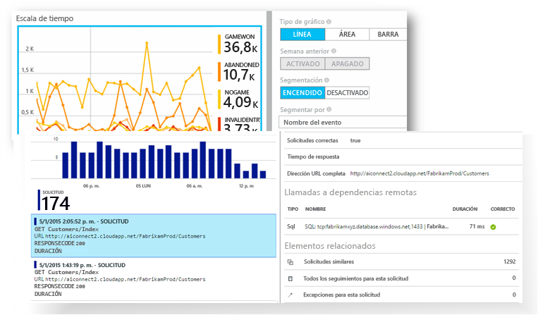

[Eche un vistazo a la animación de introducción](https://www.youtube.com/watch?v=fX2NtGrh-Y0).

## ¿Cómo funciona Application Insights?
Hay que instalar un pequeño paquete de instrumentación en la aplicación y configurar un recurso de Application Insights en el portal de Microsoft Azure. El paquete de instrumentación supervisa la aplicación y envía los datos de telemetría al portal. (La aplicación se puede ejecutar en cualquier lugar; no tiene que estar hospedada en Azure).

No solo puede instrumentar la aplicación de servicio web, sino también todos los componentes en segundo plano y JavaScript en las propias páginas web. 

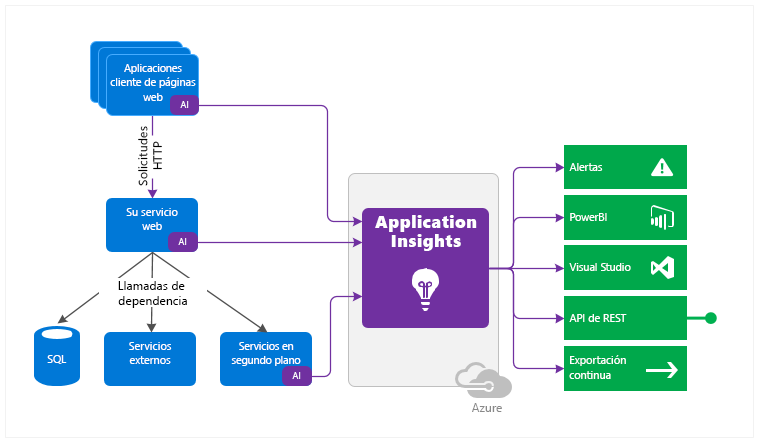

Además, puede obtener la telemetría de los entornos del host, como pueden ser contadores de rendimiento, diagnósticos de Azure o registros de Docker. También puede configurar pruebas web que envíen periódicamente solicitudes sintéticas al servicio web.

Todas estas transmisiones de telemetría se integran en Azure Portal, donde puede aplicar versátiles herramientas de análisis y búsqueda a los datos sin procesar.

### ¿Cuál es la sobrecarga?
El impacto sobre el rendimiento de la aplicación es muy pequeño. Las llamadas de seguimiento no suponen ningún tipo de bloqueo y se agrupan por lotes y se envían en un subproceso aparte.

## ¿Qué supervisa Application Insights?

Application Insights está dirigido al equipo de desarrollo y sirve ayudarle a conocer el rendimiento de una aplicación y cómo se utiliza. Supervisa:

* **Tasas de solicitud, tiempos de respuesta y tasas de error** - Averigüe qué páginas que son las más conocidas, en qué momento del día y dónde están los usuarios. Vea qué páginas presentan mejor rendimiento. Si los tiempos de respuesta y las tasas de error aumentan cuando hay más solicitudes, quizás tiene un problema de recursos. 
* **Tasas de dependencia, tiempos de respuesta y tasa de error** - Averigüe si los servicios externos le ralentizan.
* **Excepciones** - Analice las estadísticas agregadas o seleccione instancias concretas y profundice en el seguimiento de la pila y las solicitudes relacionadas. Se notifican tanto las excepciones de servidor como las de explorador.
* **Vistas de página y rendimiento de carga** - Notificados por los exploradores de los usuarios.
* **Llamadas AJAX** desde páginas web - Tasas, tiempos de respuesta y tasas de error.
* **Número de usuarios y sesiones**.
* **Contadores de rendimiento** de las máquinas de servidor de Windows o Linux, como CPU, memoria y uso de la red. 
* **Diagnóstico de host** de Docker o Azure. 
* **Registros de seguimiento de diagnóstico** de la aplicación - De esta forma puede correlacionar eventos de seguimiento con las solicitudes.
* **Métricas y eventos personalizados** que usted mismo escribe en el código de cliente o servidor para realizar un seguimiento de eventos empresariales, como artículos vendidos o partidas ganadas.

## ¿Dónde veo la telemetría?

Hay muchas formas de explorar los datos. Consulte estos artículos:

|  |  |
| --- | --- |
| [**Detección inteligente y alertas manuales**](app-insights-proactive-diagnostics.md) Las alertas automáticas se adaptan a los patrones normales de telemetría de la aplicación y se desencadenan cuando algo no responde al patrón habitual. También puede [establecer alertas](app-insights-alerts.md) sobre niveles concretos de métricas estándares o personalizadas. |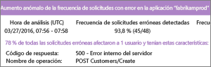 |
| [**Mapa de aplicación**](app-insights-app-map.md) Los componentes de la aplicación, con alertas y métricas clave. |  |
| [**Generador de perfiles**](app-insights-profiler.md) Inspeccione los perfiles de ejecución de solicitudes muestreadas. |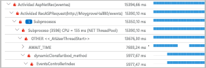 |
| [**Análisis de uso**](app-insights-usage-overview.md) Analice la segmentación y la retención de usuarios.| |
| [**Búsqueda de diagnóstico para datos de instancia**](app-insights-diagnostic-search.md) Busque y filtre eventos como solicitudes, excepciones, llamadas de dependencia, seguimientos de registro y vistas de páginas.  |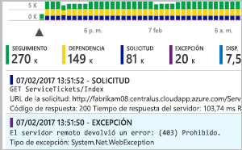 |
| [**Explorador de métricas para datos agregados**](app-insights-metrics-explorer.md) Explore, filtre y segmente datos agregados, como los índices de solicitudes, errores y excepciones; los tiempos de respuesta y los tiempos de carga de página. | |
| [**Paneles**](app-insights-dashboards.md#dashboards) Combine datos de varios recursos y compártalos con otros. Ideal para aplicaciones de varios componentes y para la presentación continua en la sala de reuniones. | |
| [**Secuencia de métricas en directo**](app-insights-live-stream.md) Al implementar una nueva compilación, fíjese en estos indicadores de rendimiento casi en tiempo real para asegurarse de que todo funciona según lo esperado. |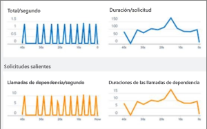 |
| [**Análisis**](app-insights-analytics.md) Responda preguntas complejas acerca del uso y el rendimiento de su aplicación mediante este eficaz lenguaje de consulta. |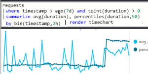 |
| [**Visual Studio**](app-insights-visual-studio.md) Vea los datos de rendimiento en el código. Vaya al código desde los seguimientos de la pila.|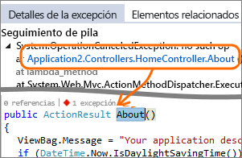 |
| [**Depurador de instantáneas**](app-insights-snapshot-debugger.md) Depure instantáneas muestreadas desde operaciones en directo, con valores de parámetro.|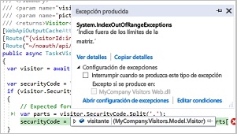 |
| [**Power BI**](app-insights-export-power-bi.md) Integre métricas de uso con otra inteligencia empresarial.| 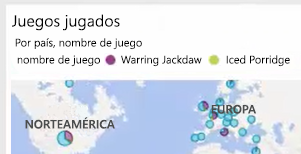|
| [**API DE REST**](https://dev.applicationinsights.io/) Escriba código para ejecutar consultas sobre las métricas y los datos sin procesar.|  |
| [**Exportación continua**](app-insights-export-telemetry.md) Exportación masiva de datos sin procesar al almacenamiento tan pronto como llegan. |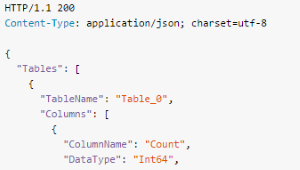 |

## ¿Cómo uso Application Insights?

### Supervisión
Instale Application Insights en la aplicación web, configure las [pruebas web de disponibilidad](app-insights-monitor-web-app-availability.md) y:

* Configure un [panel](app-insights-dashboards.md) para que su equipo no pierda de vista la carga, la capacidad de respuesta y el rendimiento de las dependencias, las cargas de páginas y las llamadas AJAX.
* Detecte cuáles son las solicitudes más lentas y con mayor número de errores.
* Vea [Live Stream](app-insights-live-stream.md) cuando implemente una versión nueva, con el fin de conocer inmediatamente la existencia de cualquier degradación.

### Detección y diagnóstico
Cuando reciba una alerta o detecte un problema:

* Evalúe cuántos usuarios se ven afectados.
* Correlacione los errores con las excepciones, las llamadas de dependencia y los seguimientos.
* Examine el generador de perfiles, las instantáneas, los volcados de pila y los registros de seguimiento.

### Compilación, medición y aprendizaje
[Mida la eficacia](app-insights-usage-overview.md) de cada característica nueva que implemente.

* Planee la medición de la forma en que los clientes utilizan las nuevas características empresariales y de experiencia de usuario.
* Escriba datos de telemetría personalizados en el código.
* Base el siguiente ciclo de desarrollo en pruebas contundentes de la telemetría.

## Primeros pasos
Application Insights es uno de los muchos servicios hospedados en Microsoft Azure y los datos de telemetría se envían ahí para analizarlos y mostrarlos. Por tanto, antes de nada, se necesita una suscripción a [Microsoft Azure](http://azure.com). El registro es gratuito y, si elige el [plan de precios](https://azure.microsoft.com/pricing/details/application-insights/) básico de Application Insights, no habrá cargo alguno hasta que la aplicación tenga un uso considerable. Si la organización ya tiene una suscripción, puede agregarle su cuenta de Microsoft.

Hay varias formas de empezar. Comience con la que más se ajuste a sus necesidades. Puede agregar los demás posteriormente.

* **En tiempo de ejecución: instrumente su aplicación web en el servidor.** Evita toda actualización del código. Se necesita acceso de administrador al servidor.
  * [**IIS local o en una máquina virtual**](app-insights-monitor-performance-live-website-now.md)
  * [**Máquina virtual o aplicación web de Azure**](app-insights-monitor-performance-live-website-now.md)
  * [**J2EE**](app-insights-java-live.md)
* **En tiempo de desarrollo: agregue Application Insights al código.** Le permite escribir datos de telemetría personalizados e instrumentalizar las aplicaciones de back-end y de escritorio.
  * [Visual Studio](app-insights-asp-net.md) 2013, actualización 2 o superior.
  * Java en [Eclipse](app-insights-java-eclipse.md) u [otras herramientas](app-insights-java-get-started.md)
  * [Node.js](app-insights-nodejs.md)
  * [Otras plataformas](app-insights-platforms.md)
* **[Instrumente sus páginas web](app-insights-javascript.md)** para la vista de la página, AJAX y otros datos de telemetría del lado cliente.
* **[Analice el uso de aplicaciones móviles](app-insights-mobile-center-quickstart.md)** mediante la integración con Visual Studio App Center.
* **[Pruebas de disponibilidad](app-insights-monitor-web-app-availability.md)** : haga ping a su sitio web de manera regular desde nuestros servidores.

## Pasos siguientes
Comience en el tiempo de ejecución con:

* [Servidor IIS](app-insights-monitor-performance-live-website-now.md)
* [Servidor de J2EE](app-insights-java-live.md)

Comience en el tiempo de desarrollo con:

* [ASP.NET](app-insights-asp-net.md)
* [Java](app-insights-java-get-started.md)
* [Node.js](app-insights-nodejs.md)

## Soporte y comentarios
* Preguntas y problemas:
  * [Solución de problemas][qna]
  * [Foro de MSDN](https://social.msdn.microsoft.com/Forums/vstudio/home?forum=ApplicationInsights)
  * [Stackoverflow](http://stackoverflow.com/questions/tagged/ms-application-insights)
* Sus sugerencias:
  * [UserVoice](https://visualstudio.uservoice.com/forums/357324)
* Blog:
  * [Blog de Application Insights](https://azure.microsoft.com/blog/tag/application-insights)

## Vídeos

[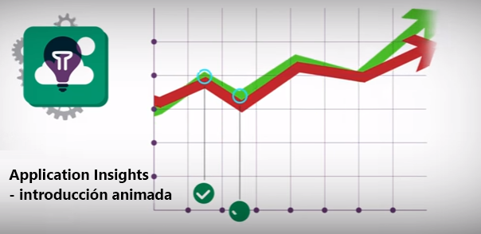](https://www.youtube.com/watch?v=fX2NtGrh-Y0)

> [!VIDEO https://channel9.msdn.com/events/Connect/2016/100/player] 

<!--Link references-->

[android]: https://github.com/Microsoft/ApplicationInsights-Android
[azure]: ../insights-perf-analytics.md
[client]: app-insights-javascript.md
[desktop]: app-insights-windows-desktop.md
[detect]: app-insights-detect-triage-diagnose.md
[greenbrown]: app-insights-asp-net.md
[ios]: https://github.com/Microsoft/ApplicationInsights-iOS
[java]: app-insights-java-get-started.md
[knowUsers]: app-insights-web-track-usage.md
[platforms]: app-insights-platforms.md
[portal]: http://portal.azure.com/
[qna]: app-insights-troubleshoot-faq.md
[redfield]: app-insights-monitor-performance-live-website-now.md
