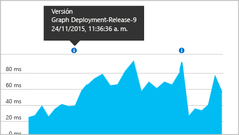

# <a name="separating-telemetry-from-development-test-and-production"></a>Separación de la telemetría de desarrollo, prueba y producción

Cuando esté desarrollando la próxima versión de una aplicación web, no querrá mezclar la telemetría de [Application Insights](app-insights-overview.md) de la nueva versión con la que ya se ha publicado. Para evitar confusiones, envíe la telemetría de las distintas fases de desarrollo para separar los recursos de Application Insights con claves de instrumentación independientes (iKey). Para que sea más fácil cambiar la clave de instrumentación cuando pase una versión de una fase a otro, puede ser útil establecer la clave iKey en el código en lugar de en el archivo de configuración. 

(Si el sistema es un servicio en la nube de Azure, hay [otra forma de configurar claves separadas](app-insights-cloudservices.md)).

## <a name="about-resources-and-instrumentation-keys"></a>Acerca de los recursos y las claves de instrumentación

Al configurar la supervisión de Application Insights para su aplicación web, se crea un *recurso* de Application Insights en Microsoft Azure. Abra este recurso en Azure Portal con el fin de ver y analizar la telemetría recopilada de la aplicación. Cada recurso se identifica con una *clave de instrumentación* (iKey). Cuando se instala el paquete de Application Insights para supervisar la aplicación, configúrelo con la clave de instrumentación para que sepa dónde enviar la telemetría.

Normalmente, decidirá usar recursos independientes o un recurso compartido único en escenarios diferentes:

* Aplicaciones independientes y diferentes: use un recurso y una clave iKey independientes para cada aplicación.
* Varios componentes o roles de una sola aplicación empresarial: use un [único recurso compartido](app-insights-monitor-multi-role-apps.md) para todas las aplicaciones de componentes. La telemetría puede filtrarse o segmentarse por la propiedad cloud_RoleName.
* Desarrollo, prueba y publicación: use un recurso y una clave iKey independientes para las versiones del sistema en "sellos" o fase de producción.
* Pruebas A/B: use un único recurso. Cree un elemento TelemetryInitializer para agregar una propiedad a la telemetría que identifica las variantes.


## <a name="dynamic-ikey"></a> Copia de la clave de instrumentación

Para que sea más fácil cambiar la clave iKey cuando el código se mueva entre las fases de producción, establézcala en el código en lugar de en el archivo de configuración.

Establezca la clave en un método de inicialización, como global.aspx.cs en un servicio de ASP.NET:

*C#*

    protected void Application_Start()
    {
      Microsoft.ApplicationInsights.Extensibility.
        TelemetryConfiguration.Active.InstrumentationKey = 
          // - for example -
          WebConfigurationManager.AppSettings["ikey"];
      ...

En este ejemplo, las ikeys para los distintos recursos se colocan en diferentes versiones del archivo de configuración web. Si cambia el archivo de configuración web (algo que se puede hacer como parte del script de lanzamiento), se intercambiará el recurso de destino.

### <a name="web-pages"></a>Páginas web
La iKey también se usa en las páginas web de su aplicación, en el [script que obtuvo desde la hoja Inicio rápido](app-insights-javascript.md). En vez de codificarla literalmente en el script, genérela desde el estado del servidor. Por ejemplo, en una aplicación ASP.NET:

*JavaScript en Razor*

    <script type="text/javascript">
    // Standard Application Insights web page script:
    var appInsights = window.appInsights || function(config){ ...
    // Modify this part:
    }({instrumentationKey:  
      // Generate from server property:
      "@Microsoft.ApplicationInsights.Extensibility.
         TelemetryConfiguration.Active.InstrumentationKey"
    }) // ...


## <a name="create-additional-application-insights-resources"></a>Creación de recurso de Application Insights adicionales
Con el fin de separar la telemetría para los diferentes componentes de la aplicación, o para diferentes sellos (desarrollo, prueba y producción) del mismo componente, tendrá que crear un recurso de Application Insights.

En el [portal.azure.com](https://portal.azure.com), agregue un recurso de Application Insights:


* **tipo de aplicación** afecta a lo que ve en la hoja de información general y las propiedades disponibles en el [explorador de métricas](app-insights-metrics-explorer.md)de Azure. Si no ve el tipo de aplicación, elija uno de los tipos web para páginas web.
* **grupo de recursos** resulta práctico para administrar propiedades como el  como el [control de acceso](app-insights-resources-roles-access-control.md)de Azure. Puede usar grupos de recursos independientes para desarrollo, prueba y producción.
* **suscripción** es su cuenta de pago de Azure.
* **ubicación** es donde se guardan los datos. Actualmente no se puede cambiar. 
* **Agregar al panel** coloca un icono de acceso rápido al recurso en la página principal de Azure. 

El recurso tarda unos segundos en crearse. Verá una alerta cuando esté listo.

(Puede escribir un [script de PowerShell](app-insights-powershell-script-create-resource.md) para crear un recurso  automáticamente.)

### <a name="getting-the-instrumentation-key"></a>Obtención de la clave de instrumentación
La clave de instrumentación identifica al recurso que ha creado. 


Necesita las claves de instrumentación de todos los recursos a los que la aplicación enviará datos.

## <a name="filter-on-build-number"></a>Filtrado por número de compilación
Cuando se publica una nueva versión de la aplicación, querrá poder separar la telemetría en las diferentes versiones.

Puede establecer la propiedad de versión de la aplicación para filtrar los resultados de la [búsqueda](app-insights-diagnostic-search.md) y del [explorador de métricas](app-insights-metrics-explorer.md).


Hay diferentes métodos de establecer la propiedad de versión de la aplicación.

* Establezca directamente:

    `telemetryClient.Context.Component.Version = typeof(MyProject.MyClass).Assembly.GetName().Version;`
* Ajuste esa línea en un [inicializador de telemetría](app-insights-api-custom-events-metrics.md#defaults) para asegurarse de que todas las instancias de TelemetryClient se establecen de forma coherente.
* [ASP.NET] Establezca la versión en `BuildInfo.config`. El módulo web recogerá la versión del nodo BuildLabel. Incluya este archivo en el proyecto y recuerde que establecer la propiedad Copiar siempre en el Explorador de soluciones.

    ```XML

    <?xml version="1.0" encoding="utf-8"?>
    <DeploymentEvent xmlns:xsi="http://www.w3.org/2001/XMLSchema-instance" xmlns:xsd="http://www.w3.org/2001/XMLSchema" xmlns="http://schemas.microsoft.com/VisualStudio/DeploymentEvent/2013/06">
      <ProjectName>AppVersionExpt</ProjectName>
      <Build type="MSBuild">
        <MSBuild>
          <BuildLabel kind="label">1.0.0.2</BuildLabel>
        </MSBuild>
      </Build>
    </DeploymentEvent>

    ```
* [ASP.NET] Genere BuildInfo.config automáticamente en MSBuild. Para ello, agregue unas líneas a su archivo `.csproj`:

    ```XML

    <PropertyGroup>
      <GenerateBuildInfoConfigFile>true</GenerateBuildInfoConfigFile>    <IncludeServerNameInBuildInfo>true</IncludeServerNameInBuildInfo>
    </PropertyGroup>
    ```

    Esto genera un archivo denominado *suNombreProyecto*.BuildInfo.config. El proceso de publicación cambia su nombre a BuildInfo.config.

    La etiqueta de compilación contiene un marcador de posición (AutoGen_...) al compilar con Visual Studio. Pero cuando se crea con MSBuild, se rellena con el número de versión correcto.

    Para permitir que MSBuild genere números de versión, establezca la versión como `1.0.*` en AssemblyReference.cs.

## <a name="version-and-release-tracking"></a>Versión y seguimiento de versiones
Para realizar el seguimiento de la versión de la aplicación, asegúrese de que `buildinfo.config` lo genera el proceso de Microsoft Build Engine. En su archivo .csproj, agregue:  

```XML

    <PropertyGroup>
      <GenerateBuildInfoConfigFile>true</GenerateBuildInfoConfigFile>    <IncludeServerNameInBuildInfo>true</IncludeServerNameInBuildInfo>
    </PropertyGroup>
```

Cuando tenga la información de la compilación, el módulo web de Application Insights agregará automáticamente la **versión de la aplicación** como una propiedad a cada elemento de telemetría. Esto le permite filtrar por versión al realizar [búsquedas de diagnósticos](app-insights-diagnostic-search.md) o al [explorar métricas](app-insights-metrics-explorer.md).

Sin embargo, tenga en cuenta que el número de versión de la compilación solo lo genera Microsoft Build Engine, no la compilación de desarrollador de Visual Studio.

### <a name="release-annotations"></a>Anotaciones de la versión
Si usa Visual Studio Team Services, puede [obtener un marcador de anotación](app-insights-annotations.md) agregado a los gráficos, siempre que publique una nueva versión. La siguiente imagen muestra cómo aparece este marcador.


## <a name="next-steps"></a>Pasos siguientes

* [Recursos compartidos para varios roles](app-insights-monitor-multi-role-apps.md)
* [Creación de un inicializador de telemetría para distinguir variantes A/B](app-insights-api-filtering-sampling.md#add-properties)
