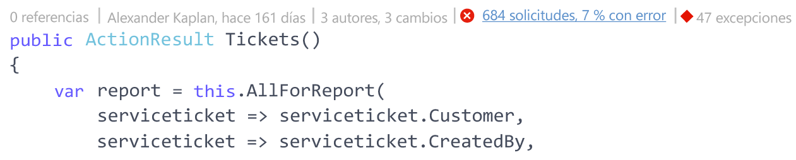
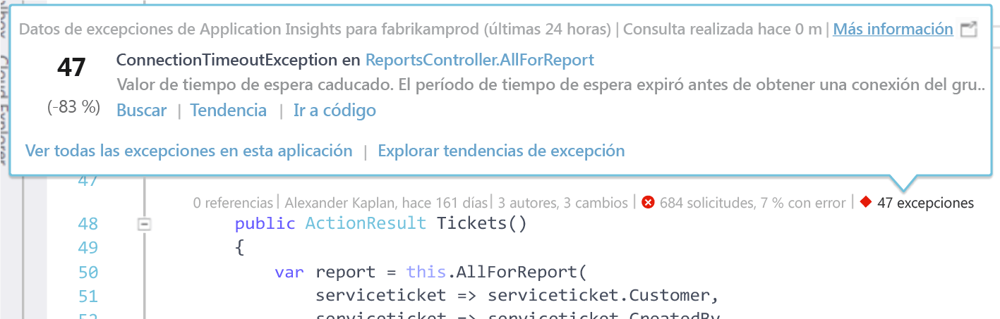
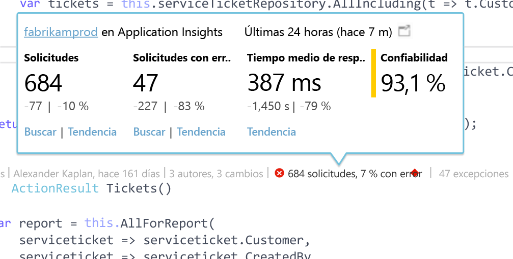

# Telemetría de Application Insights en CodeLens de Visual Studio
Los métodos del código de la aplicación web se pueden anotar con telemetría acerca de las excepciones en tiempo de ejecución y los tiempos de respuesta de las solicitudes. Si instala [Azure Application Insights](app-insights-overview.md) en la aplicación, la telemetría aparece en [CodeLens](https://msdn.microsoft.com/library/dn269218.aspx) de Visual Studio (las notas de la parte superior de cada función en las que suele ver información útil, como el número de lugares en que se hace referencia a la función o la última persona que la editó).

> [!NOTE]
> Application Insights en CodeLens está disponible en Visual Studio 2015 actualización 3, y posteriores, o bien con la última versión de la [extensión de Developer Analytics Tools](https://visualstudiogallery.msdn.microsoft.com/82367b81-3f97-4de1-bbf1-eaf52ddc635a). CodeLens está disponible en las ediciones Enterprise y Professional de Visual Studio.
> 
> 

## Dónde encontrar datos de Application Insights
Busque los datos de telemetría de Application Insights en los indicadores de CodeLens de los métodos de solicitud públicos de la aplicación web. Los indicadores de CodeLens se muestran encima del método y de otras declaraciones en el código de C# y Visual Basic. Si hay datos de Application Insights disponibles para un método, verá indicadores de solicitudes y excepciones como "100 solicitudes, 1 % con error" o "10 excepciones". Para más detalles, haga clic en un indicador de CodeLens. 

> [!TIP]
> Los indicadores de solicitudes y excepciones de Application Insights pueden tardar unos segundos más en cargarse después de que aparezcan otros indicadores de CodeLens.
> 
> 

## Excepciones en CodeLens

El indicador de excepción de CodeLens muestra el número de excepciones que se han producido en las últimas 24 horas de las 15 excepciones que se producen con más frecuencia en la aplicación durante dicho período, al procesar la solicitud atendida por el método.

Para más detalles, haga clic en el indicador de excepciones de CodeLens:

* El cambio de porcentaje en el número de excepciones en las últimas 24 horas, con respecto a las 24 horas anteriores
* Elija **Ir al código** para navegar el código fuente de la función que genera la excepción.
* Elija **Buscar** para consultar todas las instancias de esta excepción que se han producido en las últimas 24 horas.
* Elija **Tendencia** para ver la tendencia de las repeticiones de esta excepción en las últimas 24 horas.
* Elija **Ver todas las excepciones en esta aplicación** para consultar todas las excepciones que se han producido en las últimas 24 horas.
* Elija **Explorar tendencias de excepción** para ver la tendencia de todas las excepciones que se han producido en las últimas 24 horas. 

> [!TIP]
> Si ve "0 excepciones" en CodeLens, pero sabe que debería haber excepciones, asegúrese de que está seleccionado el recurso de Application Insights correcto en CodeLens. Para seleccionar otro recurso, haga clic con el botón derecho en el proyecto en el Explorador de soluciones y elija **Application Insights > Elegir origen de telemetría**. CodeLens solo se muestra para las 15 excepciones que se producen con mayor frecuencia en la aplicación en las últimas 24 horas, por lo que si una excepción está en el lugar 16º, o más allá, "0 excepciones". Las excepciones de las vistas de ASP.NET puede que no aparezcan en los métodos de controlador que generaron dichas vistas.
> 
> [!TIP]
> Si ve "? excepciones"en CodeLens, se deberá a que es preciso que asocie su cuenta de Azure con Visual Studio o puede que haya caducado la credencial de su cuenta de Azure. En ambos casos, haga clic en "? excepciones" y elija **Agregar una cuenta...** para escribir sus credenciales.
> 
> 

## Solicitudes en CodeLens

El indicador de solicitud de CodeLens muestra el número de solicitudes HTTP que sido atendidas por un método en las últimas 24 horas, además del porcentaje de dichas solicitudes en las que han producido errores.

Para más detalles, haga clic en el indicador de solicitudes de CodeLens:

* Los cambios, tanto a nivel absoluta como porcentual, en el número de solicitudes, solicitudes con error y tiempos de respuesta medios durante las últimas 24 horas, en comparación con las 24 horas anteriores.
* La confiabilidad del método, calculada como el porcentaje de solicitudes en que no se produjeron errores en las últimas 24 horas.
* Elija **Buscar** para las solicitudes o las solicitudes con error para consultar todas las solicitudes (con error) que se produjeron en las últimas 24 horas.
* Elija **Tendencia** para ver la tendencia para las solicitudes, las solicitudes con errores o los tiempos de respuesta medios en las últimas 24 horas.
* Elija el nombre del recurso de Application Insights en la esquina superior izquierda de la vista de detalles de CodeLens para cambiar el recurso que es el origen de los datos de CodeLens.

## Pasos siguientes
|  |  |
| --- | --- |
| **[Trabajo con Application Insights en Visual Studio](app-insights-visual-studio.md)** Busque la telemetría, consulte los datos de CodeLens y configure Application Insights. Todos desde Visual Studio. | |
| **[Incorporación de datos adicionales](app-insights-asp-net-more.md)** Supervise el uso, la disponibilidad, las dependencias y las excepciones. Integrar seguimientos de marcos de registro. Escribir telemetría personalizada. | |
| **[Trabajo con el portal de Application Insights](app-insights-dashboards.md)** Paneles, eficaces herramientas de diagnóstico y análisis, alertas, un mapa activo de dependencias de la aplicación y exportación de la telemetría. | |

