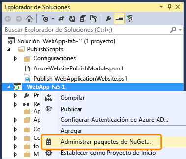
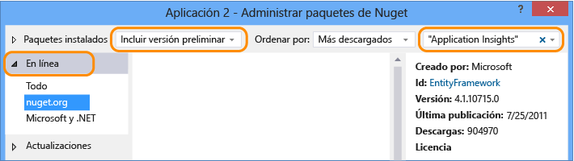

<properties
	pageTitle="Application Insights para aplicaciones de Tienda de Windows Phone | Microsoft Azure"
	description="Analice el uso y el rendimiento de la aplicación de su dispositivo Windows con Application Insights."
	services="application-insights"
    documentationCenter="windows"
	authors="alancameronwills"
	manager="douge"/>

<tags
	ms.service="application-insights"
	ms.workload="tbd"
	ms.tgt_pltfrm="ibiza"
	ms.devlang="na"
	ms.topic="get-started-article"
	ms.date="06/16/2015"
	ms.author="awills"/>

# Application Insights para aplicaciones de Windows Phone y de la Tienda Windows

*Application Insights se encuentra en su versión de vista previa.*

[AZURE.INCLUDE [app-insights-selector-get-started](../../includes/app-insights-selector-get-started.md)]

Application Insights de Visual Studio permite supervisar una aplicación activa en cuanto a:

* [**Uso**][windowsUsage] \: sepa cuántos usuarios tiene y qué hacen con su aplicación.
* [**Bloqueos**][windowsCrash] \: obtenga informes de diagnóstico de bloqueos y comprenda el impacto de estos sobre los usuarios.


En muchos tipos de aplicaciones, [Visual Studio puede agregar Application Insights a la aplicación en cuestión](#ide) casi sin que usted se dé cuenta. Sin embargo, puesto que está leyendo esto para entender mejor el proceso, le guiaremos a través de los pasos manualmente.

Necesitará:

* Una suscripción a [Microsoft Azure][azure].
* Visual Studio 2013 o posterior.

## 1\. Creación de recursos en Application Insights

En el [portal de Azure][portal], cree un nuevo recurso de Application Insights.


Un [recurso][roles] de Azure es una instancia de un servicio. Este recurso es donde se le presentará telemetría de su aplicación analizada.

#### Copia de la clave de instrumentación

La clave identifica el recurso. La necesitará pronto para configurar el SDK para enviar los datos al recurso.


## 2\. Incorporación del SDK de Application Insights a las aplicaciones

En Visual Studio, agregue el SDK adecuado a su proyecto.

Si es una aplicación universal de Windows, repita los pasos para el proyecto de Windows Phone y el proyecto de Windows.

1. Haga clic con el botón secundario en el proyecto en el Explorador de soluciones y seleccione **Administrar paquetes de NuGet**.

    

2. Busque "Application Insights".

    

3. Seleccione **Application Insights para aplicaciones de Windows**.

4. Agregue un archivo ApplicationInsights.config a la raíz del proyecto e inserte la clave de instrumentación que copió del portal. A continuación se muestra un archivo XML de ejemplo para este archivo de configuración.

	```xml

		<?xml version="1.0" encoding="utf-8" ?>
		<ApplicationInsights>
			<InstrumentationKey>YOUR COPIED INSTRUMENTATION KEY</InstrumentationKey>
		</ApplicationInsights>
	```

    Defina las propiedades del archivo ApplicationInsights.config: **Acción de generación** == **Contenido** y **Copiar en el directorio de resultados** == **Copiar siempre**.

	

5. Agregue el código de inicialización siguiente. Es más conveniente agregar este código al constructor `App()`. Si lo hace en otro lugar, podría perder la recopilación automática de las primeras vistas de página.

```C#

    using Microsoft.ApplicationInsights;
    ...

	public App()
	{
	   // Add this initilization line.
	   WindowsAppInitializer.InitializeAsync();

	   this.InitializeComponent();
	   this.Suspending += OnSuspending;
	}  
```

**Aplicaciones universales de Windows**: repita los pasos para el proyecto de Windows Phone y de la Tienda Windows. [Ejemplo de una aplicación universal de Windows 8.1](https://github.com/Microsoft/ApplicationInsights-Home/tree/master/Samples/Windows%208.1%20Universal).

## <a name="network"></a>3. Habilitación del acceso de red para la aplicación

Si la aplicación no [solicita acceso a Internet](https://msdn.microsoft.com/library/windows/apps/hh452752.aspx) aún, tendrá que agregar esta acción a su manifiesto como una [funcionalidad obligatoria](https://msdn.microsoft.com/library/windows/apps/br211477.aspx).

## <a name="run"></a>4. Ejecución del proyecto

[Ejecute la aplicación con F5](http://msdn.microsoft.com/library/windows/apps/bg161304.aspx) y úsela para generar telemetría.

En Visual Studio, aparecerá un recuento de los eventos que se han recibido.


En modo de depuración, la telemetría se envía tan pronto como se genera. En modo de lanzamiento, la telemetría se almacena en el dispositivo y solo se envía cuando se reanuda la aplicación.


## <a name="monitor"></a>5. Consulta de los datos del monitor

En el [Portal de Azure](https://portal.azure.com), abra el recurso de Application Insights que creó anteriormente.

Al principio, solo aparecerán uno o dos puntos. Por ejemplo:


Si espera más datos, haga clic en **Actualizar** después de unos segundos.

Haga clic en un gráfico para ver su contenido con mayor detalle.


## <a name="deploy"></a>5. Publicación de la aplicación en Azure

[Publique la aplicación](http://dev.windows.com/publish) y vea cómo se acumulan los datos a medida que los usuarios la descargan y la usan.

## Personalización de la telemetría

#### Selección de los recopiladores

El SDK de Application Insights incluye varios recolectores que recopilan diferentes tipos de datos de la aplicación automáticamente. De forma predeterminada, todos están activos. Pero puede elegir los recolectores que quiere inicializar en el constructor de la aplicación:

    WindowsAppInitializer.InitializeAsync( "00000000-0000-0000-0000-000000000000",
       WindowsCollectors.Metadata
       | WindowsCollectors.PageView
       | WindowsCollectors.Session
       | WindowsCollectors.UnhandledException);

#### Envío de datos de telemetría propios

Use la [API][api] para enviar eventos, métricas y datos de diagnóstico a Application Insights. En resumen:

```C#

 var tc = new TelemetryClient(); // Call once per thread

 // Send a user action or goal:
 tc.TrackEvent("Win Game");

 // Send a metric:
 tc.TrackMetric("Queue Length", q.Length);

 // Provide properties by which you can filter events:
 var properties = new Dictionary{"game", game.Name};

 // Provide metrics associated with an event:
 var measurements = new Dictionary{"score", game.score};

 tc.TrackEvent("Win Game", properties, measurements);

```

Para obtener más información, vea [Información general de la API: Eventos y métricas personalizados][api].

## Pasos siguientes

* [Detección y diagnóstico de bloqueos en la aplicación][windowsCrash]
* [Más información sobre las métricas][metrics]
* [Más información sobre Búsqueda de diagnóstico][diagnostic]


## <a name="ide"></a>Instalación automatizada

Si prefiere usar Visual Studio para completar los pasos de instalación, puede hacerlo con Windows Phone, la Tienda Windows y muchos otros tipos de aplicaciones.

### <a name="new"></a> Si crea un proyecto de aplicación de Windows...

Seleccione **Application Insights** en el cuadro de diálogo **Nuevo proyecto**.

Si se le pide que inicie sesión, use las credenciales para la cuenta de Azure (que es independiente de su cuenta de Visual Studio Online).


### <a name="existing"></a>O bien, si se trata de un proyecto existente...

Agregue Application Insights desde el Explorador de soluciones.


## Actualización a una nueva versión del SDK

Cuando [se lanza una nueva versión del SDK](app-insights-release-notes-windows.md):

* Haga clic con el botón derecho en el proyecto y elija Administrar paquetes de NuGet.
* Seleccione los paquetes de Application Insights instalados y elija **Acción: Actualizar**.


## <a name="usage"></a>Pasos siguientes


[Detección y diagnóstico de bloqueos en la aplicación][windowsCrash]

[Captura y búsqueda de registros de diagnóstico][diagnostic]


[Seguimiento del uso de la aplicación][windowsUsage]

[Uso de la API para enviar telemetría personalizada][api]

[Solución de problemas][qna]


<!--Link references-->

[api]: app-insights-api-custom-events-metrics.md
[azure]: ../insights-perf-analytics.md
[diagnostic]: app-insights-diagnostic-search.md
[metrics]: app-insights-metrics-explorer.md
[portal]: http://portal.azure.com/
[qna]: app-insights-troubleshoot-faq.md
[roles]: app-insights-resources-roles-access-control.md
[windowsCrash]: app-insights-windows-crashes.md
[windowsUsage]: app-insights-windows-usage.md

<!---HONumber=Sept15_HO2-->