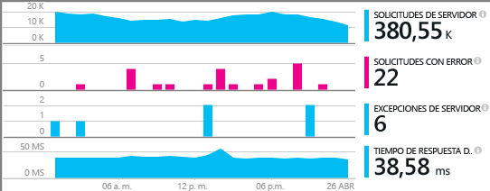
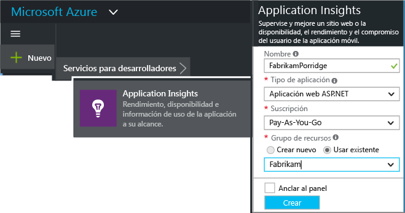
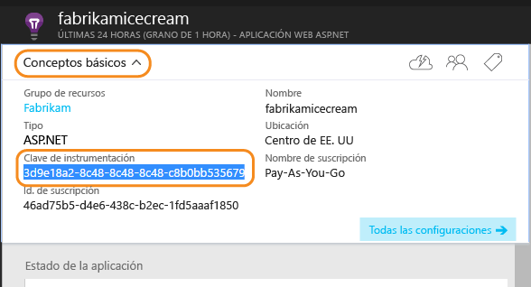
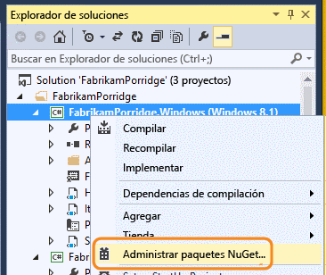
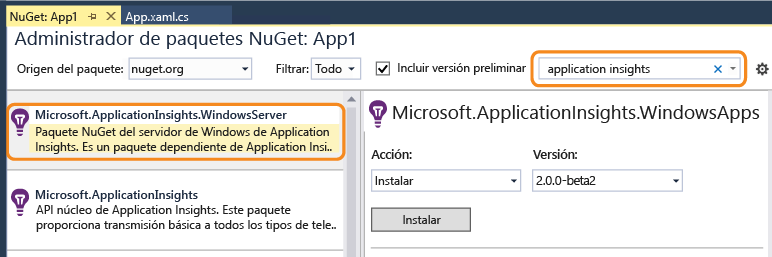
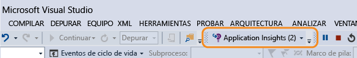
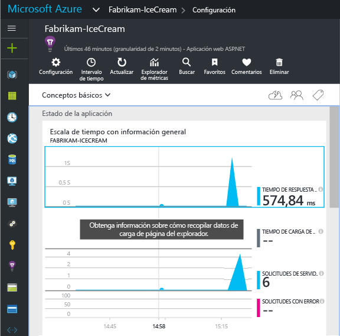
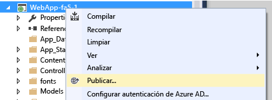

# Configuración manual de Application Insights para aplicaciones .NET

Puede configurar [Application Insights](app-insights-overview.md) para que supervise una amplia variedad de aplicaciones o roles de aplicación, componentes o microservicios. Para servicios y aplicaciones web, Visual Studio ofrece una [configuración de un solo paso](app-insights-asp-net.md). Para otros tipos de aplicación. NET, como roles de servidor back-end o aplicaciones de escritorio, puede configurar Application Insights manualmente.

#### Antes de comenzar

Necesita:

* Una suscripción a [Microsoft Azure](http://azure.com). Si su equipo u organización tiene una suscripción a Azure, el propietario puede agregarle a esta con su [cuenta Microsoft](http://live.com).
* Visual Studio 2013 o posterior.

## 1. Selección de un recurso en Application Insights

El "recurso" es donde los datos se recopilan y se muestran en Azure Portal. Debe decidir si desea crear uno o compartir uno ya existente.

### Parte de una aplicación de mayor tamaño: usar un recurso existente

Si la aplicación web tiene varios componentes (por ejemplo, una aplicación web front-end y uno o varios servicios back-end), debería enviar telemetría desde todos los componentes al mismo recurso. Esto permitirá que se muestren en una sola asignación de aplicaciones y hace posible realizar un seguimiento de una solicitud de un componente a otro.

Por lo tanto, si ya está supervisando otros componentes de esta aplicación, basta con que use el mismo recurso.

Abra el recurso en [Azure Portal](https://portal.azure.com/). 

### Aplicación independiente: crear un recurso

Si la nueva aplicación no guarda relación con otras aplicaciones, debería tener su propio recurso.

Inicie sesión en el [Portal de Azure](https://portal.azure.com/)y cree un nuevo recurso de Application Insights. Elija ASP.NET como el tipo de aplicación.

La elección del tipo de aplicación establece el contenido predeterminado de las hojas de recurso.

## 2. Copia de la clave de instrumentación
La clave identifica al recurso. La va a instalar pronto en el SDK, con el fin de dirigir los datos hacia el recurso.

## 3. Instalación del paquete de Application Insights en su aplicación
La instalación y configuración del paquete de Application Insights varía en función de la plataforma en la que trabaje. 

1. En Visual Studio, haga clic con el botón derecho en el proyecto y elija **Administrar paquetes NuGet**.
   
    
2. Instale el paquete de Application Insights para aplicaciones de Windows Server, "Microsoft.ApplicationInsights.WindowsServer".
   
    
   
    *¿Qué versión?*

    Active **incluir versión preliminar** si desea probar las características más recientes. Los documentos o blogs pertinentes indican si se necesita una versión preliminar.
    
    *¿Puedo usar otros paquetes?*
   
    Sí. Elija "Microsoft.ApplicationInsights" si solo desea usar la API para enviar su propia telemetría. El paquete de Windows Server incluye la API más otra serie de paquetes, como la colección de contadores de rendimiento y la supervisión de dependencias. 

### Para actualizar a futuras versiones del paquete
De vez en cuando, lanzamos una versión nueva del SDK.

Para actualizar a una [nueva versión del paquete](https://github.com/Microsoft/ApplicationInsights-dotnet-server/releases/), vuelva a abrir el Administrador de paquetes NuGet y filtre los paquetes instalados. Seleccione **Microsoft.ApplicationInsights.WindowsServer** y elija **Actualizar**.

Si ha realizado personalizaciones en ApplicationInsights.config, guarde una copia del mismo antes de actualizar y después combine los cambios en la nueva versión.

## 4. Envío de datos de telemetría
**Si ha instalado solo el paquete de la API:**

* Establezca la clave de instrumentación en el código, por ejemplo en `main()`: 
  
    `TelemetryConfiguration.Active.InstrumentationKey = "`*su clave*`";` 
* [Escriba su propia telemetría mediante la API](app-insights-api-custom-events-metrics.md#ikey).

**Si ha instalado otros paquetes de Application Insights,** puede, si lo prefiere, usar el archivo .config para establecer la clave de instrumentación:

* Edite ApplicationInsights.config (que la instalación de NuGet agregó). Inserte esto justo antes de la etiqueta de cierre:
  
    `<InstrumentationKey>`*la clave de instrumentación que copió*`</InstrumentationKey>`
* Asegúrese de que las propiedades de ApplicationInsights.config en el Explorador de soluciones se establecen en **Build Action = Content, Copy to Output Directory = Copy**.

Es útil establecer la clave de instrumentación en el código si desea [cambiar la clave para diferentes configuraciones de compilación](app-insights-separate-resources.md). Si establece la clave en el código, no tiene que establecerla en el archivo `.config`.

##  Ejecución del proyecto
Use **F5**para ejecutar la aplicación y pruébela. Abra varias páginas para generar telemetría.

En Visual Studio, aparecerá un recuento de los eventos que se han enviado.

##  Visualización de los datos de telemetría
Vuelva al [Portal de Azure](https://portal.azure.com/) y busque el recurso de Application Insights.

Busque los datos en los gráficos de Información general. Al principio, solo aparecerán uno o dos puntos. Por ejemplo:

Haga clic en cualquier gráfico para ver métricas más detalladas. [Más información acerca de las métricas](app-insights-web-monitor-performance.md)

### ¿No hay datos?
* Use la aplicación y abra varias páginas para generar telemetría.
* Abra el icono [Buscar](app-insights-diagnostic-search.md) para ver los eventos individuales. A veces, los eventos tardan un poco en llegar a través de la canalización de métricas.
* Espere unos segundos y haga clic en **Actualizar**. Los gráficos se actualizan automáticamente de forma periódica, pero puede actualizarlos manualmente si espera que aparezcan algunos datos.
* Vea [Solución de problemas](app-insights-troubleshoot-faq.md).

## Publicación de la aplicación
Implemente ahora la aplicación en su servidor o en Azure y observe cómo se acumulan los datos.

Si se trabaja en modo de depuración, la telemetría se agiliza a través de la canalización y los datos aparecen en cuestión de segundos. Al implementar la aplicación en la configuración de lanzamiento, los datos se acumulan más lentamente.

### ¿No hay datos después de publicar en el servidor?
Abra los puertos para el tráfico de salida en el firewall del servidor. Consulte [esta página](https://docs.microsoft.com/azure/application-insights/app-insights-ip-addresses) para obtener la lista de direcciones necesarias 

### ¿Tiene problemas el servidor de compilación?
Consulte [este apartado de la solución de problemas](app-insights-asp-net-troubleshoot-no-data.md#NuGetBuild).

> [!NOTE]
> Si la aplicación genera mucha telemetría, el módulo de muestreo adaptable reducirá automáticamente el volumen que se envía al portal mediante el envío de únicamente una fracción representativa de eventos. Sin embargo, los eventos relacionados con la misma solicitud se seleccionarán o se anulará su selección como grupo, por lo que puede navegar entre ellos. 
> [Más información sobre el muestreo](app-insights-sampling.md).
> 
> 

## Vídeo

> [!VIDEO https://channel9.msdn.com/events/Connect/2016/100/player]

## Pasos siguientes
* [Agregue más telemetría](app-insights-asp-net-more.md) para obtener la visión completa de 360 grados de la aplicación.

