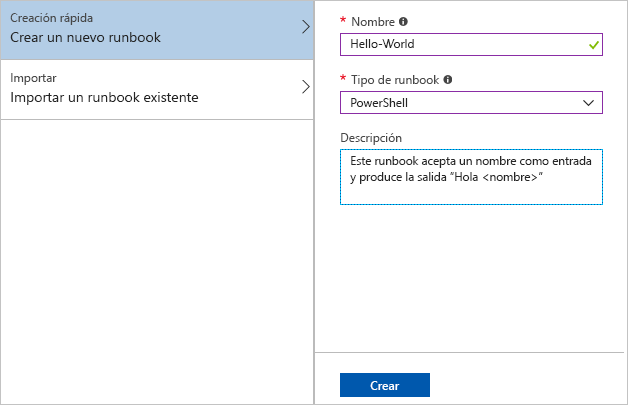
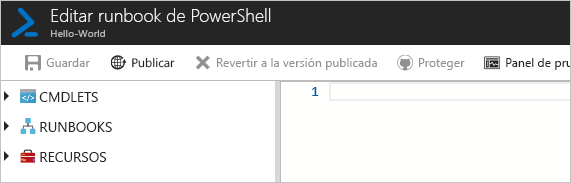
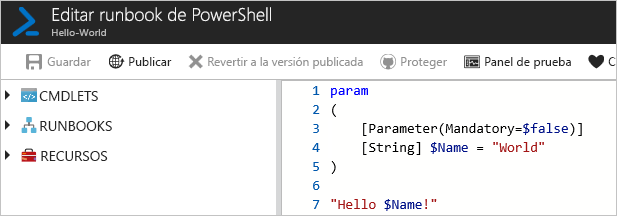
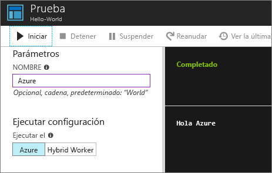
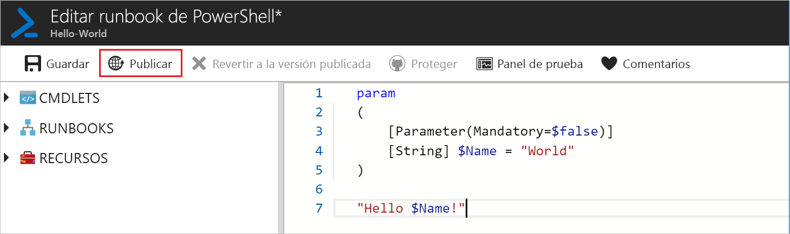
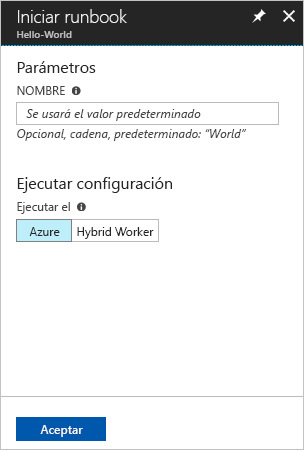
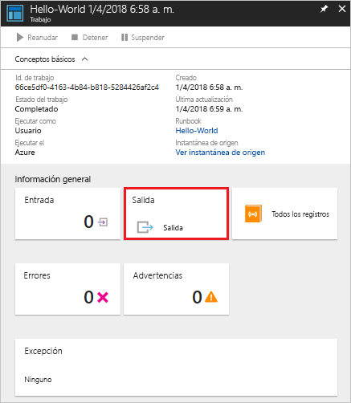
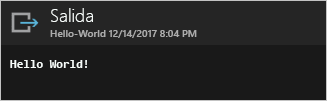

# <a name="create-an-azure-automation-runbook"></a>Creación de un runbook de Azure Automation

Los runbooks de Azure Automation se pueden crear a través de Azure. Este método proporciona una interfaz de usuario basada en explorador para crear runbooks de Automation. Esta guía de inicio rápido le guía en las operaciones de creación, edición, prueba y publicación de un runbook de Automation PowerShell.

Si no tiene una suscripción a Azure, cree una [cuenta gratuita de Azure](https://azure.microsoft.com/free/?WT.mc_id=A261C142F) antes de empezar.

## <a name="log-in-to-azure"></a>Inicie sesión en Azure.

Inicie sesión en Azure en https://portal.azure.com.

## <a name="create-runbook"></a>Creación de runbook

En primer lugar, cree un runbook. El runbook de ejemplo creado en esta guía de inicio rápido genera `Hello World` de forma predeterminada.

1. Abra su cuenta de Automation.

1. Haga clic en **Runbooks** en **AUTOMATIZACIÓN DE PROCESOS**. Se muestra la lista de runbooks.

1. Haga clic en el botón **Agregar un Runbook** que se encuentra en la parte superior de la lista. En la página **Agregar un Runbook**, seleccione **Creación rápida**.

1. Escriba "Hello-World" como **nombre** del runbook y seleccione **PowerShell** en **Tipo de Runbook**. Haga clic en **Create**(Crear).

   

1. Se crea el runbook y se abre la página **Editar Runbook de PowerShell**.

    

1. Escriba o copie y pegue el código siguiente en el panel de edición. Crea un parámetro de entrada opcional denominado "Name" con un valor predeterminado "World" y genera una cadena que utiliza este valor de entrada:
   
   ```powershell-interactive
   param
   (
       [Parameter(Mandatory=$false)]
       [String] $Name = "World"
   )

   "Hello $Name!"
   ```

1. Haga clic en **Guardar** para guardar una copia en borrador del runbook.

    

## <a name="test-the-runbook"></a>Probar el runbook

Una vez creado el runbook, debe probarlo para asegurarse de que funciona.

1. Haga clic en **Panel de prueba** para abrir la página **Probar**.

1. Escriba un valor en **Nombre** y haga clic en **Iniciar**. Se inicia el trabajo de prueba y se muestran la salida y el estado del trabajo.

    

1. Cierre la página **Probar**. Para ello, haga clic en la **X** en la esquina superior derecha. Seleccione **Aceptar** en el menú emergente que aparece.

1. En la página **Editar Runbook de PowerShell**, haga clic en **Publicar** para publicar el runbook como la versión oficial del runbook en la cuenta.

   

## <a name="run-the-runbook"></a>Ejecución del runbook

Una vez publicado el runbook, se muestra la página de información general.

1. En la página de información general del runbook, haga clic en **Iniciar** para abrir la página de configuración **Iniciar runbook** de este runbook.

   

1. Deje el valor de **Nombre** en blanco para que se use el valor predeterminado y haga clic en **Aceptar**. Se envía el trabajo del runbook y aparece la página de trabajo.

   

1. Cuando el valor de **Estado del trabajo** sea **En ejecución** o **Completado**, haga clic en **Salida** para abrir el panel **Salida** y ver la salida del runbook.

   

## <a name="clean-up-resources"></a>Limpieza de recursos

Cuando ya no necesite el runbook, elimínelo. Para ello, seleccione el runbook en la lista de runbooks y haga clic en **Eliminar**.

## <a name="next-steps"></a>pasos siguientes

En esta guía de inicio rápido, ha creado, editado, probado y publicado un runbook e iniciado un trabajo de runbook. Para obtener más información sobre los runbooks de Automation, consulte el artículo sobre los tipos de runbook diferentes que puede crear y usar en Automation.

> [!div class="nextstepaction"]
> [Procedimientos de Automation: tipos de runbooks](./automation-runbook-types.md)
