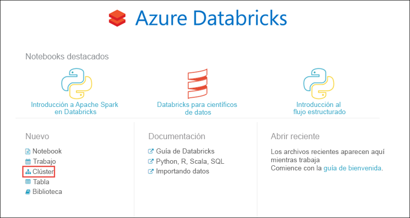
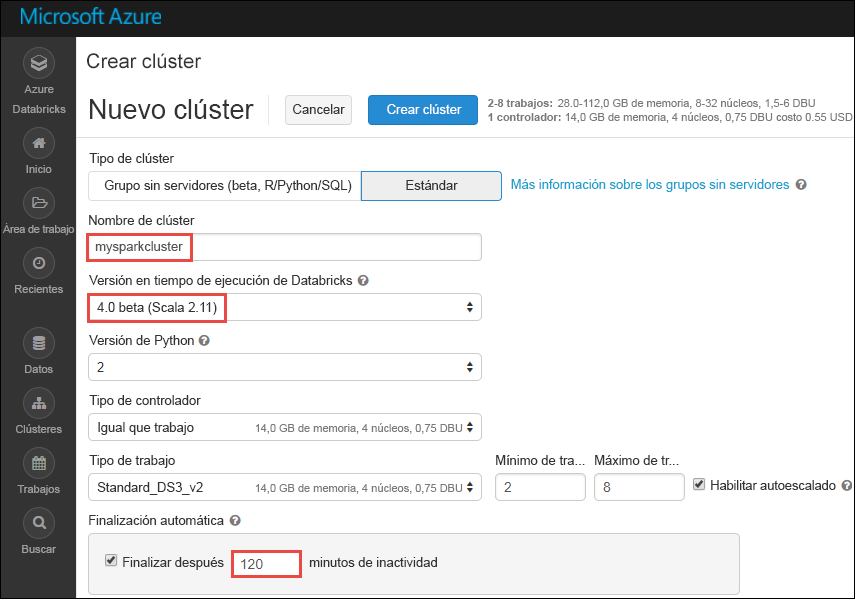

# Tutorial: Análisis de opiniones sobre los datos transmitidos con Azure Databricks

En este tutorial, aprenderá a ejecutar el análisis de opiniones en un flujo de datos en tiempo real mediante Azure Databricks. Para configurar el sistema de ingesta de datos en tiempo real, use Azure Event Hubs. Los mensajes se consumen desde Event Hubs en Azure Databricks mediante el conector Event Hubs para Spark. Por último, utilice Microsoft Cognitive Service APIs para ejecutar el análisis de opiniones de los datos transmitidos. 

Al final de este tutorial, habrá transmitido tweets de Twitter que tengan el término "Azure" y habrá ejecutado el análisis de opiniones en ellos.

La siguiente ilustración muestra el flujo de la aplicación:

En este tutorial se describen las tareas siguientes: 

> [!div class="checklist"]
> * Creación de un área de trabajo de Azure Databricks
> * Creación de un clúster de Spark en Azure Databricks
> * Creación de una aplicación de Twitter para acceder a los datos en tiempo real
> * Creación de cuadernos en Azure Databricks
> * Asociación de bibliotecas a Event Hubs y la API de Twitter
> * Creación de una cuenta de Microsoft Cognitive Services y recuperación de la clave de acceso
> * Envío de tweets a Event Hubs
> * Lectura de tweets desde Event Hubs
> * Ejecución de análisis de opiniones en tweets

Si no tiene una suscripción a Azure, cree una [cuenta gratuita](https://azure.microsoft.com/free/) antes de empezar.

## requisitos previos

Antes de comenzar este tutorial, asegúrese de que se cumplen los requisitos siguientes:
- Un espacio de nombres de Azure Event Hubs.
- Un centro de eventos en el espacio de nombres.
- Una cadena de conexión para acceder al espacio de nombres de Event Hubs. La cadena de conexión debe tener un formato similar a `Endpoint=sb://<namespace>.servicebus.windows.net/;SharedAccessKeyName=<key name>;SharedAccessKey=<key value>”`.
- Un nombre de directiva de acceso compartido y la clave de directiva para Event Hubs.

Puede cumplir estos requisitos siguiendo los pasos descritos en el artículo [Creación de un espacio de nombres y un centro de eventos de Azure Event Hubs](../event-hubs/event-hubs-create.md).

## Iniciar sesión en Azure Portal

Inicie sesión en [Azure Portal](https://portal.azure.com/).

## Creación de un área de trabajo de Azure Databricks

En esta sección, creará un área de trabajo de Azure Databricks mediante Azure Portal. 

1. En Azure Portal, seleccione **Crear un recurso** > **Datos y análisis** > **Azure Databricks (versión preliminar)**.

    

2. En **Azure Databricks (versión preliminar)**, seleccione **Crear**.

3. En **Azure Databricks Service**, proporcione los valores para crear un área de trabajo de Databricks.

    

    Proporcione los valores siguientes: 
     
    |Propiedad  |DESCRIPCIÓN  |
    |---------|---------|
    |**Workspace name** (Nombre del área de trabajo)     | Proporcione un nombre para el área de trabajo de Databricks        |
    |**Suscripción**     | En el cuadro desplegable, seleccione la suscripción de Azure.        |
    |**Grupos de recursos**     | Especifique si desea crear un nuevo grupo de recursos o utilizar uno existente. Un grupo de recursos es un contenedor que almacena los recursos relacionados con una solución de Azure. Para más información, consulte [Información general del grupo de recursos de Azure](../azure-resource-manager/resource-group-overview.md). |
    |**Ubicación**     | Seleccione **Este de EE. UU. 2**. Para otras regiones disponibles, consulte [Productos disponibles por región](https://azure.microsoft.com/regions/services/).        |
    |**Plan de tarifa**     |  Elija entre **Standard** o **Premium**. Para más información sobre estos planes, consulte la [página de precios de Databricks](https://azure.microsoft.com/pricing/details/databricks/).       |

    Seleccione **Anclar al panel** y, después, seleccione **Crear**.

4. La cuenta tarda unos minutos en crearse. Durante la creación de la cuenta, el portal muestra el icono **Enviando implementación para Azure Databricks** a la derecha. Puede que deba desplazarse a la derecha del panel para ver el icono. También hay una barra de progreso que se muestra en la parte superior de la pantalla. Puede ver cualquier área para el progreso.

    

## Creación de un clúster de Spark en Databricks

1. En Azure Portal, vaya al área de trabajo de Databricks que ha creado y, después, seleccione **Launch Workspace** (Iniciar área de trabajo).

2. Se le redirigirá al portal de Azure Databricks. En el portal, seleccione **Cluster**.

    

3. En la página **Nuevo clúster**, proporcione los valores para crear un clúster.

    

    Acepte los demás valores predeterminados, salvo los siguientes:

    * Escriba un nombre para el clúster.
    * Para este artículo, cree un clúster con el runtime **4.0 (beta)**. 
    * Asegúrese de que selecciona la casilla **Terminate after ____ minutes of inactivity** (Terminar después de ____ minutos de inactividad). Proporcione una duración (en minutos) para terminar el clúster, si este no se usa.

    Seleccione **Create cluster** (Crear clúster). Una vez que el clúster se está ejecutando, puede asociarle notebooks y ejecutar trabajos de Spark.

## Crear una aplicación de Twitter

Para recibir un flujo de tweets en tiempo real, debe crear una aplicación en Twitter. Siga los pasos para crear una aplicación de Twitter y anote los valores que necesita para finalizar este tutorial.

1. Desde un explorador web, vaya a [Twitter Application Management](http://twitter.com/app) (Administración de aplicaciones de Twitter) y seleccione **Create New App** (Crear nueva aplicación).

    

2. En la página **Create an application** (Crear una aplicación), proporcione los detalles de la nueva aplicación y, a continuación, seleccione **Create your Twitter application** (Crear su aplicación de Twitter).

    

3. En la página de la aplicación, seleccione la pestaña **Claves y tokens de acceso** y copie los valores de **Consume Key** (Clave de consumidor) y **Consumer Secret** (Secreto de consumidor). Además, seleccione **Create my access token** (Crear mi token de acceso) para generar los tokens de acceso. Copie los valores de **Access Token** (Token de acceso) y **Access Token Secret** (Secreto del token de acceso).

    

Guarde los valores que ha recuperado de la aplicación de Twitter. Necesitará estos valores más adelante en el tutorial.

## Asociación de bibliotecas a un clúster de Spark

En este tutorial, se utilizan las API de Twitter para enviar tweets a Event Hubs. Se utiliza también el [conector de Event Hubs para Apache Spark](https://github.com/Azure/azure-event-hubs-spark) para leer y escribir datos en Azure Event Hubs. Para usar estas API como parte del clúster, puede agregarlas como bibliotecas a Azure Databricks y, a continuación, asociarlas al clúster de Spark. Las instrucciones siguientes muestran cómo agregar la biblioteca a la carpeta **Shared** (Compartidos) del área de trabajo.

1.  En el área de trabajo de Azure Databricks, seleccione **Workspace** (Área de trabajo) y, a continuación, haga clic con el botón derecho en **Shared** (Compartidos). En el menú contextual, seleccione **Create** > **Library** (Crear > Biblioteca).

    

2. En la página New Library (Nueva biblioteca), en **Source** (Origen), seleccione **Maven Coordinate** (Coordenada de Maven). En **Coordinate** (Coordenada), escriba la coordenada del paquete que desea agregar. Estas son las coordenadas de Maven para las bibliotecas que se utilizan en este tutorial:

    * Conector de Event Hubs para Spark: `com.microsoft.azure:azure-eventhubs-spark_2.11:2.3.0`
    * API de Twitter: `org.twitter4j:twitter4j-core:4.0.6`

    

3. Seleccione **Create Library** (Crear biblioteca).

4. Seleccione la carpeta en la que ha agregado la biblioteca y, a continuación, seleccione el nombre de la biblioteca.

    

5. En la página de la biblioteca, seleccione el clúster donde desea utilizar la biblioteca. Una vez que la biblioteca está correctamente asociada con el clúster, el estado cambia inmediatamente a **Attached** (Asociada).

    

6. Repita estos pasos para el paquete de Twitter, `twitter4j-core:4.0.6`.

## Obtención de una clave de acceso de Cognitive Services

En este tutorial, utilizará [Text Analytics APIs de Microsoft Cognitive Services](../cognitive-services/text-analytics/overview.md) para ejecutar análisis de opiniones en una transmisión de tweets en tiempo real. Antes de usar las API, debe crear una cuenta de Microsoft Cognitive Services y recuperar una clave de acceso para usar Text Analytics APIs.

1. Inicie sesión en el [Azure Portal](https://portal.azure.com/).

2. Seleccione **+ Crear un recurso**.
 
3. En Azure Marketplace, seleccione **AI + Cognitive Services** > **Text Analytics API**.

    

4. En el cuadro de diálogo **Create** (Crear), proporcione los siguientes valores:

    

    - Escriba un nombre para la cuenta de Cognitive Services.
    - Seleccione la suscripción en la que se creará la cuenta.
    - Seleccione una ubicación de Azure.
    - Seleccione un plan de tarifa para el servicio. Para más información sobre los precios de Cognitive Services, consulte la [página de precios](https://azure.microsoft.com/pricing/details/cognitive-services/).
    - Especifique si desea crear un nuevo grupo de recursos o seleccionar uno existente.

    Seleccione **Crear**.

5. Una vez creada la cuenta, en la pestaña **Información general**, seleccione **Mostrar claves de acceso**.

    

    Copie también una parte de la dirección URL del punto de conexión, tal y como se muestra en la captura de pantalla. Necesita esta dirección URL en el tutorial.

6. En **Manage keys** (Administrar claves), seleccione el icono de copia en la clave que desea usar.

    

7. Guarde los valores de la dirección URL del punto de conexión y la clave de acceso que recuperó en este paso. Los necesitará más adelante en este tutorial.

## Creación de cuadernos en Databricks

En esta sección, se crearán dos cuadernos en el área de trabajo de Databricks con los nombres siguientes:

- **SendTweetsToEventHub**: un cuaderno de productor que se usa para obtener tweets de Twitter y transmitirlos a Event Hubs.
- **AnalyzeTweetsFromEventHub**: un cuaderno de consumidor que se utiliza para leer los tweets de Event Hubs y ejecutar un análisis de opiniones.

1. En el panel izquierdo, seleccione **Workspace** (Área de trabajo). En la lista desplegable **Workspace** (Área de trabajo), seleccione **Create** (Crear) y, a continuación, haga clic en **Notebook** (Cuaderno).

    

2. En el cuadro de diálogo **Create Notebook** (Crear cuaderno), escriba **SendTweetsToEventHub**, seleccione **Scala** como lenguaje y seleccione el clúster de Spark que creó anteriormente.

    

    Seleccione **Crear**.

3. Repita los pasos para crear el cuaderno **AnalyzeTweetsFromEventHub**.

## Envío de tweets a Event Hubs

En el cuaderno **SendTweetsToEventHub**, pegue el código siguiente y reemplace el marcador de posición por los valores del espacio de nombres de Event Hubs y la aplicación de Twitter que creó anteriormente. Este cuaderno transmite los tweets con la palabra clave "Azure" a Event Hubs en tiempo real.

    import java.util._
    import scala.collection.JavaConverters._
    import com.microsoft.azure.eventhubs._
    import java.util.concurrent._
    
    val namespaceName = "<EVENT HUBS NAMESPACE>"
    val eventHubName = "<EVENT HUB NAME>"
    val sasKeyName = "<POLICY NAME>"
    val sasKey = "<POLICY KEY>"
    val connStr = new ConnectionStringBuilder()
                .setNamespaceName(namespaceName)
                .setEventHubName(eventHubName)
                .setSasKeyName(sasKeyName)
                .setSasKey(sasKey)
    
    val pool = Executors.newFixedThreadPool(1)
    val eventHubClient = EventHubClient.create(connStr.toString(), pool)
    
    def sendEvent(message: String) = {
      val messageData = EventData.create(message.getBytes("UTF-8"))
      eventHubClient.get().send(messageData) 
      System.out.println("Sent event: " + message + "\n")
    }
    
    import twitter4j._
    import twitter4j.TwitterFactory
    import twitter4j.Twitter
    import twitter4j.conf.ConfigurationBuilder
    
    // Twitter configuration!
    // Replace values below with yours
    
    val twitterConsumerKey = "<CONSUMER KEY>"
    val twitterConsumerSecret = "<CONSUMER SECRET>"
    val twitterOauthAccessToken = "<ACCESS TOKEN>"
    val twitterOauthTokenSecret = "<TOKEN SECRET>"
    
    val cb = new ConfigurationBuilder()
      cb.setDebugEnabled(true)
      .setOAuthConsumerKey(twitterConsumerKey)
      .setOAuthConsumerSecret(twitterConsumerSecret)
      .setOAuthAccessToken(twitterOauthAccessToken)
      .setOAuthAccessTokenSecret(twitterOauthTokenSecret)
    
    val twitterFactory = new TwitterFactory(cb.build())
    val twitter = twitterFactory.getInstance()
    
    // Getting tweets with keyword "Azure" and sending them to the Event Hub in realtime!
    
    val query = new Query(" #Azure ")
    query.setCount(100)
    query.lang("en")
    var finished = false
    while (!finished) {
      val result = twitter.search(query) 
      val statuses = result.getTweets()
      var lowestStatusId = Long.MaxValue
      for (status <- statuses.asScala) {
        if(!status.isRetweet()){ 
          sendEvent(status.getText())
        }
        lowestStatusId = Math.min(status.getId(), lowestStatusId)
        Thread.sleep(2000)
      }
      query.setMaxId(lowestStatusId - 1)
    }
    
    // Closing connection to the Event Hub
    eventHubClient.get().close()

Presione **MAYÚS + ENTRAR** para ejecutar el cuaderno. Verá una salida similar al siguiente fragmento de código. Cada evento de la salida es un tweet en tiempo real que se ingiere en Event Hubs. 

    Sent event: @Microsoft and @Esri launch Geospatial AI on Azure https://t.co/VmLUCiPm6q via @geoworldmedia #geoai #azure #gis #ArtificialIntelligence

    Sent event: Public preview of Java on App Service, built-in support for Tomcat and OpenJDK
    https://t.co/7vs7cKtvah 
    #cloudcomputing #Azure
    
    Sent event: 4 Killer #Azure Features for #Data #Performance https://t.co/kpIb7hFO2j by @RedPixie
    
    Sent event: Migrate your databases to a fully managed service with Azure SQL Database Managed Instance | #Azure | #Cloud https://t.co/sJHXN4trDk
    
    Sent event: Top 10 Tricks to #Save Money with #Azure Virtual Machines https://t.co/F2wshBXdoz #Cloud
    
    ...
    ...

## Lectura de tweets desde Event Hubs

En el cuaderno **AnalyzeTweetsFromEventHub**, pegue el código siguiente y reemplace los marcadores de posición por los valores de la instancia de Azure Event Hubs que creó anteriormente. Este cuaderno lee los tweets que transmitió anteriormente a Event Hubs usando el cuaderno **SendTweetsToEventHub**.

    import org.apache.spark.eventhubs._

    // Build connection string with the above information 
    val connectionString = ConnectionStringBuilder("<EVENT HUBS CONNECTION STRING>")
      .setEventHubName("<EVENT HUB NAME>")
      .build
    
    val customEventhubParameters = 
      EventHubsConf(connectionString)
      .setMaxEventsPerTrigger(5)
    
    val incomingStream = spark.readStream.format("eventhubs").options(customEventhubParameters.toMap).load()
    
    incomingStream.printSchema
    
    // Sending the incoming stream into the console.
    // Data comes in batches!
    incomingStream.writeStream.outputMode("append").format("console").option("truncate", false).start().awaitTermination()

Obtendrá la siguiente salida:

  
    root
     |-- body: binary (nullable = true)
     |-- offset: long (nullable = true)
     |-- seqNumber: long (nullable = true)
     |-- enqueuedTime: long (nullable = true)
     |-- publisher: string (nullable = true)
     |-- partitionKey: string (nullable = true)
   
    -------------------------------------------
    Batch: 0
    -------------------------------------------
    +------+------+--------------+---------------+---------+------------+
    |body  |offset|sequenceNumber|enqueuedTime   |publisher|partitionKey|
    +------+------+--------------+---------------+---------+------------+
    |[50 75 62 6C 69 63 20 70 72 65 76 69 65 77 20 6F 66 20 4A 61 76 61 20 6F 6E 20 41 70 70 20 53 65 72 76 69 63 65 2C 20 62 75 69 6C 74 2D 69 6E 20 73 75 70 70 6F 72 74 20 66 6F 72 20 54 6F 6D 63 61 74 20 61 6E 64 20 4F 70 65 6E 4A 44 4B 0A 68 74 74 70 73 3A 2F 2F 74 2E 63 6F 2F 37 76 73 37 63 4B 74 76 61 68 20 0A 23 63 6C 6F 75 64 63 6F 6D 70 75 74 69 6E 67 20 23 41 7A 75 72 65]                              |0     |0             |2018-03-09 05:49:08.86 |null     |null        |
    |[4D 69 67 72 61 74 65 20 79 6F 75 72 20 64 61 74 61 62 61 73 65 73 20 74 6F 20 61 20 66 75 6C 6C 79 20 6D 61 6E 61 67 65 64 20 73 65 72 76 69 63 65 20 77 69 74 68 20 41 7A 75 72 65 20 53 51 4C 20 44 61 74 61 62 61 73 65 20 4D 61 6E 61 67 65 64 20 49 6E 73 74 61 6E 63 65 20 7C 20 23 41 7A 75 72 65 20 7C 20 23 43 6C 6F 75 64 20 68 74 74 70 73 3A 2F 2F 74 2E 63 6F 2F 73 4A 48 58 4E 34 74 72 44 6B]            |168   |1             |2018-03-09 05:49:24.752|null     |null        | 
    +------+------+--------------+---------------+---------+------------+
    
    -------------------------------------------
    Batch: 1
    -------------------------------------------
    ...
    ...

Dado que la salida está en modo binario, utilice el siguiente fragmento de código para convertirla en una cadena.

    import org.apache.spark.sql.types._
    import org.apache.spark.sql.functions._
    
    // Event Hub message format is JSON and contains "body" field
    // Body is binary, so we cast it to string to see the actual content of the message
    val messages = 
      incomingStream
      .withColumn("Offset", $"offset".cast(LongType))
      .withColumn("Time (readable)", $"enqueuedTime".cast(TimestampType))
      .withColumn("Timestamp", $"enqueuedTime".cast(LongType))
      .withColumn("Body", $"body".cast(StringType))
      .select("Offset", "Time (readable)", "Timestamp", "Body")
    
    messages.printSchema
    
    messages.writeStream.outputMode("append").format("console").option("truncate", false).start().awaitTermination()

Ahora, la salida será similar al siguiente fragmento de código:

    root
     |-- Offset: long (nullable = true)
     |-- Time (readable): timestamp (nullable = true)
     |-- Timestamp: long (nullable = true)
     |-- Body: string (nullable = true)
    
    -------------------------------------------
    Batch: 0
    -------------------------------------------
    +------+-----------------+----------+-------+
    |Offset|Time (readable)  |Timestamp |Body
    +------+-----------------+----------+-------+
    |0     |2018-03-09 05:49:08.86 |1520574548|Public preview of Java on App Service, built-in support for Tomcat and OpenJDK
    https://t.co/7vs7cKtvah 
    #cloudcomputing #Azure          |
    |168   |2018-03-09 05:49:24.752|1520574564|Migrate your databases to a fully managed service with Azure SQL Database Managed Instance | #Azure | #Cloud https://t.co/sJHXN4trDk    |
    |0     |2018-03-09 05:49:02.936|1520574542|@Microsoft and @Esri launch Geospatial AI on Azure https://t.co/VmLUCiPm6q via @geoworldmedia #geoai #azure #gis #ArtificialIntelligence|
    |176   |2018-03-09 05:49:20.801|1520574560|4 Killer #Azure Features for #Data #Performance https://t.co/kpIb7hFO2j by @RedPixie                                                    |
    +------+-----------------+----------+-------+
    -------------------------------------------
    Batch: 1
    -------------------------------------------
    ...
    ...

## Ejecución de análisis de opiniones en tweets

En esta sección, se ejecuta el análisis de opiniones en los tweets recibidos mediante la API de Twitter. En esta sección, agregará los fragmentos de código al mismo cuaderno **AnalyzeTweetsFromEventHub**.

Empiece por agregar una nueva celda de código en cuaderno y pegue el fragmento de código que se proporciona a continuación. Este fragmento de código define los tipos de datos para trabajar con Language and Sentiment API.

    import java.io._
    import java.net._
    import java.util._    

    class Document(var id: String, var text: String, var language: String = "", var sentiment: Double = 0.0) extends Serializable 

    class Documents(var documents: List[Document] = new ArrayList[Document]()) extends Serializable {
    
        def add(id: String, text: String, language: String = "") {
            documents.add (new Document(id, text, language))
        }
        def add(doc: Document) {
            documents.add (doc)
        }
    }

Agregue una nueva celda de código y pegue el fragmento de código siguiente. Este fragmento de código es necesario para analizar las cadenas JSON.

    class CC[T] extends Serializable { def unapply(a:Any):Option[T] = Some(a.asInstanceOf[T]) }
    object M extends CC[scala.collection.immutable.Map[String, Any]]
    object L extends CC[scala.collection.immutable.List[Any]]
    object S extends CC[String]
    object D extends CC[Double]

Agregue una nueva celda de código y pegue el fragmento de código siguiente. Este fragmento de código define un objeto que contiene las funciones para llamar a Text Analysis API para ejecutar el análisis de opiniones y la detección del idioma. Asegúrese de reemplazar los marcadores de posición `<PROVIDE ACCESS KEY HERE>` y `<PROVIDE HOST HERE>` por los valores recuperados para su cuenta de Cognitive Services.

    import javax.net.ssl.HttpsURLConnection
    import com.google.gson.Gson
    import com.google.gson.GsonBuilder
    import com.google.gson.JsonObject
    import com.google.gson.JsonParser
    import scala.util.parsing.json._
    
    object SentimentDetector extends Serializable {
      
      // Cognitive Services API connection settings
      val accessKey = "<PROVIDE ACCESS KEY HERE>"
      val host = "<PROVIDE HOST HERE>"
      val languagesPath = "/text/analytics/v2.0/languages"
      val sentimentPath = "/text/analytics/v2.0/sentiment"
      val languagesUrl = new URL(host+languagesPath)
      val sentimenUrl = new URL(host+sentimentPath)
      
      def getConnection(path: URL): HttpsURLConnection = {
        val connection = path.openConnection().asInstanceOf[HttpsURLConnection]
        connection.setRequestMethod("POST")
        connection.setRequestProperty("Content-Type", "text/json")
        connection.setRequestProperty("Ocp-Apim-Subscription-Key", accessKey)
        connection.setDoOutput(true)
        return connection
      }
      
      def prettify (json_text: String): String = {
        val parser = new JsonParser()
        val json = parser.parse(json_text).getAsJsonObject()
        val gson = new GsonBuilder().setPrettyPrinting().create()
        return gson.toJson(json)
      }
      
      // Handles the call to Cognitive Services API.
      // Expects Documents as parameters and the address of the API to call.
      // Returns an instance of Documents in response.
      def processUsingApi(inputDocs: Documents, path: URL): String = {
        val docText = new Gson().toJson(inputDocs)
        val encoded_text = docText.getBytes("UTF-8")
        val connection = getConnection(path)
        val wr = new DataOutputStream(connection.getOutputStream())
        wr.write(encoded_text, 0, encoded_text.length)
        wr.flush()
        wr.close()
    
        val response = new StringBuilder()
        val in = new BufferedReader(new InputStreamReader(connection.getInputStream()))
        var line = in.readLine()
        while (line != null) {
            response.append(line)
            line = in.readLine()
        }
        in.close()
        return response.toString()
      }
      
      // Calls the language API for specified documents.
      // Returns a documents with language field set.
      def getLanguage (inputDocs: Documents): Documents = { 
        try {
          val response = processUsingApi(inputDocs, languagesUrl)
          // In case we need to log the json response somewhere
          val niceResponse = prettify(response)
          val docs = new Documents()
          val result = for {
                // Deserializing the JSON response from the API into Scala types
                Some(M(map)) <- scala.collection.immutable.List(JSON.parseFull(niceResponse))
                L(documents) = map("documents")
                M(document) <- documents
                S(id) = document("id")
                L(detectedLanguages) = document("detectedLanguages")
                M(detectedLanguage) <- detectedLanguages
                S(language) = detectedLanguage("iso6391Name")
          } yield {
                docs.add(new Document(id = id, text = id, language = language))
          }
          return docs
        } catch {
              case e: Exception => return new Documents()
        }
      }
      
      // Calls the sentiment API for specified documents. Needs a language field to be set for each of them.
      // Returns documents with sentiment field set, taking a value in the range from 0 to 1.
      def getSentiment (inputDocs: Documents): Documents = {
        try {
          val response = processUsingApi(inputDocs, sentimenUrl)
          val niceResponse = prettify(response)
          val docs = new Documents()
          val result = for {
                // Deserializing the JSON response from the API into Scala types
                Some(M(map)) <- scala.collection.immutable.List(JSON.parseFull(niceResponse))
                L(documents) = map("documents")
                M(document) <- documents
                S(id) = document("id")
                D(sentiment) = document("score")
          } yield {
                docs.add(new Document(id = id, text = id, sentiment = sentiment))
          }
          return docs
        } catch {
            case e: Exception => return new Documents()
        }
      }
    }
    
    // User Defined Function for processing content of messages to return their sentiment.
    val toSentiment = udf((textContent: String) => {
      val inputDocs = new Documents()
      inputDocs.add (textContent, textContent)
      val docsWithLanguage = SentimentDetector.getLanguage(inputDocs)
      val docsWithSentiment = SentimentDetector.getSentiment(docsWithLanguage)
      if (docsWithLanguage.documents.isEmpty) {
        // Placeholder value to display for no score returned by the sentiment API
        (-1).toDouble
      } else {
        docsWithSentiment.documents.get(0).sentiment.toDouble
      }
    })

Agregue una celda de código final para preparar una trama de datos con el contenido del tweet y las opiniones asociadas al tweet.

    // Prepare a dataframe with Content and Sentiment columns
    val streamingDataFrame = incomingStream.selectExpr("cast (body as string) AS Content").withColumn("Sentiment", toSentiment($"Content"))
    
    // Display the streaming data with the sentiment
    streamingDataFrame.writeStream.outputMode("append").format("console").option("truncate", false).start().awaitTermination()

Debe ver algo parecido al siguiente fragmento de código:

    -------------------------------------------
    Batch: 0
    -------------------------------------------
    +--------------------------------+------------------+
    |Content                         |Sentiment         |
    +--------------------------------+------------------+
    |Public preview of Java on App Service, built-in support for Tomcat and OpenJDK
    https://t.co/7vs7cKtvah   #cloudcomputing #Azure          |0.7761918306350708|
    |Migrate your databases to a fully managed service with Azure SQL Database Managed Instance | #Azure | #Cloud https://t.co/sJHXN4trDk    |0.8558163642883301|
    |@Microsoft and @Esri launch Geospatial AI on Azure https://t.co/VmLUCiPm6q via @geoworldmedia #geoai #azure #gis #ArtificialIntelligence|0.5               |
    |4 Killer #Azure Features for #Data #Performance https://t.co/kpIb7hFO2j by @RedPixie                                                    |0.5               |
    +--------------------------------+------------------+ 

Un valor cercano a **1** en la columna **Sentiment** (Opiniones) sugiere una gran experiencia con Azure. Un valor cercano a **0** sugiere que los usuarios tienen problemas cuando trabajan con Microsoft Azure. 

Eso es todo. Con Azure Databricks, ha transmitido correctamente datos en tiempo real a Azure Event Hubs, ha consumido los flujos de datos mediante el conector de Event Hubs y, a continuación, ha ejecutado el análisis de opiniones en los datos transmitidos.

## Limpieza de recursos

Cuando haya terminado de ejecutar el tutorial, puede finalizar el clúster. Para ello, desde el área de trabajo de Azure Databricks, en el panel izquierdo, seleccione **Clusters** (Clústeres). En el clúster que desea finalizar, mueva el cursor sobre el botón de puntos suspensivos en la columna **Actions** (Acciones) y seleccione el icono **Terminate** (Finalizar).

Si no finaliza manualmente el clúster, este se detendrá automáticamente si seleccionó la casilla **Terminate after __ minutes of inactivity** (Finalizar después de __ minutos de inactividad) al crear el clúster. En tal caso, el clúster se detendrá automáticamente si ha estado inactivo durante el tiempo especificado.

## Pasos siguientes 
En este tutorial, aprendió a utilizar Azure Databricks para transmitir datos a Azure Event Hubs y, después, leyó los datos transmitidos desde Event Hubs en tiempo real. Ha aprendido a:
> [!div class="checklist"]
> * Creación de un área de trabajo de Azure Databricks
> * Creación de un clúster de Spark en Azure Databricks
> * Creación de una aplicación de Twitter para acceder a los datos en tiempo real
> * Creación de cuadernos en Azure Databricks
> * Agregue y asocie las bibliotecas a Event Hubs y la API de Twitter
> * Creación de una cuenta de Microsoft Cognitive Services y recuperación de la clave de acceso
> * Envío de tweets a Event Hubs
> * Lectura de tweets desde Event Hubs
> * Ejecución de análisis de opiniones en tweets

Continúe con el tutorial siguiente para aprender cómo realizar tareas de aprendizaje automático mediante Azure Databricks.

> [!div class="nextstepaction"]
>[Aprendizaje automático con Azure Databricks](https://docs.azuredatabricks.net/spark/latest/mllib/decision-trees.html)
