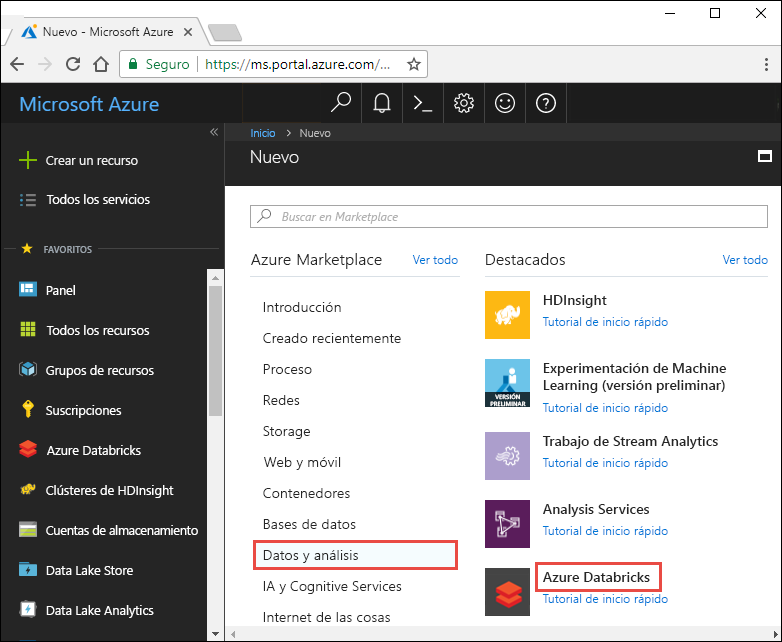
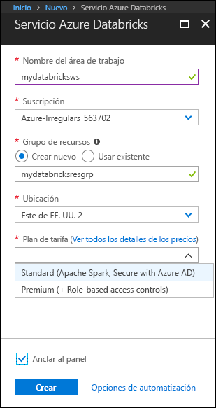
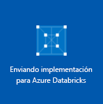
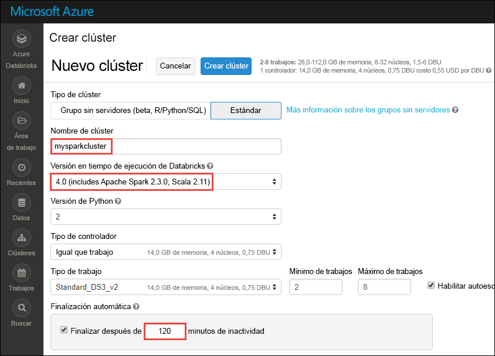
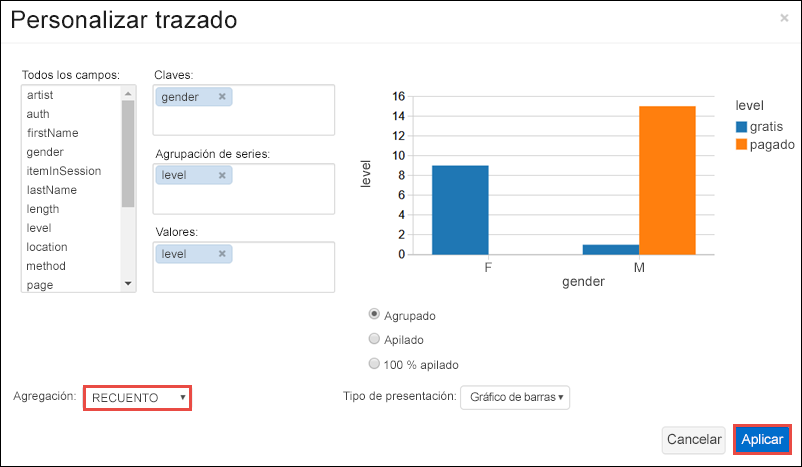
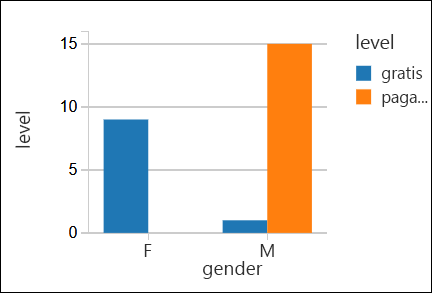

# <a name="quickstart-run-a-spark-job-on-azure-databricks-using-the-azure-portal"></a>Guía de inicio rápido: ejecución de un trabajo de Spark en Azure Databricks con Azure Portal

Esta guía de inicio rápido muestra cómo crear un área de trabajo de Azure Databricks y un clúster de Apache Spark dentro de esa área de trabajo. Por último, aprenderá a ejecutar un trabajo de Spark en el clúster de Databricks. Para obtener más información sobre Azure Databricks, vea [¿Qué es Azure Databricks?](what-is-azure-databricks.md)

Si no tiene una suscripción a Azure, cree una [cuenta gratuita](https://azure.microsoft.com/free/) antes de empezar.

## <a name="log-in-to-the-azure-portal"></a>Iniciar sesión en Azure Portal

Inicie sesión en [Azure Portal](https://portal.azure.com).

## <a name="create-a-databricks-workspace"></a>Creación de un área de trabajo de Databricks

En esta sección, creará un área de trabajo de Azure Databricks mediante Azure Portal. 

1. En Azure Portal, haga clic en **Crear un recurso**, haga clic en **Datos y análisis** y, a continuación, haga clic en **Azure Databricks (versión preliminar)**. 

    

2. En **Azure Databricks (versión preliminar)**, haga clic en **Crear**.

3. En **Servicio Azure Databricks**, proporcione los valores siguientes:

    

    * En **Nombre de área de trabajo**, proporcione un nombre para el área de trabajo de Databricks.
    * En **Suscripción**, en el cuadro desplegable, seleccione su suscripción de Azure.
    * Para **Grupo de recursos**, especifique si desea crear un grupo de recursos o utilizar uno existente. Un grupo de recursos es un contenedor que almacena los recursos relacionados con una solución de Azure. Para más información, consulte [Información general del grupo de recursos de Azure](../azure-resource-manager/resource-group-overview.md).
    * En **Ubicación**, seleccione **Este de EE.UU. 2**. Para otras regiones disponibles, consulte [Productos disponibles por región](https://azure.microsoft.com/regions/services/).
    * En **Plan de tarifa**, seleccione **Estándar** o **Premium**. Para más información sobre estos planes, consulte la [página de precios de Databricks](https://azure.microsoft.com/pricing/details/databricks/).

    Haga clic en **Create**(Crear).

4. La cuenta tarda unos minutos en crearse. Durante la creación de cuentas el portal, se muestra el icono **Implementando Azure Databricks** a la derecha. Puede que deba desplazarse a la derecha del panel para ver el icono. También hay una barra de progreso que se muestra en la parte superior de la pantalla. Puede ver cualquier área para el progreso.

    

## <a name="create-a-spark-cluster-in-databricks"></a>Creación de un clúster de Spark en Databricks

1. En Azure Portal, vaya al área de trabajo de Databricks que ha creado y, después, haga clic en **Launch Workspace** (Iniciar área de trabajo).

2. Se le redirigirá al portal de Azure Databricks. Desde el portal, haga clic en **Clúster**.

    

3. En la página **Nuevo clúster**, proporcione los valores para crear un clúster.

    

    * Escriba un nombre para el clúster.
    * Para este artículo, cree un clúster con el entorno en tiempo de ejecución **4.0**. 
    * Asegúrese de que selecciona la casilla **Terminate after ____ minutes of inactivity** (Terminar después de ____ minutos de inactividad). Proporcione una duración (en minutos) para terminar el clúster, si este no se usa.
    * Acepte los demás valores predeterminados. 
    * Haga clic en **Crear clúster**. Una vez que el clúster se está ejecutando, puede asociarle notebooks y ejecutar trabajos de Spark.

Para obtener más información sobre la creación de clústeres, consulte [Create a Spark cluster in Azure Databricks](https://docs.azuredatabricks.net/user-guide/clusters/create.html) (Creación de un clúster de Spark en Azure Databricks).

## <a name="run-a-spark-sql-job"></a>Ejecución de un trabajo de Spark SQL

Antes de empezar esta sección, debe completar lo siguientes requisitos previos:

* [Creación de una cuenta de almacenamiento de Azure](../storage/common/storage-create-storage-account.md#create-a-storage-account). 
* Descargue el archivo JSON de ejemplo [ desde GitHub](https://github.com/Azure/usql/blob/master/Examples/Samples/Data/json/radiowebsite/small_radio_json.json). 
* Cargue el archivo JSON de ejemplo en la cuenta de almacenamiento de Azure que creó. Puede usar [Explorador de Microsoft Azure Storage](../vs-azure-tools-storage-manage-with-storage-explorer.md) para cargar archivos.

Realice los pasos siguientes para crear un notebook en Databricks, configúrelo para leer los datos de una cuenta de Azure Blob Storage y, a continuación, ejecute un trabajo de Spark SQL en los datos.

1. En el panel izquierdo, haga clic en **Área de trabajo**. Desde la lista desplegable **Área de trabajo**, haga clic en **Crear** y, a continuación, haga clic en **Notebook**.

    

2. En el cuadro de diálogo **Creación de notebook**, escriba un nombre, seleccione **Scala** como lenguaje y seleccione el clúster de Spark que creó anteriormente.

    

    Haga clic en **Create**(Crear).

3. En este paso, asocie la cuenta de Azure Storage con el clúster de Databricks Spark. Hay dos maneras de hacerlo: montar la cuenta de Azure Storage para el sistema de archivos de Databricks (DBFS) o acceder directamente a la cuenta de Azure Storage desde la aplicación que cree.  

    > [!IMPORTANT]
    >En este artículo se utiliza el **enfoque para montar el almacenamiento con DBFS**. Este enfoque garantiza que el almacenamiento montado se asocia con el propio sistema de archivos del clúster. De esa forma, cualquier aplicación que acceda al clúster puede usar también el almacenamiento asociado. El enfoque del acceso directo está limitado a la aplicación desde donde se configura el acceso.
    >
    > Para usar el enfoque del montaje, es preciso crear un clúster de Spark con la versión **4.0** del entorno en tiempo de ejecución de Databricks, que es lo que ha elegido en este artículo.

    En el siguiente fragmento de código, reemplace `{YOUR CONTAINER NAME}`, `{YOUR STORAGE ACCOUNT NAME}` y `{YOUR STORAGE ACCOUNT ACCESS KEY}` por los valores adecuados de su cuenta de Azure Storage. Pegue el fragmento de código siguiente en una celda vacía del notebook y, después, presione MAYÚS + ENTRAR para ejecutar la celda de código.

    * **Montaje de la cuenta de almacenamiento con DBFS (se recomienda)**. En este fragmento de código, la ruta de acceso de la cuenta de Azure Storage se monta en `/mnt/mypath`. Por consiguiente, en todas las futuras ocurrencias en las que acceda a la cuenta de Azure Storage no es preciso que dé la ruta de acceso completa. Puede utilizar `/mnt/mypath`.

          dbutils.fs.mount(
            source = "wasbs://{YOUR CONTAINER NAME}@{YOUR STORAGE ACCOUNT NAME}.blob.core.windows.net/",
            mountPoint = "/mnt/mypath",
            extraConfigs = Map("fs.azure.account.key.{YOUR STORAGE ACCOUNT NAME}.blob.core.windows.net" -> "{YOUR STORAGE ACCOUNT ACCESS KEY}"))

    * **Acceso directo a la cuenta de almacenamiento**

          spark.conf.set("fs.azure.account.key.{YOUR STORAGE ACCOUNT NAME}.blob.core.windows.net", "{YOUR STORAGE ACCOUNT ACCESS KEY}")

    Para obtener instrucciones acerca de cómo recuperar la clave de la cuenta de almacenamiento, consulte [Administración de claves de acceso de almacenamiento](../storage/common/storage-create-storage-account.md#manage-your-storage-account).

    > [!NOTE]
    > También puede usar Azure Data Lake Store con un clúster de Spark en Azure Databricks. Para obtener instrucciones, consulte [Use Data Lake Store with Azure Databricks](https://go.microsoft.com/fwlink/?linkid=864084) (Uso de Data Lake Store con Azure Databricks).

4. Ejecute una instrucción SQL para crear una tabla temporal con datos desde el archivo de datos JSON de ejemplo, **small_radio_json.json**. En el siguiente fragmento de código, reemplace los valores del marcador de posición con el nombre del contenedor y el nombre de la cuenta de almacenamiento. Pegue el fragmento de código en una celda vacía del notebook y, después, presione MAYÚS + ENTRAR. En el fragmento de código, `path` indica la ubicación del archivo JSON de ejemplo que cargó en su cuenta de Azure Storage.

    ```sql
    %sql 
    DROP TABLE IF EXISTS radio_sample_data
    CREATE TABLE radio_sample_data
    USING json
    OPTIONS (
     path "/mnt/mypath/small_radio_json.json"
    )
    ```

    Una vez que el comando se completa correctamente, tiene todos los datos desde el archivo JSON como una tabla en el clúster de Databricks.

    El comando mágico del lenguaje `%sql` le permite ejecutar un código SQL desde el notebook, aunque este sea de otro tipo. Para obtener más información, consulte [Combinación de lenguajes en un notebook](https://docs.azuredatabricks.net/user-guide/notebooks/index.html#mixing-languages-in-a-notebook).

5. Echemos un vistazo a una instantánea de los datos JSON de ejemplo para entender mejor la consulta que ejecutamos. Pegue el siguiente fragmento de código en una celda vacía y presione **MAYÚS + ENTRAR**.

    ```sql
    %sql 
    SELECT * from radio_sample_data
    ```

6. Verá un resultado tabular como se muestra en la siguiente captura de pantalla (solo se ven algunas columnas):

    

    Entre otros detalles, los datos de ejemplo capturan el género de la audiencia de un canal de radio (nombre de columna, **género**) y si su suscripción es gratis o de pago (nombre de columna, **nivel**).

7. Ahora cree una representación visual de estos datos para mostrar para cada género, cuántos usuarios tienen cuentas gratis y cuántas son de suscriptores pagados. En la parte inferior de la salida tabular, haga clic en el icono **Gráfico de barras** y, a continuación, haga clic en **Opciones de trazado**.

    

8. En **Personalizar trazado**, arrastre y coloque los valores como se muestra en la captura de pantalla.

    

    * Establezca **Claves** en **gender** (género).
    * Establezca **Agrupaciones de serie** en **level** (nivel).
    * Establezca **Valores** en **level** (nivel).
    * Establezca **Agregación** en **COUNT** (recuento).

    Haga clic en **Aplicar**.

9. El resultado muestra la representación visual, como se describe en la siguiente captura de pantalla:

     

## <a name="clean-up-resources"></a>Limpieza de recursos

Al crear el clúster de Spark, si ha activado la casilla **Terminar después de ___ minutos de actividad**, el clúster se terminará automáticamente si ha estado inactivo durante el tiempo especificado.

Si no activó la casilla, debe terminar el clúster manualmente. Para ello, desde el área de trabajo de Azure Databricks, en el panel izquierdo, haga clic en **Clústeres**. En el clúster que desea terminar, mueva el cursor sobre el botón de puntos suspensivos en la columna **Acciones** y haga clic en el icono **Terminar**.


## <a name="next-steps"></a>Pasos siguientes

En este artículo, creó un clúster de Spark en Azure Databricks y ejecutó un trabajo de Spark utilizando los datos de Azure Storage. También puede mirar [Spark data sources](https://docs.azuredatabricks.net/spark/latest/data-sources/index.html) (Orígenes de datos de Spark) para aprender a importar datos desde otros orígenes de datos en Azure Databricks. Siga con el siguiente artículo para aprender a usar Azure Data Lake Store con Azure Databricks.

> [!div class="nextstepaction"]
>[Use Data Lake Store with Azure Databricks](https://go.microsoft.com/fwlink/?linkid=864084) (Uso de Data Lake Store con Azure Databricks)
