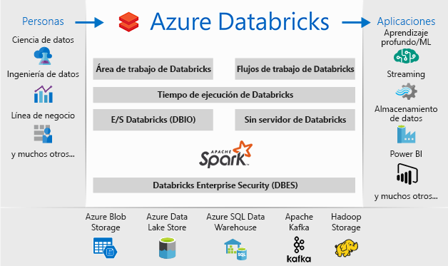

# ¿Qué es Azure Databricks?

Azure Databricks es una plataforma de análisis basada en Apache Spark optimizada para la plataforma de servicios en la nube de Microsoft Azure. Diseñada por los fundadores de Apache Spark, Databricks está integrado con Azure para proporcionar una configuración con un solo clic, flujos de trabajo optimizados y un área de trabajo interactiva que permite la colaboración entre científicos de datos, ingenieros de datos y analistas empresariales.

## Plataforma de análisis basada en Apache Spark

Azure Databricks consta de las tecnologías y funcionalidades de clúster de Apache Spark de código abierto integrales. En Azure Databricks, Spark incluye los siguientes componentes:

* **Spark SQL y las tramas de datos**: Spark SQL es el módulo de Spark para trabajar con datos estructurados. Una trama de datos es una colección distribuida de datos que se organizan en columnas con nombre. Es conceptualmente equivalente a una tabla en una base de datos relacional o a una trama de datos en R/Python.

* **Streaming**: procesamiento y análisis de datos en tiempo real para aplicaciones analíticas e interactivas. Se integra con HDFS, Flume y Kafka.

* **MLib**: biblioteca de Machine Learning que consta de algoritmos y utilidades de aprendizaje comunes, como la clasificación, la regresión, la agrupación en clústeres, el filtrado colaborativo, la reducción de dimensionalidad, y las primitivas de optimización subyacentes.

* **GraphX**: gráficos y cálculo gráfico para una amplia gama de casos de uso, desde los análisis cognitivos hasta la exploración de datos.

* **Spark Core API**: incluye compatibilidad con R, SQL, Python, Scala y Java.

## Apache Spark en Azure Databricks

Azure Databricks proporciona una plataforma en la nube sin administración basada en las funcionalidades de Spark que incluye:

- Clústeres de Spark completamente administrados
- Un área de trabajo interactiva de exploración y visualización
- Una plataforma para activar las aplicaciones favoritas basadas en Spark

### Clústeres de Apache Spark completamente administrados en la nube

Azure Databricks tiene un entorno de producción seguro y confiable en la nube, administrado y con el soporte técnico de expertos en Spark. Puede:

* Crear clústeres en segundos.
* Escalar y reducir clústeres automática y dinámicamente en vertical (clústeres sin servidor incluidos) y compartirlos entre equipos. 
* Usar clústeres mediante programación con las API de REST. 
* Utilizar funcionalidades seguras de integración de datos basadas en Spark que permiten unificar los datos sin centralización. 
* Acceder inmediatamente a las últimas características de Apache Spark con cada versión.

### Entorno de tiempo de ejecución de Databricks
El entorno de tiempo de ejecución de Databricks se basa en Apache Spark y se ha creado de forma nativa para la nube de Azure. 

Con la opción **Serverless** (Sin servidor), Azure Databricks elimina completamente la complejidad de la infraestructura y la necesidad de experiencia especializada para instalar y configurar la infraestructura de datos. La opción Serverless (Sin servidor) ayuda a los científicos de datos a iterar rápidamente como equipo.

Para los ingenieros de datos, a quienes interesa el rendimiento de las tareas de producción, Azure Databricks proporciona un motor de Spark más rápido y eficiente gracias a varias optimizaciones en la capa de E/S y la de procesamiento (Databricks E/S).

### Área de trabajo para la colaboración

A través de un entorno de colaboración integrado, Azure Databricks optimiza el proceso de exploración de datos, la creación de prototipos y la ejecución de aplicaciones basadas en datos en Spark.

* Determine cómo usar los datos con una exploración de datos sencilla.
* Documente el progreso en blocs de notas en R, Python, Scala o SQL.
* Visualice los datos en unos clics y use herramientas conocidas como Matplotlib, ggplot o d3.
* Use paneles interactivos para crear informes dinámicos.
* Use Spark e interactúe con los datos al mismo tiempo.

## Seguridad de la empresa

Azure Databricks proporciona seguridad empresarial de Azure, incluida la integración de Azure Active Directory, controles basados en roles y Acuerdos de Nivel de Servicio que protegen los datos y la empresa.

* La integración con Azure Active Directory permite ejecutar soluciones completas basadas en Azure con Azure Databricks.
* El acceso basado en roles de Azure Databricks permite permisos de usuario específicos para los cuadernos, los clústeres, los trabajos y los datos.
* Acuerdos de Nivel de Servicio de clase empresarial. 

## Integración con servicios de Azure

Azure Databricks se integra totalmente con las bases de datos y los almacenes de Azure: SQL Data Warehouse, Cosmos DB, Data Lake Store y Blob Storage. 

## Integración con Power BI
Mediante la integración enriquecida con Power BI, Azure Databricks permite detectar y compartir información potente de manera rápida y sencilla. También puede usar otras herramientas de BI, como Tableau Software, a través de puntos de conexión de clúster de JDBC/ODBC.

## pasos siguientes

* [Guía de inicio rápido: ejecución de un trabajo de Spark en Azure Databricks](quickstart-create-databricks-workspace-portal.md)
* [Uso de los clústeres de Spark](https://docs.azuredatabricks.net/user-guide/clusters/index.html)
* [Uso de cuadernos](https://docs.azuredatabricks.net/user-guide/notebooks/index.html)
* [Creación de trabajos de Spark](https://docs.azuredatabricks.net/user-guide/jobs.html)

 

