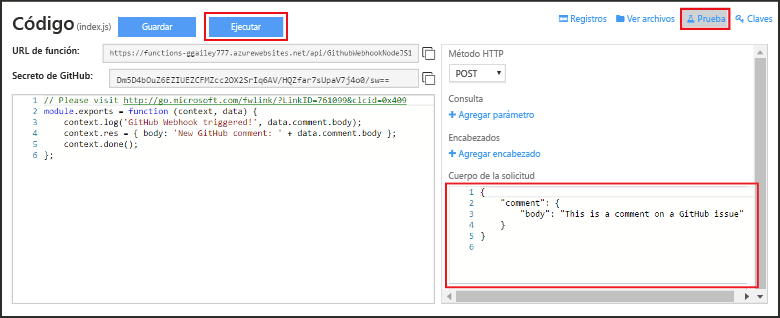

# Creación de un webhook o una función de API de Azure
Azure Functions es una experiencia de procesos a petición orientada a eventos que permite crear unidades de código programadas o desencadenadas que se implementan en diversos lenguajes de programación. Para más información acerca de Azure Functions, consulte [Información general sobre Azure Functions](functions-overview.md).

En este tema se muestra cómo crear una función de Node.js que se invoca mediante un webhook de GitHub. La función nueva se crea a partir de una plantilla predefinida del portal de Funciones de Azure. También puede ver un vídeo de corta duración en el que podrá seguir la realización de estos pasos en el portal.

## Visualización del vídeo
El siguiente vídeo muestra cómo realizar los pasos básicos de este tutorial 

>[!VIDEO https://channel9.msdn.com/Series/Windows-Azure-Web-Sites-Tutorials/Create-a-Web-Hook-or-API-Azure-Function/player]
>
>

## Creación de una función desencadenada por un webhook a partir de la plantilla
Una aplicación de función hospeda la ejecución de sus funciones en Azure. Si ya no tiene una cuenta de Azure, consulte la experiencia [Probar Functions](https://functions.azure.com/try) o [cree una cuenta gratis de Azure](https://azure.microsoft.com/free/). 

1. Vaya al [portal de Funciones de Azure](https://functions.azure.com/signin) e inicie sesión con su cuenta de Azure.

2. Si tiene una aplicación de función existente, selecciónela en **Your function apps** (Sus aplicaciones de función) y haga clic en **Abrir**. Para crear una aplicación de función, escriba un **nombre** único para ella o acepte el que se genera, seleccione su **región** preferida y haga clic en **Crear y comenzar**. 

3. En la aplicación de función, haga clic en **+ Nueva función** > **Webhook de GitHub: nodo** > **Crear**. En este paso se crea una función con un nombre predeterminado basado en la plantilla especificada. 
   
     

4. En la pestaña **Desarrollar**, observe la función express.js de ejemplo en la ventana **Código**. Esta función recibe una solicitud de GitHub de un webhook de comentario del problema, registra el texto del problema y envía una respuesta al webhook como `New GitHub comment: <Your issue comment text>`.

     

1. Copie los valores de **Dirección URL de función** y **Secreto de GitHub**. Estos valores se necesitan para crear el webhook en GitHub. 

2. Haga clic en **Probar**, observe el cuerpo JSON predefinido de un comentario de problema en el **cuerpo de la solicitud** y haga clic en **Ejecutar**. 

    
   
    > [!NOTE]
    > Siempre puede probar el derecho de una función basada en plantilla en la pestaña **Desarrollar**; solo tiene que suministrar los datos JSON del cuerpo esperados y haga clic en botón **Ejecutar**. En este caso, la plantilla tiene un cuerpo predefinido para un comentario de problema. 

A continuación, creará el webhook real en el repositorio de GitHub.

## Configuración del webhook
1. En GitHub, navegue hasta un repositorio que le pertenezca. También puede utilizar los repositorios bifurcados.
 
2. Haga clic en **Configuración** > **Webhooks y servicios** > **Agregar webhook**.
   
       
3. Pegue la dirección URL y el secreto de la función en **Payload URL** (URL de carga útil) y **Secret** (Secreto), a continuación haga clic en **Let me select individual events** (Dejarme seleccionar eventos individuales), seleccione **Issue comment** (Comentario de problema) y haga clic en **Add webhook** (Agregar webhook).
   
     

En este punto, el webhook de GitHub está configurado para desencadenar la función cuando se agregue un nuevo comentario de problema.  
Ahora, ha llegado el momento de probarlo.

## Prueba de la función
1. En el repositorio de GitHub, abra la pestaña **Issues** (Problemas) en una nueva ventana de explorador, haga clic en **New Issue** (Nuevo problema), escriba un título y haga clic en **Submit new issue** (Enviar nuevo problema). También puede abrir un problema existente.

2. En el problema, escriba un comentario y haga clic en **Comment**(Comentario). En este punto, puede volver a su webhook en GitHub y en **Recent Deliveries** (Entregas recientes) ver que se ha enviado una solicitud de webhook y que el cuerpo de respuesta es `New GitHub comment: <Your issue comment text>`.

3. En el portal de Functions, desplácese hacia abajo hasta los registros y vea que la función se ha desencadenado y que el valor `New GitHub comment: <Your issue comment text>` está escrito en los registros de streaming.

## Pasos siguientes
Consulte estos temas para más información sobre Azure Functions.

* [Azure Functions developer reference](functions-reference.md)  
   (Referencia para desarrolladores de Funciones de Azure) contiene las referencias del programador para codificar las funciones.
* [Testing Azure Functions](functions-test-a-function.md)  
   describe las diversas herramientas y técnicas para probar sus funciones.
* [How to scale Azure Functions](functions-scale.md)  
  Trata los planes de servicio disponibles con Azure Functions, incluido el plan de hospedaje de Consumo, y cómo elegir el plan adecuado.  

[!INCLUDE [Getting Started Note](../../includes/functions-get-help.md)]

<!--HONumber=Dec16_HO2-->

