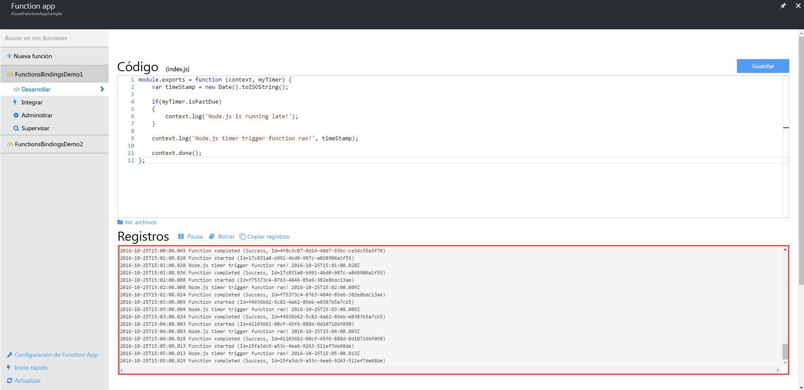
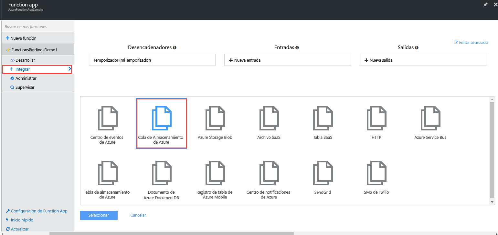
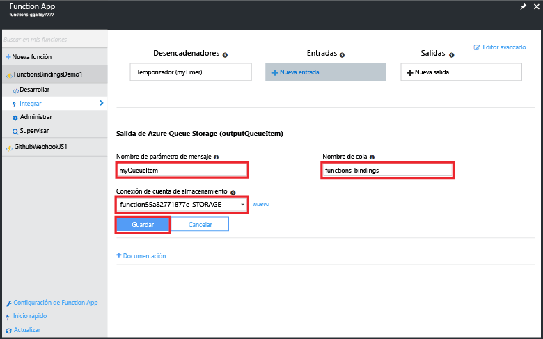
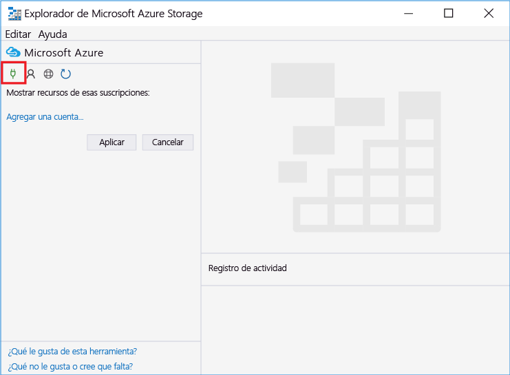
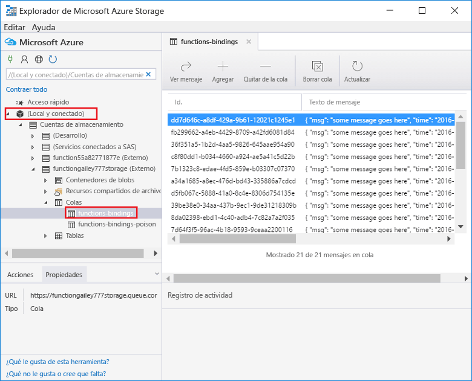
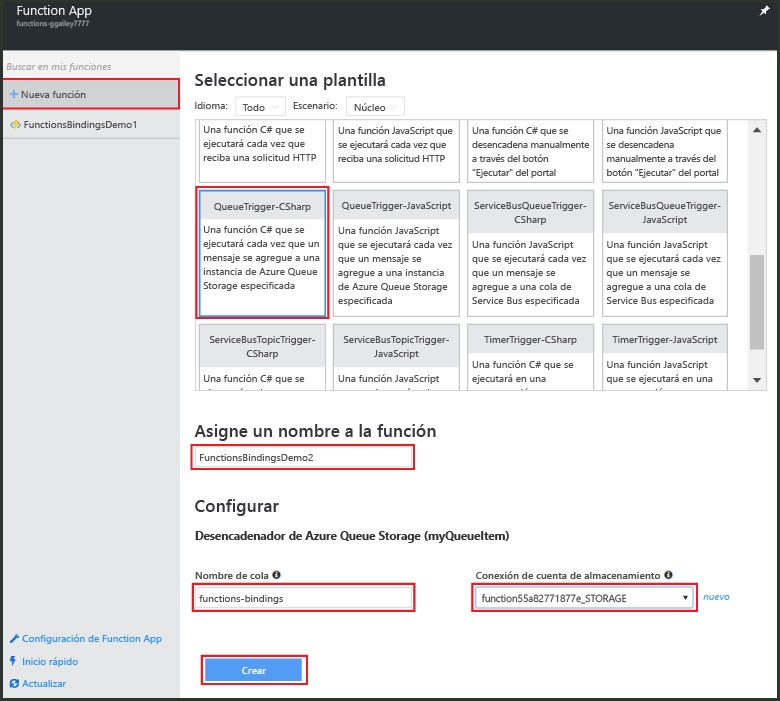
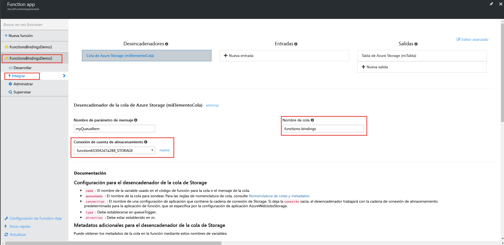
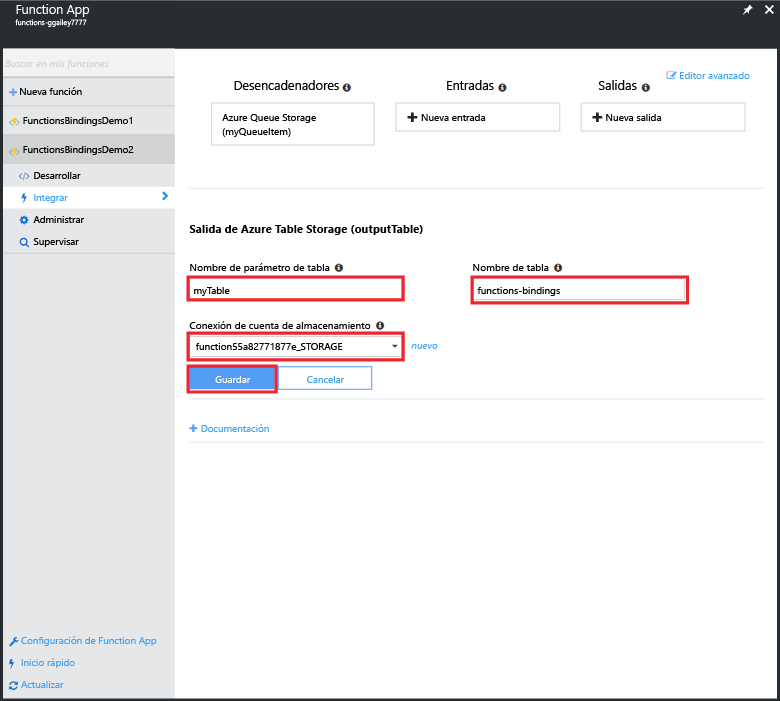
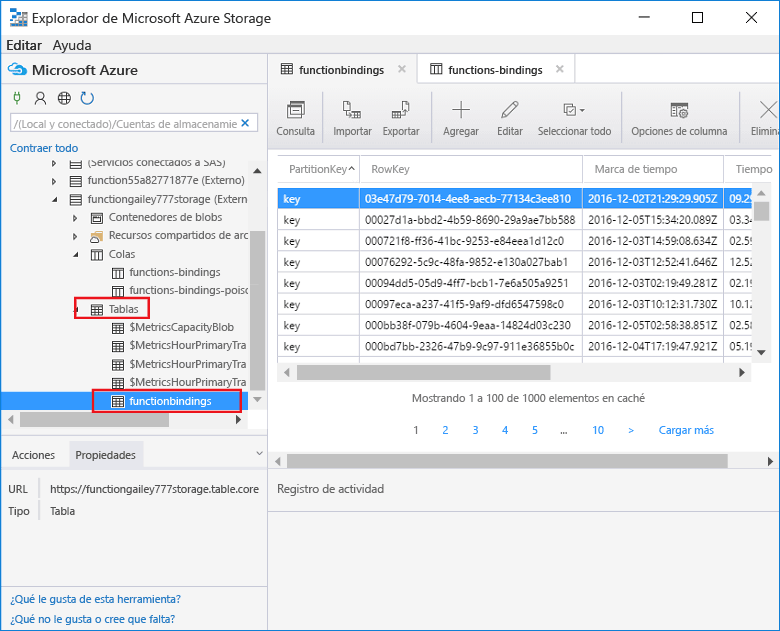

# <a name="use-azure-functions-to-create-a-function-that-connects-to-other-azure-services"></a>Use Azure Functions para crear una aplicación sin servidor que se conecta a otros servicios de Azure

En este tema se muestra cómo crear una función en Azure Functions que escucha los mensajes en una cola de Azure Storage y copia los mensajes en las filas de una tabla de Azure Storage. Se utiliza una función desencadenada del temporizador para cargar mensajes en la cola. Una segunda función lee en la cola y escribe mensajes en la tabla. Tanto la cola como la tabla las crea automáticamente Azure Functions según las definiciones de enlace. 

Para hacer todo más interesante, se escribe una función en JavaScript y la otra en script de C#. Esto demuestra cómo una aplicación de la función puede tener funciones en distintos lenguajes. 

En un [vídeo de Channel 9](https://channel9.msdn.com/Series/Windows-Azure-Web-Sites-Tutorials/Create-an-Azure-Function-which-binds-to-an-Azure-service/player) se puede ver una demostración de este escenario.

## <a name="create-a-function-that-writes-to-the-queue"></a>Creación de una función que escribe en la cola

Para poder conectarse a una cola de almacenamiento, debe crear una función que carga la cola de mensajes. Esta función de JavaScript usa un desencadenador de temporizador que escribe un mensaje en la cola cada 10 segundos. Si ya no tiene una cuenta de Azure, consulte la experiencia [Probar Azure Functions](https://functions.azure.com/try) o [cree su cuenta gratis de Azure](https://azure.microsoft.com/free/).

1. Vaya a Azure Portal y busque la aplicación de función.

2. Haga clic en **Nueva función** > **TimerTrigger-JavaScript**. 

3. Llame a la función **FunctionsBindingsDemo1**, escriba el valor de la expresión cron de `0/10 * * * * *` para **Programación** y, después, haga clic en **Crear**.
   
    

    Ahora ha creado una función desencadenada por el temporizador que se ejecuta cada 10 segundos.

5. En la pestaña **Desarrollar** haga clic en **Registros** y consulte la actividad en el registro. Verá una entrada de registro escrita cada 10 segundos.
   
    

## <a name="add-a-message-queue-output-binding"></a>Adición de un enlace de salida de la cola de mensajes

1. En la pestaña **Integrar**, elija **Nueva salida** > **Azure Queue Storage** > **Seleccionar**.

    

2. Escriba `myQueueItem` para **el nombre del parámetro de mensaje** y `functions-bindings` para el **nombre de la cola**, seleccione una **conexión de la cuenta de almacenamiento** existente o haga clic en **Nueva** para crear una y, después, haga clic en **Guardar**.  

    

1. En la pestaña **Desarrollar**, anexe el código siguiente a la función:
   
    ```javascript
   
    function myQueueItem() 
    {
        return {
            msg: "some message goes here",
            time: "time goes here"
        }
    }
   
    ```
2. Localice la instrucción *if* alrededor de la línea 9 de la función e introduzca el código siguiente después de la instrucción.
   
    ```javascript
   
    var toBeQed = myQueueItem();
    toBeQed.time = timeStamp;
    context.bindings.myQueueItem = toBeQed;
   
    ```  
   
    Este código crea un elemento **myQueueItem** y establece su propiedad **time** en la marca de tiempo actual. A continuación, agrega el nuevo elemento de cola al enlace de **myQueueItem** del contexto.

3. Haga clic en **Guardar y ejecutar**.

## <a name="view-storage-updates-by-using-storage-explorer"></a>Ver actualizaciones de almacenamiento mediante el Explorador de Storage
Puede comprobar que la función funciona consultando los mensajes en la cola que ha creado.  Puede conectarse a la cola de almacenamiento mediante el Explorador de nube en Visual Studio. Sin embargo, el portal facilita la conexión a su cuenta de almacenamiento mediante el Explorador de Microsoft Azure Storage.

1. En la pestaña **Integrar**, haga clic en el enlace de salida de la cola > **Documentación**, después muestre la cadena de conexión para la cuenta de almacenamiento y copie el valor. Use este valor para conectarse a su cuenta de almacenamiento.

    


2. Si no lo ha hecho ya, descargue e instale el [Explorador de Microsoft Azure Storage](http://storageexplorer.com). 
 
3. En el Explorador de Storage, haga clic en el icono de Azure Storage, pegue la cadena de conexión en el campo y complete el asistente.

    

4. En **Local y conectado**, expanda **Cuentas de almacenamiento** > su cuenta de almacenamiento > **Colas** > **Enlaces de funciones** y compruebe que los mensajes se escriben en la cola.

    

    Si la cola no existe o está vacía, lo más probable es que haya un problema con el enlace o código de la función.

## <a name="create-a-function-that-reads-from-the-queue"></a>Creación de una función que lee en la cola

Ahora que tiene mensajes que se van a agregar a la cola, puede crear otra función que lee de la cola y escribe los mensajes de forma permanente a una tabla de Azure Storage.

1. Haga clic en **Nueva función** > **QueueTrigger CSharp**. 
 
2. Llame a la función `FunctionsBindingsDemo2`, escriba **functions-bindings** en el campo **Nombre de la cola**, seleccione una cuenta de almacenamiento existente o cree una y, después, haga clic en **Crear**.

     

3. (Opcional) Puede comprobar que la nueva función funciona mediante la visualización de la nueva cola en el Explorador de Storage como antes. También puede utilizar el Explorador de nube en Visual Studio.  

4. (Opcional) Actualice la cola **functions-bindings** y observe que los elementos se han quitado de la cola. La eliminación se produce porque la función está enlazada a la cola **functions-bindings** como un desencadenador de entrada y la función lee la cola. 
 
## <a name="add-a-table-output-binding"></a>Adición de un enlace de salida de tabla

1. En FunctionsBindingsDemo2, haga clic en **Integrar** > **Nueva salida** > **Azure Table Storage** > **Seleccionar**.

     

2. Escriba `functionbindings` para el **nombre de la tabla** y `myTable` para el **nombre de parámetro de la tabla**, elija un **conexión de la cuenta de almacenamiento** o cree una nueva y, después, haga clic en **Guardar**.

    
   
3. En la pestaña **Desarrollar**, sustituya el código de función existente por el siguiente:
   
    ```cs
    
    using System;
    
    public static void Run(QItem myQueueItem, ICollector<TableItem> myTable, TraceWriter log)
    {    
        TableItem myItem = new TableItem
        {
            PartitionKey = "key",
            RowKey = Guid.NewGuid().ToString(),
            Time = DateTime.Now.ToString("hh.mm.ss.ffffff"),
            Msg = myQueueItem.Msg,
            OriginalTime = myQueueItem.Time    
        };
        
        // Add the item to the table binding collection.
        myTable.Add(myItem);
    
        log.Verbose($"C# Queue trigger function processed: {myItem.RowKey} | {myItem.Msg} | {myItem.Time}");
    }
    
    public class TableItem
    {
        public string PartitionKey {get; set;}
        public string RowKey {get; set;}
        public string Time {get; set;}
        public string Msg {get; set;}
        public string OriginalTime {get; set;}
    }
    
    public class QItem
    {
        public string Msg { get; set;}
        public string Time { get; set;}
    }
    ```
    La clase **TableItem** representa una fila en la tabla de almacenamiento y hay que agregar el elemento a la colección `myTable` de objetos **TableItem**. Debe establecer las propiedades **PartitionKey** y **RowKey** para poder insertarlas en la tabla.

4. Haga clic en **Guardar**.  Por último, puede comprobar que la función funciona contemplando la tabla en el Explorador de Storage o el Explorador de nube de Visual Studio.

5. (Opcional) En la cuenta de almacenamiento del Explorador de Storage, expanda **Tablas** > **functionsbindings** y compruebe que se agregan filas a la tabla. También puede hacer lo mismo en el Explorador de nube en Visual Studio.

    

    Si la tabla no existe o está vacía, lo más probable es que haya un problema con el enlace o código de la función. 
 
[!INCLUDE [More binding information](../../includes/functions-bindings-next-steps.md)]

## <a name="next-steps"></a>Pasos siguientes
Consulte los siguientes temas para más información sobre Azure Functions:

* [Referencia para desarrolladores de Funciones de Azure](functions-reference.md)  
  contiene las referencias del programador para codificar funciones y definir desencadenadores y enlaces.
* [Prueba de Azure Functions](functions-test-a-function.md)  
  describe las diversas herramientas y técnicas para probar sus funciones.
* [How to scale Azure Functions](functions-scale.md)  
  Trata los planes de servicio disponibles con Azure Functions, incluido el plan de hospedaje de Consumo, y cómo elegir el plan adecuado. 

[!INCLUDE [Getting help note](../../includes/functions-get-help.md)]

