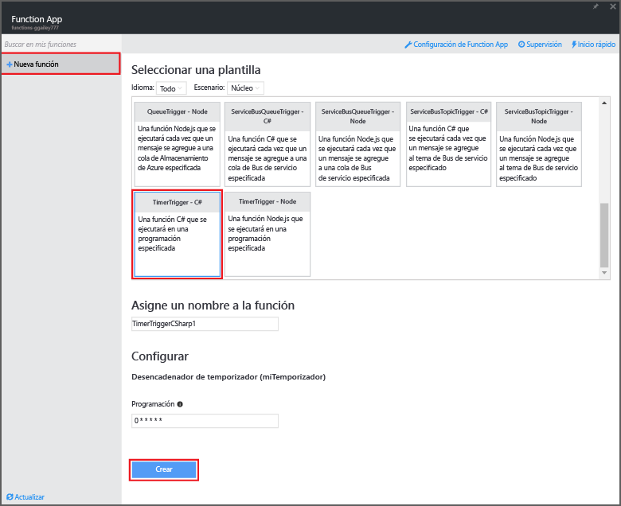
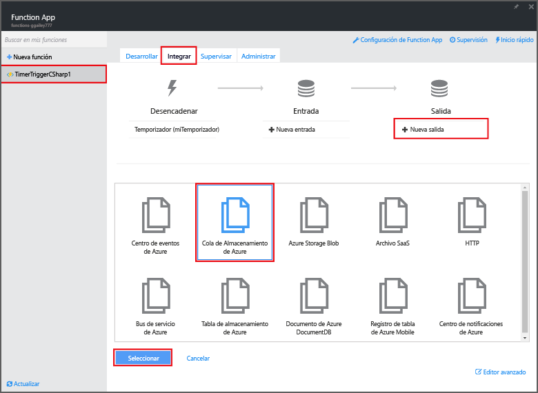
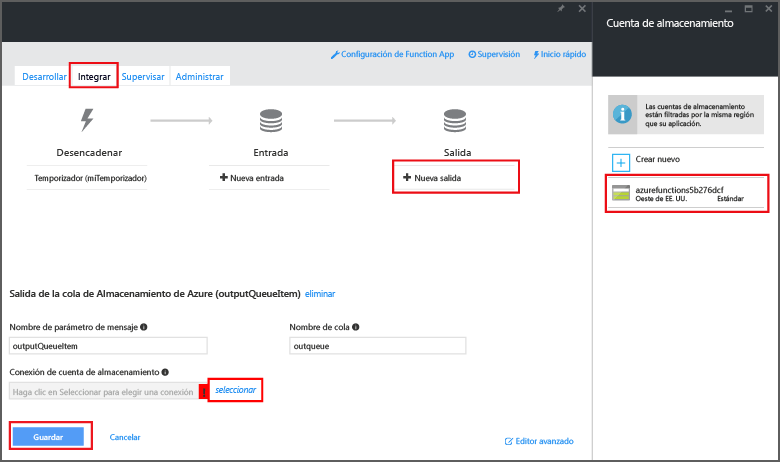

<properties
   pageTitle="Creación de una función de procesamiento de eventos | Microsoft Azure"
   description="Utilice Funciones de Azure para crear una función de C# que se ejecuta basándose en un temporizador de eventos."
   services="azure-functions"
   documentationCenter="na"
   authors="ggailey777"
   manager="erikre"
   editor=""
   tags=""
   />

<tags
   ms.service="functions"
   ms.devlang="multiple"
   ms.topic="get-started-article"
   ms.tgt_pltfrm="multiple"
   ms.workload="na"
   ms.date="06/05/2016"
   ms.author="glenga"/>
   
# Creación de una función de Azure de procesamiento de eventos

Funciones de Azure es una experiencia de procesos a petición orientada a eventos que permite crear unidades de código programadas o desencadenadas que se implementan en diversos lenguajes de programación. Para más información sobre Funciones de Azure, consulte [Información general sobre Funciones de Azure](functions-overview.md).

En este tema se muestra cómo crear una nueva función en C# que se ejecuta según un temporizador de eventos para agregar mensajes a una cola de almacenamiento.

## Requisitos previos 

Para poder crear una función, tiene que tener una cuenta de Azure activa. Si aún no tiene una cuenta de Azure, [puede crear una gratuita](https://azure.microsoft.com/free/).

## Creación de una función desencadenada por un temporizador a partir de la plantilla

Una aplicación de función hospeda la ejecución de sus funciones en Azure. Para poder crear una función, tiene que tener una cuenta de Azure activa. Si aún no tiene una cuenta de Azure, [tiene a su disposición gratuitas](https://azure.microsoft.com/free/).

1. Vaya al [portal de Funciones de Azure](https://functions.azure.com/signin) e inicie sesión con su cuenta de Azure.

2. Si tiene una aplicación de función existente, selecciónela en **Your function apps** (Sus aplicaciones de función) y haga clic en **Abrir**. Para crear una aplicación de función, escriba un **nombre** único para ella o acepte el que se genera, seleccione su **región** preferida y haga clic en **Create + get started** (Crear y comenzar).

3. En Function App, haga clic en **+ New Function** (+ Nueva función) > **TimerTrigger - C#** > **Create** (Crear). Esto crea una función con un nombre predeterminado que se ejecuta en la programación predeterminada de una vez cada minuto.

	

4. En la nueva función, haga clic en la pestaña **Integrate** (Integrar) > **New Output** (Nueva salida) > **Azure Storage Queue** (Cola de Almacenamiento de Azure) > **Select** (Seleccionar).

	

5. En **Azure Storage Queue output** (Salida de Cola de Almacenamiento de Azure), haga clic en **Select** (Seleccionar) junto a **Storage account connection** (Conexión de cuenta de almacenamiento), seleccione la cuenta de almacenamiento existente o cree una nueva y después haga clic en **Save** (Guardar).

	

6. En la pestaña **Develop** (Desarrollar), reemplace el script de C# existente en la ventana **Code** (Código) con el código siguiente:

		using System;
		
		public static void Run(TimerInfo myTimer, out string outputQueueItem, TraceWriter log)
		{
		    // Add a new scheduled message to the queue.
		    outputQueueItem = $"Ping message added to the queue at: {DateTime.Now}.";
		    
		    // Also write the message to the logs.
		    log.Info(outputQueueItem);
		}

	Este código agrega un nuevo mensaje a la cola con la fecha y hora actuales cuando se ejecuta la función.

7. Haga clic en **Save** (Guardar) y consulte la ventana **Logs** (Registros) para la ejecución de la función siguiente.

8. (Opcional) Vaya a la cuenta de almacenamiento y compruebe que los mensajes se agregan a la cola.

9. Vuelva a la pestaña **Integrate** (Integrar) y cambie el campo de programación a `0 0 * * * *`. La función ahora se ejecuta una vez cada hora.

Esto es un ejemplo muy simplificado de un desencadenador de temporizador y de un enlace de salida de cola de almacenamiento. Para más información, consulte los temas [Desencadenador de temporizador de funciones de Azure](functions-bindings-timer.md) y [Enlaces y desencadenadores de funciones de Azure para Almacenamiento de Azure](functions-bindings-storage.md).

##Pasos siguientes

Consulte estos temas para más información sobre Funciones de Azure.

+ [Referencia para desarrolladores de Funciones de Azure](functions-reference.md) contiene las referencias del programador para codificar funciones y definir desencadenadores y enlaces.
+ En [Prueba de las funciones de Azure](functions-test-a-function.md) se describen las diversas herramientas y técnicas para probar las funciones.
+ En [Escalado de Funciones de Azure](functions-scale.md) se abordan los planes de servicio disponibles con Funciones de Azure, incluido el plan de servicio dinámico, y cómo elegir el plan adecuado.  

[AZURE.INCLUDE [Nota de introducción](../../includes/functions-get-help.md)]

<!---HONumber=AcomDC_0622_2016-->