# Creación de una función desencadenada por Azure Cosmos DB

Aprenda a crear una función que se desencadena cuando se agregan o se cambian datos en Azure Cosmos DB. Para más información sobre Azure Cosmos DB, consulte [Azure Cosmos DB: informática de base de datos sin servidor con Azure Functions](..\cosmos-db\serverless-computing-database.md).

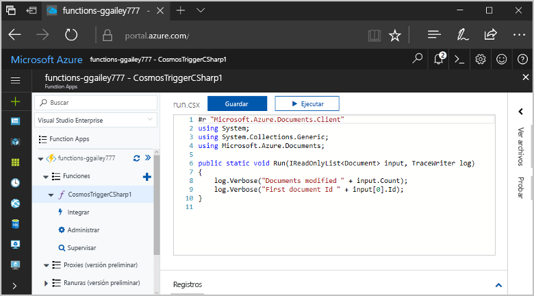

## requisitos previos

Para completar este tutorial:

+ Si no tiene una suscripción a Azure, cree una [cuenta gratuita](https://azure.microsoft.com/free/?WT.mc_id=A261C142F) antes de empezar.

[!INCLUDE [functions-portal-favorite-function-apps](../../includes/functions-portal-favorite-function-apps.md)]

## Creación de una Function App de Azure

[!INCLUDE [Create function app Azure portal](../../includes/functions-create-function-app-portal.md)]

Después, cree una función en la nueva Function App.

## Creación de un desencadenador de Azure Cosmos DB

1. Expanda su instancia de Function App y haga clic en el botón **+**, que se encuentra junto a **Functions**. Si se trata de la primera función de Function App, seleccione **Función personalizada**. Se muestra el conjunto completo de plantillas de funciones.

    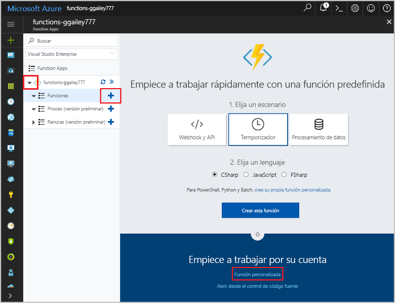

2. En el campo de búsqueda, escriba `cosmos` y seleccione el idioma que desee para la plantilla del desencadenador de Azure Cosmos DB.

    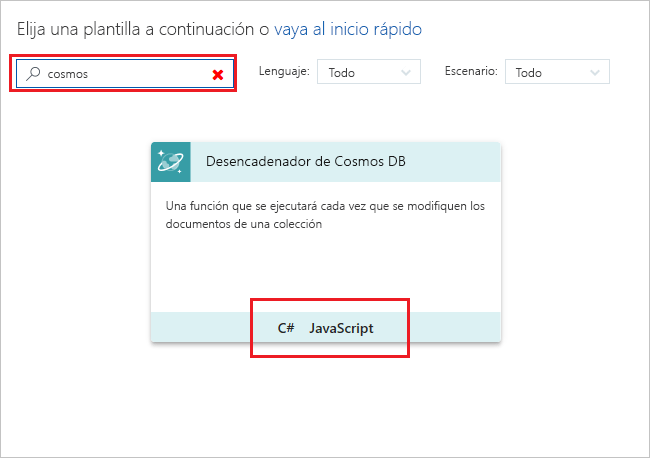

3. Configure el nuevo desencadenador según la configuración especificada en la tabla que aparece debajo de la imagen.

    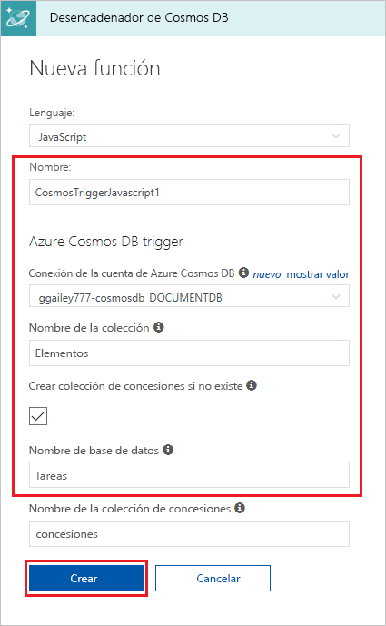
    
    | Configuración      | Valor sugerido  | Descripción                                |
    | ------------ | ---------------- | ------------------------------------------ |
    | **Name** | Valor predeterminado | Use el nombre de función predeterminado sugerido por la plantilla. |
    | **Nombre de colección** | Elementos | Nombre de la colección que se va a supervisar. |
    | **Create lease collection if it doesn't exist** (Crear colección de concesiones si no existe) | Activado | La colección no existe, por lo que se crea. |
    | **Nombre de la base de datos** | Tareas | Nombre de la base de datos con la colección que se va a supervisar. |

4. Seleccione **Nuevo** junto a la etiqueta de conexión **Cuenta de Azure Cosmos DB** y elija una cuenta de Cosmos DB existente o **+ Crear nuevo**. 
 
    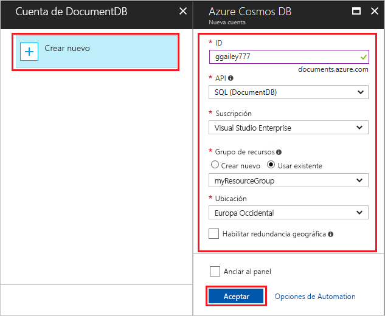

6. Al crear una nueva cuenta de Cosmos DB, use la configuración **Nueva cuenta** tal como se especifica en la tabla.

    | Configuración      | Valor sugerido  | DESCRIPCIÓN                                |
    | ------------ | ---------------- | ------------------------------------------ |
    | **Id** | Nombre de base de datos | Identificador único para la base de datos de Azure Cosmos DB  |
    | **API** | SQL (DocumentDB) | En este tema se usa la API de base de datos de documentos.  |
    | **Suscripción** | Suscripción de Azure | Suscripción de Azure  |
    | **Grupo de recursos** | myResourceGroup |  Use el grupo de recursos existente que contiene la aplicación de función. |
    | **Ubicación**  | WestEurope | Seleccione una ubicación cerca de la aplicación de función o de otras aplicaciones que usen los documentos almacenados.  |

6. Haga clic en **Aceptar** para crear la base de datos. La operación de creación de la base de datos puede tardar unos minutos. Después de crear la base de datos, la cadena de conexión de base de datos se almacena como una configuración de aplicación de función. El nombre de esta configuración de aplicación se inserta en **Azure Cosmos DB account connection** (Conexión a la cuenta de Azure Cosmos DB). 

7. Haga clic en **Crear** para crear la función desencadenada de Azure Cosmos DB. Después de crea la función, se muestra el código de función basado en la plantilla.  

    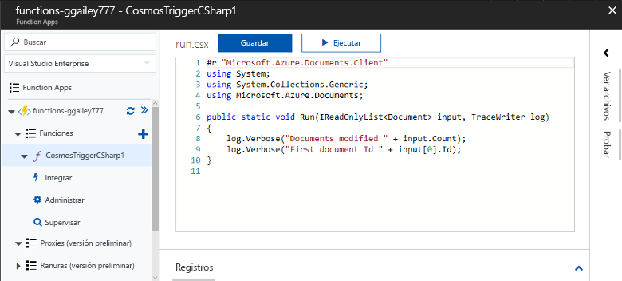

    Esta plantilla de función escribe el número de documentos y el identificador del primer documento en los registros. 

A continuación, se conectará a la cuenta de Azure Cosmos DB y creará la colección **Tareas** en la base de datos. 

## Creación de la colección de elementos

1. Abra una segunda instancia de [Azure Portal](https://portal.azure.com) en una nueva pestaña del explorador. 

2. En el lado izquierdo del portal, expanda la barra de iconos, escriba `cosmos` en el campo de búsqueda y seleccione **Azure Cosmos DB**.

    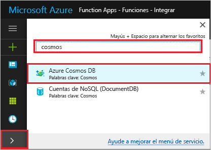

2. Elija la cuenta de Azure Cosmos DB y luego seleccione el **Explorador de datos**. 
 
3. En **Colecciones**, elija **taskDatabase** y seleccione **Nueva colección**.

    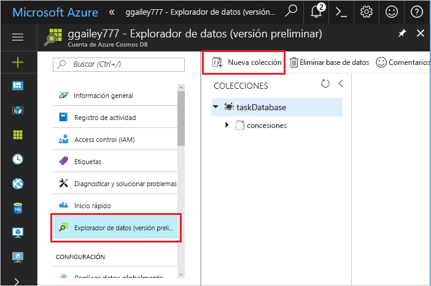

4. En **Agregar colección**, use la configuración que se muestra en la tabla situada debajo de la imagen. 
 
    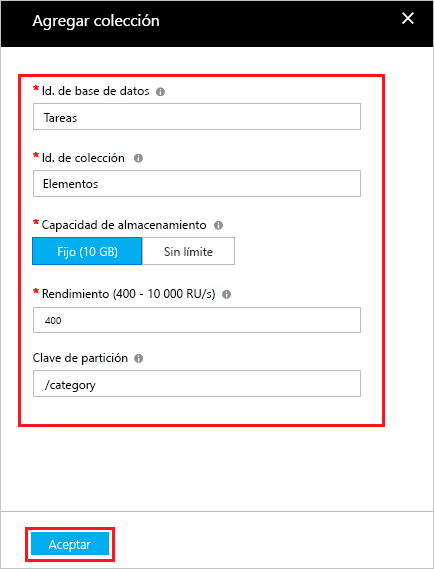
 
    | Configuración|Valor sugerido|DESCRIPCIÓN |
    | ---|---|--- |
    | **Identificador de base de datos** | Tareas |Nombre de la nueva base de datos. Debe coincidir con el nombre definido en el enlace de función. |
    | **Identificador de colección** | Elementos | Nombre de la nueva colección. Debe coincidir con el nombre definido en el enlace de función.  |
    | **Capacidad de almacenamiento** | Fija (10 GB)|Use el valor predeterminado. Este valor corresponde a la capacidad de almacenamiento de la base de datos. |
    | **Rendimiento** |400 RU| Use el valor predeterminado. Si quiere reducir la latencia, puede escalar verticalmente el rendimiento más adelante. |
    | **[Clave de partición](../cosmos-db/partition-data.md#design-for-partitioning)** | /categoría|Una clave de partición que distribuye los datos uniformemente a cada partición. La selección de la clave de partición correcta es importante al crear una colección de rendimiento. | 

1. Haga clic en **Aceptar** para crear la colección **Tareas**. Puede que la colección tarde un poco en crearse.

Una vez que la colección especificada en el enlace de función existe, puede probar la función mediante la adición de documentos a esta nueva colección.

## Prueba de la función

1. Expanda la nueva colección **taskCollection** en el Explorador de datos, elija **Documentos** y luego seleccione **Nuevo documento**.

    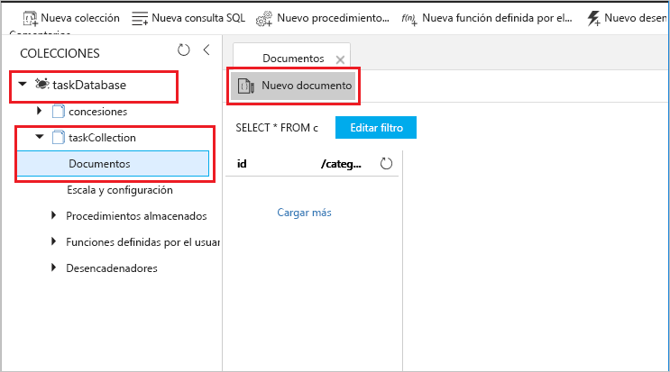

2. Reemplace el contenido del nuevo documento por el siguiente contenido, y luego elija **Guardar**.

        {
            "id": "task1",
            "category": "general",
            "description": "some task"
        }

1. Cambie a la primera pestaña del explorador que contiene la función del portal. Expanda los registros de función y compruebe que el nuevo documento ha desencadenado la función. Compruebe que el valor de identificador de documento `task1` se escribe en los registros. 

    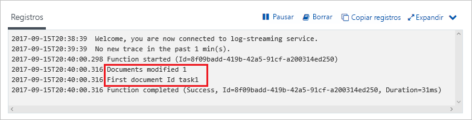

4. (Opcional) Vuelva a su documento, realice un cambio y haga clic en **Actualizar**. A continuación, vuelva a los registros de función y compruebe que la actualización también ha desencadenado la función.

## Limpieza de recursos

[!INCLUDE [Next steps note](../../includes/functions-quickstart-cleanup.md)]

## pasos siguientes

Ha creado una función que se ejecuta cuando se agrega o modifica un documento en su instancia de Azure Cosmos DB.

[!INCLUDE [Next steps note](../../includes/functions-quickstart-next-steps.md)]

Para más información sobre los desencadenadores de Azure Cosmos DB, consulte [Enlaces de Azure Cosmos DB para Azure Functions](functions-bindings-cosmosdb.md).
