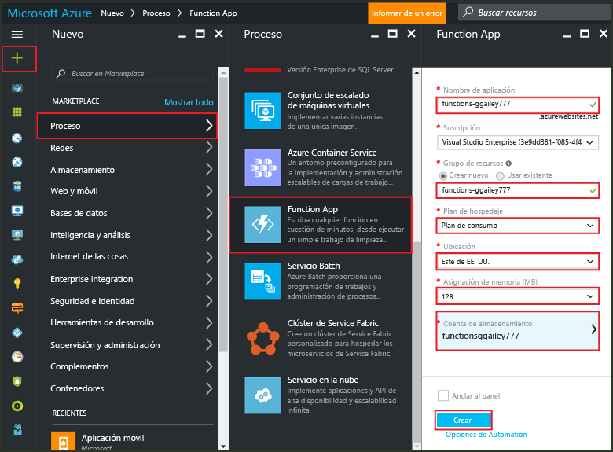
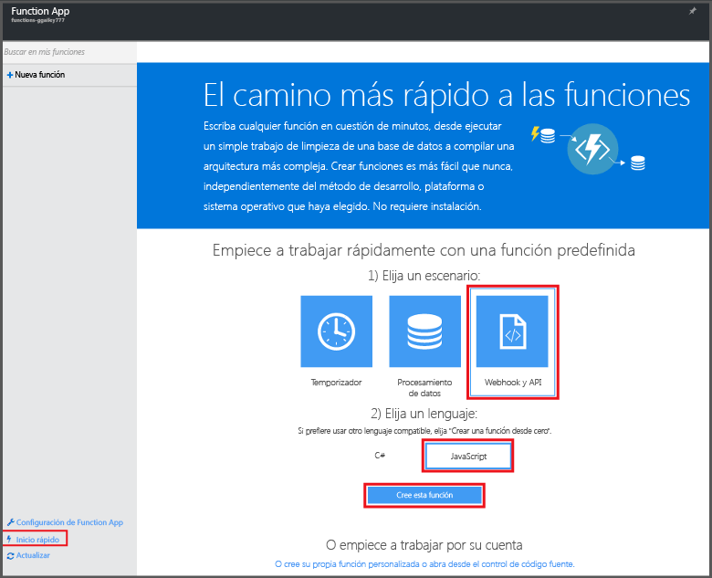

# Creación de una función en Azure Portal
## Información general
Azure Functions es una experiencia de proceso a petición basada en eventos que amplía la plataforma de aplicaciones existente de Azure con funcionalidades para implementar código desencadenado por eventos que tienen lugar en otros servicios de Azure, productos de SaaS y sistemas locales. Con Azure Functions, sus aplicaciones se escalan en función de la demanda y solo hay que pagar por los recursos consumidos. Azure Functions permite crear unidades de código programadas o desencadenadas que se implementan en varios lenguajes de programación. Para más información acerca de Azure Functions, consulte [Información general sobre Azure Functions](functions-overview.md).

En este tema se muestra cómo utilizar Azure Portal para crear una sencilla función de Azure de Node.js, "hello world", invocada por un desencadenador de HTTP. Antes de poder crear una función en Azure Portal, debe crear explícitamente una aplicación de función en Azure App Service. Para que la aplicación de función se cree de forma automática, consulte el [otro tutorial de inicio rápido de Azure Functions](functions-create-first-azure-function.md), que es una experiencia de inicio rápido más sencilla e incluye un vídeo.

## Creación de una aplicación de función
Una aplicación de función hospeda la ejecución de sus funciones en Azure. Siga estos pasos para crear una aplicación de función en Azure Portal.

Para poder crear la primera función, es necesario tener una cuenta de Azure activa. Si aún no tiene ninguna cuenta de Azure, [tiene a su disposición cuentas gratuitas](https://azure.microsoft.com/free/).

1. Vaya a [Azure Portal](https://portal.azure.com) e inicie sesión con su cuenta de Azure.
2. Haga clic en **+Nuevo** > **Web y móvil** > **Function App**, seleccione su **Suscripción**, escriba un **Nombre de la aplicación** único, que identifica la aplicación de función, y especifique la siguiente configuración:
   
   * **[Grupo de recursos](../azure-portal/resource-group-portal.md)**: seleccione **Crear nuevo** y escriba un nombre para el nuevo grupo de recursos. También puede elegir un grupo de recursos existente; sin embargo, es posible que no pueda crear un plan de App Service dinámico para la aplicación de función.
   * **[Plan de App Service](../app-service/azure-web-sites-web-hosting-plans-in-depth-overview.md)**: elija *dinámico* o *clásico*.
     * **Dinámico**: el tipo de plan predeterminado para Azure Functions. Al elegir un plan dinámico, también debe elegir la ubicación en el campo **Ubicación** y establecer el valor de **Asignación de memoria** (en MB). Para más información sobre cómo afecta la asignación de memoria a los costos, consulte [Precios de Functions](https://azure.microsoft.com/pricing/details/functions/).
     * **Clásico**: un plan de App Service requiere que se cree un **Plan del Servicio de aplicaciones/Ubicación** o se seleccione uno existente. Esta configuración determina la [ubicación, características, costo y recursos de procesos](https://azure.microsoft.com/pricing/details/app-service/) asociados a la aplicación.
   * **Cuenta de almacenamiento**: cada aplicación de función requiere una cuenta de almacenamiento. Puede elegir una cuenta de almacenamiento existente o crear una.
     
     
3. Haga clic en **Crear** para aprovisionar e implementar la nueva función de aplicación.

Ahora que se ha aprovisionado la aplicación de función, puede crear la primera función.

## Creación de una función
Mediante estos pasos se crea una función desde el inicio rápido de Azure Functions.

1. En la pestaña **Inicio rápido**, haga clic en **Webhook y API**, **JavaScript** y **Crear esta función**. Se crea una función predefinida de Node.js.
   
    
2. (Opcional) En este momento del inicio rápido, puede realizar un recorrido rápido de las características de Azure Functions en el portal. Una vez que haya realizado u omitido el recorrido, podrá probar la nueva función mediante el desencadenador de HTTP.

## Prueba de la función
Puesto que los inicios rápidos de Azure Functions contienen código funcional, puede probar la nueva función inmediatamente.

1. En la pestaña **Desarrollar**, revise la ventana **Código** y observe que este código Node.js espera una solicitud HTTP con un valor de *nombre* pasado en el cuerpo del mensaje o en una cadena de consulta. Cuando se ejecuta la función, este valor se devuelve en el mensaje de respuesta.
   
    
2. Desplácese hacia abajo hasta el cuadro de texto **Cuerpo de la solicitud**, cambie el valor de la propiedad *name* a su nombre y haga clic en **Ejecutar**. Verá que una solicitud HTTP de prueba desencadena la ejecución, la información se escribe en los registros de streaming y se muestra la respuesta "hello" en **Salida**.
3. Para desencadenar la ejecución de la misma función desde otra ventana o pestaña del explorador, copie el valor de **URL de función** de la pestaña **Desarrollar** y péguelo en la barra de direcciones; a continuación, agregue el valor de la cadena de consulta `&name=yourname` y presione ENTRAR. La misma información se escribe en los registros y el explorador muestra la respuesta "hello" como antes.

## Pasos siguientes
Este inicio rápido demuestra una ejecución muy sencilla de una función básica desencadenada por HTTP. Consulte estos temas para más información acerca de cómo usar el potencial de Azure Functions en sus aplicaciones.

* [Referencia para desarrolladores de Azure Functions](functions-reference.md) contiene las referencias del programador para codificar las funciones y definir los desencadenadores y los enlaces.
* [Prueba de Azure Functions](functions-test-a-function.md) describe las diversas herramientas y técnicas para probar sus funciones.
* [Escalado de Azure Functions](functions-scale.md) aborda los planes de servicio disponibles con Azure Functions, incluido el plan de servicio dinámico, y cómo elegir el plan adecuado.
* [¿Qué es Azure App Service?](../app-service/app-service-value-prop-what-is.md) Azure Functions aprovecha la plataforma Azure App Service para obtener una funcionalidad básica, como implementaciones, variables de entorno y diagnósticos.

[!INCLUDE [Nota de introducción](../../includes/functions-get-help.md)]

<!---HONumber=AcomDC_0914_2016-->