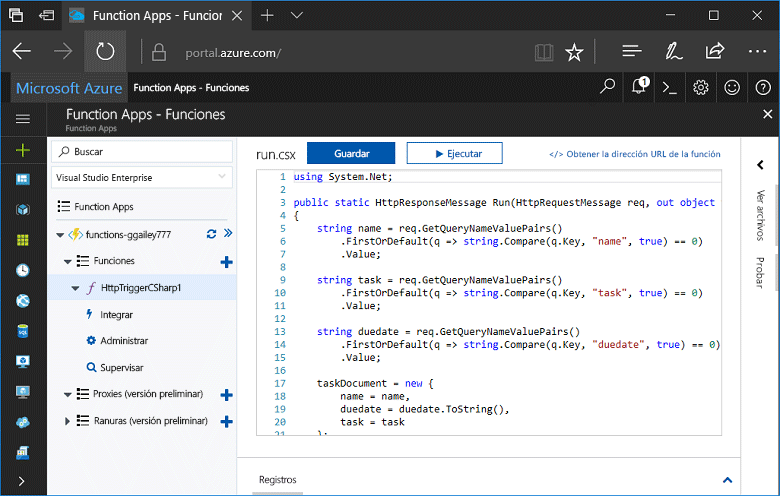
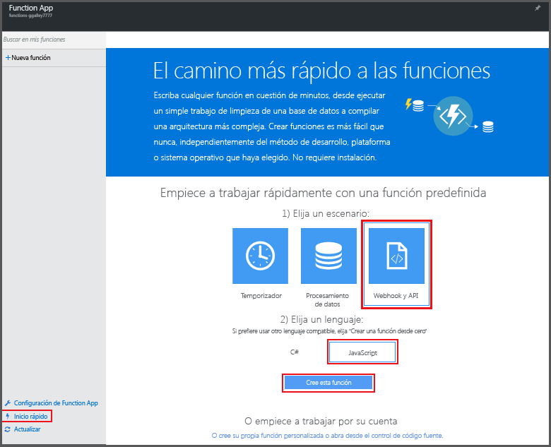
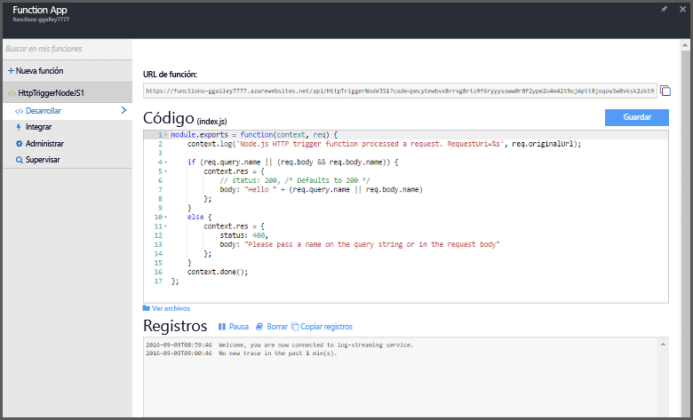
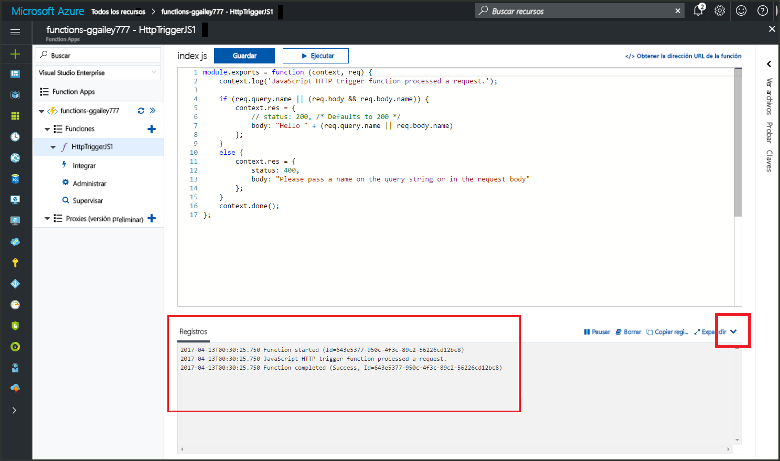

# Creación de su primera función en Azure Portal

Azure Functions permite ejecutar el código en un entorno [sin servidor](https://azure.microsoft.com/overview/serverless-computing/) sin necesidad de crear una máquina virtual o publicar una aplicación web. En este tema, aprenderá a usar Functions para crear una función "Hola mundo" en Azure Portal.

[!INCLUDE [quickstarts-free-trial-note](../../includes/quickstarts-free-trial-note.md)]

## Inicio de sesión en Azure

Abra Azure Portal. Inicie sesión en [Azure Portal](https://portal.azure.com/) con su cuenta de Azure.

## Creación de una aplicación de función

Debe tener una Function App para hospedar la ejecución de las funciones. Una Function App permite agrupar funciones como una unidad lógica para facilitar la administración, la implementación y el uso compartido de recursos. 

[!INCLUDE [Create function app Azure portal](../../includes/functions-create-function-app-portal.md)]

[!INCLUDE [functions-portal-favorite-function-apps](../../includes/functions-portal-favorite-function-apps.md)]

Después, cree una función en la nueva Function App.

## Crear una función desencadenada por HTTP

1. Expanda la nueva Function App y haga clic en el botón **+** situado junto a **Funciones**.

2.  En la página **Get started quickly** (Empiece a trabajar rápidamente), seleccione **Webhook y API**, **Elija un lenguaje** para la función y haga clic en **Crear esta función**. 
   
    

Se crea una función en el lenguaje elegido mediante la plantilla para una función desencadenada por HTTP. En este tema se muestra una función de script de C# en el portal, pero puede crear una función en cualquier [lenguaje compatible](supported-languages.md). 

Ahora, puede ejecutar la nueva función mediante el envío de una solicitud HTTP.

## Prueba de la función

1. En la nueva función, haga clic en **</> Obtener la dirección URL de la función** en la parte superior derecha, seleccione **default (Function key)** y, después, haga clic en **Copiar**. 

    

2. Pegue la dirección URL de la función en la barra de direcciones de su explorador. Anexe el valor `&name=<yourname>` de la cadena de consulta al final de esta dirección URL y presione la tecla `Enter` en el teclado para ejecutar la solicitud. Debería ver la respuesta devuelta por la función mostrada en el explorador.  

    Lo siguiente es un ejemplo de la respuesta en el explorador Edge (otros exploradores pueden incluir XML mostrado):

    

    La dirección URL de la solicitud incluye una clave que, de forma predeterminada, es necesaria para tener acceso a la función a través de HTTP.   

3. Cuando se ejecuta la función, se escribe información de seguimiento en los registros. Para ver el resultado del seguimiento de la ejecución anterior, vuelva a la función en el portal y haga clic en la flecha que encontrará en la parte inferior de la pantalla para expandir **Registros**. 

   

## Limpieza de recursos

[!INCLUDE [Clean up resources](../../includes/functions-quickstart-cleanup.md)]

## pasos siguientes

Ha creado una Function App con una función simple desencadenada por HTTP.  

[!INCLUDE [Next steps note](../../includes/functions-quickstart-next-steps.md)]

Para obtener más información, vea [Enlaces HTTP y webhook en Azure Functions](functions-bindings-http-webhook.md).

