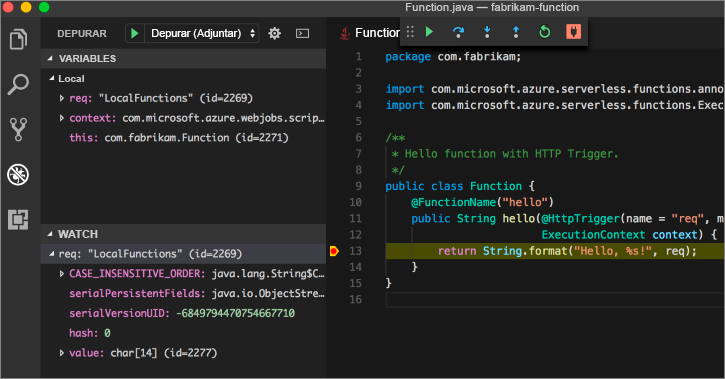

# <a name="create-your-first-function-with-java-and-maven-preview"></a>Creación de la primera función con Java y Maven (versión preliminar)

> [!NOTE] 
> Java para Azure Functions actualmente se encuentra disponible en versión preliminar.

Este tutorial de inicio rápido lo guía para crear un proyecto de función [sin servidor](https://azure.microsoft.com/overview/serverless-computing/) con Maven, probarlo localmente e implementarlo en Azure Functions. Cuando termine, tendrá una aplicación de función desencadenada por HTTP que se ejecuta en Azure.


[!INCLUDE [quickstarts-free-trial-note](../../includes/quickstarts-free-trial-note.md)]

## <a name="prerequisites"></a>requisitos previos
Para desarrollar una aplicación de funciones con Java, debe tener instalado lo siguiente:

-  La versión más reciente de [.NET Core](https://www.microsoft.com/net/core).
-  [Kit para desarrolladores de Java](https://www.azul.com/downloads/zulu/), versión 8.
-  [CLI de Azure](https://docs.microsoft.com/cli/azure)
-  [Apache Maven](https://maven.apache.org), versión 3.0 o posterior.
-  [Node.js](https://nodejs.org/download/), versión 8.6 o posterior.

> [!IMPORTANT] 
> La variable de entorno JAVA_HOME se debe establecer en la ubicación de instalación del JDK para completar esta guía de inicio rápido.

## <a name="install-the-azure-functions-core-tools"></a>Instalación de Azure Functions Core Tools

[Azure Functions Core Tools 2.0](https://www.npmjs.com/package/azure-functions-core-tools) proporciona un entorno de desarrollo local para escribir, ejecutar y depurar Azure Functions. Instale las herramientas con [npm](https://www.npmjs.com/), que se incluye con [Node.js](https://nodejs.org/).

```
npm install -g azure-functions-core-tools@core
```

> [!NOTE]
> Si tiene problemas para instalar la versión 2.0 de Azure Functions Core Tools, consulte [Entorno en tiempo de ejecución versión 2.x](/azure/azure-functions/functions-run-local#version-2x-runtime).

## <a name="generate-a-new-functions-project"></a>Generación de un nuevo proyecto de Functions

En una carpeta vacía, ejecute el comando siguiente para generar el proyecto de Functions desde un [arquetipo Maven](https://maven.apache.org/guides/introduction/introduction-to-archetypes.html).

### <a name="linuxmacos"></a>Linux/MacOS

```bash
mvn archetype:generate \
    -DarchetypeGroupId=com.microsoft.azure \
    -DarchetypeArtifactId=azure-functions-archetype 
```

### <a name="windows-cmd"></a>Windows (CMD)
```cmd
mvn archetype:generate ^
    -DarchetypeGroupId=com.microsoft.azure ^
    -DarchetypeArtifactId=azure-functions-archetype
```

Maven le pide que especifique los valores necesarios para finalizar la generación del proyecto. Para conocer los valores _groupId_, _artifactId_ y _version_, consulte la referencia sobre las [convenciones de nomenclatura de Maven](https://maven.apache.org/guides/mini/guide-naming-conventions.html). El valor _appName_ debe ser único en todo Azure, por lo que Maven genera un nombre de aplicación en función del valor _artifactId_ escrito anteriormente como valor predeterminado. El valor _packageName_ determina el paquete de Java para el código de función generado.

```Output
Define value for property 'groupId': com.fabrikam.functions
Define value for property 'artifactId' : fabrikam-functions
Define value for property 'version' 1.0-SNAPSHOT : 
Define value for property 'package': com.fabrikam.functions
Define value for property 'appName' fabrikam-functions-20170927220323382:
Confirm properties configuration: Y
```

Maven crea los archivos del proyecto en una carpeta nueva con el nombre _artifactId_. El código generado en el proyecto es una función [desencadenada por HTTP](/azure/azure-functions/functions-bindings-http-webhook) simple que devuelve el cuerpo de la solicitud:

```java
public class Function {
    /**
     * This function listens at endpoint "/api/hello". Two ways to invoke it using "curl" command in bash:
     * 1. curl -d "HTTP Body" {your host}/api/hello
     * 2. curl {your host}/api/hello?name=HTTP%20Query
     */
    @FunctionName("hello")
    public HttpResponseMessage<String> hello(
            @HttpTrigger(name = "req", methods = {"get", "post"}, authLevel = AuthorizationLevel.ANONYMOUS) HttpRequestMessage<Optional<String>> request,
            final ExecutionContext context) {
        context.getLogger().info("Java HTTP trigger processed a request.");

        // Parse query parameter
        String query = request.getQueryParameters().get("name");
        String name = request.getBody().orElse(query);

        if (name == null) {
            return request.createResponse(400, "Please pass a name on the query string or in the request body");
        } else {
            return request.createResponse(200, "Hello, " + name);
        }
    }
}

```

## <a name="run-the-function-locally"></a>Ejecución local de la función

Cambie de directorio a la carpeta de proyecto que acaba de crear y compile y ejecute la función con Maven:

```
cd fabrikam-function
mvn clean package 
mvn azure-functions:run
```

> [!NOTE]
> Si experimenta esta excepción: `javax.xml.bind.JAXBException` con Java 9, consulte la solución alternativa en [GitHub](https://github.com/jOOQ/jOOQ/issues/6477).

Verá esta salida cuando la función esté en ejecución:

```Output
Listening on http://localhost:7071
Hit CTRL-C to exit...

Http Functions:

   hello: http://localhost:7071/api/hello
```

Desencadene la función desde la línea de comandos con cURL en un terminal nuevo:

```
curl -w '\n' -d LocalFunction http://localhost:7071/api/hello
```

```Output
Hello LocalFunction!
```

Use `Ctrl-C` en el terminal para detener el código de función.

## <a name="deploy-the-function-to-azure"></a>Implementación de la función en Azure

El proceso de implementación en Azure Functions usa las credenciales de cuenta desde la CLI de Azure. [Inicie sesión con la CLI de Azure](/cli/azure/authenticate-azure-cli?view=azure-cli-latest) y luego implemente el código en una aplicación de función nueva con el destino de Maven `azure-functions:deploy`.

```
az login
mvn azure-functions:deploy
```

Cuando se complete la implementación, verá la dirección URL que puede usar para acceder a la aplicación de función de Azure:

```output
[INFO] Successfully deployed Function App with package.
[INFO] Deleting deployment package from Azure Storage...
[INFO] Successfully deleted deployment package fabrikam-function-20170920120101928.20170920143621915.zip
[INFO] Successfully deployed Function App at https://fabrikam-function-20170920120101928.azurewebsites.net
[INFO] ------------------------------------------------------------------------
```

Pruebe la aplicación de función que se ejecuta en Azure con cURL:

```
curl -w '\n' https://fabrikam-function-20170920120101928.azurewebsites.net/api/hello -d AzureFunctions
```

```Output
Hello AzureFunctions!
```

## <a name="next-steps"></a>pasos siguientes

Creó una aplicación de función de Java con un desencadenador HTTP simple y la implementó en Azure Functions.

- Revise la [guía para desarrolladores de Java Functions](functions-reference-java.md) para más información sobre cómo desarrollar funciones de Java.
- Agregue funciones adicionales con desencadenadores distintos en el proyecto con el destino de Maven `azure-functions:add`.
- Depure localmente las funciones con Visual Studio Code. Con el [paquete de extensiones de Java](https://marketplace.visualstudio.com/items?itemName=vscjava.vscode-java-pack) instalado y el proyecto de Functions abierto en Visual Studio Code, [adjunte el depurador](https://code.visualstudio.com/Docs/editor/debugging#_launch-configurations) al puerto 5005. Luego establezca un punto de interrupción en el editor y desencadene la función mientras se ejecuta localmente: 


