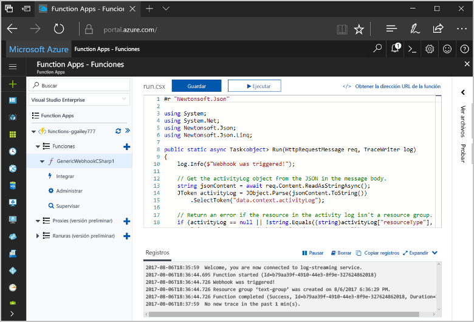
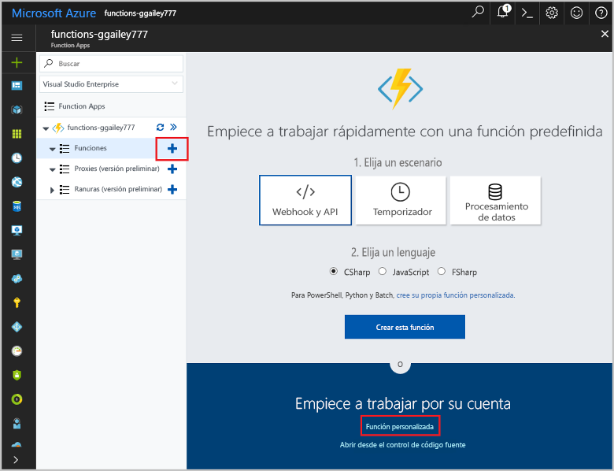
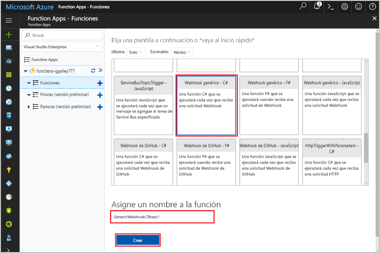
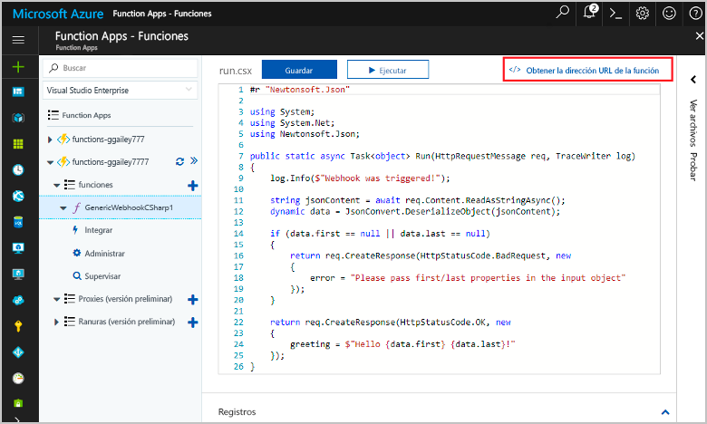
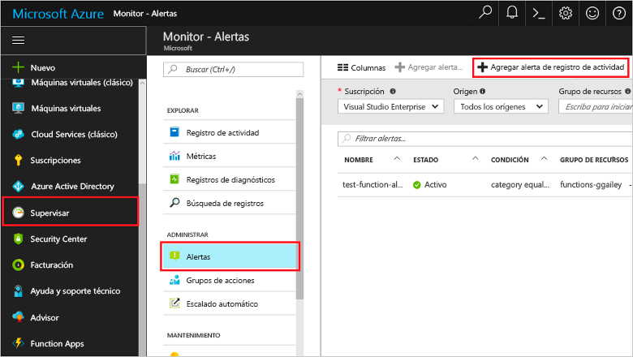
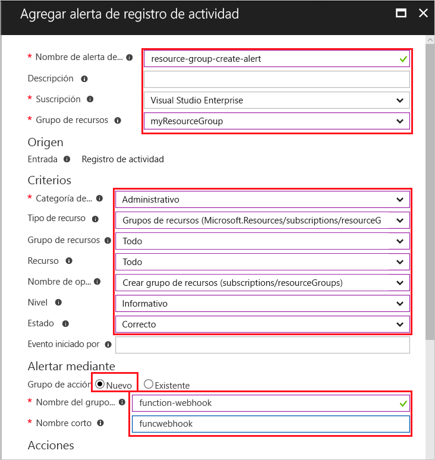
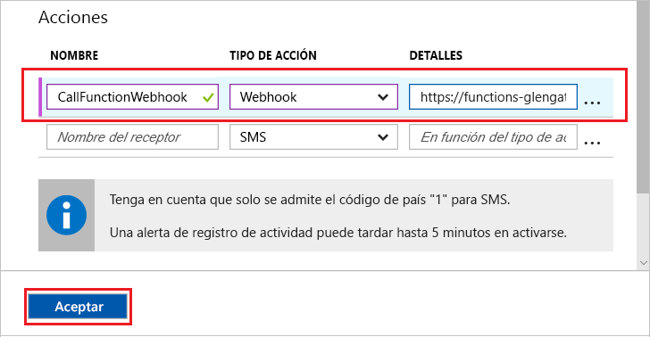
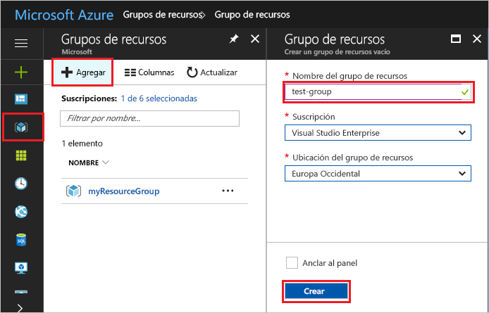
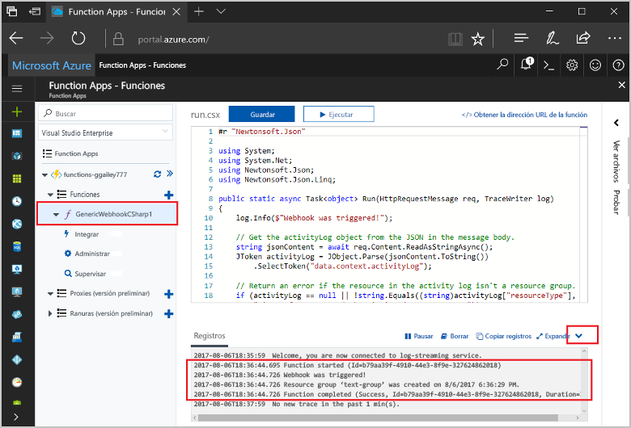

# <a name="create-a-function-triggered-by-a-generic-webhook"></a>Creación de una función desencadenada por un webhook genérico

Azure Functions permite ejecutar el código en un entorno sin servidor sin necesidad de crear una máquina virtual o publicar una aplicación web. Por ejemplo, puede configurar una función que va a desencadenar una alerta generada por Azure Monitor. En este tema se muestra cómo ejecutar código de C#, cuando se agrega un grupo de recursos a su suscripción.   



## <a name="prerequisites"></a>Requisitos previos 

Para completar este tutorial:

+ Si no tiene una suscripción a Azure, cree una [cuenta gratuita](https://azure.microsoft.com/free/?WT.mc_id=A261C142F) antes de empezar.

[!INCLUDE [functions-portal-favorite-function-apps](../../includes/functions-portal-favorite-function-apps.md)]

## <a name="create-an-azure-function-app"></a>Creación de una Function App de Azure

[!INCLUDE [Create function app Azure portal](../../includes/functions-create-function-app-portal.md)]

Después, cree una función en la nueva Function App.

## <a name="create-function"></a>Creación de una función desencadenada mediante un webhook genérico

1. Expanda su instancia de Function App y haga clic en el botón **+**, que se encuentra junto a **Functions**. Si esta función es la primera de su instancia de Function App, seleccione **Función personalizada**. Se muestra el conjunto completo de plantillas de funciones.

    

2. Seleccione la plantilla **Webhook genérico - C#**. Escriba un nombre para la función de C# y, después, seleccione **Crear**.

      

2. En la función nueva, haga clic en **</> Obtener la dirección URL de la función** y copie y guarde los valores. Use este valor para configurar el webhook. 

    
         
Después, cree un punto de conexión de webhook en una alerta de registro de actividad en Azure Monitor. 

## <a name="create-an-activity-log-alert"></a>Creación de una alerta de registro de actividad

1. En Azure Portal, vaya al servicio **Monitor**, seleccione **Alertas** y haga clic en **Agregar alerta de registro de actividad**.   

    

2. Use la configuración que se especifica en la tabla:

    

    | Configuración      |  Valor sugerido   | Descripción                              |
    | ------------ |  ------- | -------------------------------------------------- |
    | **Nombre de alerta de registro de actividad** | resource-group-create-alert | Nombre de la alerta de registro de actividad. |
    | **Suscripción** | Su suscripción | La suscripción que está utilizando para este tutorial. | 
    |  **Grupo de recursos** | myResourceGroup | El grupo de recursos en el que se implementan los recursos de la alerta. Si se usa el mismo grupo de recursos que la aplicación de función, resulta más fácil realizar una limpieza después de completar el tutorial. |
    | **Categoría de eventos** | Administrativo | Esta categoría incluye los cambios realizados en los recursos de Azure.  |
    | **Tipo de recurso** | Grupos de recursos | Filtra las alertas por las actividades de grupo de recursos. |
    | **Grupo de recursos**<br/>y **recurso** | Todo | Supervisa todos los recursos. |
    | **Nombre de la operación** | Crear grupo de recursos | Filtra las alertas para crear las operaciones. |
    | **Level** | Informativo | Incluye las alertas de nivel informativo. | 
    | **Estado** | Correcto | Filtra las alertas por las acciones que se han completado correctamente. |
    | **Grupo de acción** | Nuevo | Cree un nuevo grupo de acción, que define la acción que se realiza cuando se genera una alerta. |
    | **Nombre del grupo de acción** | function-webhook | Un nombre para identificar el grupo de acciones.  | 
    | **Nombre corto** | funcwebhook | Un nombre corto para el grupo de acciones. |  

3. En **Acciones**, agregue una acción mediante la configuración de acuerdo con lo especificado en la tabla: 

    

    | Configuración      |  Valor sugerido   | Descripción                              |
    | ------------ |  ------- | -------------------------------------------------- |
    | **Name** | CallFunctionWebhook | Nombre para la acción. |
    | **Tipo de acción** | webhook | La respuesta a la alerta es que se llama a una dirección URL del webhook. |
    | **Detalles** | Dirección URL de la función | Pegue la URL del webhook de la función que copió anteriormente. |v

4. Haga clic en **Aceptar** para crear la alerta y el grupo de acción.  

Ahora se llama al webhook cuando se crea un grupo de recursos en la suscripción. Ahora, actualice el código en la función para controlar los datos de registro JSON en el cuerpo de la solicitud.   

## <a name="update-the-function-code"></a>Actualización del código de la función

1. Vuelva a la aplicación de función en el portal y expanda la función. 

2. Reemplace el código del script C# de la función en el portal por el código siguiente:

    ```csharp
    #r "Newtonsoft.Json"
    
    using System;
    using System.Net;
    using Newtonsoft.Json;
    using Newtonsoft.Json.Linq;
    
    public static async Task<object> Run(HttpRequestMessage req, TraceWriter log)
    {
        log.Info($"Webhook was triggered!");
    
        // Get the activityLog object from the JSON in the message body.
        string jsonContent = await req.Content.ReadAsStringAsync();
        JToken activityLog = JObject.Parse(jsonContent.ToString())
            .SelectToken("data.context.activityLog");
    
        // Return an error if the resource in the activity log isn't a resource group. 
        if (activityLog == null || !string.Equals((string)activityLog["resourceType"], 
            "Microsoft.Resources/subscriptions/resourcegroups"))
        {
            log.Error("An error occured");
            return req.CreateResponse(HttpStatusCode.BadRequest, new
            {
                error = "Unexpected message payload or wrong alert received."
            });
        }
    
        // Write information about the created resource group to the streaming log.
        log.Info(string.Format("Resource group '{0}' was {1} on {2}.",
            (string)activityLog["resourceGroupName"],
            ((string)activityLog["subStatus"]).ToLower(), 
            (DateTime)activityLog["submissionTimestamp"]));
    
        return req.CreateResponse(HttpStatusCode.OK);    
    }
    ```

Ahora puede probar la función al crear un grupo de recursos en la suscripción.

## <a name="test-the-function"></a>Prueba de la función

1. Haga clic en el icono del grupo de recursos, situado a la izquierda de Azure Portal, seleccione **+ Agregar**, escriba el **nombre de un grupo de recursos** y seleccione **Crear** para crear un grupo de recursos vacío.
    
    

2. Vuelva a la función y expanda la ventana **Registros**. Una vez creado el grupo de recursos, la alerta del registro de actividad desencadena el webhook y se ejecuta la función. Verá el nombre del nuevo grupo de recursos escrito en los registros.  

    

3. (Opcional) Vuelva y elimine el grupo de recursos que ha creado. Tenga en cuenta que esta actividad no desencadena la función. Esto es debido a que la alerta ha filtrado las operaciones de eliminación. 

## <a name="clean-up-resources"></a>Limpieza de recursos

[!INCLUDE [Next steps note](../../includes/functions-quickstart-cleanup.md)]

## <a name="next-steps"></a>Pasos siguientes

Ha creado una función que se ejecuta cuando se recibe una solicitud de un webhook genérico. 

[!INCLUDE [Next steps note](../../includes/functions-quickstart-next-steps.md)]

Para más información sobre los desencadenadores de webhook, consulte [Enlaces HTTP y webhook en Azure Functions](functions-bindings-http-webhook.md). Para más información sobre el desarrollo de las funciones de C#, consulte [Referencia para desarrolladores de scripts de C# de Azure Functions](functions-reference-csharp.md).

