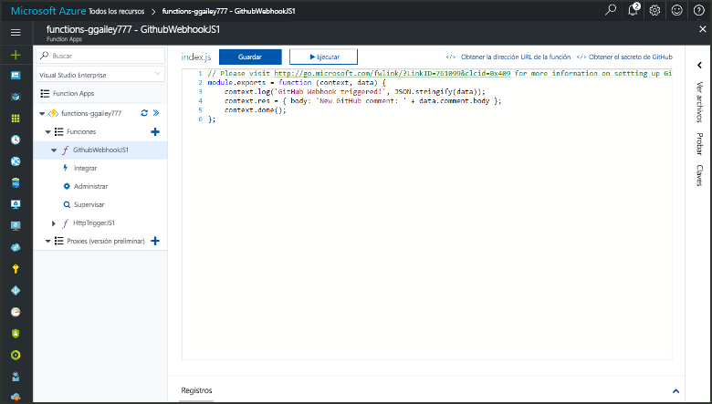
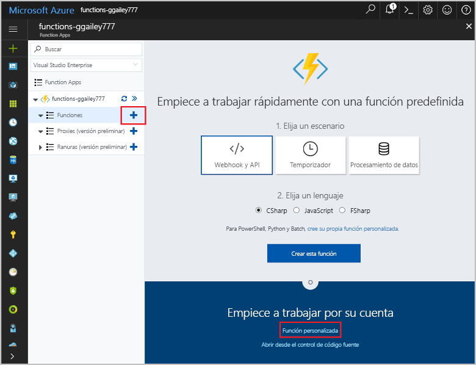
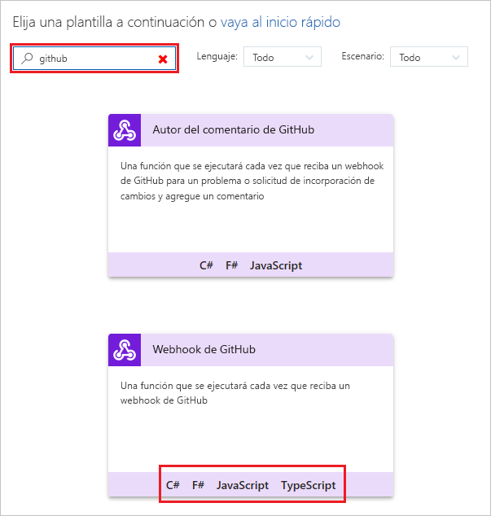
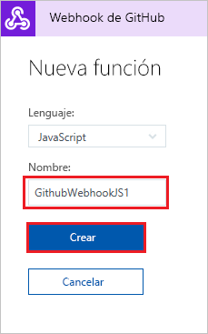
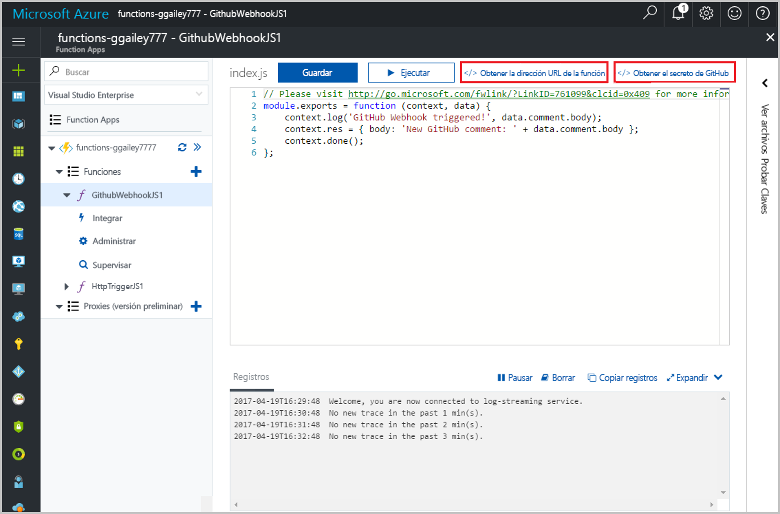
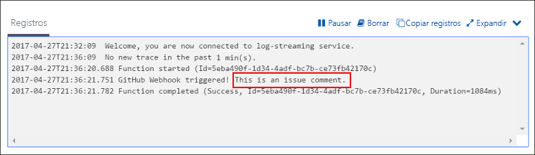

# Creación de una función desencadenada por Webhook de GitHub

Obtenga información sobre cómo crear una función que se desencadena mediante una solicitud de webhook HTTP con una carga específica de GitHub.

## Requisitos previos

+ Una cuenta de GitHub con un proyecto como mínimo.
+ Una suscripción de Azure. Si no tiene una, cree una [cuenta gratuita](https://azure.microsoft.com/free/?WT.mc_id=A261C142F) antes de empezar.

[!INCLUDE [functions-portal-favorite-function-apps](../../includes/functions-portal-favorite-function-apps.md)]

## Creación de una Function App de Azure

[!INCLUDE [Create function app Azure portal](../../includes/functions-create-function-app-portal.md)]

Después, cree una función en la nueva Function App.

## Crear una función desencadenada de webhook de GitHub

1. Expanda su instancia de Function App y haga clic en el botón **+**, que se encuentra junto a **Functions**. Si se trata de la primera función de Function App, seleccione **Función personalizada**. Se muestra el conjunto completo de plantillas de funciones.

    

2. En el campo de búsqueda, escriba `github` y seleccione el idioma que desee para la plantilla del desencadenador de webhook de GitHub. 

      

2. Escriba un **nombre** para la función y, después, seleccione **Crear**. 

      

3. En la función nueva, haga clic en **</> Obtener la dirección URL de la función** y copie y guarde los valores. Haga lo mismo para **</> Obtener el secreto de GitHub**. Estos valores se utilizan para configurar el webhook en GitHub.

    

A continuación, va a crear un webhook en el repositorio de GitHub.

## Configuración del webhook

1. En GitHub, navegue hasta un repositorio que le pertenezca. También puede utilizar los repositorios bifurcados. Si necesita bifurcar un repositorio, use <https://github.com/Azure-Samples/functions-quickstart>.

1. Haga clic en **Configuración**, después en **Webhooks** y, finalmente, en **Agregar Webhook**.

    

1. Use la configuración especificada en la tabla y haga clic en **Agregar Webhook**.

    

| Configuración | Valor sugerido | Descripción |
|---|---|---|
| **Dirección URL de carga** | Valor copiado | Use el valor devuelto por **</> Obtener la dirección URL de la función**. |
| **Secreto**   | Valor copiado | Use el valor devuelto por **</> Obtener el secreto de GitHub**. |
| **Tipo de contenido** | application/json | La función espera una carga JSON. |
| Desencadenadores de eventos | Dejarme seleccionar eventos individuales | Solo interesa desencadenar en función de eventos de comentarios de problema.  |
| | Comentario de problema |  |

Ahora, el webhook está configurado para desencadenar la función cuando se agregue un nuevo comentario de problema.

## Prueba de la función

1. En el repositorio de GitHub, abra la pestaña **Issues** (Problemas) en una nueva ventana del explorador.

1. En la ventana nueva, haga clic en **Problema nuevo**, escriba un título y haga clic en **Submit new issue** (Enviar problema nuevo).

1. En el problema, escriba un comentario y haga clic en **Comment**(Comentario).

    

1. Vuelva al portal y vea los registros. Debería ver una entrada de seguimiento con el texto del nuevo comentario.

     

## Limpieza de recursos

[!INCLUDE [Next steps note](../../includes/functions-quickstart-cleanup.md)]

## Pasos siguientes

Ha creado una función que se ejecuta cuando se recibe una solicitud de un webhook de GitHub.

[!INCLUDE [Next steps note](../../includes/functions-quickstart-next-steps.md)]

Para más información sobre los desencadenadores de webhook, consulte [Enlaces HTTP y webhook en Azure Functions](functions-bindings-http-webhook.md).
