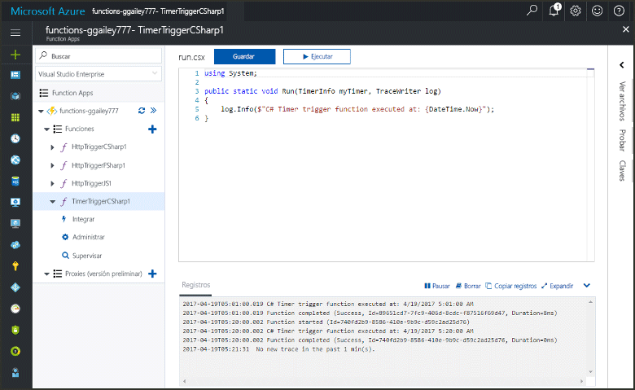
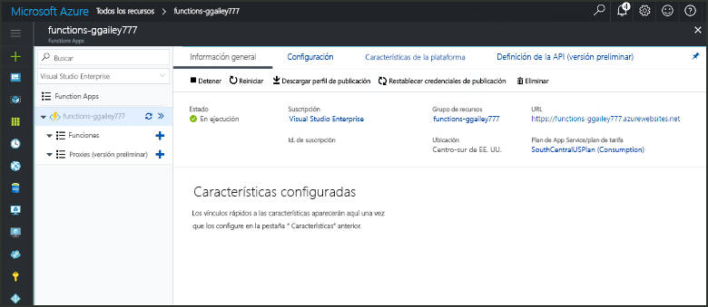
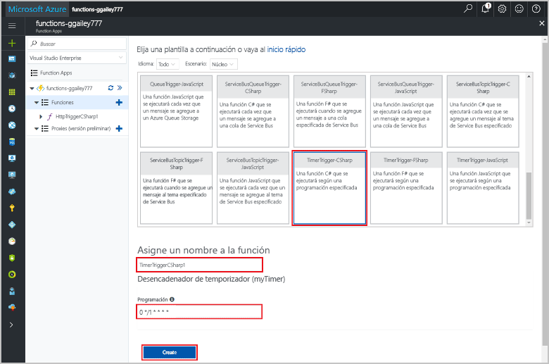
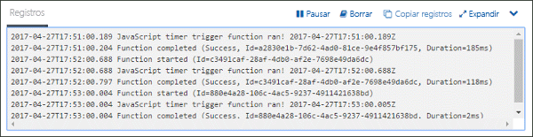
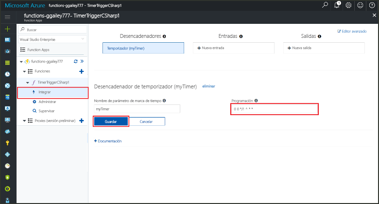

# Cree una función en Azure que se desencadena mediante un temporizador

Obtenga información sobre cómo usar Azure Functions para crear una función que se ejecuta según la programación que usted defina.

## Requisitos previos

Para completar este tutorial:

+ Si no tiene una suscripción a Azure, cree una [cuenta gratuita](https://azure.microsoft.com/free/?WT.mc_id=A261C142F) antes de empezar.

[!INCLUDE [functions-portal-favorite-function-apps](../../includes/functions-portal-favorite-function-apps.md)]

## Creación de una Function App de Azure

[!INCLUDE [Create function app Azure portal](../../includes/functions-create-function-app-portal.md)]

Después, cree una función en la nueva Function App.

## Creación de una función desencadenada por un temporizador

1. Expanda su instancia de Function App y haga clic en el botón **+**, que se encuentra junto a **Functions**. Si se trata de la primera función de Function App, seleccione **Función personalizada**. Se muestra el conjunto completo de plantillas de funciones.

    

2. Seleccione la plantilla **TimerTrigger** del idioma que desee. Luego, use la configuración que se especifica en la tabla:

    

    | Configuración | Valor sugerido | Descripción |
    |---|---|---|
    | **Asigne un nombre a la función** | TimerTriggerCSharp1 | Define el nombre de la función desencadenada por el temporizador. |
    | **[Programación](http://en.wikipedia.org/wiki/Cron#CRON_expression)** | 0 \*/1 \* \* \* \* | [Expresión CRON](http://en.wikipedia.org/wiki/Cron#CRON_expression) de seis campos que programa la función para que se ejecute cada minuto. |

2. Haga clic en **Crear**. Se crea una función en el lenguaje elegido que se ejecuta cada minuto.

3. Vea la información de seguimiento que se escribe en los registros para comprobar la ejecución.

    

Ahora puede cambiar la programación de la función para que se ejecute con menos frecuencia, por ejemplo, una vez cada hora. 

## Actualizar la programación del temporizador

1. Expanda la función y haga clic en **Integrar**. Aquí es donde se definen los enlaces de entrada y salida de la función y se establece la programación. 

2. Escriba el nuevo valor de **Programación** `0 0 */1 * * *` y, después, haga clic en **Guardar**.  

Ahora tiene una función que se ejecuta una vez cada hora. 

## Limpieza de recursos

[!INCLUDE [Next steps note](../../includes/functions-quickstart-cleanup.md)]

## Pasos siguientes

Ha creado una función que se ejecuta según una programación.

[!INCLUDE [Next steps note](../../includes/functions-quickstart-next-steps.md)]

Para obtener más información sobre los desencadenadores de temporizador, vea [Programación de la ejecución de código con Azure Functions](functions-bindings-timer.md).