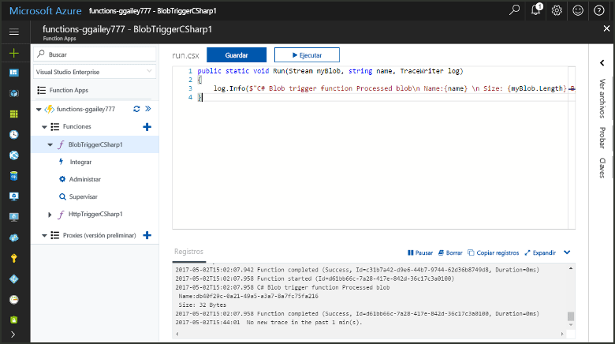
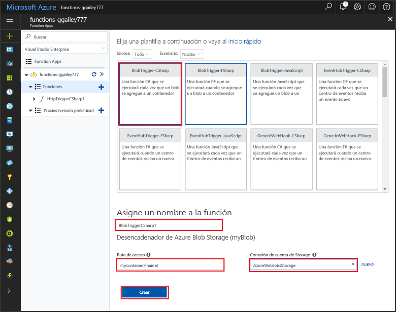
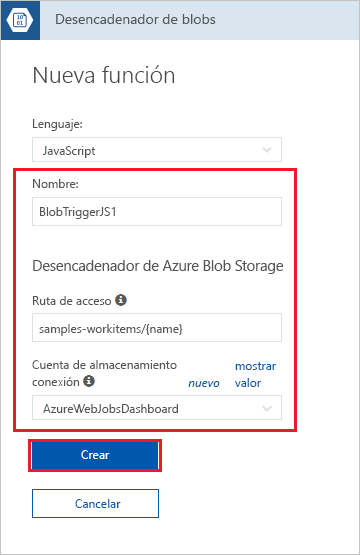
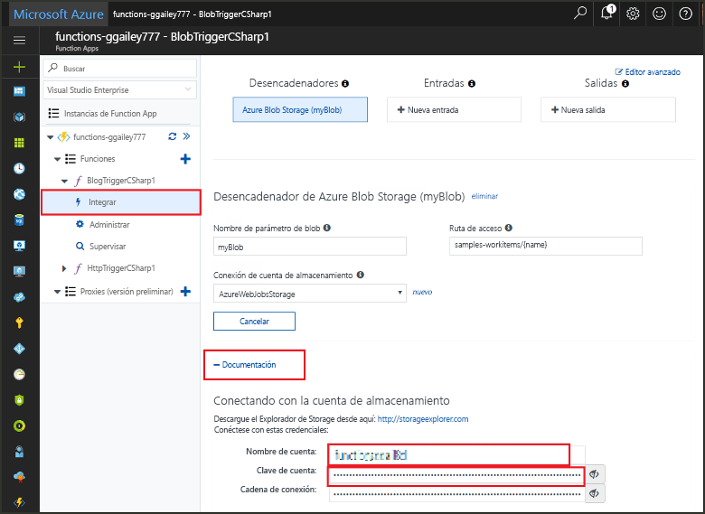
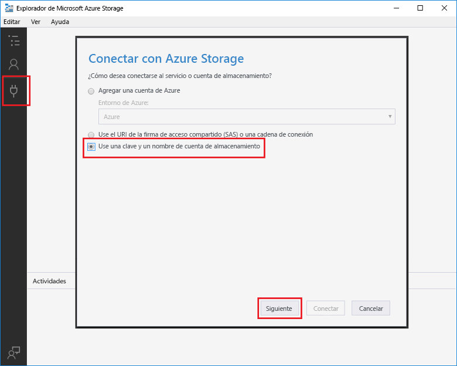
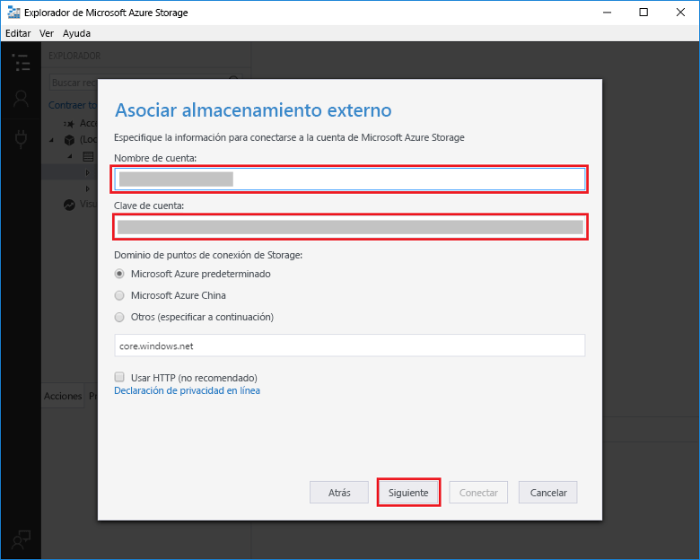
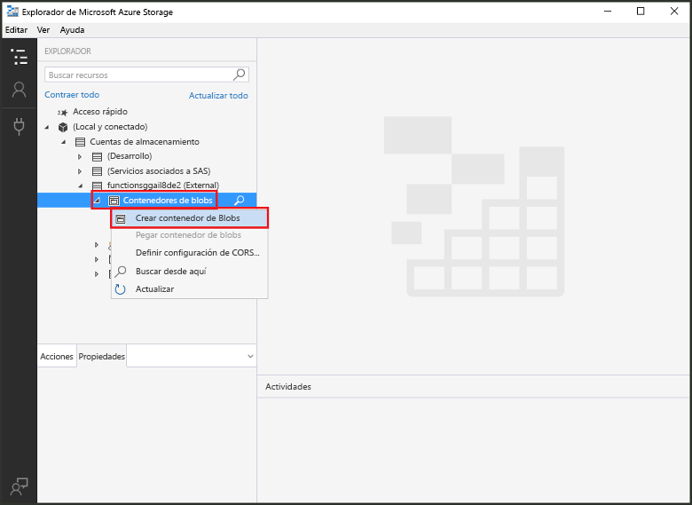
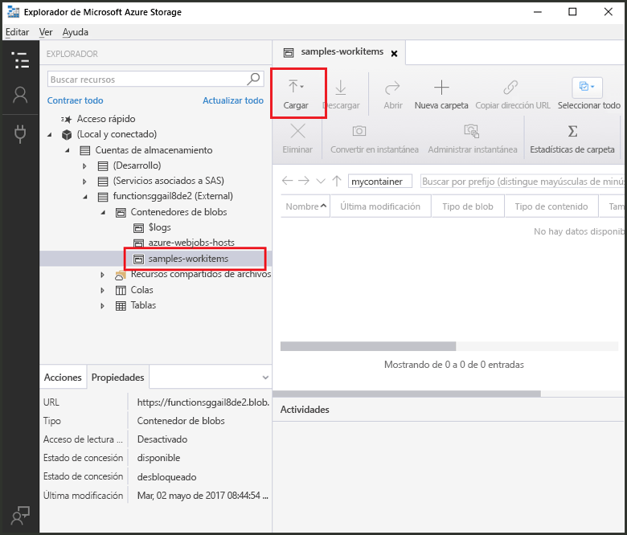
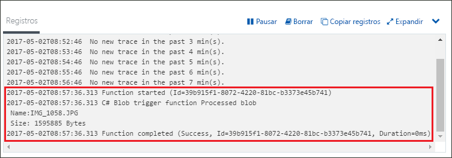

# Crear una función desencadenada por Azure Blob Storage

Obtenga información sobre cómo crear una función que se desencadena cuando se cargan o se actualizan archivos en Azure Blob Storage.

## Requisitos previos

+ Descargue e instale el [Explorador de Microsoft Azure Storage](http://storageexplorer.com/).
+ Una suscripción de Azure. Si no tiene una, cree una [cuenta gratuita](https://azure.microsoft.com/free/?WT.mc_id=A261C142F) antes de empezar.

[!INCLUDE [functions-portal-favorite-function-apps](../../includes/functions-portal-favorite-function-apps.md)]

## Creación de una Function App de Azure

[!INCLUDE [Create function app Azure portal](../../includes/functions-create-function-app-portal.md)]

Después, cree una función en la nueva Function App.

## Creación de una función desencadenada por Blob Storage

1. Expanda su instancia de Function App y haga clic en el botón **+**, que se encuentra junto a **Functions**. Si se trata de la primera función de Function App, seleccione **Función personalizada**. Se muestra el conjunto completo de plantillas de funciones.

    

2. En el campo de búsqueda, escriba `blob` y seleccione el idioma que desee para la plantilla del desencadenador de Blob Storage.

    
 
3. Utilice la configuración que se especifica en la tabla debajo de la imagen.

    

    | Configuración | Valor sugerido | Descripción |
    |---|---|---|
    | **Name** | Único en la Function App | Nombre de la función desencadenada por este blob. |
    | **Ruta de acceso**   | samples-workitems/{name}    | Ubicación de Blob Storage que se está supervisando. El nombre de archivo del blob se pasa en el enlace como parámetro _name_.  |
    | **Conexión de la cuenta de almacenamiento** | AzureWebJobsStorage | Puede usar la conexión de cuenta de almacenamiento que ya usa la Function App o crear una nueva.  |

3. Haga clic en **Crear** para crear la función.

Después, conéctese a su cuenta de Azure Storage y cree el contenedor **samples-workitems**.

## Cree el contenedor.

1. En la función, haga clic en **Integrar**, expanda **Documentación** y copie los dos valores de **Nombre de cuenta** y **Clave de cuenta**. Use estas credenciales para conectarse a la cuenta de almacenamiento. Si ya se ha conectado a la cuenta de almacenamiento, vaya al paso 4.

    

1. Ejecute la herramienta [Explorador de Microsoft Azure Storage](http://storageexplorer.com/), haga clic en el icono de conexión situado a la izquierda, seleccione **Use a storage account name and key** (Usar el nombre y la clave de una cuenta de almacenamiento) y haga clic en **Siguiente**.

    

1. Escriba los valores de **Nombre de cuenta** y **Clave de cuenta** del paso 1, haga clic en **Siguiente** y, después, en **Conectar**. 

    

1. Expanda la cuenta de almacenamiento asociada, haga clic con el botón derecho en **Contenedores de blobs**, haga clic en **Crear contenedor de blobs**, escriba `samples-workitems` y, después, presione ENTRAR.

    

Ahora que tiene un contenedor de blobs, puede probar la función. Para ello, cargue un archivo en el contenedor.

## Prueba de la función

1. De nuevo en Azure Portal, vaya a la función. Expanda **Registros** en la parte inferior de la página y asegúrese de que el streaming de registros no está en pausa.

1. En el Explorador de Storage, expanda la cuenta de almacenamiento, **Contenedores de blobs** y **samples-workitems**. Haga clic en **Cargar** y en **Cargar archivos…**

    

1. En el cuadro de diálogo **Cargar archivos**, haga clic en el campo **Archivos**. Busque un archivo en el equipo local, como un archivo de imagen, selecciónelo y haga clic en **Abrir** y, después, en **Cargar**.

1. Vuelva a sus registros de función y compruebe que se ha leído el blob.

   

    >[!NOTE]
    > Cuando la Function App se ejecuta en el plan de consumo predeterminado, puede haber un retraso de hasta varios minutos entre el momento en que se agrega o se actualiza el blob y el momento en que se desencadena la función. Si necesita una latencia baja en las funciones desencadenadas por el blob, considere la posibilidad de ejecutar la Function App en un plan de App Service.

## Limpieza de recursos

[!INCLUDE [Next steps note](../../includes/functions-quickstart-cleanup.md)]

## Pasos siguientes

Ha creado una función que se ejecuta cuando se agrega o se actualiza un blob en Blob Storage. 

[!INCLUDE [Next steps note](../../includes/functions-quickstart-next-steps.md)]

Para obtener más información sobre los desencadenadores de Blob Storage, vea [Enlaces de Blob Storage en Azure Functions](functions-bindings-storage-blob.md).
