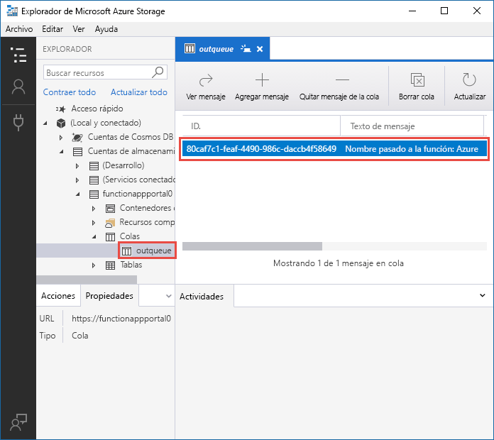
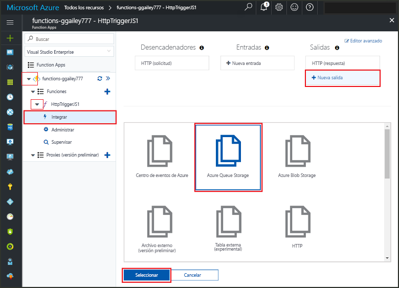
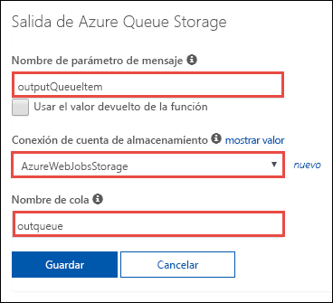
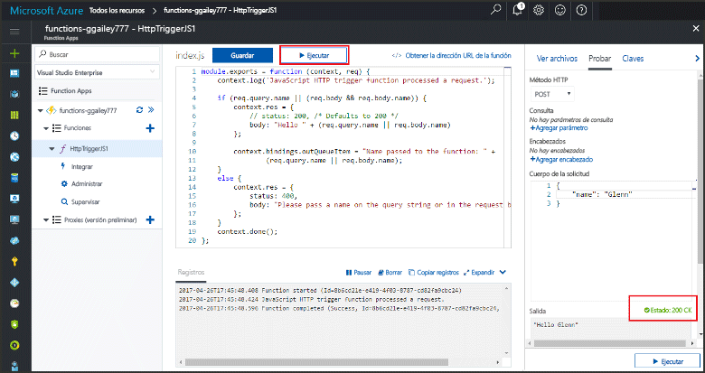
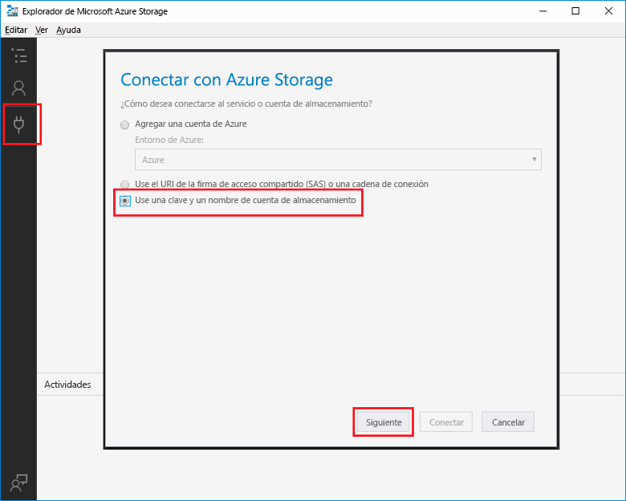
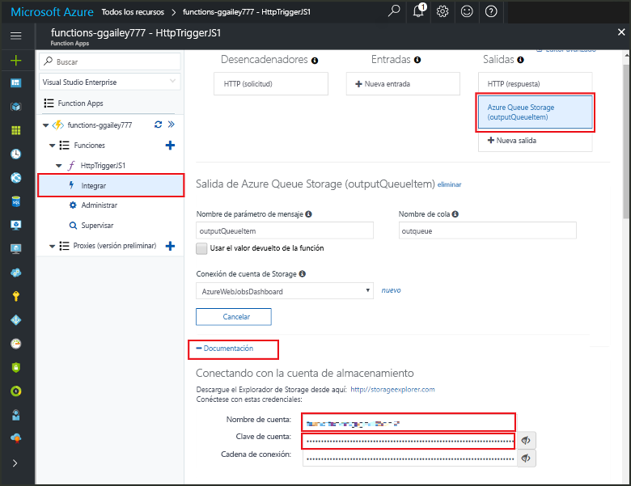
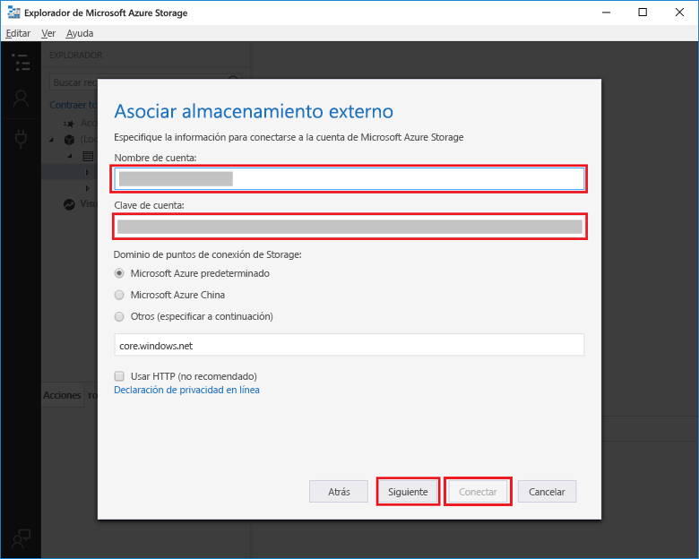

# <a name="add-messages-to-an-azure-storage-queue-using-functions"></a>Agregar mensajes a una cola de Azure Storage con Functions

En Azure Functions, los enlaces de entrada y salida proporcionan una forma declarativa de hacer que los datos de servicios externos estén disponibles para su código. En esta guía de inicio rápido, se utiliza en enlace de salida para crear un mensaje en una cola cuando una solicitud HTTP desencadena una función. Utilice el Explorador de Azure Storage para ver los mensajes de cola que crea la función:



## <a name="prerequisites"></a>requisitos previos 

Para completar esta guía de inicio rápido:

* Siga las instrucciones de [Creación de su primera función desde Azure Portal](functions-create-first-azure-function.md) y no realice el paso **Limpieza de recursos**. Esta guía de inicio rápido crea la aplicación de función y la función que se va a utilizar aquí.

* Instale [Explorador de Microsoft Azure Storage](http://storageexplorer.com/). Se trata de una herramienta que se va a utilizar para examinar los mensajes en cola que crea el enlace de salida.

## <a name="add-binding"></a>Agregar un enlace de salida

En esta sección, se va a utilizar la interfaz de usuario del portal para agregar un enlace de salida de almacenamiento en cola a la función que se ha creado anteriormente. Con este enlace podrá escribir un código mínimo para crear un mensaje en una cola. No tiene que escribir código para tareas como la apertura de una conexión de almacenamiento, la creación de una cola o la obtención de una referencia a una cola. El sistema en tiempo de ejecución de Azure Functions y el enlace de salida en cola se encargan automáticamente de esas tareas.

1. En Azure Portal, abra la página correspondiente a la aplicación de función que ha creado en [Creación de su primera función desde Azure Portal](functions-create-first-azure-function.md). Para ello, seleccione **Más servicios > Instancias de Function App** y, después, seleccione la aplicación de función.

2. Seleccione la función que creó en la guía de inicio rápido anterior.

1. Seleccione **Integrar > Nueva salida > Azure Queue Storage**.

1. Haga clic en **Seleccionar**.
    
    

3. En la **salida de Azure Queue Storage**, use la configuración como se especifica en la tabla que sigue a esta captura de pantalla: 

    

    | Configuración      |  Valor sugerido   | DESCRIPCIÓN                              |
    | ------------ |  ------- | -------------------------------------------------- |
    | **Nombre del parámetro de mensaje** | outputQueueItem | El nombre del parámetro del enlace de salida. | 
    | **Conexión de la cuenta de almacenamiento** | AzureWebJobsStorage | Puede usar la conexión de cuenta de almacenamiento que ya usa la Function App o crear una nueva.  |
    | **Nombre de la cola**   | outqueue    | El nombre de la cola a la que se va a conectar en la cuenta de almacenamiento. |

4. Haga clic en **Guardar** para agregar el enlace.
 
Ahora que tiene definido un enlace de salida, necesita actualizar el código que va a usar el enlace para agregar mensajes a una cola.  

## <a name="add-code-that-uses-the-output-binding"></a>Adición de código que utilice el enlace de salida

En esta sección, va a agregar código que escribe un mensaje en la cola de salida. El mensaje incluye el valor que se pasa al desencadenador HTTP en la cadena de consulta. Por ejemplo, si la cadena de consulta incluye `name=Azure`, el mensaje de cola será *Name passed to the function: Azure* (Nombre pasado a la función: Azure).

1. Seleccione la función para mostrar su código en el editor. 

2. Para una función de C#, agregue un parámetro de método al enlace y escriba el código para usarlo:

   Agregue un parámetro **outputQueueItem** para la firma del método, tal como se muestra en el ejemplo siguiente. El nombre del parámetro es el mismo que introdujo para **Nombre de parámetro de mensaje** cuando creó el enlace.

   ```cs   
   public static async Task<HttpResponseMessage> Run(HttpRequestMessage req, 
       ICollector<string> outputQueueItem, TraceWriter log)
   {
       ...
   }
   ```

   En el cuerpo de la función de C#, justo antes de la instrucción `return`, agregue código que utilice el parámetro para crear un mensaje de cola.

   ```cs
   outputQueueItem.Add("Name passed to the function: " + name);     
   ```

3. Para una función de JavaScript, agregue código que utilice el enlace de salida en el objeto `context.bindings` para crear un mensaje de la cola. Agregue este código antes de la instrucción `context.done`.

   ```javascript
   context.bindings.outputQueueItem = "Name passed to the function: " + 
               (req.query.name || req.body.name);
   ```

4. Seleccione **Guardar** para guardar los cambios.
 
## <a name="test-the-function"></a>Prueba de la función 

1. Después de que se guarden los cambios del código, seleccione **Ejecutar**. 

    

   Tenga en cuenta que el **cuerpo de la solicitud** contiene el valor de `name` *Azure*. Este valor aparece en el mensaje de la cola que se crea cuando se invoca la función.

   Como alternativa a la selección de **Ejecutar** aquí, puede llamar a la función mediante la introducción de una dirección URL en un navegador y de la especificación del valor `name` en la cadena de consulta. El método de explorador se muestra en la [guía de inicio rápido anterior](functions-create-first-azure-function.md#test-the-function).

2. Compruebe los registros para asegurarse de que la función se ha realizado correctamente. 

Se crea una nueva cola denominada **outqueue** en su cuenta de Storage mediante el entorno de ejecución de Functions cuando el enlace de salida se usa por primera vez. Usará el Explorador de Storage para comprobar que se han creado la cola y un mensaje.

### <a name="connect-storage-explorer-to-your-account"></a>Conexión del Explorador de Storage con la cuenta

Omita esta sección si ya ha instalado el Explorador de Storage y lo ha conectado a la cuenta de almacenamiento que utiliza con esta guía de inicio rápido.

2. Ejecute la herramienta [Explorador de Microsoft Azure Storage](http://storageexplorer.com/), seleccione el icono de conexión situado a la izquierda, elija **Use a storage account name and key** (Usar el nombre y la clave de una cuenta de almacenamiento) y seleccione **Siguiente**.

    

1. En Azure Portal, en la página de la aplicación de función, seleccione la función y, después, seleccione **Integrar**.

1. Seleccione el enlace de salida **Azure Queue Storage** que agregó en un paso anterior.

1. Expanda la sección **Documentación** sección en la parte inferior de la página. 

   El portal muestra las credenciales que puede usar en el Explorador de Storage para conectarse a la cuenta de almacenamiento.

   

1. Copie el valor del **nombre de la cuenta** desde el portal y péguelo en el cuadro **Nombre de la cuenta** en el Explorador de Storage.
 
1. Haga clic en el icono de mostrar/ocultar junto a **Clave de cuenta** para mostrar el valor y, después, copie el valor de **Clave de cuenta** y péguelo en el cuadro **Clave de cuenta** en el Explorador de Storage.
  
3. Seleccione **Siguiente > Conectar**.

   

### <a name="examine-the-output-queue"></a>Examen de la cola de salida

4. En el Explorador de Storage, seleccione la cuenta de almacenamiento que esté usando para esta guía de inicio rápido.

1. Expanda el nodo **Colas** y, después, seleccione la cola con el nombre **outqueue**. 

   La cola contiene el mensaje que creó el enlace de salida de la cola al ejecutar la función desencadenada por HTTP. Si se invoca la función con el valor predeterminado `name` de *Azure*, el mensaje de cola es *Name passed to the function: Azure* (Nombre pasado a la función: Azure).

    

2. Vuelva a ejecutar la función y aparecerá un nuevo mensaje en la cola.  

## <a name="clean-up-resources"></a>Limpieza de recursos

[!INCLUDE [Clean up resources](../../includes/functions-quickstart-cleanup.md)]

## <a name="next-steps"></a>pasos siguientes

En esta guía de inicio rápido, ha agregado un enlace de salida a una función existente. Para obtener más información sobre los enlaces a Queue Storage, vea [Enlaces de cola de Storage en Azure Functions](functions-bindings-storage-queue.md). 

[!INCLUDE [Next steps note](../../includes/functions-quickstart-next-steps.md)]
