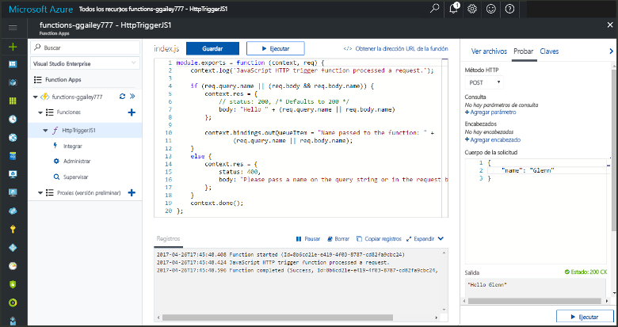

# <a name="add-messages-to-an-azure-storage-queue-using-functions"></a>Agregar mensajes a una cola de Azure Storage con Functions

En Azure Functions, los enlaces de entrada y salida proporcionan una manera declarativa de conectarse a los datos de servicio externos desde su función. En este tema, obtendrá información sobre cómo actualizar una función existente agregando un enlace de salida que envía mensajes a Azure Queue Storage.  



## <a name="prerequisites"></a>Requisitos previos 

[!INCLUDE [Previous topics](../../includes/functions-quickstart-previous-topics.md)]

* Instale el [Explorador de Microsoft Azure Storage](http://storageexplorer.com/).

## <a name="add-binding"></a>Agregar un enlace de salida
 
1. Expanda su Function App y su función.

2. Seleccione sucesivamente **Integrar**, **+ Nueva salida**, **Azure Queue Storage** y **Seleccionar**.
    
    

3. Use la configuración que se especifica en la tabla: 

    

    | Configuración      |  Valor sugerido   | Descripción                              |
    | ------------ |  ------- | -------------------------------------------------- |
    | **Nombre de la cola**   | myqueue-items    | El nombre de la cola a la que se va a conectar en la cuenta de almacenamiento. |
    | **Conexión de la cuenta de almacenamiento** | AzureWebJobStorage | Puede usar la conexión de cuenta de almacenamiento que ya usa la Function App o crear una nueva.  |
    | **Nombre del parámetro de mensaje** | outputQueueItem | El nombre del parámetro del enlace de salida. | 

4. Haga clic en **Guardar** para agregar el enlace.
 
Ahora que tiene definido un enlace de salida, necesita actualizar el código que va a usar el enlace para agregar mensajes a una cola.  

## <a name="update-the-function-code"></a>Actualizar el código de la función

1. Seleccione la función para mostrar su código en el editor. 

2. Para una función de C#, actualice la definición de función de la manera siguiente para agregar el parámetro de enlace de almacenamiento **outputQueueItem**. Omita este paso para una función de JavaScript.

    ```cs   
    public static async Task<HttpResponseMessage> Run(HttpRequestMessage req, 
        ICollector<string> outputQueueItem, TraceWriter log)
    {
        ....
    }
    ```

3. Agregue el siguiente código a la función justo antes de que se devuelva el método. Use el fragmento de código adecuado para el lenguaje de su función.

    ```javascript
    context.bindings.outputQueueItem = "Name passed to the function: " + 
                (req.query.name || req.body.name);
    ```

    ```cs
    outputQueueItem.Add("Name passed to the function: " + name);     
    ```

4. Seleccione **Guardar** para guardar los cambios.

El valor que se ha pasado al desencadenador HTTP se incluye en un mensaje agregado a la cola.
 
## <a name="test-the-function"></a>Prueba de la función 

1. Después de que se guarden los cambios del código, seleccione **Ejecutar**. 

    

2. Compruebe los registros para asegurarse de que la función se ha realizado correctamente. Se crea una nueva cola denominada **outqueue** en su cuenta de almacenamiento mediante el entorno de ejecución de las funciones cuando el enlace de salida se usa por primera vez.

Después, puede conectarse a su cuenta de almacenamiento para comprobar la cola nueva y el mensaje que ha agregado en esta. 

## <a name="connect-to-the-queue"></a>Conectarse a la cola

Omita los tres primeros pasos si ya ha instalado el Explorador de almacenamiento y lo ha conectado a su cuenta de almacenamiento.    

1. En su función, elija **Integrar** y en el nuevo enlace de salida de **Azure Queue Storage**. Después, expanda **Documentación**. Copie el **Nombre de cuenta** y la **Clave de cuenta**. Use estas credenciales para conectarse a la cuenta de almacenamiento.
 
    

2. Ejecute la herramienta [Explorador de Microsoft Azure Storage](http://storageexplorer.com/), seleccione el icono de conexión situado a la izquierda, elija **Use a storage account name and key** (Usar el nombre y la clave de una cuenta de almacenamiento) y seleccione **Siguiente**.

    
    
3. Pegue los valores de **Nombre de cuenta** y **Clave de cuenta** del paso 1 en sus campos correspondientes y seleccione **Siguiente** y **Conectar**. 
  
    

4. Expanda la cuenta de almacenamiento adjunta, expanda **Colas** y compruebe que existe una cola denominada **myqueue-items**. También debe ver ya un mensaje en la cola.  
 
    
 

## <a name="clean-up-resources"></a>Limpieza de recursos

[!INCLUDE [Next steps note](../../includes/functions-quickstart-cleanup.md)]

## <a name="next-steps"></a>Pasos siguientes

Ha agregado un enlace de salida a una función existente. 

[!INCLUDE [Next steps note](../../includes/functions-quickstart-next-steps.md)]

Para obtener más información sobre los enlaces a Queue Storage, vea [Enlaces de cola de Storage en Azure Functions](functions-bindings-storage-queue.md). 


