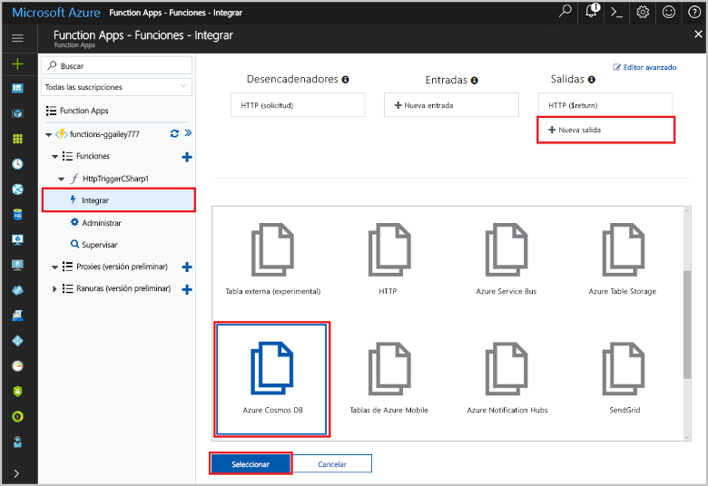
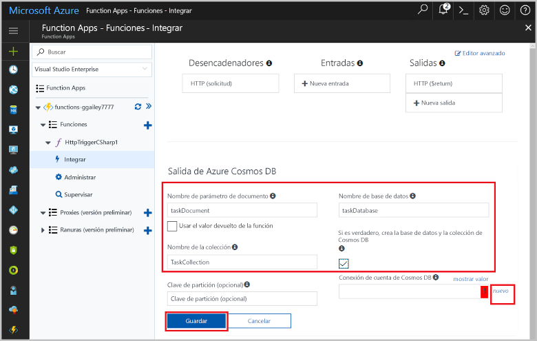
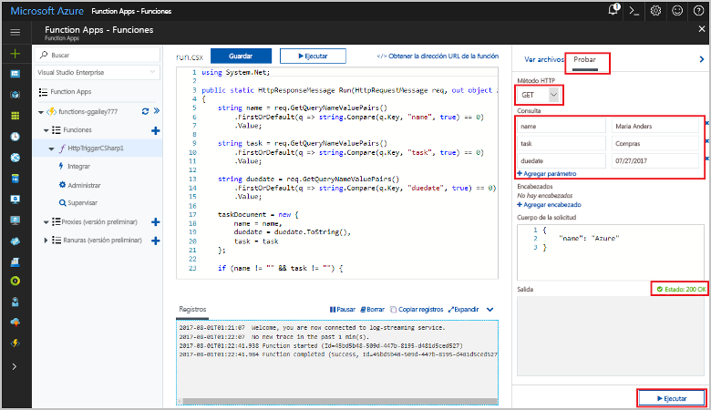
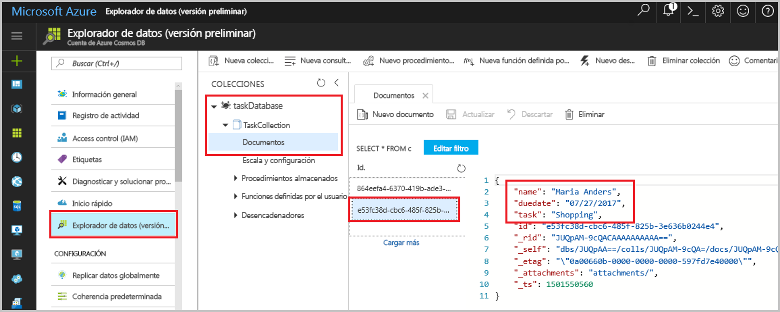

# <a name="store-unstructured-data-using-azure-functions-and-cosmos-db"></a>Almacenamiento de datos no estructurados mediante Azure Functions y Cosmos DB

Azure Cosmos DB es una excelente manera de almacenar datos no estructurados y JSON. En combinación con Azure Functions, Cosmos DB facilita y agiliza el almacenamiento de datos con mucho menos código que el necesario para almacenar datos en una base de datos relacional.

En este tutorial se describe cómo usar Azure Portal para crear una función de Azure Function que almacena datos no estructurados en un documento de Cosmos DB. 

## <a name="prerequisites"></a>Requisitos previos

[!INCLUDE [Previous quickstart note](../../includes/functions-quickstart-previous-topics.md)]

[!INCLUDE [functions-portal-favorite-function-apps](../../includes/functions-portal-favorite-function-apps.md)]

## <a name="create-a-function"></a>Creación de una función

Cree un nuevo webhook genérico de C# denominado `MyTaskList`.

1. Expanda la lista de funciones existente y haga clic en el signo + para crear una nueva función.
1. Seleccione GenericWebHook CSharp y asígnele el nombre `MyTaskList`.


## <a name="add-an-output-binding"></a>Adición de un enlace de salida

Una función de Azure puede tener un desencadenador y cualquier número de enlaces de entrada o salida. En este ejemplo, vamos a usar un desencadenador de solicitud HTTP y el documento de Cosmos DB como enlace de salida.

1. Haga clic en la pestaña *Integrar* de la función para ver o modificar el desencadenador y los enlaces de la función.
1. Elija el vínculo *Nueva salida* situado en la parte superior derecha de la página.

Nota: El desencadenador de la solicitud HTTP ya está configurado, sin embargo, debe agregar el enlace de documento de Cosmos DB.



1. Escriba la información necesaria para crear el enlace. Use la tabla siguiente para determinar los valores.



|  Campo | Valor  |
|---|---|
| Nombre del parámetro de documento | Nombre que hace referencia al objeto de Cosmos DB en el código |
| Nombre de la base de datos | Nombre de la base de datos para guardar documentos |
| Nombre de colección | Nombre de la agrupación de bases de datos de Cosmos DB |
| ¿Le gusta Cosmos DB y la colección que se ha creado? | Sí o no |
| Conexión de la cuenta de Cosmos DB | Cadena de conexión que apunta a la base de datos de Cosmos DB |

También debe configurar la conexión a la base de datos de Cosmos DB.

1. Haga clic en el vínculo "Nuevo" junto a la etiqueta *Conexión al documento de Cosmos DB".
1. Rellene los campos y seleccione las opciones apropiadas necesarias para crear el documento de Cosmos DB.


|  Campo | Valor  |
|---|---|
| Id | Identificador único para la base de datos de Cosmos DB  |
| NoSQL API | Cosmos DB o MongoDB  |
| La suscripción | Suscripción a MSDN  |
| Grupo de recursos  | Cree un nuevo grupo o seleccione uno existente.  |
| Ubicación  | WestEurope  |

1. Haga clic en el botón *Ok* (Aceptar). Debe esperar unos minutos mientras Azure crea los recursos.
1. Haga clic en el botón *Save* (Guardar).

## <a name="update-the-function-code"></a>Actualización del código de la función

Reemplace el código de plantilla de la función por lo siguiente:

Tenga en cuenta que el código de este ejemplo solo está disponible en C#.

```csharp
using System.Net;

public static HttpResponseMessage Run(HttpRequestMessage req, out object taskDocument, TraceWriter log)
{
    string name = req.GetQueryNameValuePairs()
        .FirstOrDefault(q => string.Compare(q.Key, "name", true) == 0)
        .Value;

    string task = req.GetQueryNameValuePairs()
        .FirstOrDefault(q => string.Compare(q.Key, "task", true) == 0)
        .Value;

    string duedate = req.GetQueryNameValuePairs()
        .FirstOrDefault(q => string.Compare(q.Key, "duedate", true) == 0)
        .Value;

    taskDocument = new {
        name = name,
        duedate = duedate.ToString(),
        task = task
    };

    if (name != "" && task != "") {
        return req.CreateResponse(HttpStatusCode.OK);
    }
    else {
        return req.CreateResponse(HttpStatusCode.BadRequest);
    }
}

```

Este ejemplo de código lee las cadenas de consulta de la solicitud HTTP y las asigna como miembros de un objeto `taskDocument`. El objeto `taskDocument` guarda automáticamente los datos en la base de datos de Cosmos DB e incluso crea la base de datos en el primer uso.

## <a name="test-the-function-and-database"></a>Prueba de la función y la base de datos

1. En la pestaña de función, haga clic en el vínculo *Prueba* a la derecha del portal y especifique las siguientes cadenas de consulta HTTP:

| Cadena de consulta | Valor |
|---|---|
| name | Chris P. Bacon |
| task | Realización de un sándwich BLT |
| duedate | 05/12/2017 |

1. Haga clic en el vínculo *Ejecutar*.
1. Compruebe que la función devuelve un código de respuesta *HTTP 200 OK*.



Confirme que se realizó una entrada en la base de datos de Cosmos DB.

1. Busque la base de datos en Azure Portal y selecciónela.
1. Seleccione la opción *Explorador de datos*.
1. Expanda los nodos hasta que llegue a las entradas del documento.
1. Confirme que la entrada de la base de datos. Habrá metadatos adicionales en la base de datos junto con los datos.



Si los datos están en el documento, significa que ha creado correctamente una función de Azure que almacena datos no estructurados en una base de datos de Cosmos DB.

## <a name="clean-up-resources"></a>Limpieza de recursos

[!INCLUDE [Next steps note](../../includes/functions-quickstart-cleanup.md)]

## <a name="next-steps"></a>Pasos siguientes

Consulte los siguientes temas para más información sobre Azure Functions:

[!INCLUDE [Getting help note](../../includes/functions-get-help.md)]

[!INCLUDE [functions-quickstart-next-steps](../../includes/functions-quickstart-next-steps.md)]
