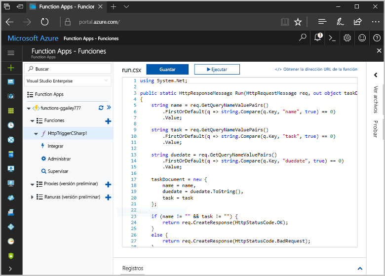
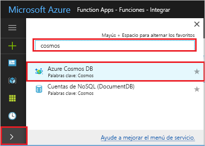

# <a name="store-unstructured-data-using-azure-functions-and-cosmos-db"></a>Almacenamiento de datos no estructurados mediante Azure Functions y Cosmos DB

[Azure Cosmos DB](https://azure.microsoft.com/services/cosmos-db/) es una excelente manera de almacenar datos no estructurados y JSON. En combinación con Azure Functions, Cosmos DB facilita y agiliza el almacenamiento de datos con mucho menos código que el necesario para almacenar datos en una base de datos relacional.

En Azure Functions, los enlaces de entrada y salida proporcionan una manera declarativa de conectarse a los datos de servicio externos desde su función. En este tema, aprenda a actualizar una función de C# existente para agregar un enlace de salida que almacene los datos no estructurados en un documento de Cosmos DB. 



## <a name="prerequisites"></a>Requisitos previos

Para completar este tutorial:

[!INCLUDE [Previous quickstart note](../../includes/functions-quickstart-previous-topics.md)]

## <a name="add-an-output-binding"></a>Adición de un enlace de salida

1. Expanda su Function App y su función.

1. Seleccione **Integrar** y **+ Nueva salida**, que se encuentra en la parte superior derecha de la página. Elija **Azure Cosmos DB** y haga clic en **Seleccionar**.

    

3. Use la configuración de **salida de Azure Cosmos DB**, tal y como se especifica en la tabla: 

    

    | Configuración      | Valor sugerido  | Descripción                                |
    | ------------ | ---------------- | ------------------------------------------ |
    | **Nombre del parámetro de documento** | taskDocument | Nombre que hace referencia al objeto de Cosmos DB en el código. |
    | **Nombre de la base de datos** | taskDatabase | Nombre de la base de datos para guardar documentos. |
    | **Nombre de colección** | TaskCollection | Nombre de colección de bases de datos de Cosmos DB. |
    | **Si es true, crea la base de datos y la colección de Cosmos DB** | Activado | La colección no existe, por lo que se crea. |

4. Seleccione **Nuevo** junto a la etiqueta **Conexión al documento de Cosmos DB** y elija **+ Crear nuevo**. 

5. Use la configuración de **Nueva cuenta** tal y como se especifica en la tabla: 

    

    | Configuración      | Valor sugerido  | Descripción                                |
    | ------------ | ---------------- | ------------------------------------------ |
    | **Id** | Nombre de base de datos | Identificador único para la base de datos de Cosmos DB  |
    | **API** | SQL (DocumentDB) | Seleccione la API de base de datos de documentos.  |
    | **Suscripción** | Suscripción de Azure | Suscripción de Azure  |
    | **Grupo de recursos** | myResourceGroup |  Use el grupo de recursos existente que contiene la aplicación de función. |
    | **Ubicación**  | WestEurope | Seleccione una ubicación cerca de la aplicación de función o de otras aplicaciones que usen los documentos almacenados.  |

6. Haga clic en **Aceptar** para crear la base de datos. La operación de creación de la base de datos puede tardar unos minutos. Después de crear la base de datos, la cadena de conexión de base de datos se almacena como una configuración de aplicación de función. El nombre de esta configuración de aplicación se inserta en la **conexión de la cuenta de Cosmos DB**. 
 
8. Después de establece la cadena de conexión, seleccione **Guardar** para crear el enlace.

## <a name="update-the-function-code"></a>Actualización del código de la función

Reemplace el código existente de la función de C# por el código siguiente:

```csharp
using System.Net;

public static HttpResponseMessage Run(HttpRequestMessage req, out object taskDocument, TraceWriter log)
{
    string name = req.GetQueryNameValuePairs()
        .FirstOrDefault(q => string.Compare(q.Key, "name", true) == 0)
        .Value;

    string task = req.GetQueryNameValuePairs()
        .FirstOrDefault(q => string.Compare(q.Key, "task", true) == 0)
        .Value;

    string duedate = req.GetQueryNameValuePairs()
        .FirstOrDefault(q => string.Compare(q.Key, "duedate", true) == 0)
        .Value;

    taskDocument = new {
        name = name,
        duedate = duedate.ToString(),
        task = task
    };

    if (name != "" && task != "") {
        return req.CreateResponse(HttpStatusCode.OK);
    }
    else {
        return req.CreateResponse(HttpStatusCode.BadRequest);
    }
}

```
Este ejemplo de código lee las cadenas de consulta de la solicitud HTTP y las asigna a los campos del objeto `taskDocument`. El enlace `taskDocument` envía los datos del objeto desde este parámetro de enlace para almacenarlos en la base de datos de documentos enlazada. La base de datos se crea la primera vez que se ejecuta la función.

## <a name="test-the-function-and-database"></a>Prueba de la función y la base de datos

1. Expanda la ventana derecha y seleccione **Probar**. En **Consulta**, haga clic en **+ Agregar parámetro** y agregue los siguientes parámetros a la cadena de consulta:

    + `name`
    + `task`
    + `duedate`

2. Haga clic en **Ejecutar** y compruebe que se devuelve un estado 200.

    

1. En el lado izquierdo de Azure Portal, expanda la barra de iconos, escriba `cosmos` en el campo de búsqueda y seleccione **Azure Cosmos DB**.

    

2. Seleccione la base de datos que creó y luego seleccione **Explorador de datos**. Expanda los nodos de **Colecciones**, seleccione el nuevo documento y confirme que el documento contiene los valores de la cadena de consulta, junto con algunos metadatos adicionales. 

    

Ha agregado correctamente un enlace al desencadenador HTTP que almacena datos no estructurados en una base de datos de Cosmos DB.

[!INCLUDE [Clean-up section](../../includes/clean-up-section-portal.md)]

## <a name="next-steps"></a>Pasos siguientes

[!INCLUDE [functions-quickstart-next-steps](../../includes/functions-quickstart-next-steps.md)]

Para más información sobre el enlace a una base de datos de la base de datos de Cosmos, consulte [Enlaces de Cosmos DB en Azure Functions](functions-bindings-documentdb.md).

