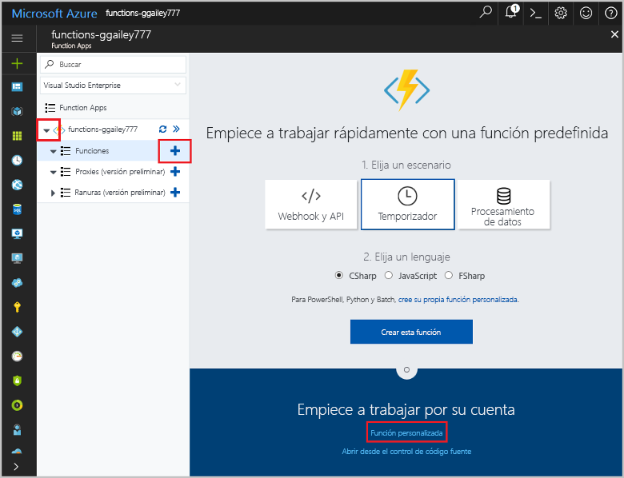

# <a name="create-a-function-that-integrates-with-azure-logic-apps"></a>Creación de una función que se integre con Azure Logic Apps

Azure Functions se integra con Azure Logic Apps en el diseñador de Logic Apps. Esta integración permite usar la capacidad de proceso de Azure Functions en las orquestaciones con otros servicios de Azure y de terceros. 

Este tutorial muestra cómo utilizar Functions con Logic Apps y Microsoft Cognitive Services en Azure para analizar opiniones de entradas de Twitter. Una función desencadenada por HTTP clasifica los tweets en verde, amarillo o rojo en función de la puntuación de la opinión. Se envía un correo electrónico cuando se detecta una opinión deficiente. 


En este tutorial, aprenderá a:

> [!div class="checklist"]
> * Crear un recurso de API de Cognitive Services.
> * Crear una función que clasifica las opiniones de tweet.
> * Crear una aplicación de lógica que se conecta a Twitter.
> * Agregar detección de opiniones a la aplicación lógica. 
> * Conectar la aplicación lógica a la función.
> * Enviar un correo electrónico en función de la respuesta de la función.

## <a name="prerequisites"></a>requisitos previos

+ Una cuenta de [Twitter](https://twitter.com/) activa. 
+ Una cuenta de [Outlook.com](https://outlook.com/) (para enviar las notificaciones).
+ Este tema usa como punto de inicio los recursos creados en [Creación de su primera función desde Azure Portal](functions-create-first-azure-function.md).  
Si aún no lo hecho, lleve a cabo estos pasos ahora para crear la aplicación de función.

## <a name="create-a-cognitive-services-resource"></a>Creación de un recurso de Cognitive Services

Cognitive Services APIs están disponibles en Azure como recursos individuales. Use la API Text Analytics para detectar la opinión de los tweets que se supervisan.

1. Inicie sesión en el [Azure Portal](https://portal.azure.com/).

2. Haga clic en el botón **Nuevo** de la esquina superior izquierda de Azure Portal.

3. Haga clic en **AI + Analytics** > **Text Analytics API** (IA + Analytics > API Text Analytics). A continuación, utilice la configuración de acuerdo con lo especificado en la tabla, acepte los términos y active **Anclar al panel**.

    

    | Configuración      |  Valor sugerido   | Descripción                                        |
    | --- | --- | --- |
    | **Name** | MyCognitiveServicesAccnt | Elija un nombre de cuenta único. |
    | **Ubicación** | Oeste de EE. UU | Use la ubicación más cercana. |
    | **Plan de tarifa** | F0 | Comience con la tarifa más baja. Si se queda sin llamadas, aumente a un nivel superior.|
    | **Grupos de recursos** | myResourceGroup | Utilice el mismo grupo de recursos para todos los servicios de este tutorial.|

4. Haga clic en **Crear** para crear el recurso. Una vez creado, seleccione el recurso de Cognitive Services nuevo anclado al panel. 

5. En la columna de navegación de la izquierda, haga clic en **Claves** y, luego, copie el valor de la **clave 1** y guárdelo. Esta clave se usa para conectar la aplicación lógica a la API Cognitive Services. 
 
    

[!INCLUDE [functions-portal-favorite-function-apps](../../includes/functions-portal-favorite-function-apps.md)]

## <a name="create-the-function-app"></a>Crear la aplicación de función

Functions proporciona una excelente manera de descargar tareas de procesamiento en un flujo de trabajo de aplicaciones lógicas. Este tutorial utiliza una función desencadenada por HTTP de Cognitive Services para procesar las puntuaciones de opinión de los tweet y devolver un valor de clasificación.  

[!INCLUDE [Create function app Azure portal](../../includes/functions-create-function-app-portal.md)]

## <a name="create-an-http-triggered-function"></a>Crear una función desencadenada mediante HTTP  

1. Expanda su instancia de Function App y haga clic en el botón **+**, que se encuentra junto a **Functions**. Si se trata de la primera función de Function App, seleccione **Función personalizada**. Se muestra el conjunto completo de plantillas de funciones.

    

2. En el campo de búsqueda, escriba `http` y, a continuación, elija **C#** para la plantilla del desencadenador HTTP. 

    

3. Escriba un **nombre** para la función, elija `Function` en el **[Nivel de autenticación](functions-bindings-http-webhook.md#http-auth)** y, a continuación, seleccione **Crear**. 

    

    Esta opción crea una función de script de C# mediante la plantilla del desencadenador de HTTP. El código aparecerá en una ventana nueva como `run.csx`.

4. Reemplace el contenido del archivo `run.csx` con el código siguiente y, luego, haga clic en **Guardar**:

    ```csharp
    using System.Net;
    
    public static async Task<HttpResponseMessage> Run(HttpRequestMessage req, TraceWriter log)
    {
        // The sentiment category defaults to 'GREEN'. 
        string category = "GREEN";
    
        // Get the sentiment score from the request body.
        double score = await req.Content.ReadAsAsync<double>();
        log.Info(string.Format("The sentiment score received is '{0}'.",
                    score.ToString()));
    
        // Set the category based on the sentiment score.
        if (score < .3)
        {
            category = "RED";
        }
        else if (score < .6)
        {
            category = "YELLOW";
        }
        return req.CreateResponse(HttpStatusCode.OK, category);
    }
    ```
    El código de la función devuelve una clasificación de color basada en la puntuación de la opinión recibida en la solicitud. 

4. Para probar la función, haga clic en **Probar** a la derecha para expandir la pestaña de pruebas. Escriba un valor de `0.2` en el **Cuerpo de la solicitud** y, a continuación, haga clic en **Ejecutar**. Devuelve un valor **RED** (rojo) en el cuerpo de la respuesta. 

    

Ahora, tiene una función que clasifica las puntuaciones de opinión. A continuación, cree una aplicación lógica que integre la función con la API de Twitter y Cognitive Services. 

## <a name="create-a-logic-app"></a>Creación de una aplicación lógica   

1. En Azure Portal, haga clic en el botón **Nuevo** de la esquina superior izquierda de Azure Portal.

2. Haga clic en **Integración empresarial** > **Aplicación lógica**. A continuación, utilice la configuración como se especifica en la tabla, active **Anclar al panel** y haga clic en **Crear**.
 
4. Después, en **Nombre**, escriba `TweetSentiment`; use la configuración como se especifica en la tabla, acepte los términos y active **Anclar al panel**.

    

    | Configuración      |  Valor sugerido   | Descripción                                        |
    | ----------------- | ------------ | ------------- |
    | **Name** | TweetSentiment | Elija un nombre adecuado para la aplicación. |
    | **Grupos de recursos** | myResourceGroup | Elija el mismo grupo de recursos existente que antes. |
    | **Ubicación** | Este de EE. UU | Elija una ubicación cercana a usted. |    

4. Seleccione **Anclar al panel** y haga clic en **Crear** para crear la aplicación lógica. 

5. Una vez creada la aplicación, haga clic en la nueva aplicación lógica anclada al panel. A continuación, en el diseñador de Logic Apps, desplácese hacia abajo y haga clic en la plantilla **Aplicación lógica en blanco**. 

    

Ahora puede usar el diseñador de Logic Apps para agregar servicios y desencadenadores a la aplicación.

## <a name="connect-to-twitter"></a>Conexión a Twitter

En primer lugar, cree una conexión a la cuenta de Twitter. La aplicación lógica sondea si hay tweets, que desencadenan la ejecución de la aplicación.

1. En el diseñador, haga clic en el servicio **Twitter** y haga clic en el desencadenador **Cuando se publica un nuevo tweet**. Inicie sesión en su cuenta de Twitter y autorice a Logic Apps para usar su cuenta.

2. Use la configuración del desencadenador de Twitter como se especifica en la tabla. 

    

    | Configuración      |  Valor sugerido   | DESCRIPCIÓN                                        |
    | ----------------- | ------------ | ------------- |
    | **Texto de búsqueda** | #Azure | Use un hashtag lo suficientemente popular como para generar nuevos tweets en el intervalo elegido. Si usa el nivel Gratis y el hashtag es demasiado popular, puede agotar rápidamente la cuota de transacciones de la API Cognitive Services. |
    | **Frecuencia** | Minuto | La unidad de frecuencia utilizada para el sondeo de Twitter.  |
    | **Intervalo** | 15 | El tiempo transcurrido entre solicitudes a Twitter, en unidades de frecuencia. |

3.  Haga clic en **Guardar** para conectarse a su cuenta de Twitter. 

Ahora la aplicación está conectada a Twitter. A continuación, va a conectar a análisis de texto para detectar la opinión de los tweets recopilados.

## <a name="add-sentiment-detection"></a>Agregar la detección de opiniones

1. Haga clic en **Nuevo paso** y, a continuación, en **Agregar una acción**.

    

2. En **Elegir una acción**, haga clic en **Análisis de texto** y, a continuación, haga clic en la acción **Detectar opiniones**.

    

3. Escriba un nombre de conexión como `MyCognitiveServicesConnection`, pegue la clave para la API Cognitive Services que guardó y haga clic en **Crear**.  

4. Haga clic en **Texto para analizar** > **Texto de Tweet** y, a continuación, haga clic en **Guardar**.  

    

Una vez configurada la detección de opinión, puede agregar una conexión a la función que consume los resultados de la puntuación de la opinión.

## <a name="connect-sentiment-output-to-your-function"></a>Conexión de la salida de opiniones con la función

1. En el diseñador de Logic Apps, haga clic en **Nuevo paso** > **Agregar una acción** y, a continuación, haga clic en **Azure Functions**. 

2. Haga clic en **Elegir una función de Azure** y seleccione la función **CategorizeSentiment** que ha creado anteriormente.  

    

3. En **Cuerpo de la solicitud**, haga clic en **Puntuación** y, a continuación, en **Guardar**.

    

Ahora, la función se desencadena cuando se envía una puntuación de opiniones desde la aplicación lógica. La función devuelve una clasificación de códigos de color a la aplicación lógica. A continuación, agregue una notificación por correo electrónico que se envía cuando la función devuelve un valor de opinión de **RED** (rojo). 

## <a name="add-email-notifications"></a>Agregar notificaciones por correo electrónico

La última parte del flujo de trabajo consiste en desencadenar el envío de un correo electrónico cuando la opinión obtiene una puntuación _RED_ (rojo). Este tema utiliza un conector de Outlook.com. Puede realizar pasos similares para utilizar un conector de Gmail o de Office 365 Outlook.   

1. En el diseñador de Logic Apps, haga clic en **Nuevo paso** > **Agregar una condición**. 

2. Haga clic en **Elegir un valor** y, a continuación, haga clic en **Cuerpo**. Seleccione **Es igual a**, haga clic en **Elegir un valor**, escriba `RED` y haga clic en **Guardar**. 

    

3. En **IF TRUE**, haga clic en **Agregar una acción**, busque `outlook.com`, haga clic en **Enviar un correo electrónico** e inicie sesión en su cuenta de Outlook.com.
    
    

    > [!NOTE]
    > Si no tiene una cuenta de Outlook.com, puede elegir otro conector, como Gmail u Office 365 Outlook

4. En la acción **Enviar un correo electrónico**, use la configuración de correo electrónico que se especifica en la tabla. 

    

    | Configuración      |  Valor sugerido   | DESCRIPCIÓN  |
    | ----------------- | ------------ | ------------- |
    | **To** | Escriba su dirección de correo electrónico | La dirección de correo electrónico que recibe la notificación. |
    | **Asunto** | Detectada opinión de tweet negativa  | La línea de asunto de la notificación de correo electrónico.  |
    | **Cuerpo** | Texto de tweet, ubicación | Haga clic en los parámetros **Texto de tweet** y **Ubicación**. |

5.  Haga clic en **Save**(Guardar).

Ahora que el flujo de trabajo se ha completado, puede habilitar la aplicación lógica y comprobar la ejecución de la función.

## <a name="test-the-workflow"></a>Probar el flujo de trabajo

1. En el diseñador de Logic Apps, haga clic en **Ejecutar** para iniciar la aplicación.

2. En la columna izquierda, haga clic en **Información general** para ver el estado de la aplicación lógica. 
 
    

3. (Opcional) Haga clic en una de las ejecuciones para ver los detalles de la ejecución.

4. Vaya a la función, vea los registros y compruebe que los valores de opinión se reciben y procesan.
 
    

5. Cuando se detecta una opinión potencialmente negativa, recibirá un correo electrónico. Si no ha recibido un correo electrónico, puede cambiar el código de la función para devolver siempre RED (rojo):

        return req.CreateResponse(HttpStatusCode.OK, "RED");

    Después de comprobar las notificaciones de correo electrónico, vuelva a cambiar al código original:

        return req.CreateResponse(HttpStatusCode.OK, category);

    > [!IMPORTANT]
    > Después de completar este tutorial, debe deshabilitar la aplicación lógica. Al deshabilitar la aplicación, evita recibir cargos por ejecuciones y agotar las transacciones de la API Cognitive Services.

Ya ha visto lo fácil que es integrar Functions en un flujo de trabajo de Logic Apps.

## <a name="disable-the-logic-app"></a>Deshabilitar la aplicación lógica

Para deshabilitar la aplicación lógica, haga clic en **Información general** y, a continuación, haga clic en **Deshabilitar** en la parte superior de la pantalla. Esto detiene la ejecución de la aplicación lógica y evita incurrir en cargos sin eliminar la aplicación. 


## <a name="next-steps"></a>pasos siguientes

En este tutorial aprendió lo siguiente:

> [!div class="checklist"]
> * Crear un recurso de API de Cognitive Services.
> * Crear una función que clasifica las opiniones de tweet.
> * Crear una aplicación de lógica que se conecta a Twitter.
> * Agregar detección de opiniones a la aplicación lógica. 
> * Conectar la aplicación lógica a la función.
> * Enviar un correo electrónico en función de la respuesta de la función.

Continúe con el siguiente tutorial para aprender a crear una API sin servidor para la función.

> [!div class="nextstepaction"] 
> [Creación de una API sin servidor mediante Azure Functions](functions-create-serverless-api.md)

Para más información acerca de Logic Apps, consulte [Azure Logic Apps](../logic-apps/logic-apps-overview.md).

